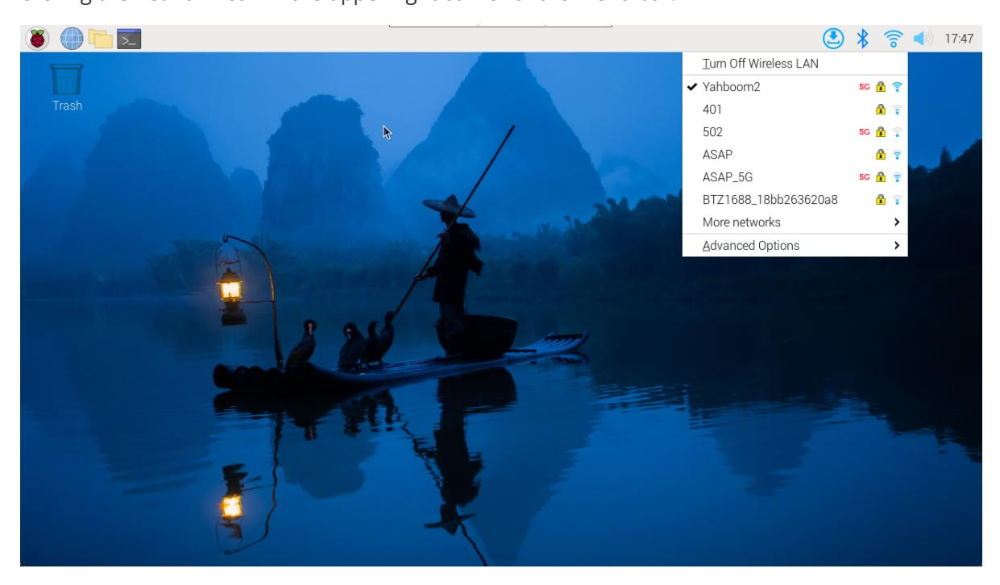
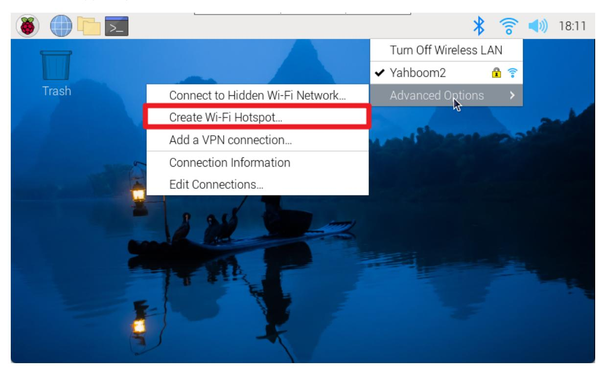
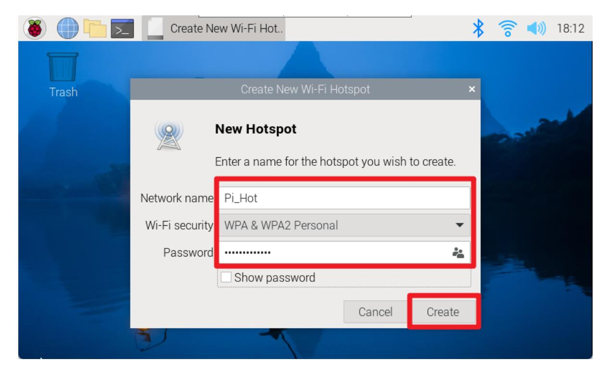

# **Network Configuration**

#### **[Network Configuration](#page-0-0)**

- 1. WiFi [connection](#page-0-1)
- 2. Turn on [hotspot](#page-1-0)
- [3. Hotspot/WiFi](#page-2-0) starts automatically after booting

Network configuration mainly introduces WiFi connection and hotspot opening.

# **1. WiFi connection**

### **Graphical interface**

Using the Raspberry Pi graphical desktop system, we can connect to the corresponding WiFi by clicking the network icon in the upper right corner of the menu bar.

Note: If the region is not set, you need to set the region before connecting to the network for the first time before you can configure the network.

#### **Command Line**

For systems without a graphical interface, you can configure the network through the command line.

Note: You need to use the raspi-config tool to set the WLAN country/region first, and then use the command line to configure the network.

Use the raspi-config tool: enter sudo raspi-config in the terminal

Set WLAN country:

Localization Options → WLAN Country → CN China → OK

After completing the above option settings, select Finish to exit the raspi-config tool.

View WiFi enabled status command: nmcli radio wifi

Turn on WiFi status command: nmcli radio wifi on

Turn off WiFi status command: nmcli radio wifi off

Find network command: sudo nmcli dev wifi list

Connect to the network command: sudo nmcli --ask dev wifi connect <example\_ssid>

Note: If it is displayed that you do not have permission to operate, please add sudo in front of all commands.

The above information prompt appears indicating that the WiFi connection is successful!

## **2. Turn on hotspot**

Using the Raspberry Pi graphical desktop system, we can create a hotspot by clicking the network icon in the upper right corner of the menu bar.

After the creation is successful, you can use your mobile phone to view the hotspot!

# **3. Hotspot/WiFi starts automatically after booting**

We can set up the Raspberry Pi system to connect to WIFI or turn on a hotspot by modifying the priority of the network settings.

The higher the priority number, the better the connection method will be!

