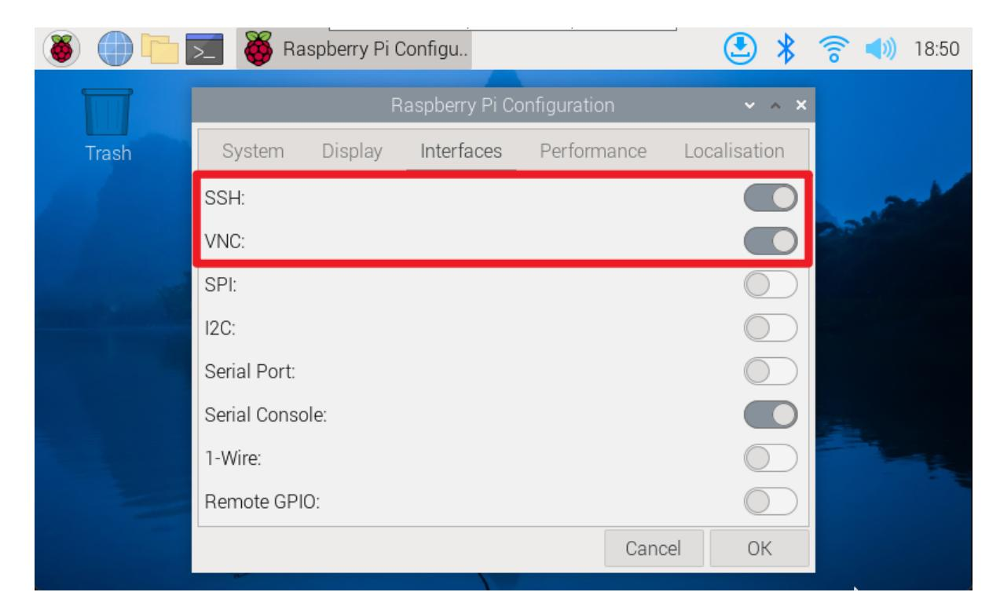
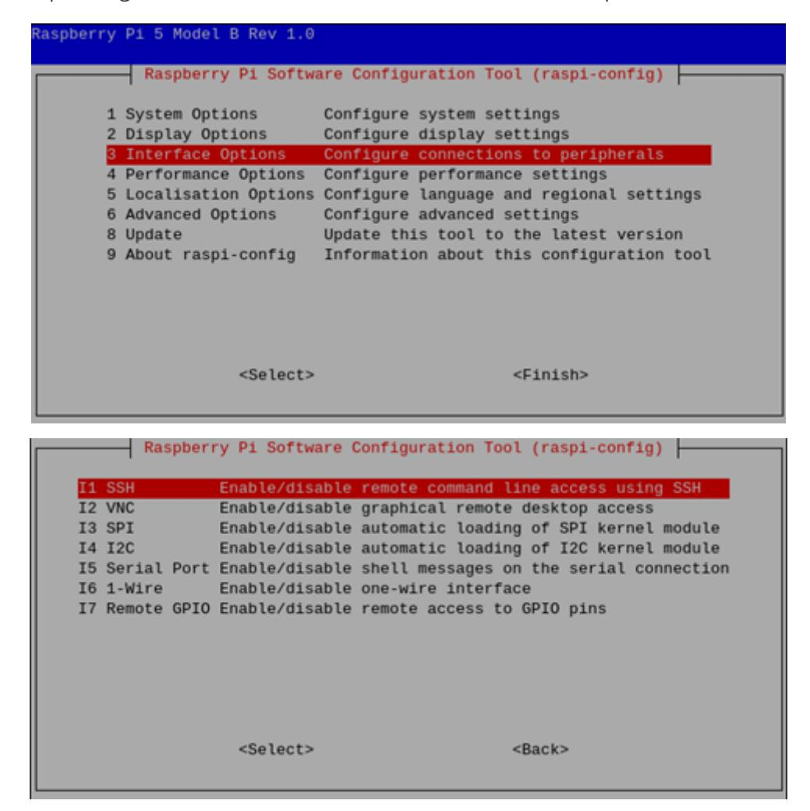
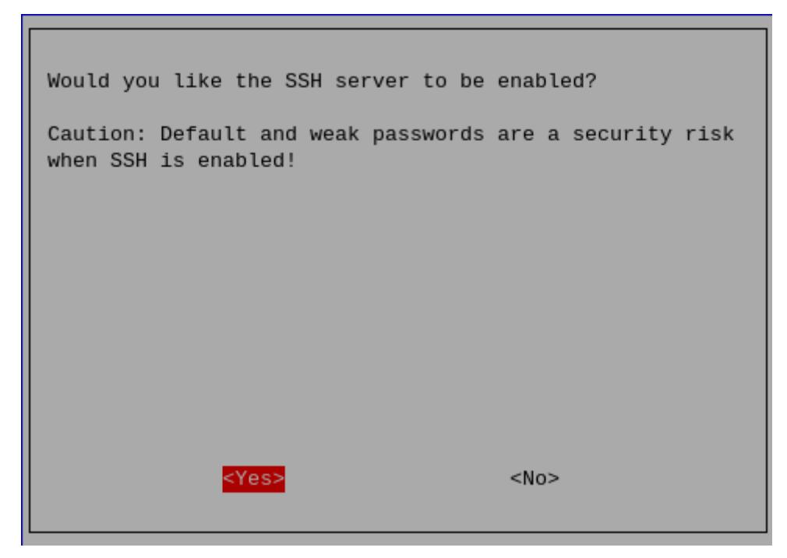
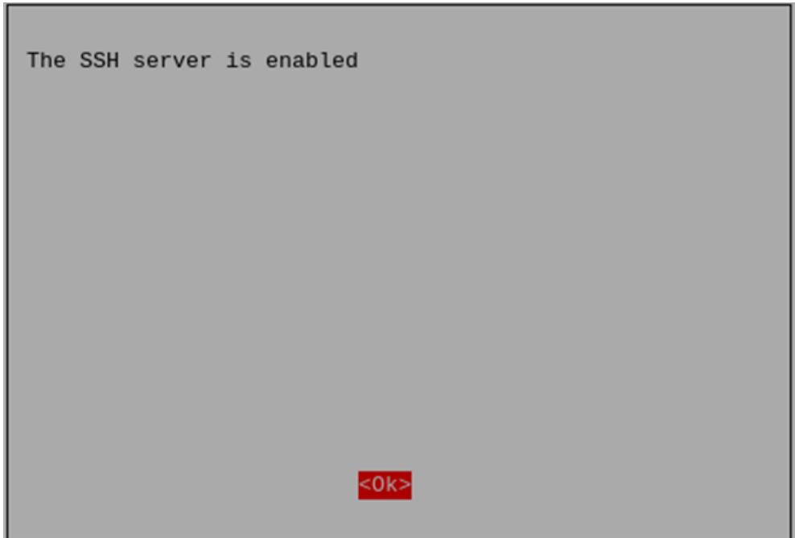
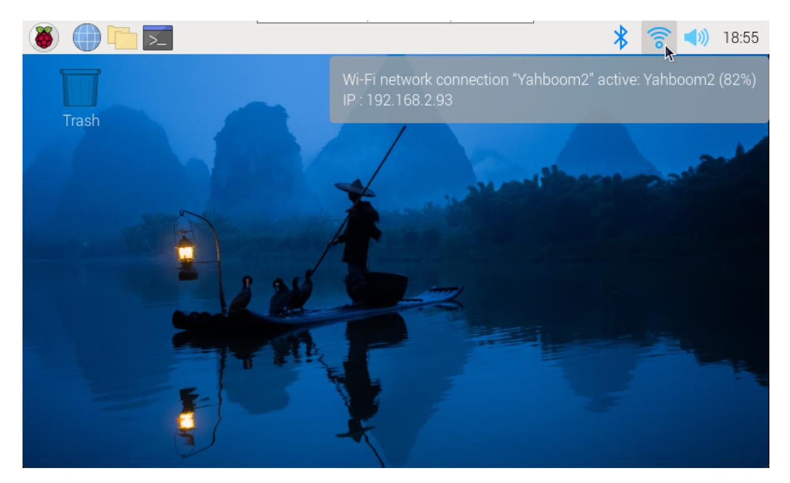
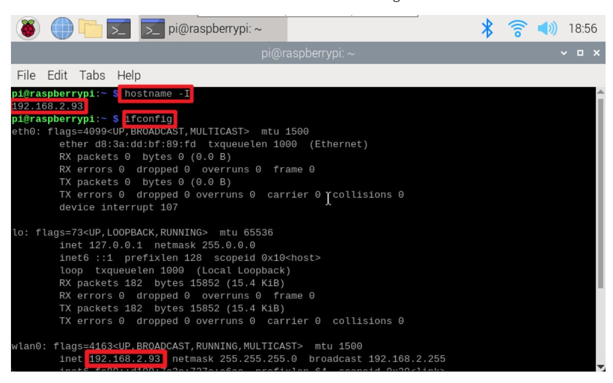
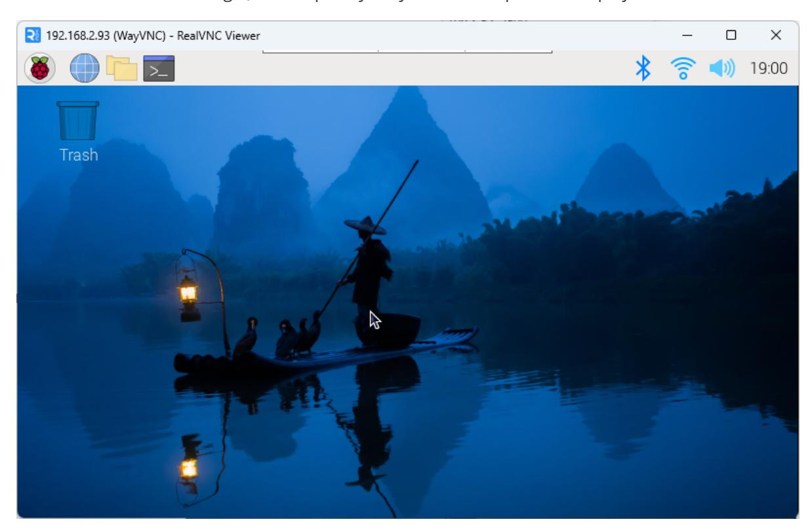

# **remote access**

#### **[remote access](#page-0-0)**

- <span id="page-0-0"></span>[1. Preliminary](#page-0-1) preparation
  - [1.1. Enable](#page-0-2) SSH and VNC [Graphical](#page-0-3) interface
    - [Command Line](#page-1-0)
  - [1.2. Obtain](#page-2-0) IP
    - [Graphical](#page-2-1) interface
- 2. SSH [remote](#page-3-0) control
- <span id="page-0-1"></span>3. VNC [remote](#page-4-0) login

We often use SSH and VNC tools to remotely control the Raspberry Pi system.

### **1. Preliminary preparation**

Before performing SSH or VNC remote login, you need to enable SSH and VNC functions in the Raspberry Pi system settings or use the raspi-config tool.

### <span id="page-0-2"></span>**1.1. Enable SSH and VNC**

### <span id="page-0-3"></span>**Graphical interface**

Enable SSH and VNC: applications menu → Preferences → Raspberry Pi Configuration




#### **Command Line**

Use the raspi-config tool to enable SSH and VNC functions: Interface Options → SSH/VNC: enable

<span id="page-1-0"></span>





<span id="page-2-0"></span>The steps to enable the VNC function are the same, just follow the steps above! Note: If opening the VNC service fails, check whether the system has been updated; update the software and restart the system before reopening the VNC service.

### **1.2. Obtain IP**

After enabling SSH and VNC functions, you can remotely control the Raspberry Pi based on its IP!

#### <span id="page-2-1"></span>**Graphical interface**

After the system is connected to WiFi, hover the mouse on the WiFi icon to see the corresponding IP address.



Use the command to view the IP address: hostname -I or ifconfig



## <span id="page-3-0"></span>**2. SSH remote control**

After obtaining the IP address of the Raspberry Pi motherboard, you can perform SSH remote login on the terminal based on the user name and password of the Raspberry Pi system.

SSH remote login command: ssh username@IP address

```
My current login user name is pi, the password is yahboom, and the IP address is
192.168.2.93
sshpi@192.168.2.93
```

## <span id="page-4-0"></span>**3. VNC remote login**

After obtaining the IP address of the Raspberry Pi motherboard, you can use the RealVNC Viewer software to log in remotely.

My current login user name is pi, the password is yahboom, and the IP address is 192.168.2.93


After successful remote login, the Raspberry Pi system desktop will be displayed!

