# Multimodal Visual Understanding + SLAM Navigation
**Multimodal Visual Understanding + SLAM Navigation**

1. Course Content

2. Starting the Agent

### 2.3 Configuring the Map Mapping File

3. Running Example

### 3.1 Starting the Program

### 3.2 Test Case

## 1. Course Content
Run example programs to perform integrated tasks using the robot's visual understanding

capabilities combined with SLAM navigation through text-based interaction.
## 2. Starting the Agent
**Note: If the agent is already running, you do not need to start it again.**

Enter the following command in the vehicle terminal:

The terminal will print the following information, indicating a successful connection:

[!NOTE]

Note: To experience this section of the course, you need to first build at least one grid map

according to the LiDAR section of the course.

### 2.3 Configuring the Map Mapping File
Connect to the robot's desktop via VNC and start the navigation node using the following

commands:

Start rviz on the robot:

Alternatively, you can start the display on the virtual machine; there is no need to start the

display window repeatedly.

## Afterward, the rviz2 visualization interface will open. Click 2D Pose Estimate in the top toolbar to

enter the selection state, and roughly mark the robot's position and orientation on the map.

The robot model will be displayed on the map, as shown below:

We can name any precise point on the map. Here, we use "Master Bedroom" and "Kitchen" as

examples.

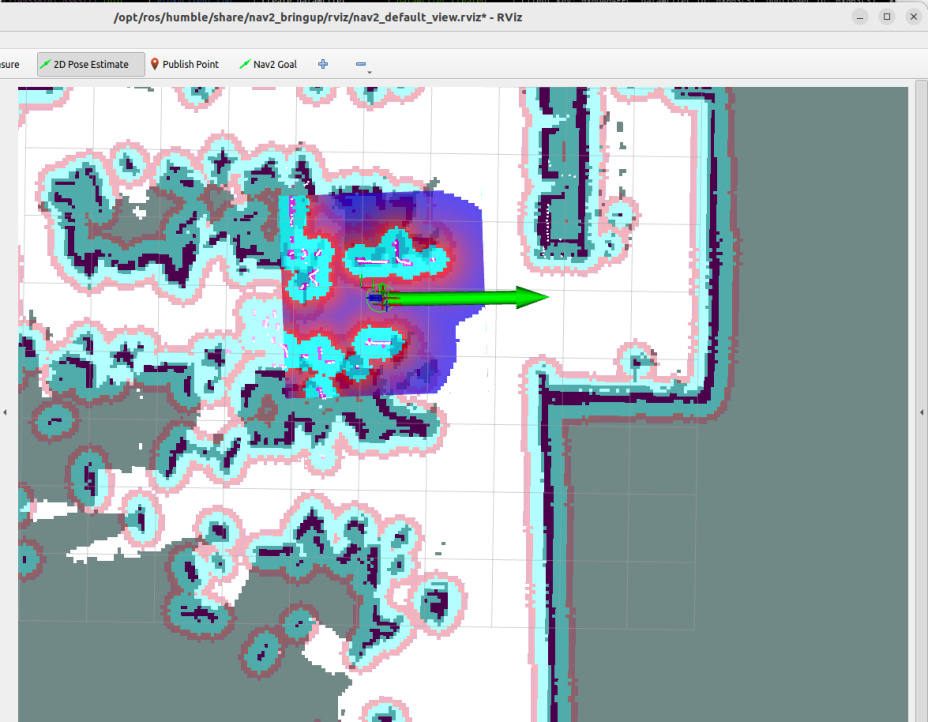

As shown in the figure below, we first click the **Nav2 Goal** tool to navigate the robot to the target

point we need to mark.

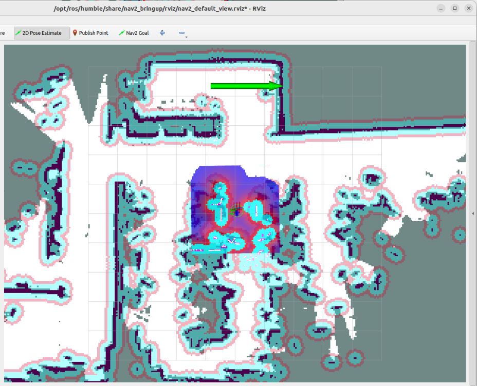

Run the following command in the terminal to obtain the current robot's pose information in

the map coordinate system:

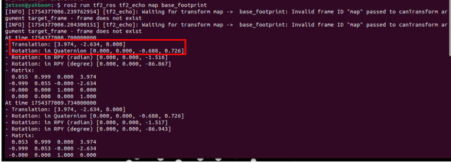

Open the `map_mapping.yaml` map mapping file (you can open it using VNC, VS Code, command

line, or any other method):

Here's an example of opening the file via the command line:

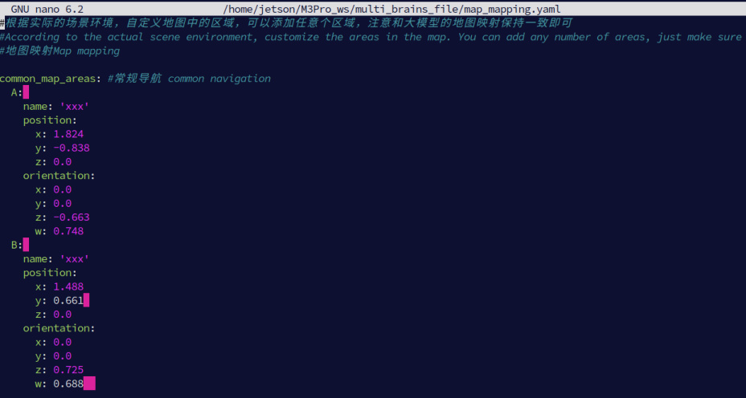

in the previously obtained pose information into the `position` and `orientation` fields.

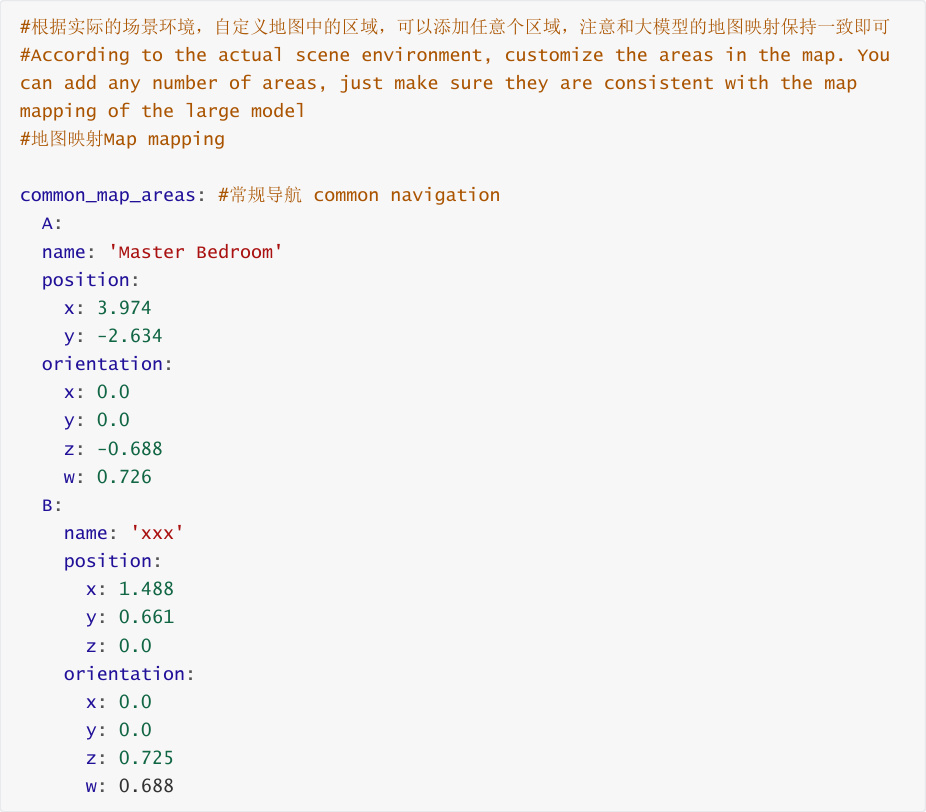

After the modifications are complete, saving the file will take effect immediately. 2.4 Configuring

Map Mapping Variables in Dify

After configuring the map mapping file as described above, we need to let the AI large

language model know the relationship between the locations and symbols in these maps.

Start the Dify service (if already started, no need to restart):

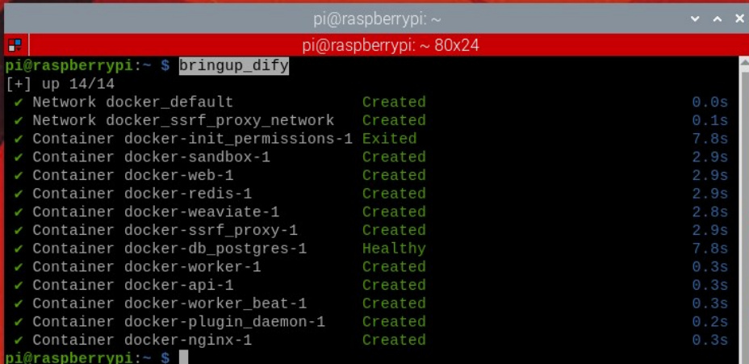

Enter the vehicle's IP address directly in the browser's address bar to access the Dify

management page, then click to select the corresponding AI application.

[!NOTE]

International users: multi_brains_en

the settings in the previous map mapping file, and then click Save.

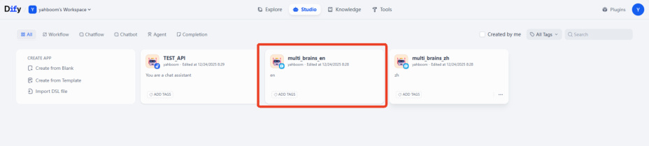

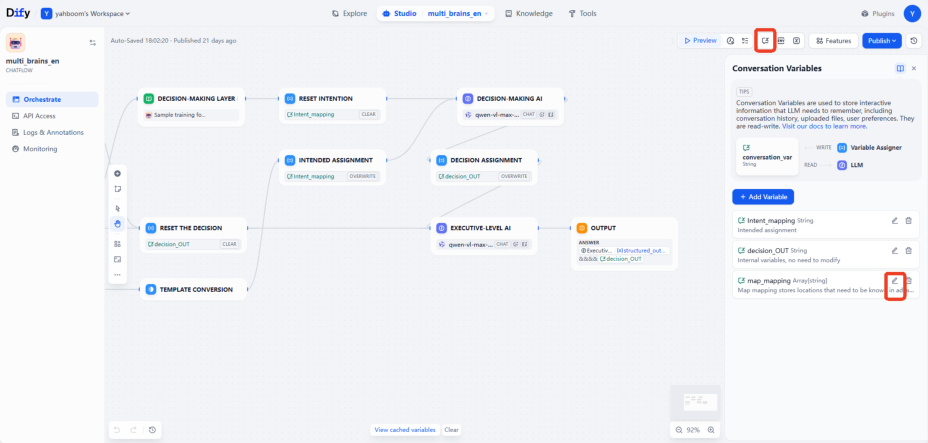

Finally, remember to click Publish -> Publish Update to save the changes.

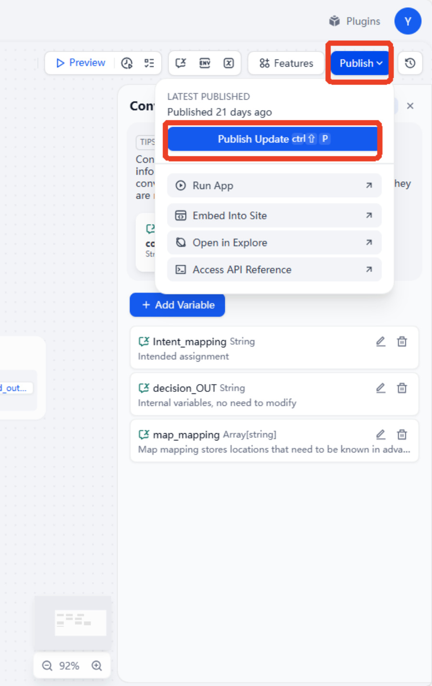
## 3. Running Example
### 3.1 Starting the Program
Connect to the robot's desktop via VNC, open a terminal, and run the command:

Start navigation commands on the vehicle's control unit:

Start rviz on the robot:

Then, follow the procedure for initializing the navigation function. This will open the rviz2
## visualization interface. Click on 2D Pose Estimate in the toolbar at the top to enter selection

mode. Roughly mark the robot's position and orientation on the map. After initialization, the

preparation is complete.

Start the text interaction program in the terminal:

### 3.2 Test Case
Here is a sample test case; users can create their own dialogue commands.

Please remember your current location, then navigate to the kitchen and the master

bedroom in sequence, remembering the items you see in each place. Finally, return to your

starting position and tell me what you saw in those two places?

Copy and paste the above test case into the text interaction terminal:

The decision-making AI outputs the planned task steps:

Then the execution layer AI will execute according to these task steps:

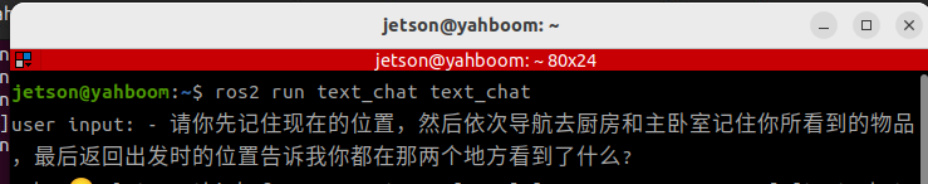

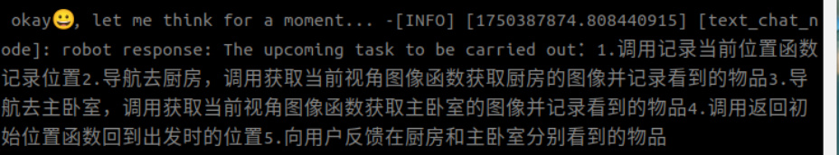
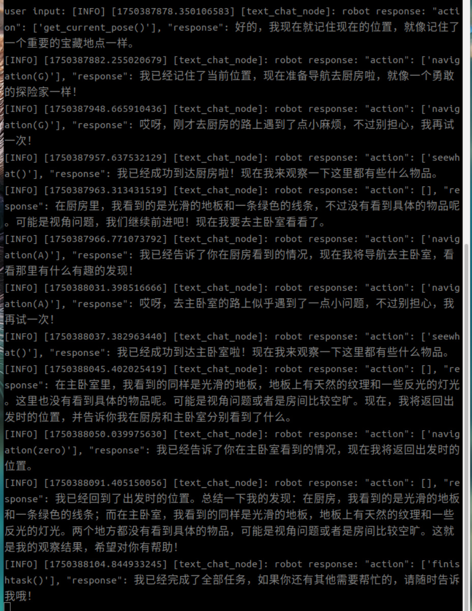
