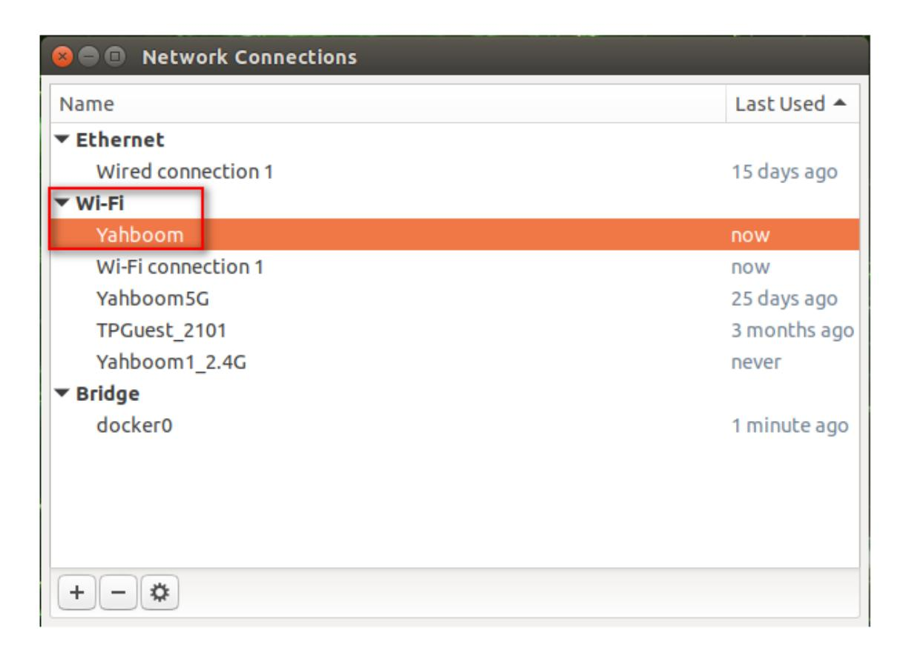
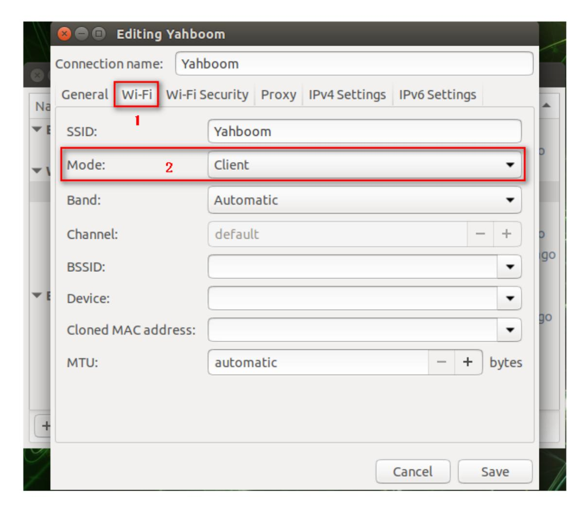
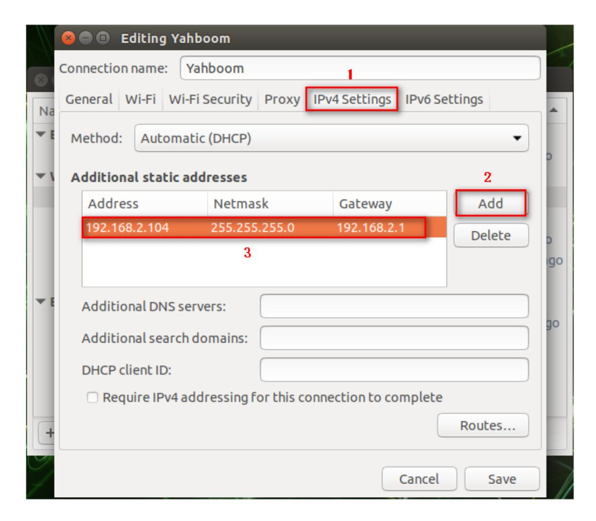
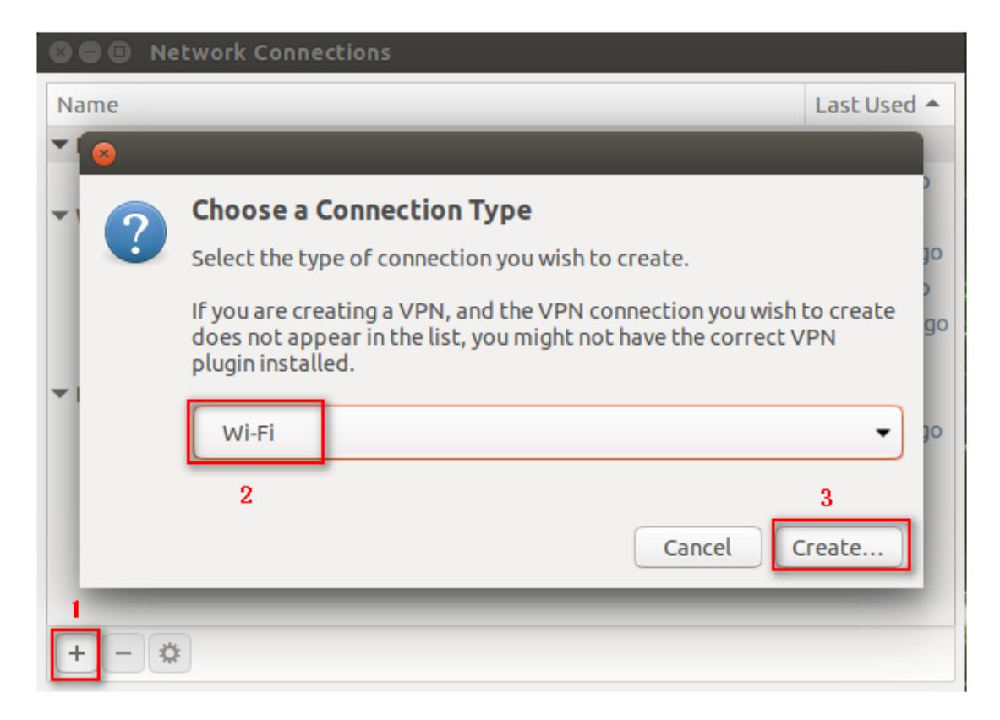
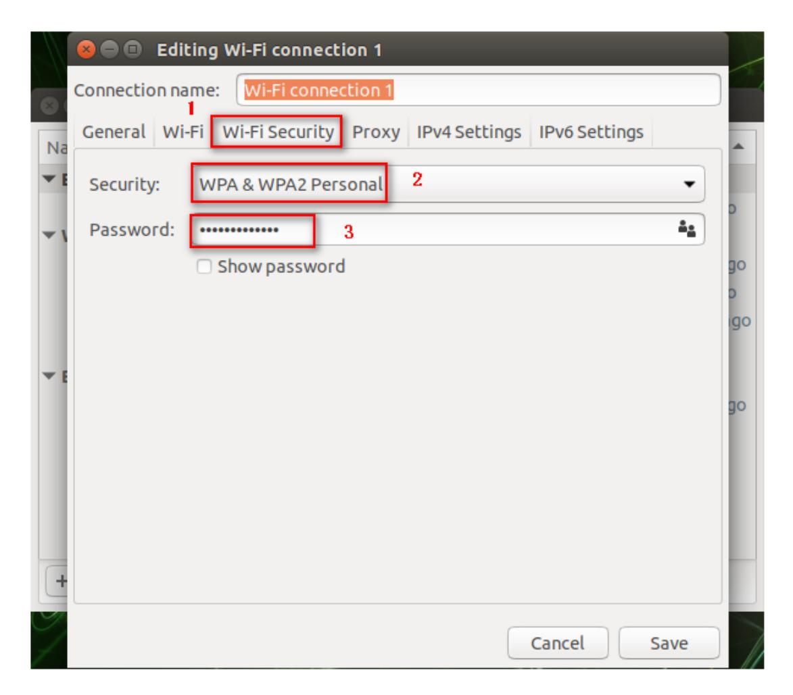
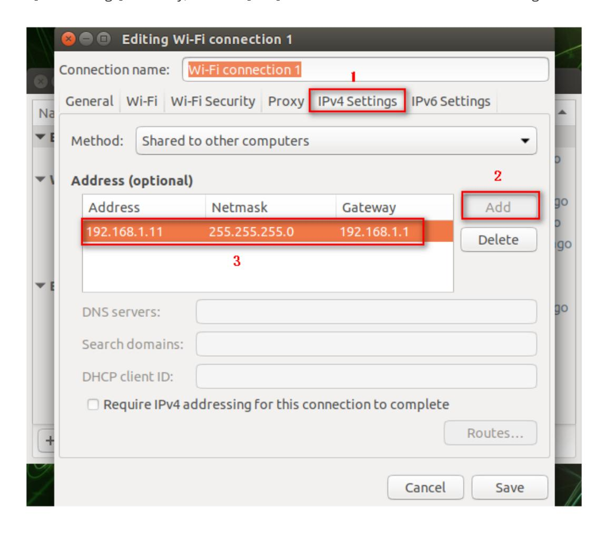
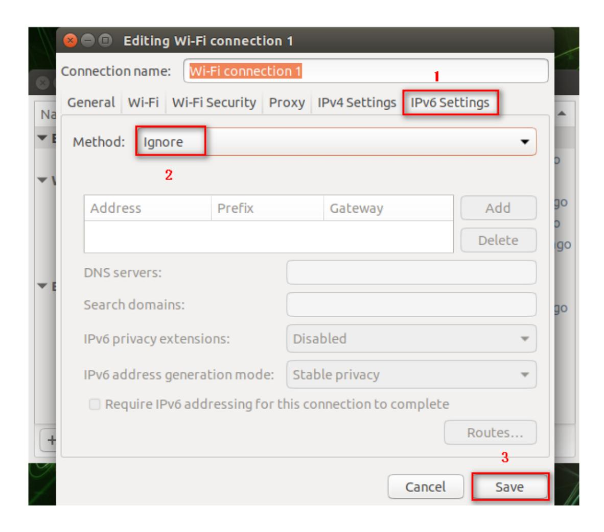
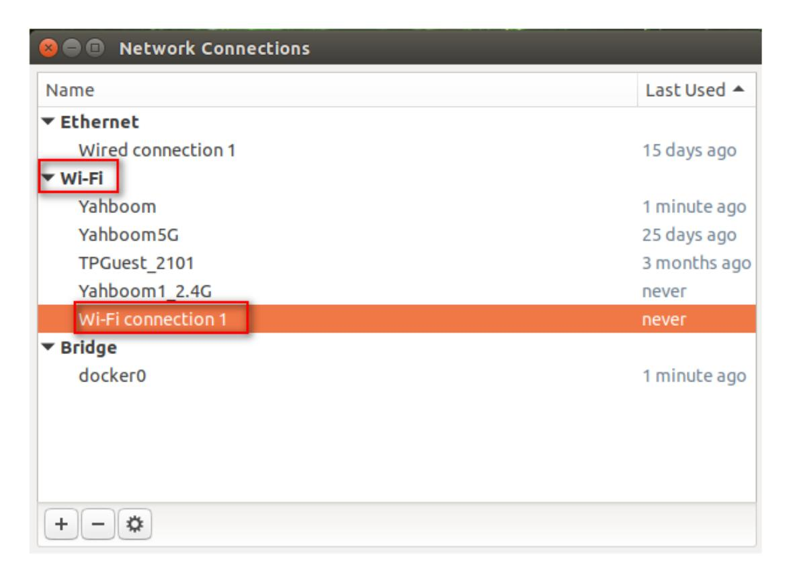

## **11.Static IP and hotspot mode**

## **1. Static IP**

Click the WiFi icon in the upper right corner of the system interface, and a frame as shown below will appear.

Click [Edit Connections...] at the bottom.


Double-click the connected Wi-Fi, here is [Yahboom].



In the [Wi-Fi] directory, select [Mode]-->[Client].



In the [IPv4 Settings] directory, click the [Add] icon, enter the IP as shown below, and finally click [save] to save.



Input following command to modify the .bashrc file,

```
sudo vim ~/.bashrc
```

Set ROS\_IP to the IP modified in the previous step, as shown in the figure below.

Note: If you do not connect to this Wi-Fi, be sure to comment out the modified line (just add # in front).

When we newly open the terminal, 【binary operator expected】 appears.

Don't pay attention to it. It does not affect use.

## **2. Hotspot mode**

Click the WiFi icon in the upper right corner of the system interface, and a frame as shown below will appear.

Click [Edit Connections...] at the bottom.


The frame as shown below will pop up, click [+] to select [Wi-Fi] mode, and click [Create...].



In the [Wi-Fi] directory, add [yah] in the [SSID] column and select [Hotspot] in the [Mode] column.


In the [Wi-Fi Security] directory, select [WPA & WPA2 Personal] in the [Security] column, and enter the password in the [Password] column.



In the [IPv4 Settings] directory, click the [Add] icon and enter the IP as shown in the figure below.



In the [IPv4 Settings] directory, select [Ignore] in the [Method] column, and finally click [Save] to save.



In [Wi-Fi] mode, our newly created WIFI appears.



At this point, the new WIFI has been successfully created. Next, connect to the new WIFI. Follow the steps below.


Select the newly created WIFI [Wi-Fi connections 1] in the [Connections] column of the pop-up dialog box, and click [Connect].

