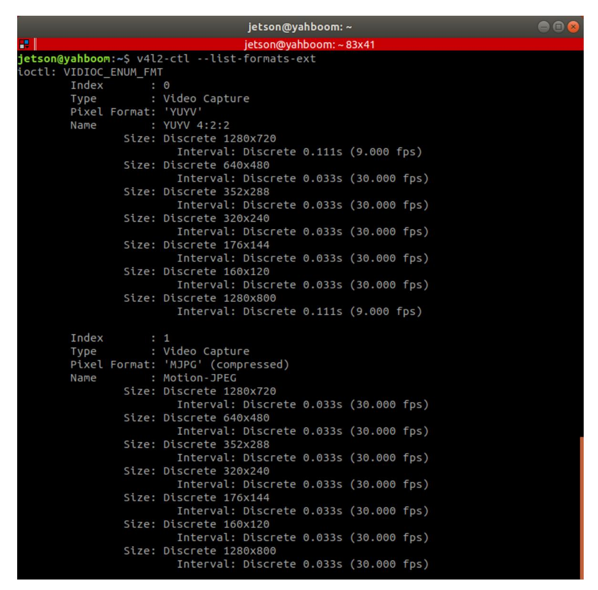

# **12.Bind device ID**

[12.Bind device](#page-0-0) ID

- <span id="page-0-0"></span>1.Device view [command](#page-0-1)
- 2. Establish port mapping [relationship](#page-3-0)
  - [2.1. Device](#page-3-1) binding
  - [2.2. Introduction](#page-4-0) to rule file syntax
- [3. Verify](#page-5-0) view
- [4. Bind USB](#page-6-0) port

When the robot uses two or more USB serial devices, the corresponding relationship between the device name and the device is not fixed, but is assigned in sequence according to the order in which the devices are connected to the system.

Inserting one device first and then another device can determine the relationship between the device and the device name, but it is very troublesome to plug and unplug the device every time the system starts. The serial port can be mapped to a fixed device name. Regardless of the insertion order, the device will be mapped to a new device name. We only need to use the new device name to read and write the device.

## <span id="page-0-1"></span>**1.Device view command**

View camera device parameters

Enter the following command in the terminal to view the corresponding relationship between the camera's pixel size and frame rate.

v4l2-ctl --list-formats-ext



View device ID

```
lsusb
```

As can be seen from the picture below, Astra depth camera has an official document for binding the device to the ID number of each device. Generally, the controller does not need to be bound, and it can mainly be bound to the PCB and radar.

View device ID

ll /dev/

| <b></b>      |                  |                |            |    |            |    | iot            | 700@vabboom: 117v42   |
|--------------|------------------|----------------|------------|----|------------|----|----------------|-----------------------|
|              | 1 coot           | root           | -          | 10 | 12月        | 10 |                | son@yahboom: ~ 117x43 |
| CLM          | 1 root           | root           | 3,         |    | 12月        |    | 17:15          |                       |
| CLM          | 1 root           | root           | 3,         |    | 12月        |    | 17:15          |                       |
| CLM          | 1 root           | root           | 3,         |    | 12月        |    | 17:15          |                       |
| CLM          | 1 root           | root           | 3,         |    |            |    | 17:15          |                       |
| CLM          | 1 root           | root           | 3,         |    | 12月<br>12月 |    | 17:15          |                       |
| CLM          | 1 root           | root           | 3,         |    | 2月         |    | 17:15          |                       |
| CLMM         | 1 root           | tty<br>dialout | 4,         |    | 12月        |    | 18:01<br>17:15 |                       |
| CLM-LM       | 1 root<br>1 root | dialout        | 4,         |    | 12月        |    | 17:15          | -                     |
| CLM-LM       | 1 root           | dialout        | 4,         |    | 12月        |    | 17:15          |                       |
| CLM-LM       | 1 root           |                | 4,<br>238, |    | 2月         |    |                | ttyTHS1               |
| CLMM         |                  | dialout 2      |            |    | 12月        |    |                | ttyTHS2               |
| CCW-CW       | 1 root           | dialout 1      |            |    |            |    |                | ttyUSB0 PCB           |
| CLMXLMXLMX   | 1 root           | dialout 1      |            |    | 2月         |    |                | ttyUSB1 laser         |
| CLM          | 1 root           | root           |            |    |            |    | 17:15          |                       |
| CLM          | 1 root           | root           |            |    | 12月        |    |                | uinput                |
| CLM-LM-LM-   | 1 root           | root           | 1,         |    | 12月        |    |                | urandom               |
| drwxr-xr-x   | 4 root           | root           | _,         |    | 12月        |    | 17:15          |                       |
| CLM-LM       | 1 root           | tty            | 7,         |    | 12月        |    | 17:15          |                       |
| CLM-LM       | 1 root           | tty            | 7,         |    | 12月        |    | 17:15          |                       |
| CLM-LM       | 1 root           | tty            | 7,         |    | 12月        |    | 17:15          |                       |
| CLM-LM       | 1 root           | tty            | 7,         |    | 12月        |    | 17:15          |                       |
| CLM-LM       | 1 root           | tty            | 7,         |    | 12月        | 10 | 17:15          | vcs4                  |
| CLM-LM       | 1 root           | tty            | 7,         | 5  | 12月        | 10 | 17:15          | vcs5                  |
| CLM-LM       | 1 root           | tty            | 7,         |    | 12月        | 10 | 17:15          | vcs6                  |
| CLM-LM       | 1 root           | tty            |            |    | 12月        | 10 | 17:15          | vcsa                  |
| CLM-LM       | 1 root           | tty            |            |    | 12月        | 10 | 17:15          | vcsa1                 |
| CLM-LM       | 1 root           | tty            |            |    | 12月        |    | 17:15          |                       |
| CLM-LM       | 1 root           | tty            |            |    | 12月        | 10 | 17:15          | vcsa3                 |
| CLM-LM       | 1 root           | tty            |            |    | 12月        | 10 | 17:15          | vcsa4                 |
| CLM-LM       | 1 root           | tty            |            |    | 12月        |    | 17:15          |                       |
| CLM-LM       | 1 root           | tty            | 7,         |    | 12月        |    | 17:15          |                       |
| drwxr-xr-x   | 2 root           | root           |            |    | 1月         | 1  |                | vfio/                 |
| CLM          | 1 root           | root           |            |    | 12月        |    | 17:15          |                       |
| CLM-LM+      | 1 root           | video          | 81,        |    | 12月        |    |                | video0 Astra          |
| CLM          | 1 root           | root           |            |    |            |    |                | watchdog              |
| CLM          | 1 root           |                | 244,       |    |            |    |                | watchdog0             |
| CLM-LM-LM-   | 1 root           | root           | 1,         |    |            |    | 17:15          | _                     |
| brw-rw       | 1 root           |                | 252,       |    | 2月         |    | 18:01          |                       |
| brw-rw       | 1 root           |                | 252,       |    | 2月         |    | 18:01          |                       |
| brw-rw       | 1 root           |                | 252,       |    | 2月         |    | 18:01          |                       |
| brw-rw       | 1 root           | disk 2         | 252,       | 3  | 2月         | 14 | 18:01          | Zram3                 |
| jetson@yahbo | om:~\$           |                |            |    |            |    |                |                       |

## **2. Establish port mapping relationship**

### **2.1. Device binding**

<span id="page-3-1"></span><span id="page-3-0"></span>Astra binding

There is a create\_udev\_rules file in the scripts folder under the astra\_camera function package.

Run this file to automatically bind it.

Run the command as follows

```
./create_udev_rules
```

Enter rules.d directory

```
cd /etc/udev/rules.d/
```

You can find the 56-orbbec-usb.rules file, which is the Astra camera device binding file.

PCB and lidar binding

Enter rules.d directory

```
cd /etc/udev/rules.d/
```

Create a new rplidar.rules file

```
sudo touch rplidar.rules
sudo chmod 777 rplidar.rules
```

Open the rplidar.rules file

```
sudo vim rplidar.rules
```

Write the following content

```
KERNEL=="ttyUSB*", ATTRS{idVendor}=="1a86", ATTRS{idProduct}=="7523",
MODE:="0777", SYMLINK+="myserial"
KERNEL=="ttyUSB*", ATTRS{idVendor}=="10c4", ATTRS{idProduct}=="ea60",
MODE:="0777", SYMLINK+="rplidar"
```

Exit for the rules to take effect

```
sudo udevadm trigger
sudo service udev reload
sudo service udev restart
```

### <span id="page-4-0"></span>**2.2. Introduction to rule file syntax**

```
KERNEL=="ttyUSB*", ATTRS{idVendor}=="1a86", ATTRS{idProduct}=="7523",
MODE:="0777", SYMLINK+="myserial"
KERNEL=="ttyUSB*", ATTRS{idVendor}=="10c4", ATTRS{idProduct}=="ea60",
MODE:="0777", SYMLINK+="rplidar"
```

Analyze

```
KERNEL #The device name matching the event
ATTR{filename} # Match the sysfs attributes of the event device.
idVendor # Manufacturer number
idProduct # Product number
SYMLINK # Generate symbolic links for device files under /dev/.
Just give this device an alias.
MODE # Set permissions for the device。
```

From [6.1], we can see that the PCB device number is [ttyUSB0] and is easy to change. The ID number is [1a86, 7523] and is fixed. [ttyUSB\*] means that no matter the device number becomes [ttyUSB] in the future, it will be followed by [ 0, 1, 2, 3, 4,...] are all bound to [myserial]; the radar device [ttyUSB1] is the same; the same is true for other devices that need to be bound.

## <span id="page-5-0"></span>**3. Verify view**

View device number

```
ll /dev/
```

#### PCB

#### laser

## <span id="page-6-0"></span>**4. Bind USB port**

The above situations are all different ID numbers. If the ID numbers of the radar and PCB are the same, or there are two or more PCBs (radars) with the same ID, the above binding will be confusing.

Then, we need to bind the USB port. After binding, the USB port cannot be changed at will. Each device can only be connected to a fixed USB port.

Binding method, take [ttyUSB0] as an example to check the port of the device at this time

```
udevadm info --attribute-walk --name=/dev/ttyUSB0 |grep KERNELS
```

We need is to modify it in the rules file

```
# KERNEL=="ttyUSB*", ATTRS{idVendor}=="1a86", ATTRS{idProduct}=="7523",
MODE:="0777", SYMLINK+="myserial" # before modify
KERNELS=="1-2.1.3", ATTRS{idVendor}=="1a86", ATTRS{idProduct}=="7523",
MODE:="0777", SYMLINK+="myserial" # after modify
```