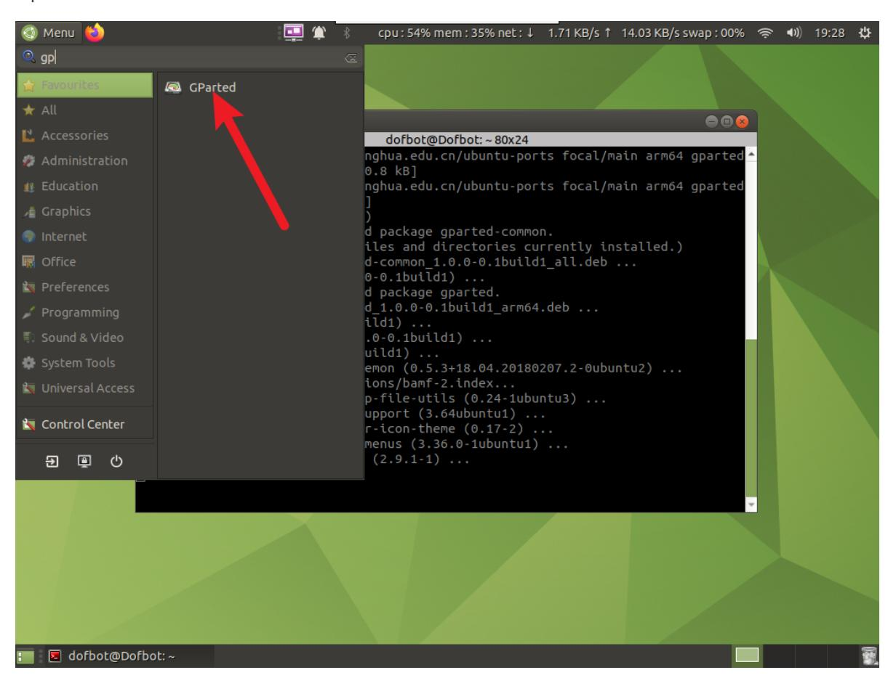
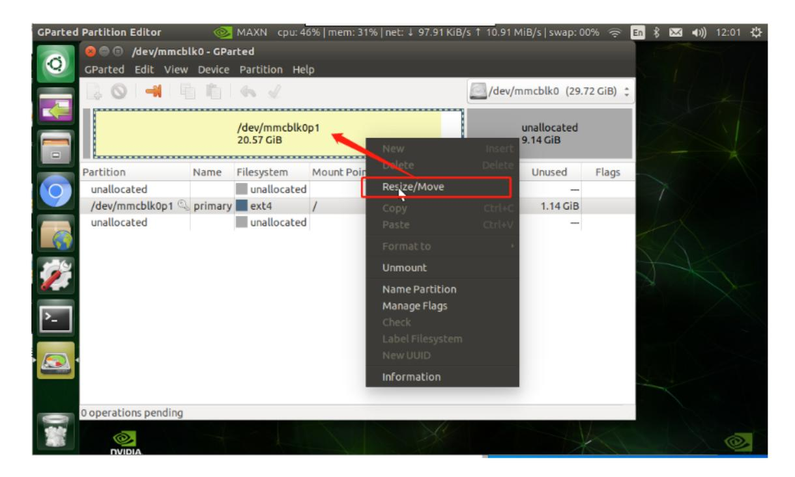
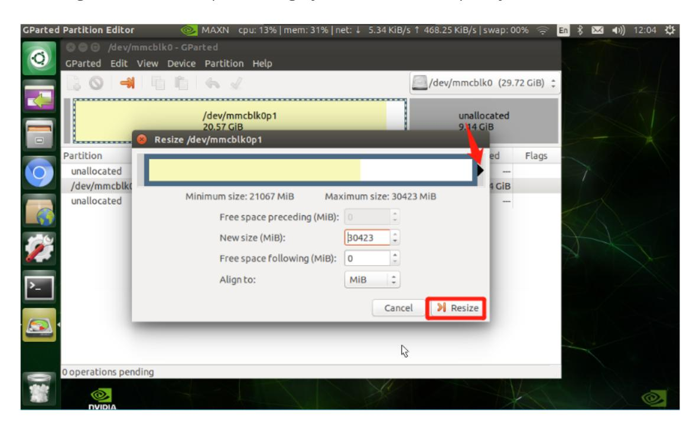
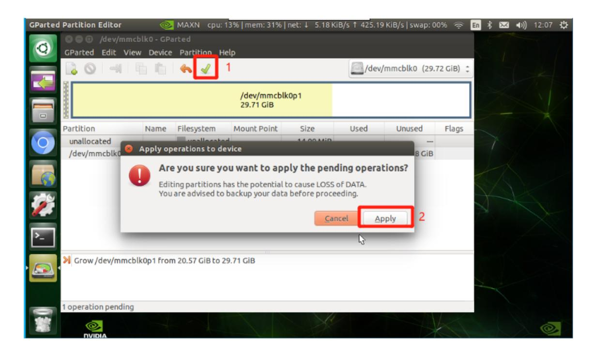
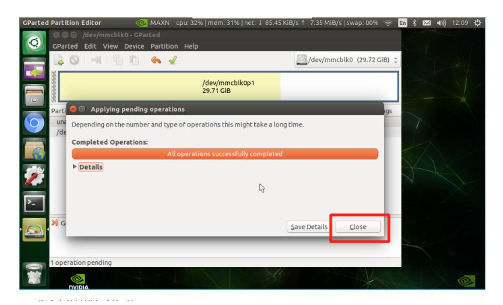

## **13.Capacity expansion and resource allocation**

## **1. Question**

After using TF to burn an image that is larger than the image memory, a part of the free memory will not be used, resulting in an error message indicating insufficient space, or failure to run large projects.

**Note: If you are using the USB flash drive, SD card and system image file provided by Yahboom, you can skip this course. The expansion methods of U disk and SD card are the same. This section takes SD card as an example.**

## **2. solution**

Install the expansion software and use the expansion software to expand the capacity.

```
sudo apt install gparted
```

## Open software



Click right key on mouse-->【/dev/mmcblk0p1】-->Resize/Move.



Pull the right frame to the top until the gray area becomes completely white->Resize



Click √ under the function bar -> Apply



Expansion completed!



Input the following command in the terminal to query and verify

```
df -h
```

Verify that the expansion is successful.

The 32G card expansion information is as follows.

```
dofbot@Dofbot: ~
                                 dofbot@Dofbot: ~ 80x24
Jnpacking gparted-common (1.0.0-0.1build1) ...
Selecting previously unselected package gparted.
Preparing to unpack .../gparted 1.0.0-0.1build1 arm64.deb ...
Jnpacking gparted (1.0.0-0.1build1) ...
Setting up gparted-common (1.0.0-0.1build1) ...
Setting up gparted (1.0.0-0.1build1) ...
Processing triggers for bamfdaemon (0.5.3+18.04.20180207.2-0ubuntu2) ...
Rebuilding /usr/share/applications/bamf-2.index...
Processing triggers for desktop-file-utils (0.24-1ubuntu3) ...
Processing triggers for mime-support (3.64ubuntu1) ...
Processing triggers for hicolor-icon-theme (0.17-2) ...
Processing triggers for gnome-menus (3.36.0-1ubuntu1) ...
Processing triggers for man-db (2.9.1-1) ...
dofbot@Dofbot:~$ df -h
               Size Used Avail Use% Mounted on
ilesystem
                                   0% /dev
ıdev
                1.8G
                        0 1.8G
tmpfs
                                   2% /run
                380M
                     4.4M
                           376M
/dev/mmcblk0p2
                            17G
                                  45% /
                29G
                      13G
                           1.9G
                                   0% /dev/shm
tmpfs
                1.9G
                       0
tmpfs
                                   1% /run/lock
                     4.0K
                           5.0M
               5.0M
tmpfs
                           1.9G
                                   0% /sys/fs/cgroup
               1.9G
                        0
```

47% /boot/firmware

1% /run/user/1000

118M

44K

138M

380M

255M

380M

/dev/mmcblk0p1

dofbot@Dofbot:~\$

tmpfs