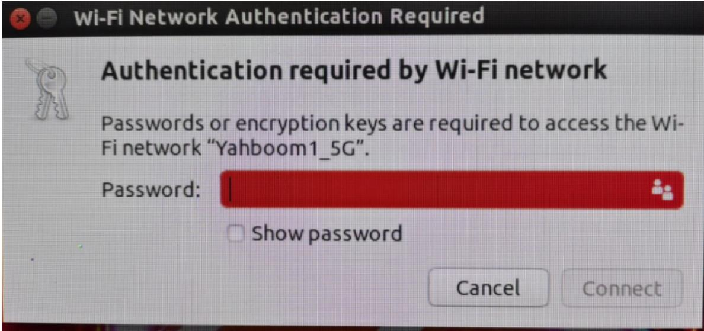

## **17.Connect to WiFi network**

[17.Connect](#page-0-0) to WiFi network

- <span id="page-0-0"></span>1. Connect the [desktop to](#page-0-1) WiFi network
- <span id="page-0-1"></span>2. Connect to WiFi network via [command line](#page-1-0)

## **1. Connect the desktop to WiFi network**

When connecting to a WiFi network, the desktop connection method is preferred, making the operation simpler and more convenient.

Click the WiFi logo in the upper right corner of the desktop, then select the WiFi signal you want to connect to, and then enter the WiFi password to confirm to connect to WiFi.




## <span id="page-1-0"></span>**2. Connect to WiFi network via command line**

Enter the following command to scan and list nearby WiFi signals

```
sudo iwlist scan
sudo nmcli device wifi list
```

Start connecting to the WiFi signal according to the WiFi name and password you need to connect.

```
sudo nmcli device wifi connect [WiFi name] password [WiFi password]
```

Example: If WiFi name is Yahboom1\_5G and password is 12345678, please enter the following command:

sudo nmcli device wifi connect Yahboom1\_5G password 12345678