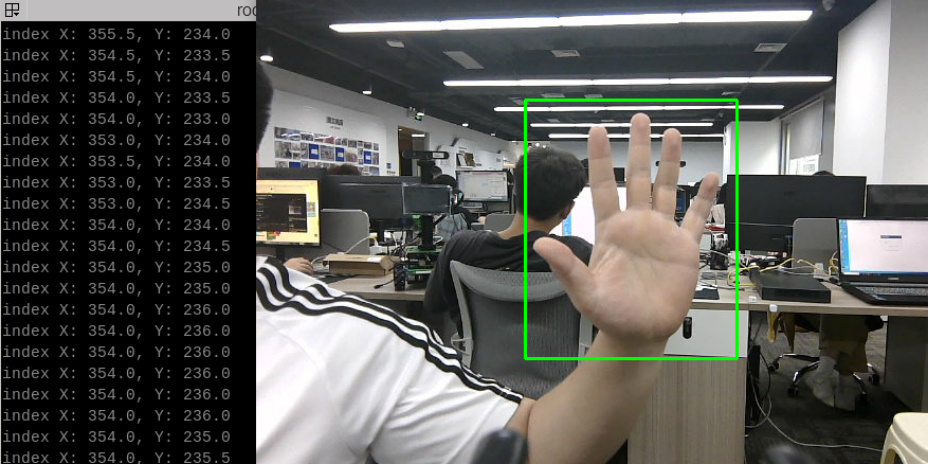
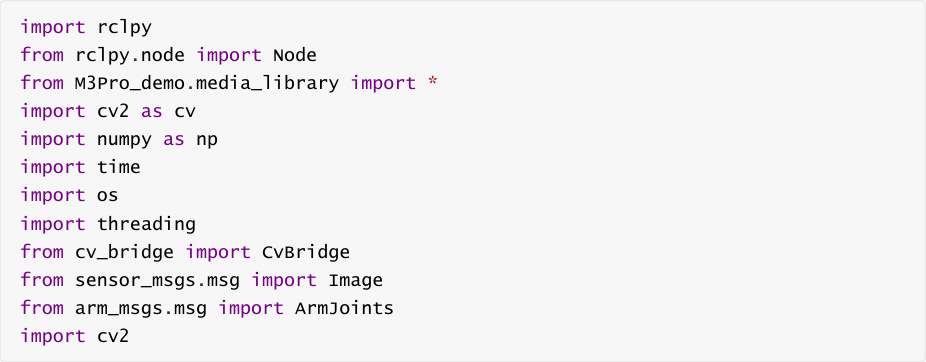
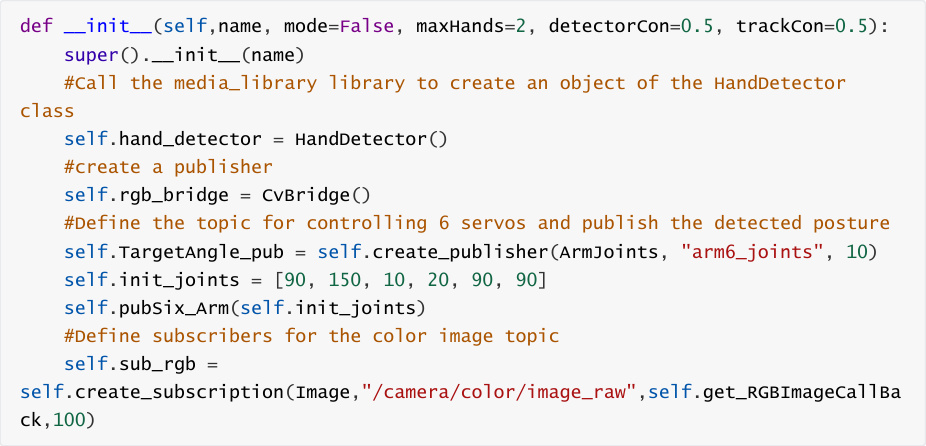
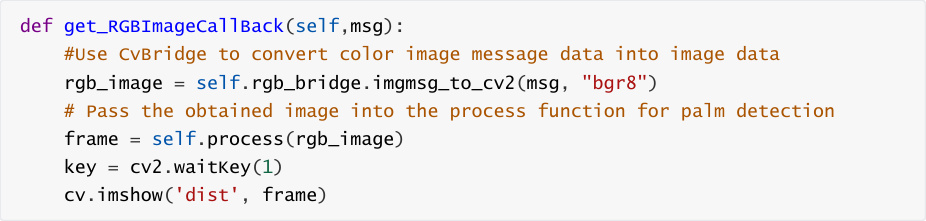
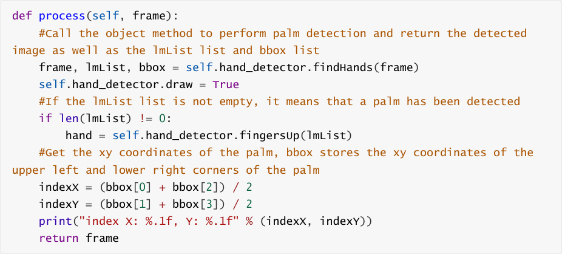

# Palm target positioning
## 1. Content Description
This course implements capturing color images and using the MediaPipe framework to detect a

hand, outputting its coordinates. This can then be combined with a robot chassis or robotic arm

to track hand movements.


This section requires entering commands in the terminal. The terminal you open depends on

your motherboard type. This lesson uses the Raspberry Pi 5 as an example. For Raspberry Pi and

Jetson-Nano boards, you need to open a terminal on the host computer and enter the command

to enter the Docker container. Once inside the Docker container, enter the commands mentioned

in this section in the terminal. For instructions on entering the Docker container from the host

computer, refer to this product tutorial **[Configuration and Operation Guide]--[Enter the**

**Docker (Jetson Nano and Raspberry Pi 5 users, see here)]** .


Simply open the terminal on the Orin motherboard and enter the commands mentioned in this

section.

## 2. Program startup
First, in the terminal, enter the following command to start the camera,


After successfully starting the camera, open another terminal and enter the following command

in the terminal to start the palm positioning program.


After the program is started, as shown in the figure below, when a palm is detected, the palm will

be framed in green on the screen, and the center coordinates of the palm will be output on the

terminal.



## 3. Core code analysis
Program code path:


Raspberry Pi 5 and Jetson-Nano board


The program code is in the running docker. The path in docker

is `/root/yahboomcar_ws/src/yahboomcar_mediapipe/yahboomcar_mediapipe/12_FindHand.`

```
   py

```

Orin Motherboard


The program code path

is `/home/jetson/yahboomcar_ws/src/yahboomcar_mediapipe/yahboomcar_mediapipe/12_Fi`

```
   ndHand.py

```

Import the library files used,


Initialize data and define publishers and subscribers,







Color image callback function,





process function,





The definition of the Medipipe recognition class can be found in the media_library library, which is

located in the M3Pro_demo function package.


In the directory,


Raspberry Pi 5 and Jetson-Nano board


The path in docker is /root/yahboomcar_ws/src/M3Pro_demo/M3Pro_demo/media_library.py


Orin Motherboard


The program code path is

/home/jetson/yahboomcar_ws/src/M3Pro_demo/M3Pro_demo/media_library.py


In this library, we use the native library of meidiapipe to expand and define many classes. Each

class defines different functions.


When needed, just pass in the parameters. For example, we define the following function in the

HandDetector class:


findHands: Find hands

fingersUp: fingers straight up

ThumbTOforefinger: Detects the angle between the thumb and index finger

get_gesture: Detect gestures
