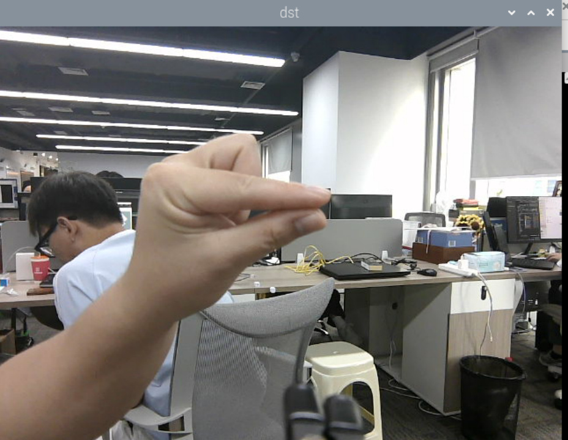
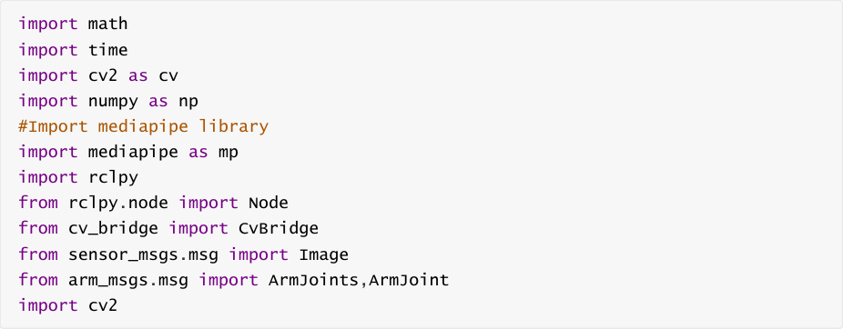
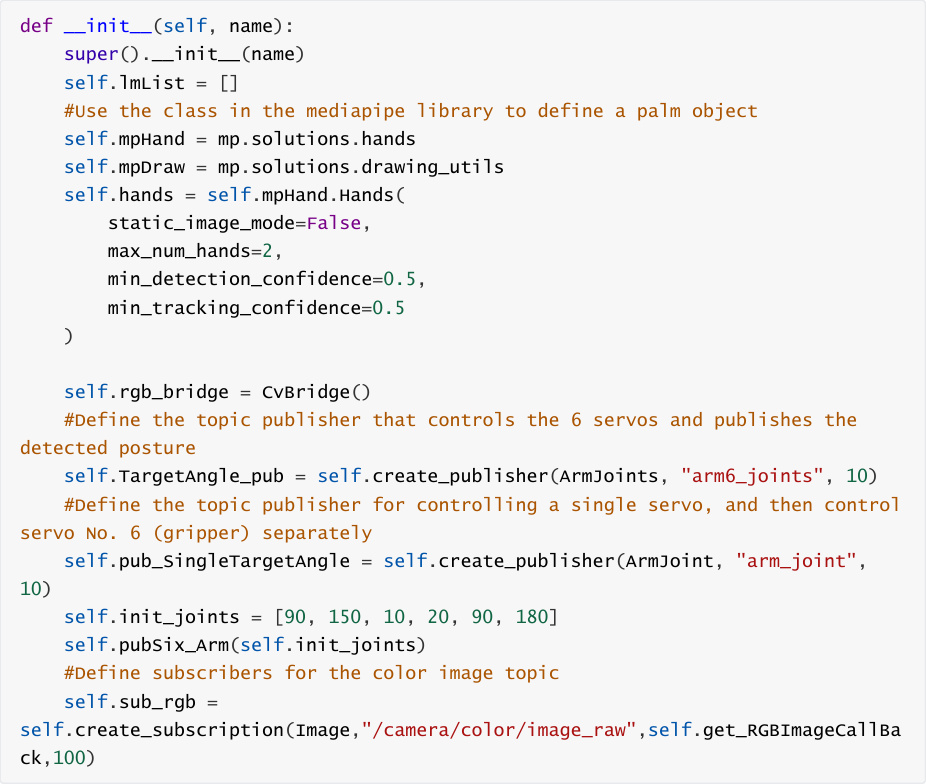
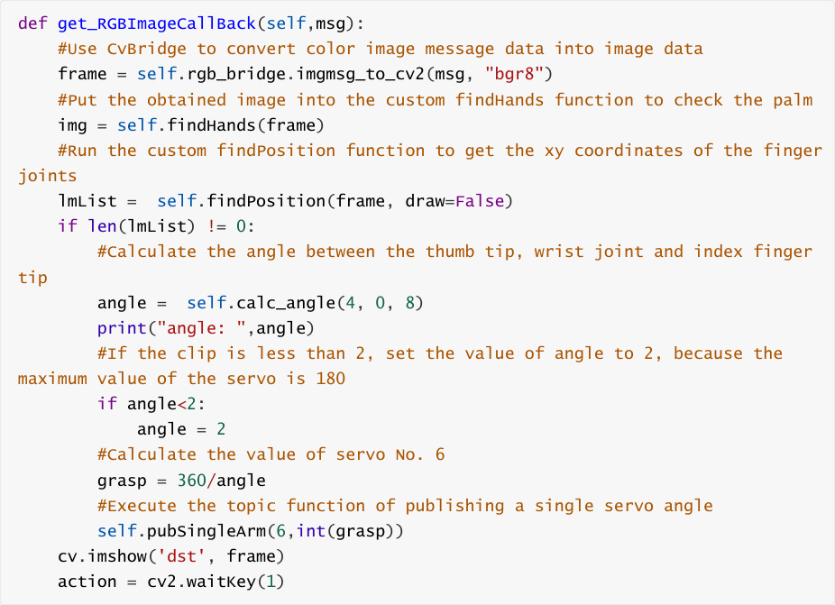
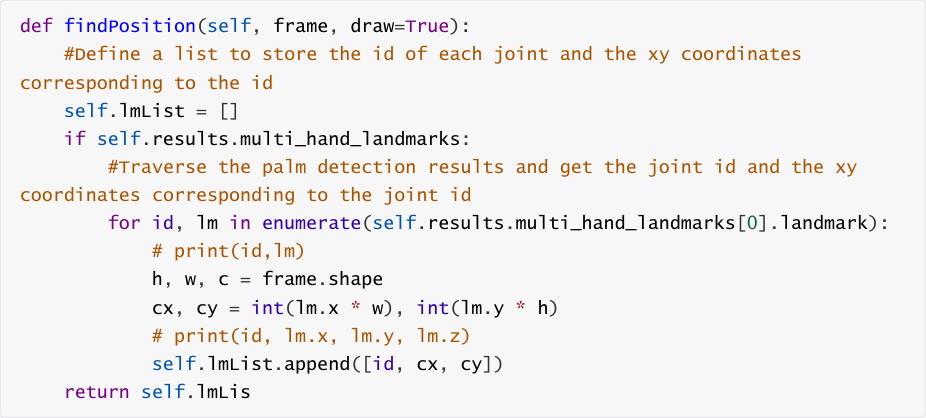
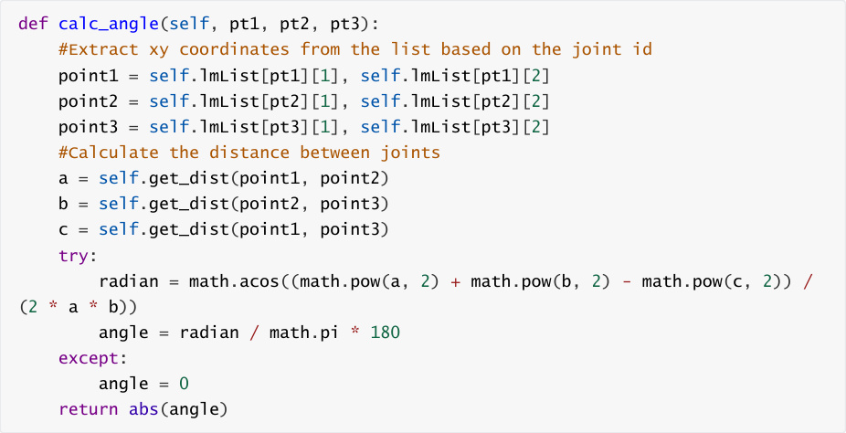

# Finger control robotic arm
## 1. Content Description
This function realizes the acquisition of color images and the use of the mediapipe framework to

detect fingers, calculate the angle between the thumb and index finger to control the opening and

closing of the robot arm gripper (servo No. 6).


This section requires entering commands in the terminal. The terminal you open depends on

your motherboard type. This lesson uses the Raspberry Pi 5 as an example. For Raspberry Pi and

Jetson-Nano boards, you need to open a terminal on the host computer and enter the command

to enter the Docker container. Once inside the Docker container, enter the commands mentioned

in this section in the terminal. For instructions on entering the Docker container from the host

computer, refer to this product tutorial **[Configuration and Operation Guide]--[Enter the**

**Docker (Jetson Nano and Raspberry Pi 5 users, see here)]** .


Simply open the terminal on the Orin motherboard and enter the commands mentioned in this

section.

## 2. Program startup
First, in the terminal, enter the following command to start the camera,


After successfully starting the camera, open another terminal and enter the following command

in the terminal to start the program for controlling the gripper with your finger:


The program runs as shown in the figure below. After detecting a hand, the program calculates

the angle between the thumb and index finger. Slowly opening and closing the two fingers causes

the robotic arm's gripper to open and close more slowly. Performance is slightly worse on the

Raspberry Pi 5 and Jetson Nano motherboards, due to motherboard performance and the fact

that the program is running in Docker.



## 3. Core code analysis
Program code path:


Raspberry Pi 5 and Jetson-Nano board


The program code is in the running docker. The path in docker

is `/root/yahboomcar_ws/src/yahboomcar_mediapipe/yahboomcar_mediapipe/13_FingerCtr`

```
   l.py

```

Orin Motherboard


The program code path is

/home/jetson/yahboomcar_ws/src/yahboomcar_mediapipe/yahboomcar_mediapipe/13_Fing

erCtrl.py


Import the library files used,





Initialize data and define publishers and subscribers,





Color image callback function,





findPosition function, get the xy coordinates of the finger joints





calc_angle function, calculates the angle formed by 3 points,



