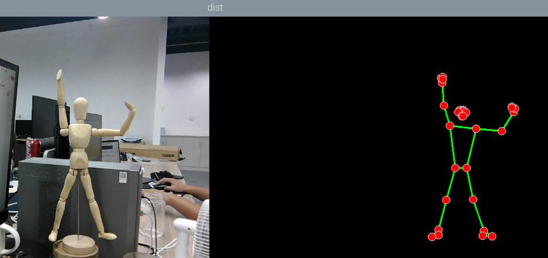
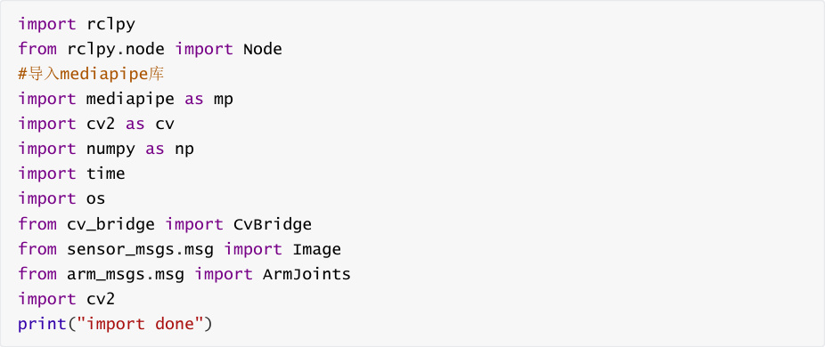
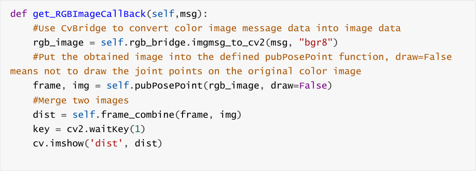
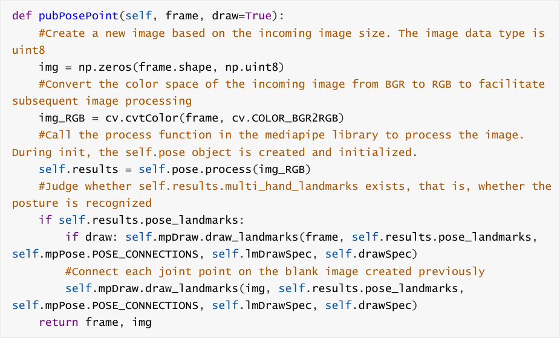

# Posture Detection
## 1. Content Description
This course implements color image acquisition and gesture detection using the MediaPipe

framework.


This section requires entering commands in the terminal. The terminal you open depends on

your motherboard type. This lesson uses the Raspberry Pi 5 as an example. For Raspberry Pi and

Jetson-Nano boards, you need to open a terminal on the host computer and enter the command

to enter the Docker container. Once inside the Docker container, enter the commands mentioned

in this section in the terminal. For instructions on entering the Docker container from the host

computer, refer to this product tutorial **[Configuration and Operation Guide]--[Enter the**

**Docker (Jetson Nano and Raspberry Pi 5 users, see here)]** .


Simply open the terminal on the Orin motherboard and enter the commands mentioned in this

section.

## 2. Program startup
First, in the terminal, enter the following command to start the camera,


After successfully starting the camera, open another terminal and enter the following command

in the terminal to start the posture detection program.


After the program is run, the following figure will be shown. The joint points of the detected

posture will be displayed on the right side of the image.



## 3. Core code analysis
Program code path:


Raspberry Pi 5 and Jetson-Nano board


The program code is in the running docker. The path in docker

is `/root/yahboomcar_ws/src/yahboomcar_mediapipe/yahboomcar_mediapipe/02_PoseDetec`

```
   tor.py

```

Orin Motherboard


The program code path is

/home/jetson/yahboomcar_ws/src/yahboomcar_mediapipe/yahboomcar_mediapipe/02_Pos

eDetector.py


Import the library files used,


Initialize data and define publishers and subscribers,

```
 def __init__(self, name,mode=False, smooth=True, detectionCon=0.5,

 trackCon=0.5):

    super().__init__(name)

    #Use the class in the mediapipe library to define a posture object

    self.mpPose = mp.solutions.pose

    self.mpDraw = mp.solutions.drawing_utils

    self.pose = self.mpPose.Pose(

    static_image_mode=mode,

    smooth_landmarks=smooth,

    min_detection_confidence=detectionCon,

    min_tracking_confidence=trackCon )

    #Define the properties of the joint connection line, which will be used in

 the subsequent joint point connection function

    self.lmDrawSpec = mp.solutions.drawing_utils.DrawingSpec(color=(0, 0, 255),

 thickness=-1, circle_radius=6)

    self.drawSpec = mp.solutions.drawing_utils.DrawingSpec(color=(0, 255, 0),

 thickness=2, circle_radius=2)

    #create a publisher

    self.rgb_bridge = CvBridge()

    #Define the topic for controlling 6 servos and publish the detected posture

    self.TargetAngle_pub = self.create_publisher(ArmJoints, "arm6_joints", 10)

    self.init_joints = [90, 150, 10, 20, 90, 90]

    self.pubSix_Arm(self.init_joints)

    #Define subscribers for the color image topic

```



```
    self.sub_rgb =

 self.create_subscription(Image,"/camera/color/image_raw",self.get_RGBImageCallBa

 ck,100)

```

Color image callback function,





pubPosePoint function,





The frame_combine image merging function was mentioned in the first lesson of this chapter.

Please refer to [Meediapipe Visual Fun Game] - [1. Hand Detection] for an analysis of this

function.
