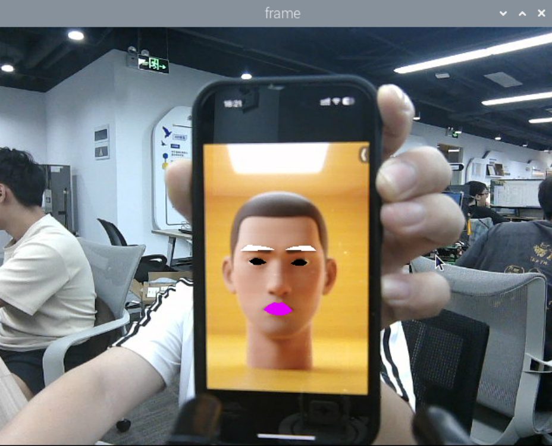
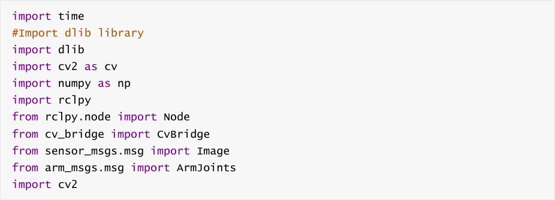
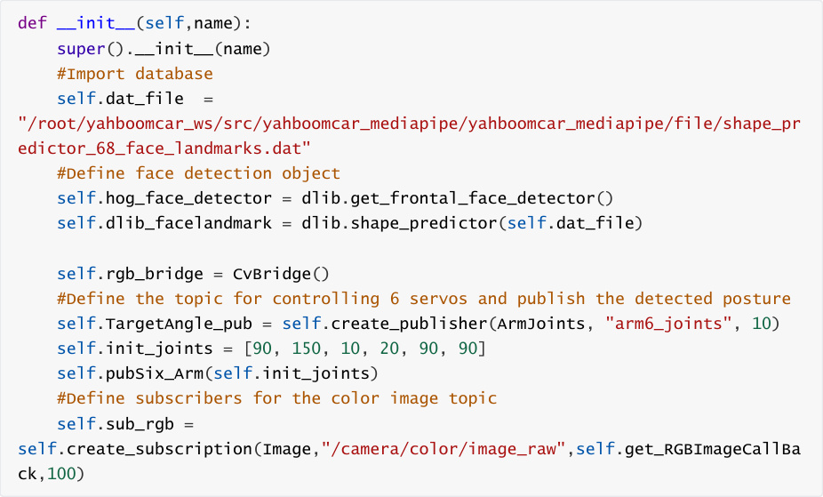
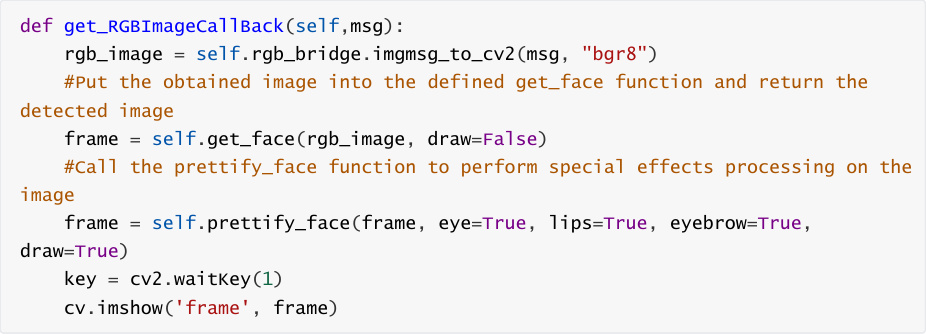
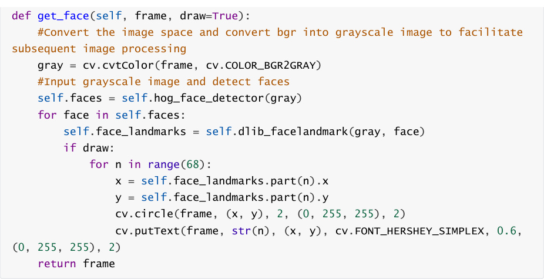
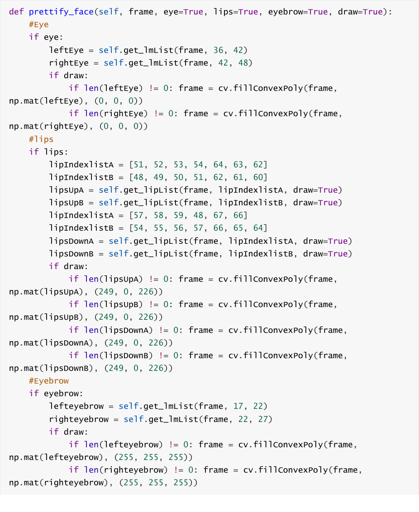
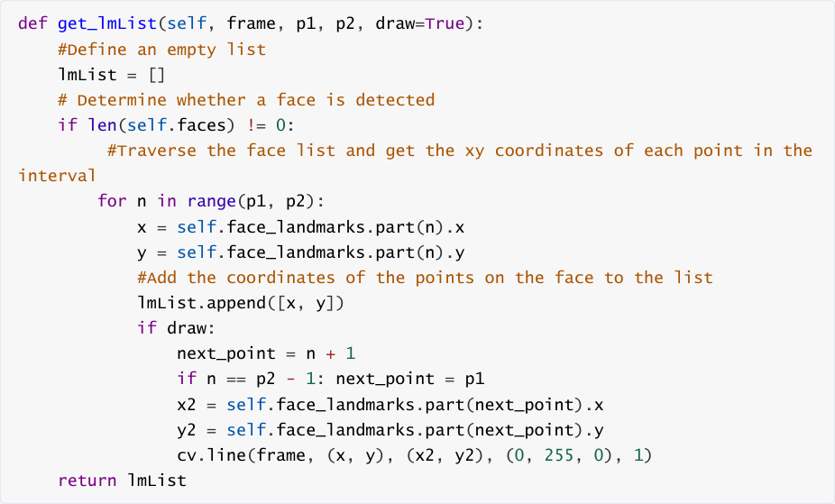

# 1. Content Description
This program implements the functions of acquiring color images and using the dlib library to

implement face detection and face effects.


This section requires entering commands in the terminal. The terminal you open depends on

your motherboard type. This lesson uses the Raspberry Pi 5 as an example. For Raspberry Pi and

Jetson-Nano boards, you need to open a terminal on the host computer and enter the command

to enter the Docker container. Once inside the Docker container, enter the commands mentioned

in this section in the terminal. For instructions on entering the Docker container from the host

computer, refer to this product tutorial **[Configuration and Operation Guide]--[Enter the**

**Docker (Jetson Nano and Raspberry Pi 5 users, see here)]** .


Open the terminal directly on the Orin motherboard and enter the commands mentioned in this

section.

## 2. Program startup
First, in the terminal, enter the following command to start the camera,


After successfully starting the camera, open another terminal and enter the following command

in the terminal to start the face effects program:


After the program is run, as shown in the figure below, it will first detect the face, and then

perform special effects processing on the eyebrows, eyes and mouth areas.



## 3. Core code analysis
Program code path:


Raspberry Pi 5 and Jetson-Nano board


The program code is in the running docker. The path in docker

is `/root/yahboomcar_ws/src/yahboomcar_mediapipe/yahboomcar_mediapipe/06_FaceLandm`

```
   arks.py

```

Orin Motherboard


The program code path is

/home/jetson/yahboomcar_ws/src/yahboomcar_mediapipe/yahboomcar_mediapipe/06_Face

Landmarks.py


Import the library files used,





Introduction to the dlib library:


DLIB is a modern C++ toolkit that includes machine learning algorithms and tools for creating

complex software in C++ to solve real-world problems. It is widely used in industry and academia

for robotics, embedded devices, mobile phones, and large-scale high-performance computing

environments. The dlib library uses 68 points to mark important facial features, such as points 18
22 for the right eyebrow and points 51-68 for the mouth. Faces are detected using the

get_frontal_face_detector module in the dlib library, and facial feature values are predicted using

the shape_predictor_68_face_landmarks.dat feature data.


The 68 facial key points of dlib are arranged in the following order:


0-16: Chin contour

17-21: right eyebrow

22-26: Left eyebrow

27-35: Nose bridge and nose tip

36-41: right eye

42-47: Left eye

48-67: Lip contour


Initialize data and define publishers and subscribers,





The topic of color images returns to the function,





get_face function, detects faces,





prettify_face function, add special effects to the face,





```
    return frame

```

get_lmList gets the facial coordinate function,



