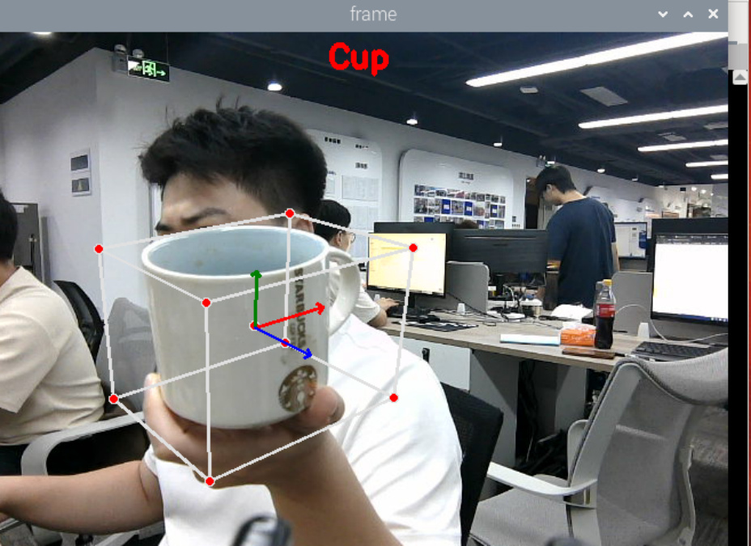
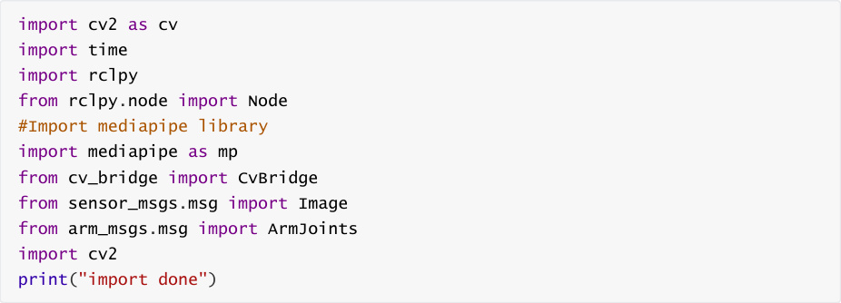
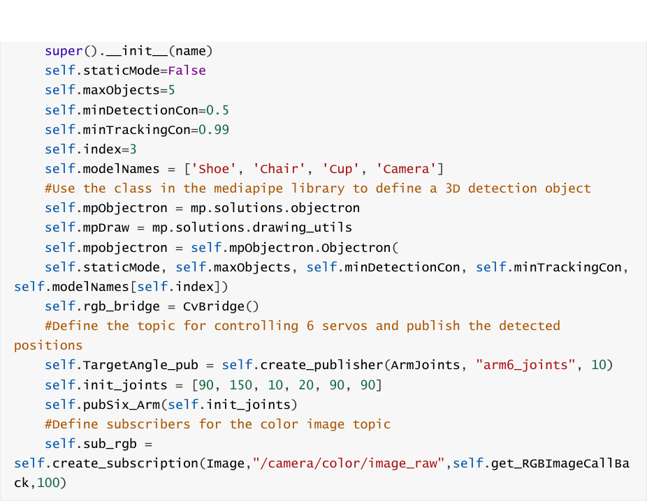
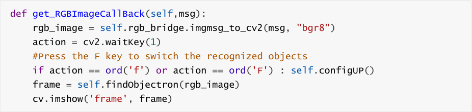
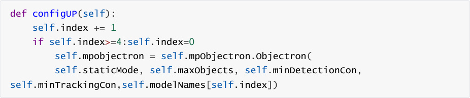

# 3D object recognition
## 1. Content Description
This course implements color image acquisition and 3D object recognition using the MediaPipe

framework (only four examples are shown: a mug, a shoe, a chair, and a camera).


This section requires entering commands in the terminal. The terminal you open depends on

your motherboard type. This lesson uses the Raspberry Pi 5 as an example. For Raspberry Pi and

Jetson-Nano boards, you need to open a terminal on the host computer and enter the command

to enter the Docker container. Once inside the Docker container, enter the commands mentioned

in this section in the terminal. For instructions on entering the Docker container from the host

computer, refer to this product tutorial **[Configuration and Operation Guide]--[Enter the**

**Docker (Jetson Nano and Raspberry Pi 5 users, see here)]** .


Simply open the terminal on the Orin motherboard and enter the commands mentioned in this

section.

## 2. Program startup
First, in the terminal, enter the following command to start the camera,


After successfully starting the camera, open another terminal and enter the following command

in the terminal to start the 3D object detection program.


After the program is running, the default object to be recognized is the shoe. You can press the F

key to switch the recognized object. As shown in the figure below, the mug is recognized.



## 3. Core code analysis
Program code path:


Raspberry Pi 5 and Jetson-Nano board

The program code is in the running docker. The path in docker

is `/root/yahboomcar_ws/src/yahboomcar_mediapipe/yahboomcar_mediapipe/08_Objectron`

```
   .py

```

Orin Motherboard

Program code

path `/home/jetson/yahboomcar_ws/src/yahboomcar_mediapipe/yahboomcar_mediapipe/08`

```
   _Objectron.py

```

Import the library files used,


Initialize data and define publishers and subscribers,

```
 def __init__(self,name):

```






Color image callback function,





configUP switches the object recognition function and selects self.modelNames by modifying the

value of self.index. The options for self.modelNames are ['Shoe', 'Chair', 'Cup', 'Camera']





findObjectron object recognition function,

```
 def findObjectron(self, frame):

    cv.putText(frame, self.modelNames[self.index], (int(frame.shape[1] / 2)
 30, 30),

    cv.FONT_HERSHEY_SIMPLEX, 0.9, (0, 0, 255), 3)

    #Convert the color space of the incoming image from BGR to RGB to facilitate

 subsequent image processing

    img_RGB = cv.cvtColor(frame, cv.COLOR_BGR2RGB)

    #Call the process function in the mediapipe library to process the image.

 During init, the self.pose object is created and initialized.

    results = self.mpobjectron.process(img_RGB)

```

```
  # Determine whether the target object is recognized

  if results.detected_objects:

     for id, detection in enumerate(results.detected_objects):

       #Draw a coordinate system for the identified target object on the

image

       self.mpDraw.draw_landmarks(frame, detection.landmarks_2d,

self.mpObjectron.BOX_CONNECTIONS)

       self.mpDraw.draw_axis(frame, detection.rotation,

detection.translation)

  return frame

```
