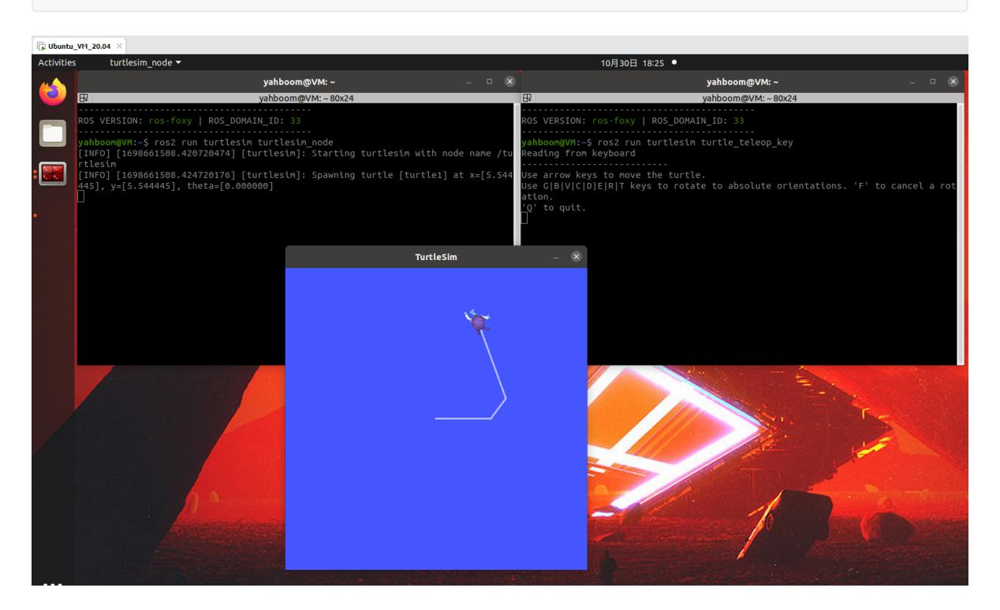

# **11. ROS2 parameter service case**

## **1. Introduction to parameters**

Similar to global variables in C++ programming, they facilitate sharing data across multiple programs. Parameters are global dictionaries in the ROS robot system, allowing data to be shared across multiple nodes.

In the ROS system, parameters exist in the form of a global dictionary. What is a dictionary? Just like a real dictionary, they consist of a name and a value, also known as a key and a value. Alternatively, we can think of them as being like parameters in programming: there's a parameter name, followed by an equals sign, and then the parameter value. To use it, you simply access the parameter name.

Parameters have a rich set of features. For example, if a node shares a parameter, other nodes can access it. If a node modifies a parameter, other nodes can immediately be notified and obtain the latest value.

# **2. Parameters in the Little Turtle Example**

In the Little Turtle example, the emulator provides a number of parameters. Let's use this example to familiarize ourselves with the meaning of parameters and command line usage.

Since a GUI is displayed here, the following examples are demonstrated in the virtual machine that comes with the tutorial for ease of operation.

1. Launch two terminals in the virtual machine, running the turtle simulator and the keyboard control node respectively:

```
ros2 run turtlesim turtlesim_node
ros2 run turtlesim turtle_teleop_key
```



2. Launch a terminal in the virtual machine and use the following command to view the parameter list:

```
ros2 param list
```

3. Querying and Modifying Parameters

To query or modify the value of a parameter, follow the param command with a get or set subcommand:

```
ros2 param describe turtlesim background_b # View the description of a parameter
ros2 param get turtlesim background_b # Query the value of a parameter
ros2 param set turtlesim background_b 10 # Modify the value of a parameter
```

4. Saving and Loading Parameter Files

Querying/modifying parameters one by one is too cumbersome. Why not try using a parameter file? Parameter files in ROS use the YAML format. You can follow the param command with the dump subcommand to save all the parameters for a node to a file, or use the load command to load all the contents of a parameter file at once:

```
ros2 param dump turtlesim >> turtlesim.yaml # Save the parameters of a node to a
parameter file
ros2 param load turtlesim turtlesim.yaml # Load all parameters from a file at
once
```

# **3. Parameter Examples**

#### **3.1. Creating a New Function Package**

Create a new function package in the src directory of the workspace

```
ros2 pkg create pkg_param --build-type ament_python --dependencies rclpy --node-
name param_demo
```

After executing the above command, the pkg\_param package will be created, a param\_demo node will be created, and the relevant configuration files will be configured.

### **3.2 Code Implementation**

Next, edit [param\_demo.py] to implement the publisher functionality and add the following code:

```
import rclpy # ROS2 Python interface library
from rclpy.node import Node # ROS2 Node Class
class ParameterNode(Node):
   def __init__(self, name):
      super().__init__(name) # ROS2 node
parent class initialization
      self.timer = self.create_timer(2, self.timer_callback) # Create a
timer (a period in seconds, a callback function that is executed at a fixed
time)
      self.declare_parameter('robot_name', 'muto') # Create a
parameter and set its default value
   def timer_callback(self): # Create a
callback function that is executed periodically by the timer
      robot_name_param =
self.get_parameter('robot_name').get_parameter_value().string_value # Read
parameter values from the ROS2 system
```

```
self.get_logger().info('Hello %s!' % robot_name_param) # Output log
information and print the parameter values read
def main(args=None): # ROS2 node main entry main
function
  rclpy.init(args=args) # ROS2 Python interface
initialization
  node = ParameterNode("param_declare") # Create a ROS2 node object
and initialize it
  rclpy.spin(node) # Loop waiting for ROS2 to
exit
  node.destroy_node() # Destroy node object
  rclpy.shutdown() # Close the ROS2 Python
interface
```

### **3.3. Compile the package**

```
colcon build --packages-select pkg_param
```

### **3.4. Run the program**

Refresh the environment variables first, then run the node.

```
ros2 run pkg_param param_demo
```

Open another terminal and set robot\_name to robot:

```
ros2 param set param_declare robot_name Robot
```

You can see the log information being printed in a loop in the terminal. "muto" represents the default parameter value for "robot\_name." Changing this parameter via the command line will also change the value in the terminal.

```
root@unbutu:~/yahboomcar_ros2_ws/yahboomcar_ws# ros2 run pkg_param param_demo
[INF0] [1698663731.020611236] [param_declare]: Hello muto!
                                                    [param_declare]: Hello muto!
[param_declare]: Hello muto!
 [INFO]
 [INF0]
[INF0]
[INF0]
               1698663733.004621321]
                                                    [param_declare]: Hello muto!
                                                    [param_declare]: Hello muto!
 [INFO]
[INFO]
                                                    [param_declare]: Hello muto!
[param_declare]: Hello muto!
                                                   [param_declare]: Hello muto!
[param_declare]: Hello muto!
[param_declare]: Hello muto!
 [INFO]
[INFO]
[INF0]
             [1698663749.005432493]
[1698663751.005418223]
                                                   [param_declare]: Hello robot!
[param_declare]: Hello robot!
 [INFO]
                                                    [param_declare]: Hello robot!
                                                   [param_declare]: Hello robot!
[param_declare]: Hello robot!
[param_declare]: Hello robot!
 [INFO]
 [INFO]
                                                    [param_declare]: Hello robot!
  [INFO]
 [INFO]
                                                    [param_declare]: Hello robot!
                                                    [param_declare]: Hello robot!
[param_declare]: Hello robot!
 [INF0]
                                                                                                                    7. 192.168.2.99 (jetson)
```

```
root@unbutu:~/yahboomcar_ros2_ws/yahboomcar_ws# ros2 param set param_declare robot_name robot
Set parameter successful
root@unbutu:~/yahboomcar_ros2_ws/yahboomcar_ws#
```