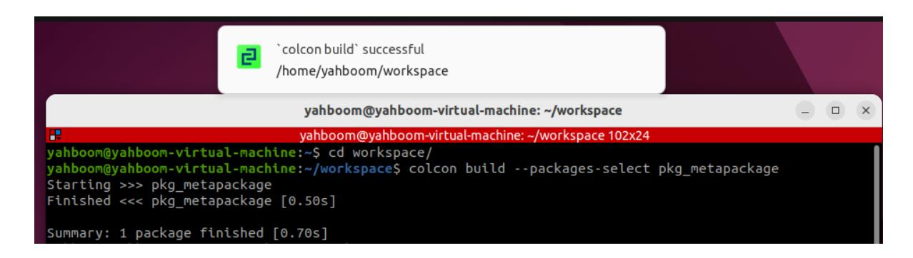

## **12.ROS2 meta-function package**

## **1. Introduction to Metapackages**

Completing a systemic function may involve multiple packages. For example, implementing a robot navigation module might include sub-packages such as mapping, positioning, and path planning. So, when installing this module, does the user need to install each package individually?

Obviously, installing packages one by one is inefficient. ROS2 provides a way to bundle different packages into a single package. When installing a module, the packaged package, also known as a metapackage, can be directly invoked.

A metapackage is a file management system concept in Linux. It's a virtual package in ROS2. It doesn't contain any substantive content, but it relies on other packages. This method allows packages to be grouped together. Think of it like a table of contents like a book, telling you which sub-packages are within a package and where to download them.

For example, the command "sudo apt install ros-humle-desktop" installs ROS 2 using a metapackage. This meta-package depends on several other ROS 2 packages, and these dependencies are installed along with the package.

A classic example of a meta-package: navigation2

[navigation2 GitHub repository: GitHub - ros-navigation/navigation2: ROS 2 Navigation](https://github.com/ros-navigation/navigation2) Framework and System

## **2. Purpose**

This package facilitates installation. We only need this one package to organize and install other related packages.

## **3. Implementation**

1. Create a new package

```
ros2 pkg create pkg_metapackage
```

2、Modify the package.xml file and add the packages that the execution depends on

```
<?xml version="1.0"?>
<?xml-model href="http://download.ros.org/schema/package_format3.xsd"
schematypens="http://www.w3.org/2001/XMLSchema"?>
<package format="3">
  <name>pkg_metapackage</name>
  <version>0.0.0</version>
  <description>TODO: Package description</description>
  <maintainer email="1461190907@qq.com">root</maintainer>
  <license>TODO: License declaration</license>
  <buildtool_depend>ament_cmake</buildtool_depend>
```

```
<exec_depend>pkg_interfaces</exec_depend>
  <exec_depend>pkg_helloworld_py</exec_depend>
  <exec_depend>pkg_topic</exec_depend>
  <exec_depend>pkg_service</exec_depend>
  <exec_depend>pkg_action</exec_depend>
  <exec_depend>pkg_param</exec_depend>
  <test_depend>ament_lint_auto</test_depend>
  <test_depend>ament_lint_common</test_depend>
  <export>
    <build_type>ament_cmake</build_type>
  </export>
</package>
```

3. The contents of the file CMakeLists.txt are as follows

```
cmake_minimum_required(VERSION 3.5)
project(pkg_metapackage)
if(CMAKE_COMPILER_IS_GNUCXX OR CMAKE_CXX_COMPILER_ID MATCHES "Clang")
  add_compile_options(-Wall -Wextra -Wpedantic)
endif()
find_package(ament_cmake REQUIRED)
ament_package()
```

- 4. Compile the meta-package
- No actual executable files will be generated

colcon build --packages-select pkg\_metapackage

