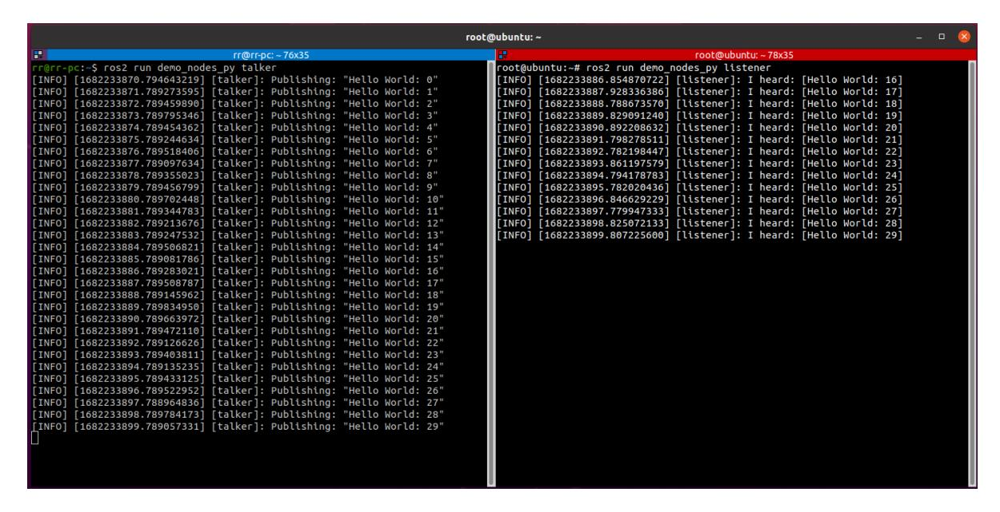

# **13. ROS2 Distributed Communication**

## **1. Concept**

Multi-machine communication, or distributed communication, refers to a communication strategy that enables data exchange between different hosts over a network.

ROS2 itself is a distributed communication framework that facilitates communication between different devices. The middleware underlying ROS2 is DDS. When running on the same network, distributed communication is achieved through the DDS domain ID mechanism (ROS\_DOMAIN\_ID). The general process is as follows: Before starting a node, you can set the domain ID value. Nodes with the same domain ID can freely discover and communicate with each other. Conversely, if the domain ID values are different, this communication is impossible. By default, all nodes start with domain ID 0. In other words, as long as they are on the same network, distributed communication can be achieved between different nodes on different ROS2 devices without any configuration.

Distributed communication has a wide range of application scenarios, including unmanned vehicle platooning, drone platooning, and remote control. These data exchanges all rely on distributed communication.

## **2. Implementation**

### **2.1. Default Implementation**

Distributed communication is achieved by simply placing the master and slave devices (you can have multiple devices) on the same network. For example, the master and slave devices can be connected to the same WiFi or router.

In Windows, setting the virtual machine to "bridge mode" will place them on the same network as the host.

#### Test:

Here, we assume we have two hosts, A and B. These can be any network-capable host, such as a virtual machine, Raspberry Pi, Jetson, x86/ARM host, or card motherboard. They only need to have the same version of the ROS2 environment installed.

#### 1. Execute on host A:

This demonstration shows the car running in Docker. Docker uses host mode. Simply put, host mode means the car shares the same network, so executing the command is identical to running the command on the car.

ros2 run demo\_nodes\_py talker

#### 2. Host B executes:

ros2 run demo\_nodes\_py listener

If the following display appears: The slaves can subscribe to the topics published by the host, multi-machine communication has been achieved.

### **2.2. Distributed Network Grouping**

If you are currently using other robots in your network, you can also set up a group for your robot to prevent interference from other robots.

ROS2 provides a DOMAIN mechanism, similar to grouping. Only computers in the same DOMAIN can communicate. We can assign both the host (car) and the slave (virtual machine) to the same group by adding the following line to their .bashrc files:

```
$ export ROS_DOMAIN_ID=<your_domain_id>
```

If the host (car) and the slave (virtual machine) are assigned different IDs, they will not be able to communicate, thus achieving the purpose of grouping.

### **2.2.1 Example 1**

1. Execute on the host (car):

This demonstrates the car running in Docker, which uses host network mode. Simply put, host mode means the car shares the same network with the car, so the execution is identical to running on the car.

```
echo "export ROS_DOMAIN_ID=6" >> ~/.bashrc # The value 6 here refers to the
ROS_DOMAIN_ID. It doesn't have to be 6, as long as it conforms to the
ROS_DOMAIN_ID rules.
source ~/.bashrc
ros2 run demo_nodes_py talker
```

2. Simultaneously, execute the following command on the slave machine [virtual machine]:

```
echo "export ROS_DOMAIN_ID=6" >> ~/.bashrc # This value matches the value on the
master machine.
source ~/.bashrc
ros2 run demo_nodes_py listener
```

If the following message appears: The slave machine can subscribe to the topic published by the master machine in a timely manner, indicating that grouped multi-machine communication has been achieved.



### **2.2.2 Case 2**

Controlling turtle movement through distributed communication

Host A run command

ros2 run turtlesim turtlesim\_node

Host B run command

ros2 run turtlesim turtle\_teleop\_key

## **3. Notes**

Setting the ROS\_DOMAIN\_ID value is not arbitrary and is subject to certain constraints:

- 1. It is recommended that the ROS\_DOMAIN\_ID value be between [0, 101], inclusive;
- 2. The total number of nodes within each domain ID is limited and must be less than or equal to 120;
- 3. If the domain ID is 101, the total number of nodes in that domain must be less than or equal to 54.

## **4. DDS Domain ID Calculation Rules (Advanced Knowledge)**

The calculation rules for domain ID values are as follows:

- 1. DDS is based on the TCP/IP or UDP/IP network communication protocol. Network communication requires a specified port number, which is represented by a 2-byte unsigned integer and has a value range of [0, 65535].
- 2. Port number assignment is also based on specific rules and cannot be used arbitrarily. According to the DDS protocol, port 7400 is used as the starting port, meaning the available ports are [7400, 65535]. Furthermore, according to the DDS protocol, each domain ID occupies 250 ports by default. Therefore, the number of domain IDs is: (65535 - 7400) / 250 = 232, corresponding to a value range of [0, 231].
- 3. The operating system also sets some reserved ports. When using ports in DDS, you need to avoid these reserved ports to avoid conflicts. Different operating systems have different reserved ports. As a result, in Linux, the available domain IDs are [0, 101] and [215-231]. In

- Windows and Mac, the available domain IDs are [0, 166]. In summary, for compatibility across multiple platforms, it is recommended that domain IDs be within the range of [0, 101].
- 4. Each domain ID occupies 250 ports by default, and each ROS2 node requires two ports. Furthermore, according to the DDS protocol, ports 1 and 2 within each domain ID's port range are the Discovery Multicast port and the User Multicast port. Ports 11 and 12 onwards are the Discovery Unicast port and the User Unicast port for the first node in the domain, and subsequent nodes occupy these ports in descending order. Therefore, the maximum number of nodes in a domain ID is: (250 - 10) / 2 = 120.
- 5. Special case: For domain ID 101, the second half of the ports are reserved by the operating system, and the maximum number of nodes is 54.

The above calculation rules are sufficient for understanding.