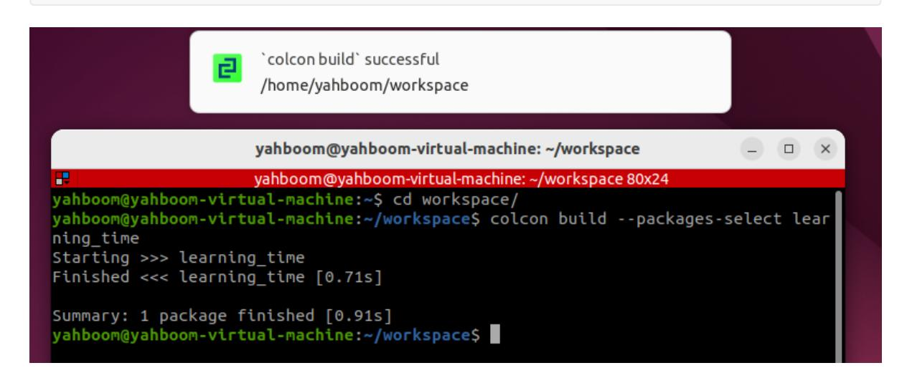
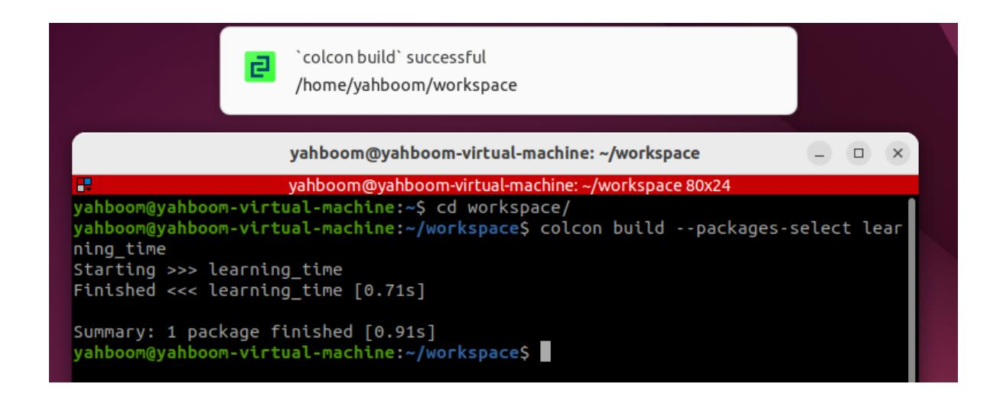
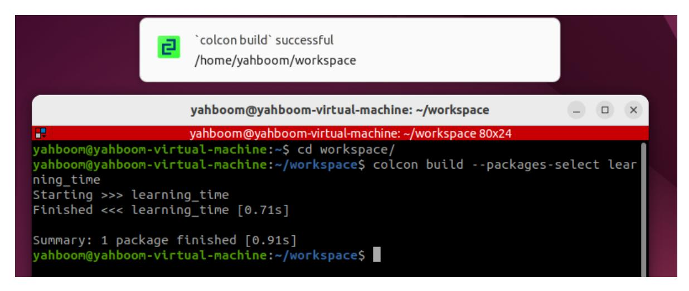
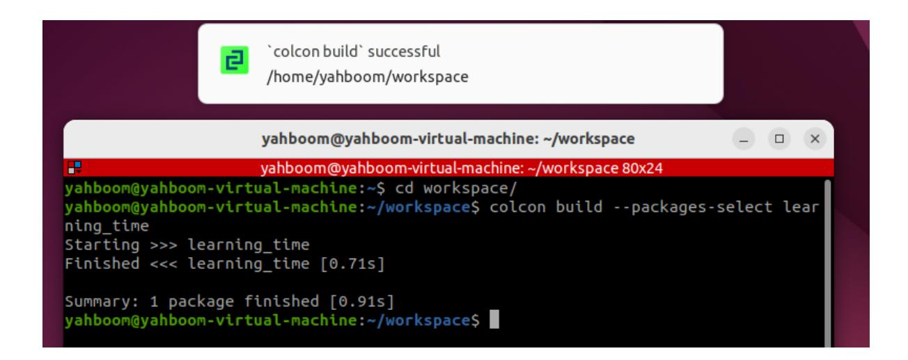

# **15.ROS2 time related API**

## **1. Introduction to Time-Related APIs**

ROS2's time-related APIs include Rate, Time, Duration, and operations on Time and Duration. These are explained below.

First, create a function package to store the relevant program files.

ros2 pkg create learning\_time --build-type ament\_python --dependencies rclpy

### **2. create\_rate**

ROS2 also provides the create\_rate function, a tool for **controlling loop execution frequency**. Its core function is to periodically execute a section of code at a **fixed frequency**. Rate ensures the stability of the loop execution frequency by controlling the "sleep time" of the loop. **Remember** that Rate should generally not be used directly in the main thread, as doing so will permanently block callback events. It is generally only used in programs with multi-threaded callbacks or in child threads.

#### How it works:

- 1. Records the start time of each loop;
- 2. Executes the code within the loop;
- 3. Calculates the difference between the current loop's actual duration and the target interval;
- 4. Automatically sleeps for the corresponding difference, ensuring that the interval from the start of one loop to the start of the next strictly equals the target interval (e.g., 100 milliseconds).

While both Rate and Timer can implement periodic execution, their application scenarios differ:

| Features                | Rate                                                                                                                      | Timer                                                                                                       |
|-------------------------|---------------------------------------------------------------------------------------------------------------------------|-------------------------------------------------------------------------------------------------------------|
| Implementation          | Based on active sleep within a loop<br>(blocking the current thread)                                                      | Based on callback functions<br>(non-blocking, triggered by the<br>ROS 2 event loop)                         |
| Applicable<br>Scenarios | Suitable for loops that need to<br>execute at a fixed frequency within<br>the same thread (such as main<br>control logic) | Suitable for periodic tasks that<br>need to execute<br>asynchronously (without<br>blocking the main thread) |
| Flexibility             | Direct control flow within the loop<br>(such as break exit)                                                               | Callback execution must be<br>controlled using flags or other<br>methods                                    |

- The following is a basic usage of Rate to implement a loop that executes twice per second:
- Create a new file in the function package called rate\_demo.py

```
from rclpy.node import Node
import threading
class RateExampleNode(Node):
    def __init__(self):
        super().__init__("rate_example_node")
        self.get_logger().info("Rate 示例节点启动")
    def run_loop(self):
        # Use the node's create_rate() to create a 2Hz Rate
        rate = self.create_rate(2)
        count = 0
        try:
            while rclpy.ok():
                self.get_logger().info(f"循环执行 {count} 次")
                count += 1
                rate.sleep() # Sleep until the next cycle (0.5 seconds)
        except KeyboardInterrupt:
            self.get_logger().info("循环被中断")
def main(args=None):
    rclpy.init(args=args)
    node = RateExampleNode()
    # Create a thread run loop (to avoid blocking the main thread)
    loop_thread = threading.Thread(target=node.run_loop)
    loop_thread.start()
    # The main thread executes spin to keep the ROS 2 node running
    try:
        rclpy.spin(node)
    except KeyboardInterrupt:
        pass
    finally:
        loop_thread.join() # Waiting for the thread to end
        node.destroy_node()
        rclpy.shutdown()
if __name__ == "__main__":
    main()
```

```
'rate_demo=learning_time.rate_demo:main'
```

Compile feature package

colcon build --packages-select learning\_time



Refresh the workspace environment and run the node

```
source ./install/setup.bash
ros2 run learning_time rate_demo
```

# **3. Timer Application**

- Timer is used to create a timer that triggers periodic tasks.
- Example: Create two timers: one that prints the execution count every 1 second, and one that prints the current time every 0.5 seconds.
- Create a new program file called Timer\_demo.py

```
import rclpy
from rclpy.node import Node
class TimerDemoNode(Node):
   def __init__(self):
       super().__init__('timer_demo_node')
       # Counter, used to demonstrate the number of timer executions
       self.counter = 0
       # Create a timer: execute the callback function every 1 second
       self.timer = self.create_timer(1.0, self.timer_callback)
       # Create a faster timer: execute every 0.5 seconds
       self.fast_timer = self.create_timer(0.5, self.fast_timer_callback)
       self.get_logger().info("定时器节点已启动")
   def timer_callback(self):
       """1 second timer callback function"""
       self.counter += 1
       current_time = self.get_clock().now()
       # Print the current time and counter value
       self.get_logger().info(
           f"[1秒定时器] 第 {self.counter} 次执行,当前时间:
{current_time.seconds_nanoseconds()}"
       )
```

```
def fast_timer_callback(self):
        """0.5 second timer callback function"""
        # Print the current timestamp (nanoseconds)
        self.get_logger().info(
            f"[0.5秒定时器] 当前时间戳: {self.get_clock().now().nanoseconds}"
        )
def main(args=None):
    # Initializing ROS 2
    rclpy.init(args=args)
    # Creating a Node
    node = TimerDemoNode()
    # Running a Node
    rclpy.spin(node)
    # Shut down ROS 2
    node.destroy_node()
    rclpy.shutdown()
if __name__ == '__main__':
    main()
```

```
'Timer_demo=learning_time.Timer_demo:main'
```

Compile function package

```
colcon build --packages-select learning_time
```



Refresh the workspace environment and run the node

```
source ./install/setup.bash
ros2 run learning_time Timer_demo
```

It can be seen that the timer is triggered according to the set timing, and the corresponding log information is printed in each callback function

### **4. Get the Current Time with get\_clock**

- The get\_clock function can be used to obtain a clock object and then use the () method to get the current time.
- Create a new program file, get\_clock\_demo.py, and fill it with the following example program:

```
import rclpy
from rclpy.node import Node
from rclpy.time import Time
class TimeExampleNode(Node):
    def __init__(self):
```

```
super().__init__("time_example_node")
        # Get the node's clock object (the system clock is used by default)
        self.clock = self.get_clock()
        # Get the current time (return a Time object)
        current_time = self.clock.now()
        self.get_logger().info(f"当前时间:{current_time}")
def main(args=None):
    rclpy.init(args=args)
    node = TimeExampleNode()
    rclpy.spin_once(node) # Run a node once
    node.destroy_node()
    rclpy.shutdown()
if __name__ == "__main__":
    main()
```

```
'get_clock_demo=learning_time.get_clock_demo:main'
```

Compile feature package

```
colcon build --packages-select learning_time
```



Refresh the workspace environment and run the node

```
source ./install/setup.bash
ros2 run learning_time get_clock_demo
```

### **5. Time and Duration**

- The Time class in ROS represents a specific time point (e.g., "2023-10-01 12:00:00"), typically used to mark the moment an event occurred.
- The Duration class represents an interval between two time points (e.g., "5 seconds"), used to calculate time differences or delays.
- Example: Time and Duration Application
- Create a new program file, TimeDuration\_demo.py .

```
import rclpy
from rclpy.time import Time
from rclpy.duration import Duration
def main():
    rclpy.init()
    node = rclpy.create_node("time_opt_node")
    # How to use the time class to create 'time points and moments'
    time1 = Time(seconds=10)
    time2 = Time(seconds=4)
    # How to use the Duration class to create a 'duration, a period of time'
    duration1 = Duration(seconds=3)
    duration2 = Duration(seconds=5)
    # Moments can be compared
    node.get_logger().info("time1 >= time2 ? %d" % (time1 >= time2))
    node.get_logger().info("time1 < time2 ? %d" % (time1 < time2))
```

```
# Time periods and times can be mathematically operated
    t3 = time1 + duration1
    t4 = time1 - time2
    t5 = time1 - duration1
    node.get_logger().info("t3 = %d" % t3.nanoseconds)
    node.get_logger().info("t4 = %d" % t4.nanoseconds)
    node.get_logger().info("t5 = %d" % t5.nanoseconds)
    # Time periods can be compared
    node.get_logger().info("-" * 80)
    node.get_logger().info("duration1 >= duration2 ? %d" % (duration1 >=
duration2))
    node.get_logger().info("duration1 < duration2 ? %d" % (duration1 <
duration2))
    rclpy.shutdown()
if __name__ == "__main__":
    main()
```

```
'TimeDuration_demo=learning_time.TimeDuration_demo:main'
```

Compile feature package

```
colcon build --packages-select learning_time
```



Refresh the workspace environment and run the node

```
source ./install/setup.bash
ros2 run learning_time TimeDuration_demo
```

This example proves that mathematical operations can be performed on time points and time periods, allowing us to flexibly query and operate on data with different timestamps.