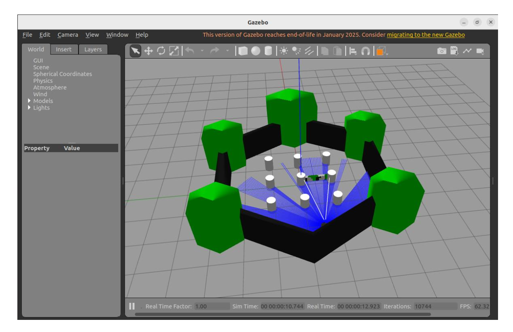
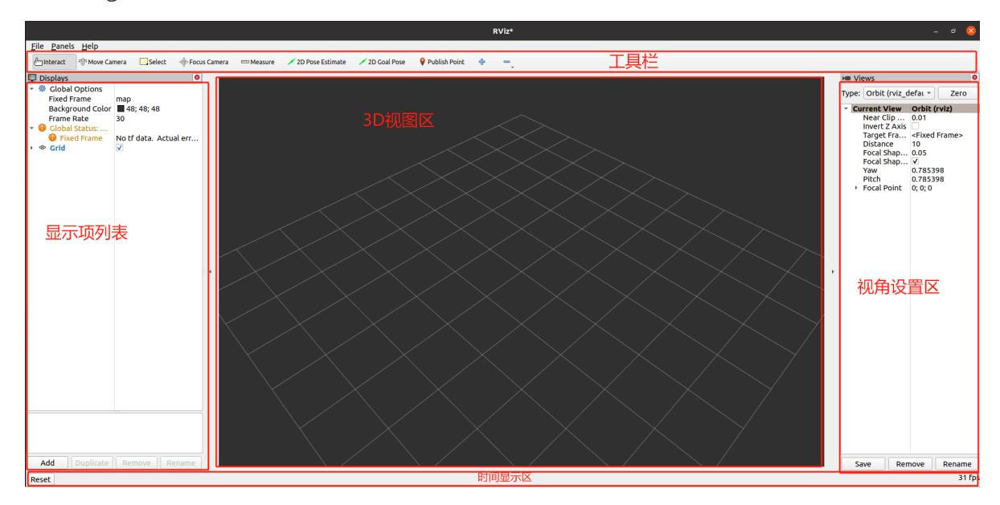
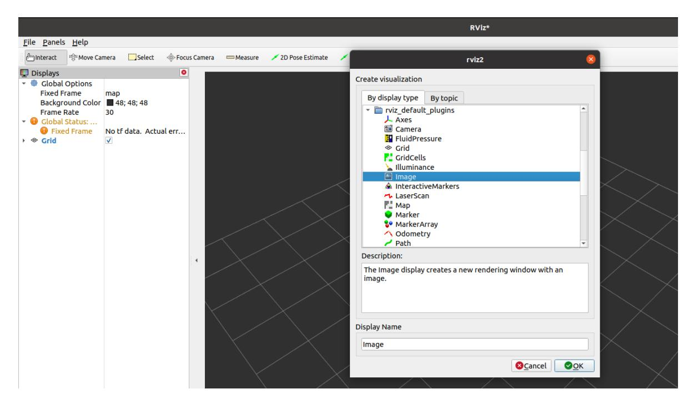
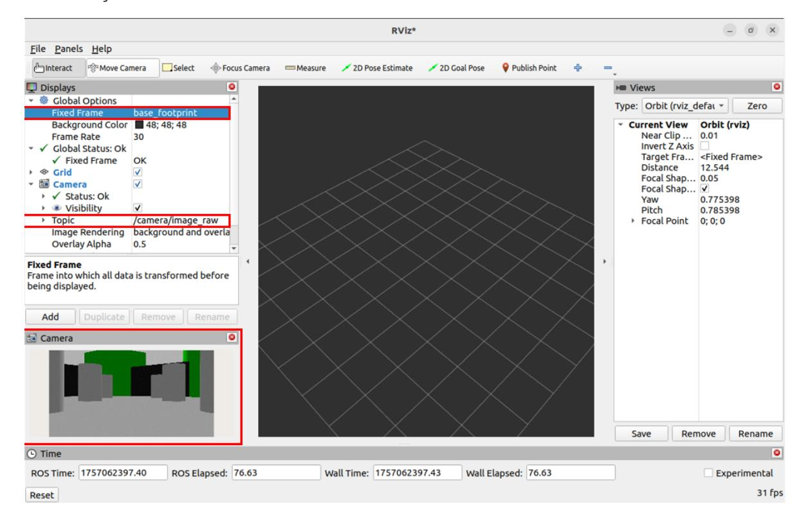
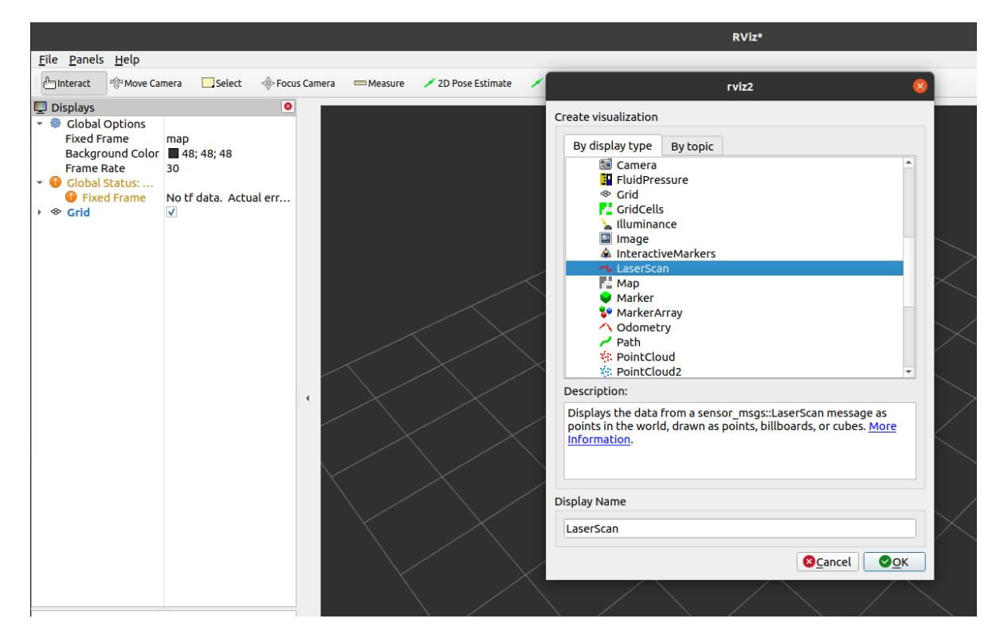
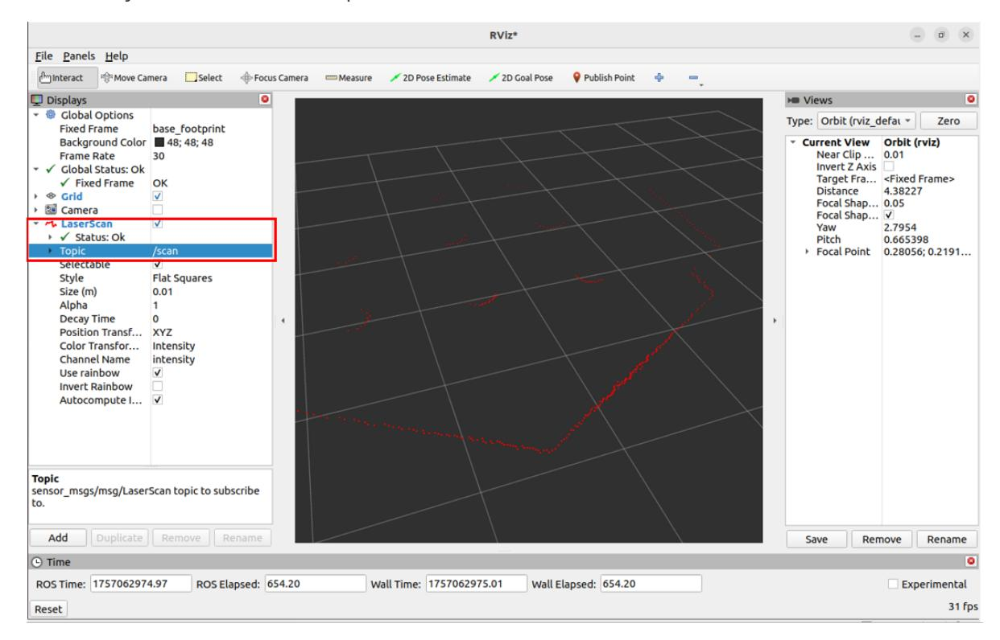
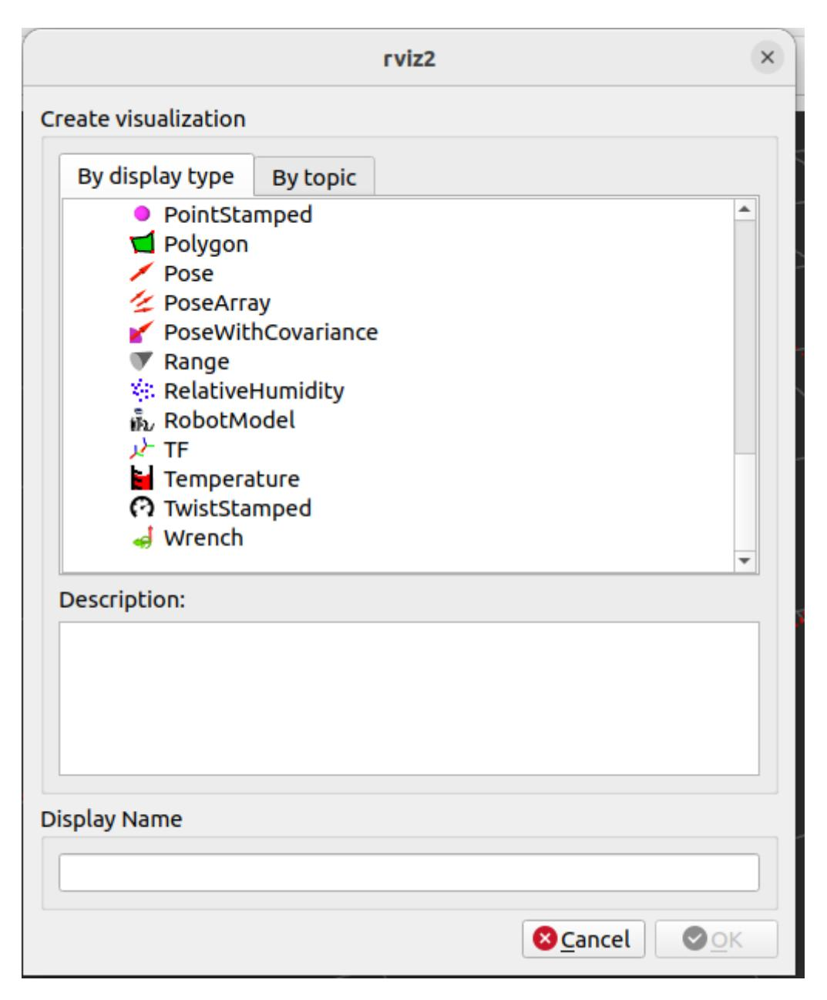
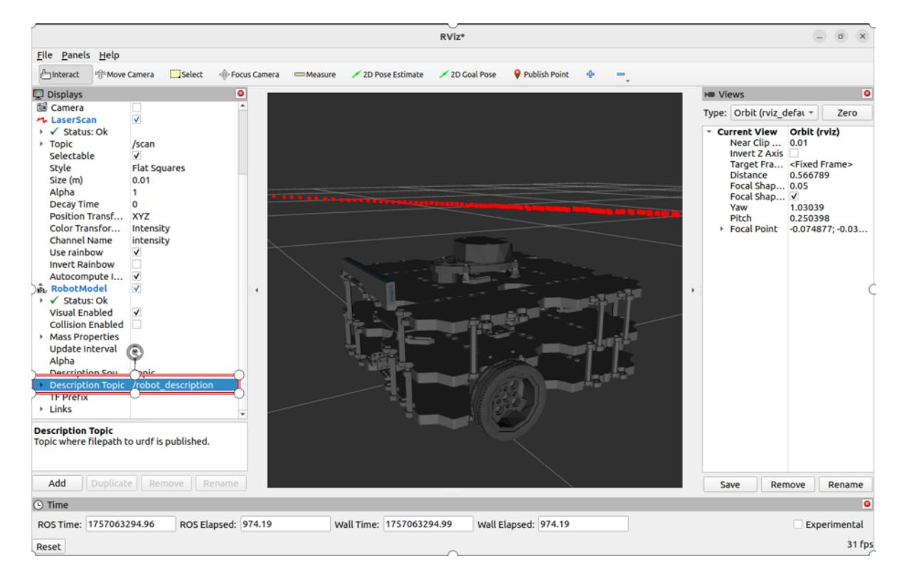
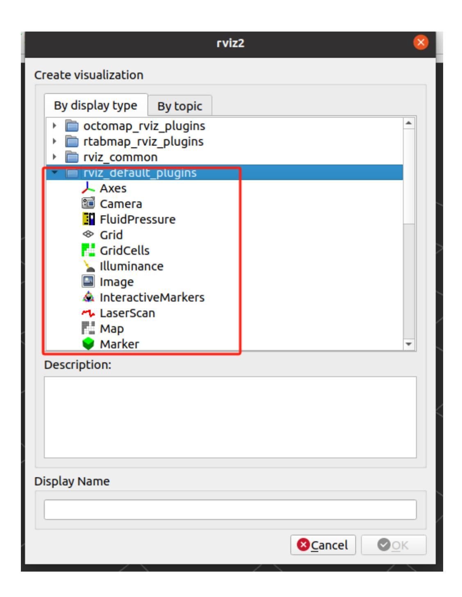

# **17. Using ROS2 Rviz2**

#### **1. Introduction to Rviz2**

During robot development, various functions require analysis at the data level, making it difficult to quickly understand their impact. For example, for robot models, we need to understand the design's appearance and the positions of the model's numerous internal coordinate systems during motion.

For robotic arm motion planning and mobile robot autonomous navigation, we need to visualize the robot's surrounding environment, the planned path, and, of course, sensor information, such as cameras, 3D cameras, and lidar. Data is used for calculations, while visualization is for human viewing.

Therefore, data visualization can greatly improve development efficiency. Rviz2 is such a data visualization software for robot development. It can handle everything from robot models, sensor information, and environmental information.

## **2. Preparation**

If you have a physical robot, you can launch Rviz on the robot controller to practice this lesson. If you don't have a physical robot, you can use Gazebo to simulate a TurtleBot3 robot to simulate the lidar, camera, and other components, facilitating subsequent data visualization.

**Note:** The following installation steps are optional. If you have a physical robot and have set up multi-machine communication, you can directly use the actual robot's radar information. You can choose to use the actual radar or a simulated robot. The following information is for users without a physical robot.

- This lesson uses a simulated robot as an example to teach you the visualization capabilities of Rviz2. The operation process is the same for both real and simulated robots.
- Install the TutleBot3 simulator package

```
sudo apt install ros-${ROS_DISTRO}-turtlebot3*
```

Install the ROS and Gazebo bridge tool

```
sudo apt install ros-${ROS_DISTRO}-ros-gz
```

Set the TurtleBot3 robot type environment variable

```
export TURTLEBOT3_MODEL=waffle
```

Start the Gazebo simulation environment

```
ros2 launch turtlebot3_gazebo turtlebot3_world.launch.py
```



## **3. Starting Rviz2**

Open a terminal and run the following command to start it:

rviz2

If starting in Docker, make sure the GUI is enabled.



#### **4. Image Data Visualization**

Click "Add" in the Displays window on the left, find the Image display item, and confirm it to add it to the display list. Then, configure the image topic to which the display item is subscribed. You can then view the robot's camera image.



- Select Fixed Frame as the base\_footprint coordinate system, and place the coordinate transformation error.
- Select the camera color image topic /camera/image\_raw .
- Now you can see the current simulated robot's view in the Camera window.



## **5. Radar Data Visualization**

Click "Add" in the Displays window on the left, select Laserscan, and then configure the subscription topic name. You should now see the laser dot.



- Select /sacn in the LaserScan topic.
- Now you can see the LiDAR point cloud outline.



# **6. Robot Model Visualization**

Click "Add" in the Displays window on the left and select RobotModel.



- In the robot's DescriptionTopic, select /robot\_deseription.
- Now you can see the robot model visualized in Rviz2.



# **7. Other Data Visualizations**

The rivz\_default\_plugins section lists many commonly used data visualization plugins. Feel free to try them out.

