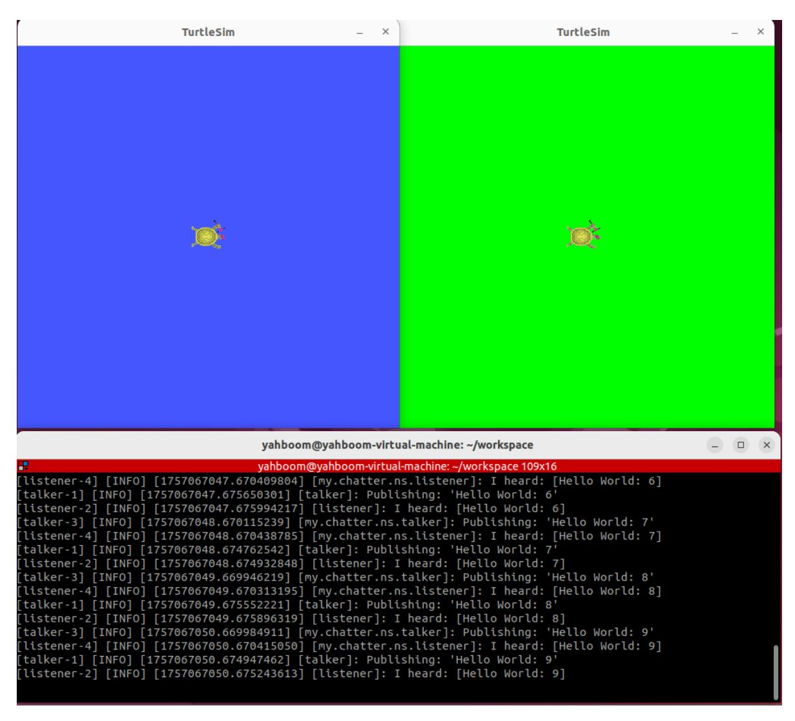
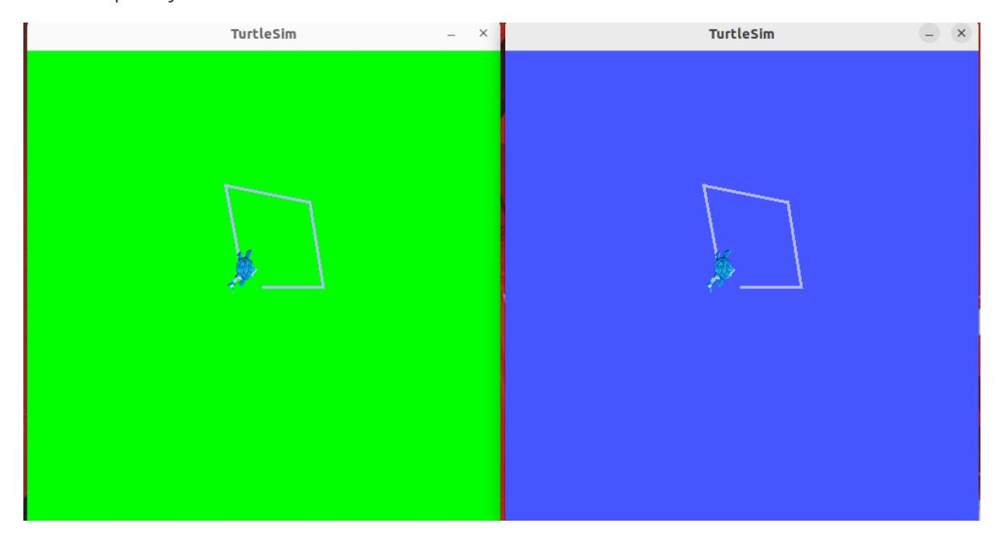
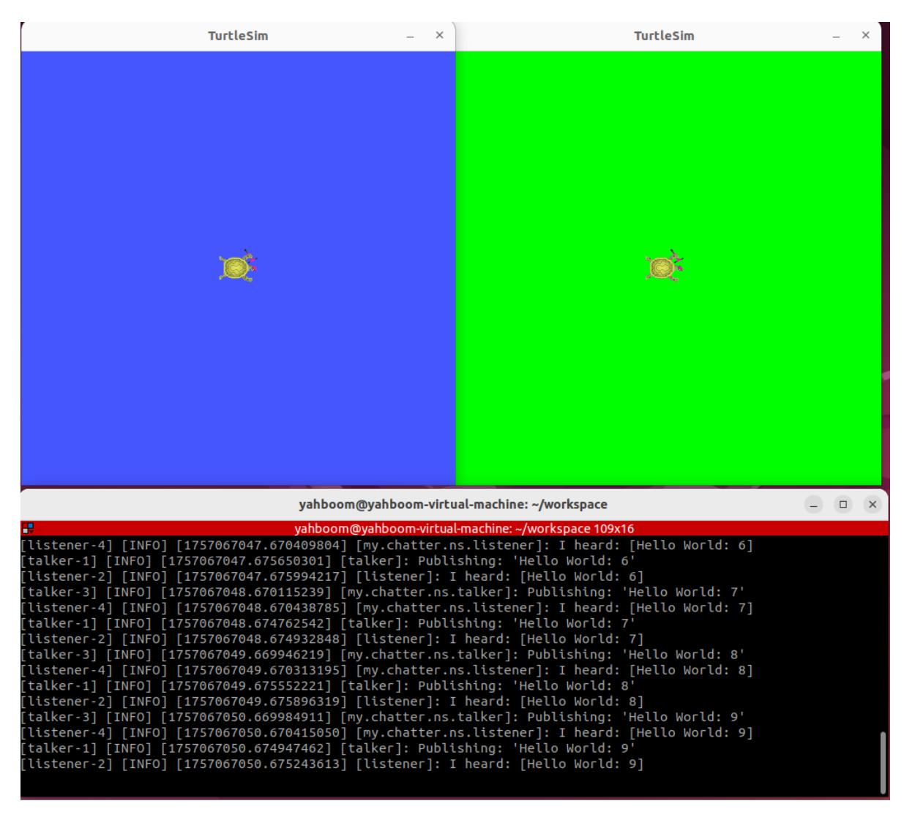
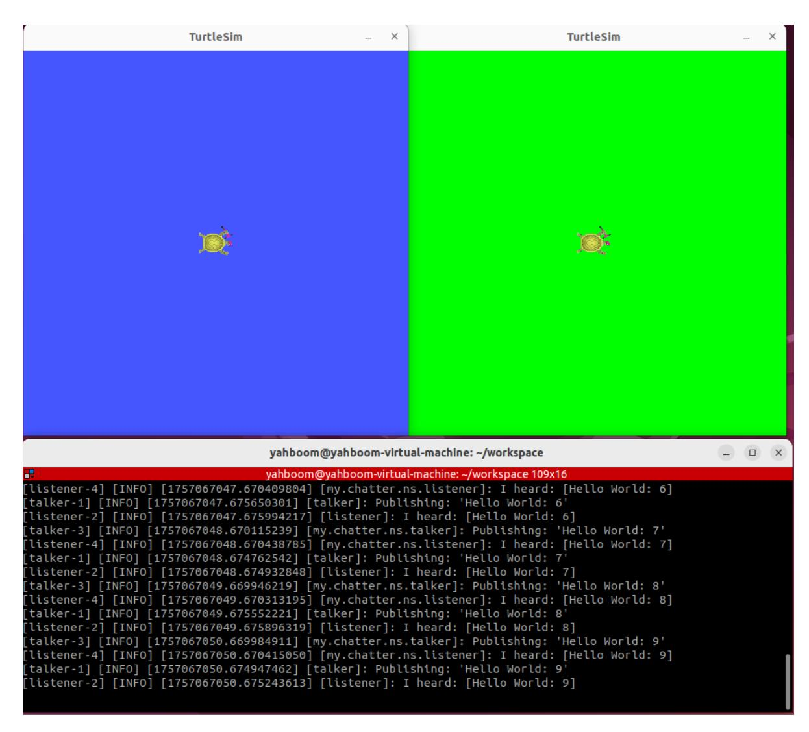

# **19. ROS2 Launch startup file configuration**

### **1. Introduction to Launch**

Until now, every time we launched a ROS node, we had to open a new terminal and run a command. With so many nodes in a robotic system, doing this every time is cumbersome. Is there a way to launch all nodes at once? The answer is, of course, a launch file, a script that launches and configures multiple nodes in the ROS system.

In ROS2, launch is used to launch multiple nodes and configure program parameters. ROS2 launch files are available in XML, YAML, and Python formats. This lesson uses a Python launch file as an example. Compared to the other two formats, the Python format is more flexible:

- Python has numerous function libraries that can be used in launch files;
- ROS2 general and specific launch features are written in Python, allowing access to launch features that may not be exposed in XML and YAML;

The key to writing ROS2 launch files in Python is to abstract each node, file, script, etc. into an action, launching them using a unified interface.

#### References:

- Launch System Design Document: [ROS 2 Launch System](https://design.ros2.org/articles/roslaunch.html)
- Official Launch API Documentation: [Architecture of launch launch 0.4.0 documentation](https://docs.ros.org/en/rolling/p/launch/architecture.html)
- Preparation: Create a package to store program files

```
ros2 pkg create learn_launch --build-type ament_python
```

### **2. Writing a Single Node Launch Program**

#### **2.1. Creating a Launch File**

Create a launch folder under the package, then create a file called [single\_node\_launch.py] within the launch folder. Copy the following content into the file:

```
from launch import LaunchDescription
from launch_ros.actions import Node
def generate_launch_description():
    node = Node(
        package='pkg_helloworld_py',
        executable='helloworld',
        output='screen'
    )
    return LaunchDescription([node])
```

#### **2.2 Configuring the setup.py File**

The launch file is often named "LaunchName\_launch.py." LaunchName is customizable, while \_launch.py is considered fixed. You need to modify the setup.py file in the package to add the files in the launch path and compile to generate the executable .py file.

```
#1. Import related header files
import os
from glob import glob
#2. In the data_files list, add the launch path and the launch.py ••file under
the path
(os.path.join('share',package_name,'launch'),glob(os.path.join('launch','*launch
.py')))
```

#### **2.3. Compile the package**

```
colcon build --packages-select learn_launch
```

#### **2.4. Run the program**

Refresh the environment variables and run the launch file

```
ros2 launch learn_launch single_node_launch.py
```

#### **2.5. Source Code Analysis**

1. Import related libraries

```
from launch import LaunchDescription
from launch_ros.actions import Node
```

2. Define a function called generate\_launch\_description and return a launch\_description.

```
def generate_launch_description():
    node = Node(
        package='pkg_helloworld_py',
        executable='helloworld',
    )
    return LaunchDescription([node])
```

We define a variable called node as the return value of a node startup. We then call the Node function with two important parameters: package and executable.

- package: represents the package name.
- executable: represents the executable program name.

Finally, we call the LaunchDescription function, passing in the node parameter, and execute the function.

### **3. Writing a Launch Program for Multiple Nodes**

#### **3.1. Creating a Launch File**

Create a new file called [multi\_node\_launch.py] and add the following content:

```
from launch import LaunchDescription
from launch_ros.actions import Node
def generate_launch_description():
    publisher_node = Node(
        package='pkg_topic',
        executable='publisher_demo',
        output='screen'
    )
    subscriber_node = Node(
        package='pkg_topic',
        executable='subscriber_demo',
        output='screen'
    )
    return LaunchDescription([
        publisher_node,
        subscriber_node
    ])
```

### **3.2. Compile the package**

```
colcon build --packages-select learn_launch
```

#### **3.3. Run the program**

Refresh the environment variables and run the launch file.

```
ros2 launch learn_launch multi_node_launch.py
```

If the terminal does not print anything, we can verify that the nodes have started successfully by checking which nodes have started. In the terminal, enter:

```
ros2 node list
```

#### **3.4 Source Code Analysis**

Similar to simple\_node\_launch.py, except for one more node.

### **4 Topic Remapping Example**

#### **4.1 Creating a New Launch File**

Create a new file called [remap\_name\_launch.py] in the same directory as multi\_node\_launch.py and add the following content:

```
from launch import LaunchDescription
from launch_ros.actions import Node
def generate_launch_description():
    publisher_node = Node(
        package='pkg_topic',
        executable='publisher_demo',
        output='screen',
        remappings=[("/topic_demo", "/topic_update")]
    )
    return LaunchDescription([
        publisher_node
    ])
```

#### **4.2. Compile the package**

```
colcon build --packages-select learn_launch
```

#### **4.3. Run the program**

Let's first see what topics the publisher\_demo node publishes before remapping topics:

```
ros2 launch learn_launch multi_node_launch.py
ros2 topic list
```

The topic here is [/topic\_demo]

Refresh the environment variables again and run the program after remapping the topic to see the changes:

```
ros2 launch learn_launch remap_name_launch.py
ros2 topic list
```

As shown above, the topic name has been remapped to [/topic\_update]

#### **4.4 Source Code Analysis**

The following sections have been added:

```
remappings=[("/topic_demo", "/topic_update")]
```

Here, the original /topic\_demo topic is remapped to /topic\_update

## **5. Example of Launching Another Launch File from a Nested Launch File**

#### **5.1. Creating a New Launch File**

Create a new file, [include\_launch.py], in the same directory as multi\_node\_launch.py and add the following content:

```
from launch import LaunchDescription
from launch_ros.actions import Node
import os
from launch.actions import IncludeLaunchDescription
from launch.launch_description_sources import PythonLaunchDescriptionSource
from ament_index_python.packages import get_package_share_directory
def generate_launch_description():
    hello_launch = IncludeLaunchDescription(PythonLaunchDescriptionSource(
        [os.path.join(get_package_share_directory('learn_launch'), 'launch'),
        '/multi_node_launch.py']),
    )
    return LaunchDescription([
        hello_launch
    ])
```

#### **5.2. Compiling the Function Package**

```
colcon build --packages-select learn_launch
```

#### **5.3. Running the Program**

Refresh the environment variables and run the launch file

ros2 launch learn\_launch include\_launch.py

#### **5.4. Source Code Analysis**

- Nested launch files require the use of the launch system's IncludeLaunchDescription and PythonLaunchDescriptionSource classes.
- os.path.join(get\_package\_share\_directory('learn\_launch')): Gets the package location, where 'learn\_launch' is the package name;
- launch): Specifies the folder where the launch file is stored within the package;
- /multi\_node\_launch.py: Specifies the /multi\_node\_launch.py file within the launch folder of the package.

### **6. Comprehensive Launch File Example**

This example primarily demonstrates how to write a complex launch file; the program's functionality is ignored.

### **6.1. Creating a New Launch File**

Create a new file, [complex\_launch.py], in the same directory as [multi\_node\_launch.py] and add the following content:

```
import os
from ament_index_python import get_package_share_directory
from launch import LaunchDescription
from launch.actions import DeclareLaunchArgument
```

```
from launch.actions import IncludeLaunchDescription
from launch.actions import GroupAction
from launch.launch_description_sources import PythonLaunchDescriptionSource
from launch.substitutions import LaunchConfiguration
from launch.substitutions import TextSubstitution
from launch_ros.actions import Node
from launch_ros.actions import PushRosNamespace
def generate_launch_description():
    # args that can be set from the command line or a default will be used
    background_r_launch_arg = DeclareLaunchArgument(
        "background_r", default_value=TextSubstitution(text="0")
    )
    background_g_launch_arg = DeclareLaunchArgument(
        "background_g", default_value=TextSubstitution(text="255")
    )
    background_b_launch_arg = DeclareLaunchArgument(
        "background_b", default_value=TextSubstitution(text="0")
    )
    chatter_ns_launch_arg = DeclareLaunchArgument(
        "chatter_ns", default_value=TextSubstitution(text="my/chatter/ns")
    )
    # include another launch file
    launch_include = IncludeLaunchDescription(
        PythonLaunchDescriptionSource(
            os.path.join(
                get_package_share_directory('demo_nodes_cpp'),
                'launch/topics/talker_listener.launch.py'))
    )
    # include another launch file in the chatter_ns namespace
    launch_include_with_namespace = GroupAction(
        actions=[
            # push-ros-namespace to set namespace of included nodes
            PushRosNamespace(LaunchConfiguration('chatter_ns')),
            IncludeLaunchDescription(
                PythonLaunchDescriptionSource(
                    os.path.join(
                        get_package_share_directory('demo_nodes_cpp'),
                        'launch/topics/talker_listener.launch.py'))
            ),
        ]
    )
    # start a turtlesim_node in the turtlesim1 namespace
    turtlesim_node = Node(
            package='turtlesim',
            namespace='turtlesim1',
            executable='turtlesim_node',
            name='sim'
        )
    # start another turtlesim_node in the turtlesim2 namespace
    # and use args to set parameters
    turtlesim_node_with_parameters = Node(
            package='turtlesim',
```

```
namespace='turtlesim2',
        executable='turtlesim_node',
        name='sim',
        parameters=[{
            "background_r": LaunchConfiguration('background_r'),
            "background_g": LaunchConfiguration('background_g'),
            "background_b": LaunchConfiguration('background_b'),
        }]
    )
# perform remap so both turtles listen to the same command topic
forward_turtlesim_commands_to_second_turtlesim_node = Node(
        package='turtlesim',
        executable='mimic',
        name='mimic',
        remappings=[
            ('/input/pose', '/turtlesim1/turtle1/pose'),
            ('/output/cmd_vel', '/turtlesim2/turtle1/cmd_vel'),
        ]
    )
return LaunchDescription([
    background_r_launch_arg,
    background_g_launch_arg,
    background_b_launch_arg,
    chatter_ns_launch_arg,
    launch_include,
    launch_include_with_namespace,
    turtlesim_node,
    turtlesim_node_with_parameters,
    forward_turtlesim_commands_to_second_turtlesim_node,
])
```

### **6.2. Compile the Workspace**

```
colcon build --packages-select learn_launch
```

### **6.3. Run the Program**

Refresh the environment variables in the terminal and run the launch file.

```
ros2 launch learn_launch complex_launch.py
```

Two turtles will appear on the host machine's VNC.



Start the keyboard control node and add the namespace (because we added the namespace when starting the node in the launch file).

```
ros2 run turtlesim turtle_teleop_key --ros-args -r __ns:=/turtlesim1
```

Use the up, down, left, and right keys to control the movement of turtle 1. Turtle 2 will completely imitate the behavior of turtle 1.



#### **6.4. Program Description**

The program mainly starts:

- 1. The talker\_listener node in demo\_nodes\_cpp
- 2. The namespaced talker\_listener node
- 3. Turtle 1, which has been namespaced as turtlesim1
- 4. Turtle 2, which has been namespaced as turtlesim2
- 5. Perform remapping so that both turtles can hear the same command topic

### **7. XML Implementation**

#### **7.1. Creating a Launch File**

Create a file called [complex\_launch.xml] in the same directory as complex\_launch.py and add the following content:

```
<launch>
    <!-- args that can be set from the command line or a default will be used --
>
    <arg name="background_r" default="0"/>
    <arg name="background_g" default="255"/>
    <arg name="background_b" default="0"/>
    <arg name="chatter_ns" default="my/chatter/ns"/>
    <!-- include another launch file -->
    <include file="$(find-pkg-share
demo_nodes_cpp)/launch/topics/talker_listener.launch.py"/>
    <!-- include another launch file in the chatter_ns namespace-->
    <group>
      <!-- push-ros-namespace to set namespace of included nodes -->
      <push-ros-namespace namespace="$(var chatter_ns)"/>
      <include file="$(find-pkg-share
demo_nodes_cpp)/launch/topics/talker_listener.launch.py"/>
    </group>
    <!-- start a turtlesim_node in the turtlesim1 namespace -->
    <node pkg="turtlesim" exec="turtlesim_node" name="sim"
namespace="turtlesim1"/>
    <!-- start another turtlesim_node in the turtlesim2 namespace
        and use args to set parameters -->
    <node pkg="turtlesim" exec="turtlesim_node" name="sim"
namespace="turtlesim2">
      <param name="background_r" value="$(var background_r)"/>
      <param name="background_g" value="$(var background_g)"/>
      <param name="background_b" value="$(var background_b)"/>
    </node>
    <!-- perform remap so both turtles listen to the same command topic -->
    <node pkg="turtlesim" exec="mimic" name="mimic">
      <remap from="/input/pose" to="/turtlesim1/turtle1/pose"/>
      <remap from="/output/cmd_vel" to="/turtlesim2/turtle1/cmd_vel"/>
    </node>
</launch>
```

#### **7.2. setup.py File Configuration**

You need to configure the compilation file. During compilation, copy our .xml launch file to the install directory so that the ROS system can find it.

#### **7.3. Compile the Function Package**

```
colcon build --packages-select learn_launch
```

#### **7.4. Run the Program**

Enter the terminal:

```
ros2 launch learn_launch complex_launch.xml
```

As expected, two turtles will appear, and the terminal will print log information.



Start the keyboard control node and add a namespace.

```
ros2 run turtlesim turtle_teleop_key --ros-args -r __ns:=/turtlesim1
```

Use keyboard control to start Turtle 1. Turtle 2 will completely mimic Turtle 1's behavior.

### **8. YAML Implementation**

#### **8.1. Create a New Launch File**

Create a new file, [complex\_launch.yaml], in the same directory as complex\_launch.py and add the following content:

```
launch:
# args that can be set from the command line or a default will be used
- arg:
    name: "background_r"
    default: "0"
- arg:
    name: "background_g"
    default: "255"
- arg:
    name: "background_b"
    default: "0"
- arg:
```

```
name: "chatter_ns"
    default: "my/chatter/ns"
# include another launch file
- include:
    file: "$(find-pkg-share
demo_nodes_cpp)/launch/topics/talker_listener.launch.py"
# include another launch file in the chatter_ns namespace
- group:
    - push-ros-namespace:
        namespace: "$(var chatter_ns)"
    - include:
        file: "$(find-pkg-share
demo_nodes_cpp)/launch/topics/talker_listener.launch.py"
# start a turtlesim_node in the turtlesim1 namespace
- node:
    pkg: "turtlesim"
    exec: "turtlesim_node"
    name: "sim"
    namespace: "turtlesim1"
# start another turtlesim_node in the turtlesim2 namespace and use args to set
parameters
- node:
    pkg: "turtlesim"
    exec: "turtlesim_node"
    name: "sim"
    namespace: "turtlesim2"
    param:
    -
      name: "background_r"
      value: "$(var background_r)"
    -
      name: "background_g"
      value: "$(var background_g)"
    -
      name: "background_b"
      value: "$(var background_b)"
# perform remap so both turtles listen to the same command topic
- node:
    pkg: "turtlesim"
    exec: "mimic"
    name: "mimic"
    remap:
    -
        from: "/input/pose"
        to: "/turtlesim1/turtle1/pose"
    -
        from: "/output/cmd_vel"
        to: "/turtlesim2/turtle1/cmd_vel"
```

#### **8.2. Configuration**

You need to configure the compilation file. During compilation, copy the .yaml launch file to the install directory so that the ROS system can find it.

#### **8.3. Compile the package**

```
colcon build --packages-select learn_launch
```

#### **8.4. Run the program**

Refresh the environment variables and run

```
ros2 launch learn_launch complex_launch.yaml
```

As expected, two baby turtles appear, and the terminal prints log information.



Start the keyboard control node and add a namespace.

```
ros2 run turtlesim turtle_teleop_key --ros-args -r __ns:=/turtlesim1
```

Start Turtle 1 using keyboard control. Turtle 2 will completely mimic Turtle 1's behavior.