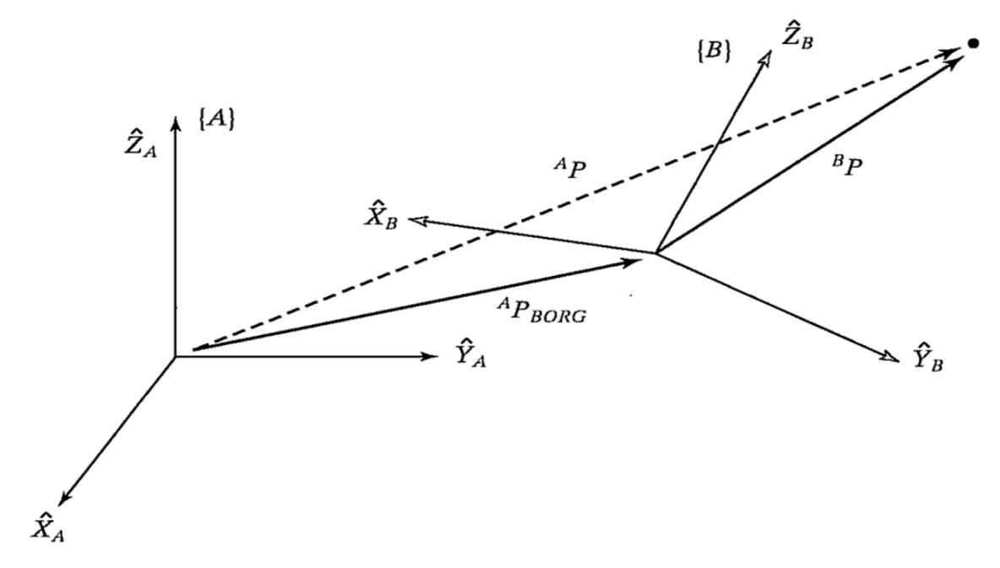
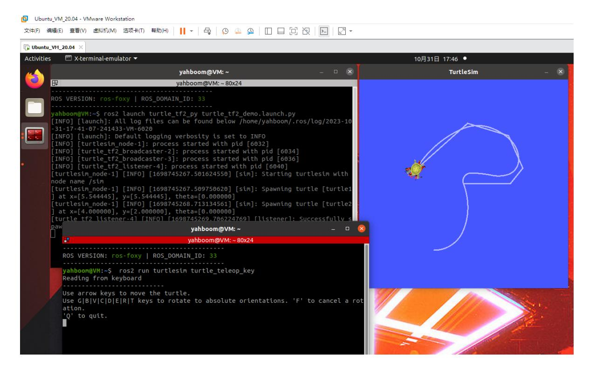
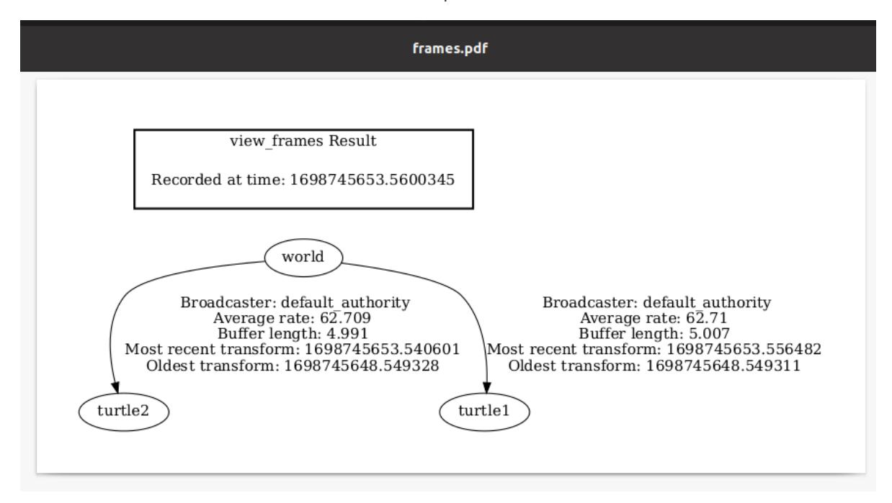
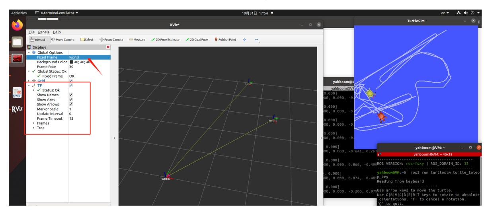
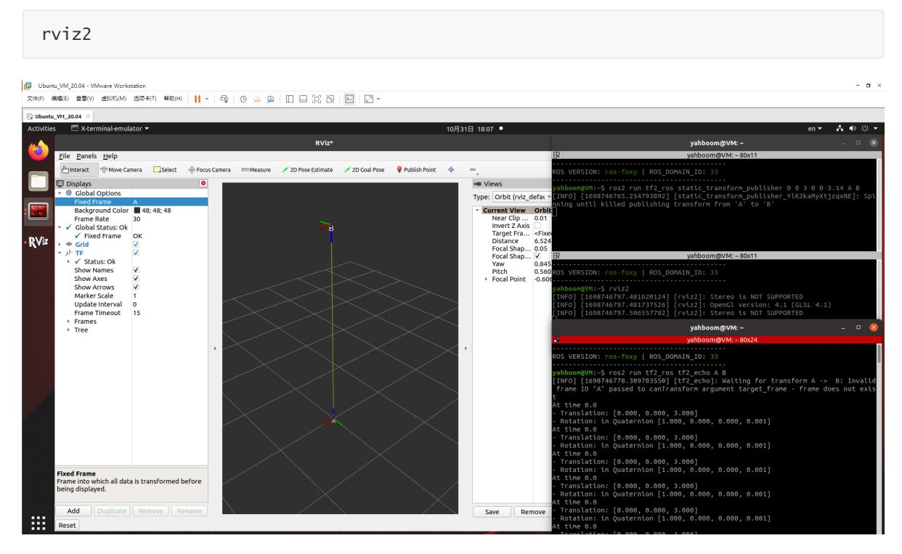
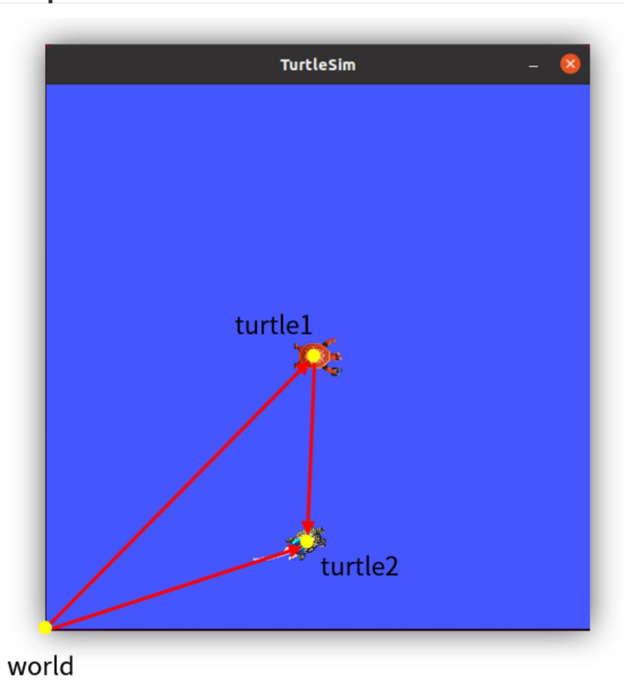
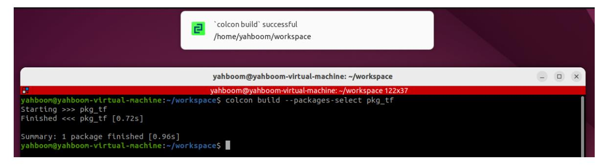
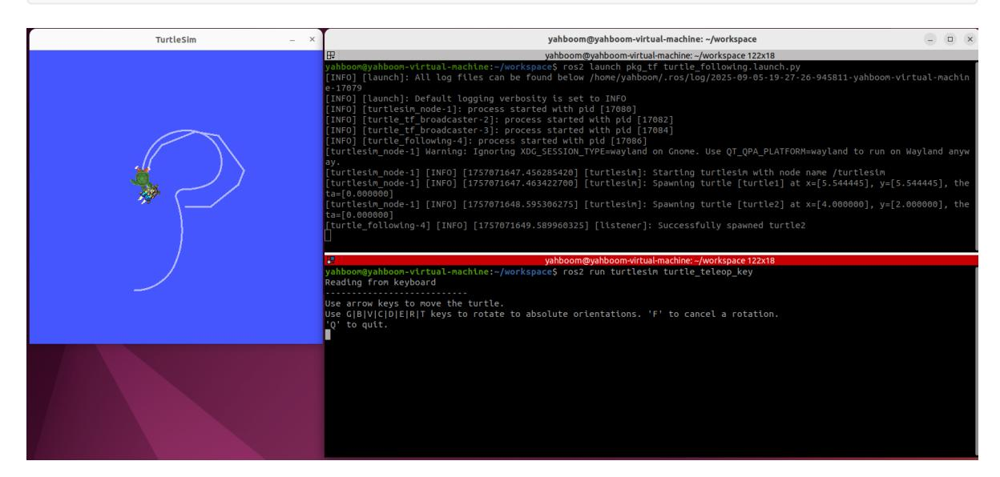
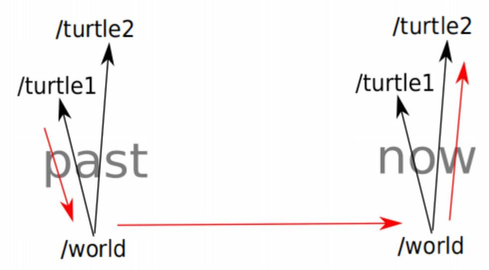

# **23. ROS2 TF2 Coordinate Transformation**

# **1. Introduction to TF2**

Coordinate systems are a very familiar concept and a key foundation in robotics. In a complete robotic system, there are many coordinate systems. How do we manage the positional relationships between these coordinate systems? ROS provides a powerful coordinate system management tool: TF2.

TF System Reference: [tf: The transform library | IEEE Conference Publication | IEEE Xplore](https://ieeexplore.ieee.org/abstract/document/6556373)

# **2. Coordinate Systems in Robotics**

Coordinate systems are also crucial in mobile robot systems. For example, the center point of a mobile robot is the base coordinate system (Base Link), and the position of the radar is called the laser link. As the robot moves, the odometry accumulates its position. The reference system for this position is called the odom coordinate system (odom). The odometry itself is subject to accumulated errors and drift. The reference system for absolute position is called the map coordinate system (map).

The relationships between layers of coordinate systems are complex. Some are relatively fixed, while others are constantly changing. Even seemingly simple coordinate systems can become complex within a spatial context, making a good coordinate system management system extremely important.



The basic theory of coordinate system transformations is explained in every robotics textbook. It can be broken down into two components: translation and rotation. These components are described by a four-by-four matrix. When plotting a coordinate system in space, the transformation between these two components is essentially a mathematical description of vectors.

The underlying principles of the TF functionality in ROS encapsulate these mathematical transformations. For detailed theoretical knowledge, please refer to robotics textbooks. We will primarily explain how to use the TF coordinate management system.

# **3. TF Command Line Operations**

Let's first use an example with two turtles to understand a robot following algorithm based on coordinate systems. **For ease of demonstration, this lesson is best conducted in a virtual machine**

### **3.1 Installing Related Tools**

This example requires installing the corresponding function packages, the TF turtle simulator example, and the TF tree visualization tool.

```
sudo apt install ros-${ROS_DISTRO}-turtle-tf2-py ros-humble-tf2-tools
sudo pip3 install transforms3d
sudo apt install ros-${ROS_DISTRO}-rqt-tf-tree
```

#### **3.2 Starting Up**

Then you can start the system using a launch file. You can then control one of the turtles, and the other will automatically follow.

```
ros2 launch turtle_tf2_py turtle_tf2_demo.launch.py
ros2 run turtlesim turtle_teleop_key
```

When we control the movement of one turtle, the other turtle will follow.



## **3.3 Viewing the TF Tree**

```
ros2 run rqt_tf_tree rqt_tf_tree
```

You can view the TF transformation tree in the rqt window.



### **3.4 Querying Coordinate Transformation Information**

Just viewing the coordinate system structure is not enough. If we want to know the specific relationship between two coordinate systems, we can use the tf2\_echo tool:

```
ros2 run tf2_ros tf2_echo turtle2 turtle1
```

After running successfully, the terminal will repeatedly print the coordinate system transformation values.

#### **3.5 Coordinate System Visualization**

Run rviz2 and add the TF display plugin.

```
rviz2
```

Set the reference coordinate system in rviz2 to "world," add the TF display plugin, and then animate the turtle. The coordinate axes in rviz will begin to move. Isn't this more intuitive?



# **4. Static Coordinate Transformation**

A static coordinate transformation refers to a fixed relative position between two coordinate systems. For example, the position between the radar and base\_link is fixed.

Example: **For ease of demonstration, this lesson is best performed in a virtual machine**

#### **4.1. Publishing the pose from A to B**

ros2 run tf2\_ros static\_transform\_publisher 0 0 3 0 0 3.14 A B

#### **4.2. Monitoring/Getting TF Relationships**

ros2 run tf2\_ros tf2\_echo A B

#### **4.3. RIVZ Visualization**

Run rviz2 and add the TF display plugin.



# **5. Case Introduction**

In the previous lesson, we explained the TF relationship in the system-provided turtle following example. In this lesson, we will implement this functionality ourselves.

#### Course Content:

- Implementing a turtle-following example through programming
- Mastering the implementation of a dynamic broadcaster through programming
- Mastering the implementation of coordinate transformations between monitoring coordinate systems through programming
- Mastering the use of PID control to convert physical quantities (distance, angle) into speed control variables

#### Advanced Content:

Understanding the TF system's ability to transform coordinate systems across time dimensions

# **6. Analysis of the Principles of the Turtle-Following Example**



In a two-turtle simulator, we can define three coordinate systems. For example, the simulator's global reference system is called "world," and the turtle1 and turtle2 coordinate systems are at the center of the two turtles. Thus, the relative position of turtle1 and the world coordinate system represents the position of turtle1, and similarly for turtle2.

To make Turtle 2 move toward Turtle 1, we draw a line connecting the two and add an arrow. Does this remind you of vector calculations learned in high school? Vectors are used to describe coordinate transformations, so in this following example, TF can be used to solve this problem perfectly.

The length of a vector represents distance, and the direction represents angle. With distance and angle, we can calculate the speed by setting a random time. Then, we encapsulate and publish the speed topic, and Turtle 2 can start moving.

So the core of this example is to perform vector calculations using the coordinate system. Since the two turtles are constantly moving, the vectors must also be calculated according to a certain period. This requires the use of TF's dynamic broadcast and monitoring.

# **7. Create a new package**

1. Create a new package in the src directory of the workspace to store our files.

```
ros2 pkg create pkg_tf --build-type ament_python --dependencies rclpy --node-
name turtle_tf_broadcaster
```

Executing the above command will create the pkg\_tf package and a turtle\_tf\_broadcaster node. The relevant configuration files will be configured. Add the following code to the turtle\_tf\_broadcaster.py file:

```
import rclpy # ROS2 Python interface
library
from rclpy.node import Node # ROS2 node class
from geometry_msgs.msg import TransformStamped # Coordinate transformation
message
import tf_transformations # TF coordinate
transformation library
from tf2_ros import TransformBroadcaster # TF coordinate
transformation broadcaster
from turtlesim.msg import Pose # TurtleSim turtle position
message
class TurtleTFBroadcaster(Node):
   def __init__(self, name):
      super().__init__(name) # Initialize the
ROS2 node parent class
      self.declare_parameter('turtlename', 'turtle') # Create a
parameter for the turtle name
      self.turtlename = self.get_parameter( # Externally set
parameter value takes precedence; otherwise, default value is used.
          'turtlename').get_parameter_value().string_value
      self.tf_broadcaster = TransformBroadcaster(self) # Create and
initialize a TF coordinate transformation broadcast object
      self.subscription = self.create_subscription( # Create a
subscriber to subscribe to turtle position messages
          Pose,
          f'/{self.turtlename}/pose', # Use the turtle
name obtained from the parameters
          self.turtle_pose_callback, 1)
   def turtle_pose_callback(self, msg): # Create a
callback function to handle turtle position messages and convert them into
coordinate transformations
      transform = TransformStamped() # Create a
coordinate transformation message object
```

```
transform.header.stamp = self.get_clock().now().to_msg() # Set the
timestamp of the coordinate transformation message
      transform.header.frame_id = 'world' # Set the
source coordinate system for the coordinate transformation
      transform.child_frame_id = self.turtlename # Set the
target coordinate system for the coordinate transformation
      transform.transform.translation.x = msg.x # Set the
X, Y, and Z translations in the coordinate transformation
      transform.transform.translation.y = msg.y
      transform.transform.translation.z = 0.0
      q = tf_transformations.quaternion_from_euler(0, 0, msg.theta) # Convert
Euler angles to quaternions (roll, pitch, yaw)
      transform.transform.rotation.x = q[0] # Set the
X, Y, and Z rotations (quaternions) in the coordinate transformation
      transform.transform.rotation.y = q[1]
      transform.transform.rotation.z = q[2]
      transform.transform.rotation.w = q[3]
      # Send the transformation
      self.tf_broadcaster.sendTransform(transform) # Broadcast the
coordinate transformation. When the turtle's position changes, the coordinate
transformation information will be updated in time.
def main(args=None):
   rclpy.init(args=args) # Initialize the ROS2
Python interface
   node = TurtleTFBroadcaster("turtle_tf_broadcaster") # Create and initialize
a ROS2 node object
   rclpy.spin(node) # Loop and wait for
ROS2 to exit
   node.destroy_node() # Destroy the node
object
   rclpy.shutdown() # Shut down the ROS2
Python interface
```

2. Next, create a new file [turtle\_following.py] in the same directory as turtle\_tf\_broadcaster.py and add the following code:

```
import math
import rclpy # ROS2 Python
interface library
from rclpy.node import Node # ROS2 node class
import tf_transformations # TF coordinate
transformation library
from tf2_ros import TransformException # TF left-side
transformation exception class
from tf2_ros.buffer import Buffer # Buffer class for
storing coordinate transformation information
from tf2_ros.transform_listener import TransformListener # Listener class for
coordinate transformations
from geometry_msgs.msg import Twist # ROS2 velocity
control message
from turtlesim.srv import Spawn # Turtle spawning
service interface
class TurtleFollowing(Node):
```

```
def __init__(self, name):
      super().__init__(name) # Initialize
the ROS2 node parent class
      self.declare_parameter('source_frame', 'turtle1') # Create a
parameter for the source coordinate frame name
      self.source_frame = self.get_parameter( # Externally
set parameter values ••take precedence; otherwise, use the default values.
          'source_frame').get_parameter_value().string_value
      self.tf_buffer = Buffer() # Create a
buffer to store coordinate transformation information
      self.tf_listener = TransformListener(self.tf_buffer, self) # Create a
coordinate transformation listener
      self.spawner = self.create_client(Spawn, 'spawn') # Create a
client to request turtle spawning
      self.turtle_spawning_service_ready = False # Flag
indicating whether the turtle spawning service has been requested
      self.turtle_spawned = False # Flag
indicating whether the turtle was successfully spawned
      self.publisher = self.create_publisher(Twist, 'turtle2/cmd_vel', 1) #
Create a velocity topic for following the moving turtle
      self.timer = self.create_timer(1.0, self.on_timer) # Create a
fixed-period timer to control the movement of the following turtle
   def on_timer(self):
      from_frame_rel = self.source_frame # Source
coordinate system
      to_frame_rel = 'turtle2' # Target
coordinate system
      if self.turtle_spawning_service_ready: # If the
turtle spawning service has been requested
          if self.turtle_spawned: # If the
follower turtle has been spawned
             try:
                 now = rclpy.time.Time() # Get the
current time in the ROS system
                 trans = self.tf_buffer.lookup_transform( ## Monitor
the coordinate transformation from the source coordinate system to the target
coordinate system at the current moment
                    to_frame_rel,
                    from_frame_rel,
                    now)
             except TransformException as ex: # If the
coordinate transformation acquisition fails, report the exception
                 self.get_logger().info(
                    f'Could not transform {to_frame_rel} to
{from_frame_rel}: {ex}')
                 return
             msg = Twist() # Create a
speed control message
```

```
scale_rotation_rate = 1.0 # Calculate
angular velocity based on the turtle's angle.
            msg.angular.z = scale_rotation_rate * math.atan2(
                trans.transform.translation.y,
                trans.transform.translation.x)
            scale_forward_speed = 0.5 # Calculate
linear velocity based on the turtle's distance.
            msg.linear.x = scale_forward_speed * math.sqrt(
                trans.transform.translation.x ** 2 +
                trans.transform.translation.y ** 2)
            self.publisher.publish(msg) # Publish
velocity command for the turtle to follow.
         else: # If the
following turtle is not spawned.
            if self.result.done(): # Check if
the turtle is spawned.
                self.get_logger().info(
                   f'Successfully spawned {self.result.result().name}')
                self.turtle_spawned = True
            else: # Still no
following turtle spawned.
                self.get_logger().info('Spawn is not finished')
      else: # If no
turtle spawning service is requested
         if self.spawner.service_is_ready(): # If the
turtle spawning server is ready
            request = Spawn.Request() # Create a
request data
            request.name = 'turtle2' # Set the
content of the request data, including turtle name, xy position, and posture
            request.x = float(4)
            request.y = float(2)
            request.theta = float(0)
            self.result = self.spawner.call_async(request) # Send
service request
            self.turtle_spawning_service_ready = True # Set the
flag to indicate that the request has been sent
         else:
            self.get_logger().info('Service is not ready') # Turtle
spawning server is not ready
def main(args=None):
   rclpy.init(args=args) # ROS2 Python interface
initialization
   node = TurtleFollowing("turtle_following") # Create and initialize a ROS2
node object.
   rclpy.spin(node) # Loop and wait for ROS2 to
exit.
   node.destroy_node() # Destroy the node object
   rclpy.shutdown() # Shut down the ROS2 Python
interface.
```

3. Create a new launch folder under the pkg\_tf package, create a new file [turtle\_following.launch.py] in the launch folder, and add the following content:

```
from launch import LaunchDescription
from launch.actions import DeclareLaunchArgument
from launch.substitutions import LaunchConfiguration
from launch_ros.actions import Node
def generate_launch_description():
    return LaunchDescription([
        DeclareLaunchArgument('source_frame', default_value='turtle1',
description='Target frame name.'),
        Node(
            package='turtlesim',
            executable='turtlesim_node',
        ),
        Node(
            package='pkg_tf',
            executable='turtle_tf_broadcaster',
            name='broadcaster1',
            parameters=[
                {'turtlename': 'turtle1'}
            ]
        ),
        Node(
            package='pkg_tf',
            executable='turtle_tf_broadcaster',
            name='broadcaster2',
            parameters=[
                {'turtlename': 'turtle2'}
            ]
        ),
        Node(
            package='pkg_tf',
            executable='turtle_following',
            name='listener',
            parameters=[
                {'source_frame': LaunchConfiguration('source_frame')}
            ]
        ),
    ])
```

## **8. Edit the configuration file**

#### **8.1. Configuration in setup.py**

Import relevant libraries

```
import os
from glob import glob
```

Add the turtle\_following node information and add the following command to copy the launch file to the shared directory in the install.

```
(os.path.join('share',package_name,'launch'),glob('launch/*')),
```

# **9. Compile the package**

colcon build --packages-select pkg\_tf



# **10. Run the Program**

Refresh the terminal environment variables, then run

ros2 launch pkg\_tf turtle\_following.launch.py

Start the turtle keyboard control node, controlling the movement of the first turtle; the second turtle will automatically follow.

ros2 run turtlesim turtle\_teleop\_key



In this terminal, press the up, down, left, and right keys on your keyboard to control the movement of one turtle. The other turtle will follow until they overlap.

# **11. Advanced Content**

Understanding TF's Cross-Time Transformation Capabilities

Buffer automatically caches all TF transformation relationships within the TF system over the past 10 seconds (you can set any desired cache duration using the Buffer constructor). All transformations in the buffer are timestamp-based and traceable. Even if two coordinate systems are at different points in time, the transformation relationship between them can be found. For a detailed explanation of this principle, please refer to the references for designing TF systems (the references are in this section's folder, or you can click the link at the beginning of this section).

The following is a supplement to the turtle following example above. The red arrow indicates that the transformation between two coordinate systems at different points in time can be found across time.



Fig. 4: A simple tf tree from a core ROS tutorial, with debugging information.

Long Term Data Storage: The above example assumes that you have the ability to transform between frames a and b at time 0 and b and c at time 1. This will only work if the length of the buffer in your Listener module is long enough to encompass both time 0 and time 1. To be able to store data for a long time, it should be transformed into the fixed frame, b, when saved. Then the source frame is the same as frame b and consequently the transform between the two is the identity, leaving only  $T_{b@t_1}^{c@t_1}$  needing to be computed to find the current location of any previously observed object. This simple case is common in many robotic systems because they do not have the tools to compute the more complicated cases. This will only work when the assumptions about where the identity transform can be used is maintained.