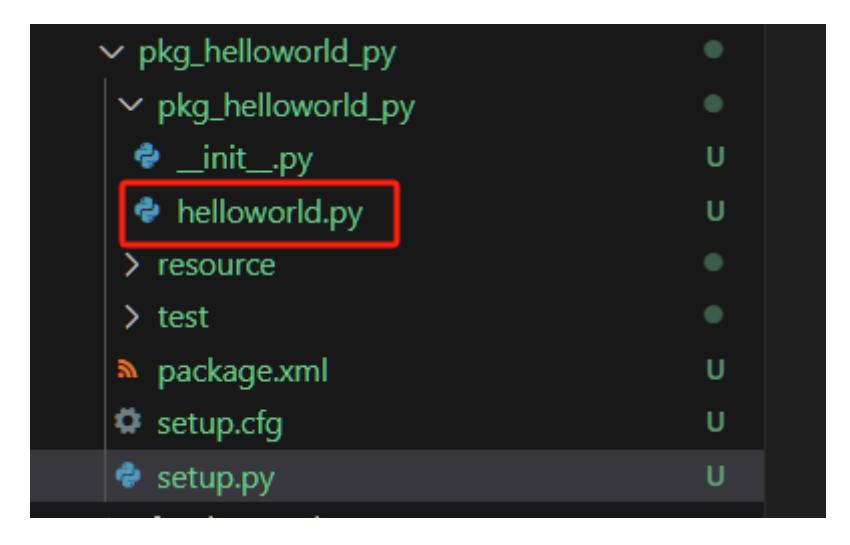

# **6. ROS2 Nodes**

## **1. Node Introduction**

Regardless of the communication method used, the construction of communication objects relies on nodes. In ROS2, each node generally corresponds to a single functional module (for example, a radar driver node might be responsible for publishing radar messages, while a camera driver node might be responsible for publishing image messages). A complete robotic system may consist of many nodes working together. In ROS2, a single executable file (C++ program or Python program) can contain one or more nodes.

## **2. Node Creation Process**

- 1. Create a Program File
- 2. Import Related ROS Libraries
- 3. Write Node Functions
- 4. Write the Configuration File
- 5. Compile and Run

## **3. Hello World Node Example**

This section uses the Python package as an example.

#### **3.1. Creating the Python Package**

Replace -workspace with your actual workspace path.

```
cd workspace/src
ros2 pkg create pkg_helloworld_py --build-type `ment_python` --dependencies
`rclpy` --node-name `helloworld`
```

### **3.2. Writing Code**

Executing the above command will create pkg\_helloworld\_py and a helloworld.py file for writing the node:



Delete the original helloworld.py Write the following code:

```
import rclpy # ROS2 Python interface library
from rclpy.node import Node # ROS2 node class
import time
"""
Create a HelloWorld node and log "Hello World" during initialization.
"""
class HelloWorldNode(Node):
   def __init__(self, name):
      super().__init__(name) # Initialize the ROS2 node
parent class
      while rclpy.ok(): # Check if the ROS2 system is
running properly
         self.get_logger().info("Hello World") # Output ROS2 logs
         time.sleep(0.5) # Sleep control loop time
def main(args=None): # Main entry point for the
ROS2 node
   rclpy.init(args=args) # Initialize the ROS2 Python
interface
   node = HelloWorldNode("helloworld") # Create and initialize the
ROS2 node object
   rclpy.spin(node) # Loop and wait for ROS2 to
exit.
   node.destroy_node() # Destroy the node object
   rclpy.shutdown() # Close the ROS2 Python
interface
```

After writing the code, you need to set the package's compilation options to let the system know the entry point for the Python program. Open the package's setup.py file and add the following entry point configuration:

#### **3.3. Compiling the Package**

Compiling the Package

```
colcon build --packages-select pkg_helloworld_py
```

Refresh the environment variables in the workspace

```
source install/setup.bash
```

#### **3.4. Running the Node**

```
ros2 run pkg_helloworld_py helloworld
```

After running successfully, you can see the "Hello World" string being printed in a loop in the terminal: