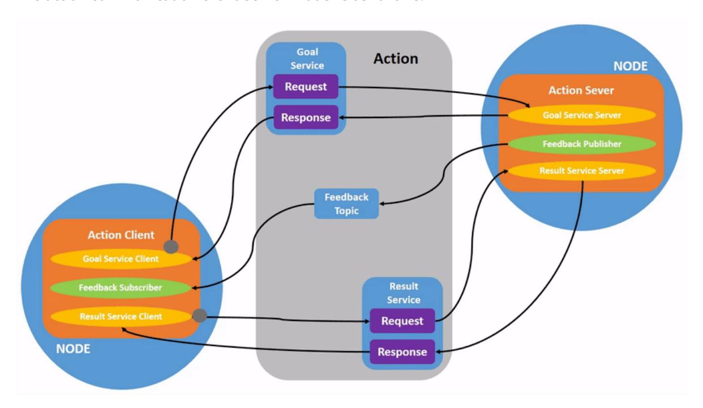
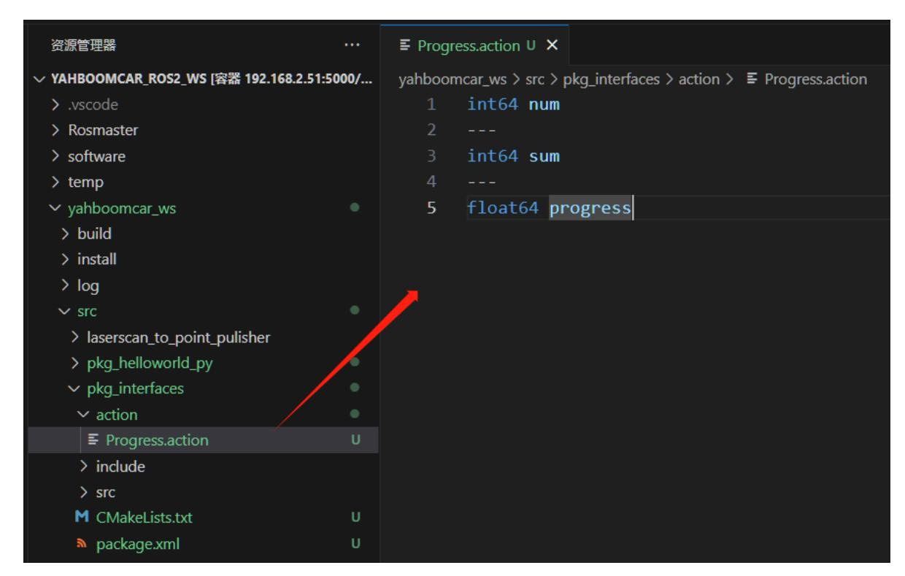
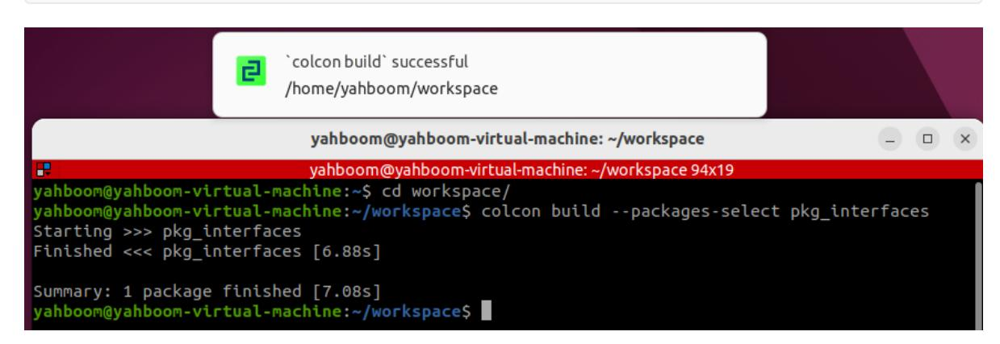
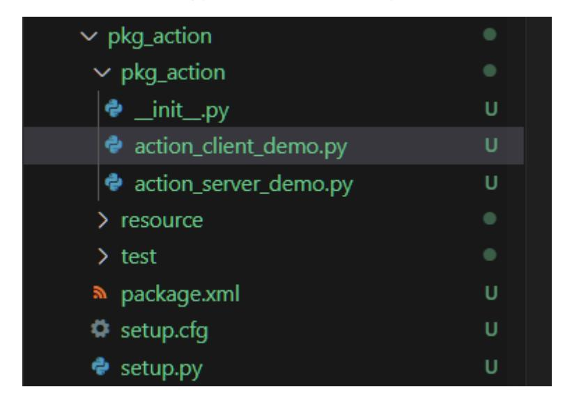

# **9.ROS2 action communication**

# **1. Introduction to Action Communication**

Action communication is a communication model with continuous feedback. Between the two communicating parties, the client sends request data to the server, and the server responds to the client. However, from the time the server receives the request to the time it generates the final response, it sends continuous feedback to the client.

The action communication client/server model is as follows:



### **2. Example Introduction**

The action client submits an integer data type N. The action server receives the request data and accumulates all integers between 1 and N, returning the final result to the action client. Each addition calculates the current computation progress and provides feedback to the action client.

## **3. Create a new function package**

# **3.1. Create an action communication interface function package**

- 1. Action communication requires creating the action communication interface first.
- Create a new pkg\_interfaces function package in the src directory of the workspace.

ros2 pkg create --build-type ament\_cmake pkg\_interfaces

2. Next, create an action folder under the pkg\_interfaces function package and create a new file called [Progress.action] within the action folder. The file contents are as follows:

```
int64 num
---
int64 sum
---
float64 progress
```



3. Add some dependency packages to package.xml. The specific content is as follows:

```
<buildtool_depend>rosidl_default_generators</buildtool_depend>
<exec_depend>rosidl_default_runtime</exec_depend>
<depend>action_msgs</depend>
<member_of_group>rosidl_interface_packages</member_of_group>
```

4. Add the following configuration to CMakeLists.txt:

```
find_package(rosidl_default_generators REQUIRED)
rosidl_generate_interfaces(${PROJECT_NAME}
  "action/Progress.action"
```

5. Compile the package:

```
colcon build --packages-select pkg_interfaces
```



6. After compilation is complete, the C++ and Python files corresponding to the Progress.action file will be generated in the install directory of the workspace. You can also access the workspace in a terminal and verify the file definitions and compilation by running the following command:

```
source install/setup.bash
ros2 interface show pkg_interfaces/action/Progress
```

Under normal circumstances, the terminal will output the same content as the Progress.action file.

### **3.2. Creating the Action Communication Function Package**

Create a new package called pkg\_action in the src directory of the workspace.

```
ros2 pkg create pkg_action --build-type ament_python --dependencies rclpy
pkg_interfaces --node-name action_server_demo
```

After executing the above command, the pkg\_action function package will be created, along with an action\_server\_demo node and the relevant configuration files.

# **4. Server Implementation**

#### **4.1 Creating the Server**

Next, edit [action\_server\_demo.py] to implement the server functionality and add the following code:

```
import time
import rclpy
from rclpy.action import ActionServer
from rclpy.node import Node
from pkg_interfaces.action import Progress
class Action_Server(Node):
    def __init__(self):
        super().__init__('progress_action_server')
        # Creating an action server
        self._action_server = ActionServer(
            self,
            Progress,
            'get_sum',
            self.execute_callback)
        self.get_logger().info('动作服务已经启动!')
    def execute_callback(self, goal_handle):
        self.get_logger().info('开始执行任务....')
        # Generate continuous feedback;
        feedback_msg = Progress.Feedback()
        sum = 0
        for i in range(1, goal_handle.request.num + 1):
            sum += i
```

```
feedback_msg.progress = i / goal_handle.request.num
            self.get_logger().info('连续反馈: %.2f' % feedback_msg.progress)
            goal_handle.publish_feedback(feedback_msg)
            time.sleep(1)
        # Generate the final response.
        goal_handle.succeed()
        result = Progress.Result()
        result.sum = sum
        self.get_logger().info('任务完成!')
        return result
def main(args=None):
    rclpy.init(args=args)
    # Call the spin function and pass in the node object
    Progress_action_server = Action_Server()
    rclpy.spin(Progress_action_server)
    Progress_action_server.destroy_node()
    # Release resources
    rclpy.shutdown()
```

#### **4.2 Edit the Configuration File**

Open setup.py and add the following line to the console\_scripts list:

```
'action_server_demo = pkg_action.action_server_demo:main',
```

#### **4.3 Compile the Package**

```
colcon build --packages-select pkg_action
```

#### **4.4 Run the Program**

```
ros2 run pkg_action action_server_demo
```

In another terminal, enter:

```
ros2 action list
```

/get\_sum is the action we need to call. To do so, enter the following command in the terminal:

```
ros2 action send_goal /get_sum pkg_interfaces/action/Progress "{num: 10}"
```

Here we calculate the sum of the values from 1 to 10:

The upper part of the image above shows the server, and the lower part shows the client. You can see that the server continuously reports progress while calculating the sum from 1 to 10. Finally, the task is completed, and the client receives feedback that the sum is 55.

# **5. Client Implementation**

#### **5.1 Creating the Client**

Create a new file, action\_client\_demo.py, in the same directory as action\_server\_demo.py.



Next, edit action\_client\_demo.py to implement the server functionality and add the following code:

```
import rclpy
from rclpy.action import ActionClient
from rclpy.node import Node
from pkg_interfaces.action import Progress
class Action_Client(Node):
    def __init__(self):
        super().__init__('progress_action_client')
        # Create an action client;
        self._action_client = ActionClient(self, Progress, 'get_sum')
    def send_goal(self, num):
        # Send a request;
        goal_msg = Progress.Goal()
        goal_msg.num = num
        self._action_client.wait_for_server()
        self._send_goal_future = self._action_client.send_goal_async(goal_msg,
feedback_callback=self.feedback_callback)
        self._send_goal_future.add_done_callback(self.goal_response_callback)
    def goal_response_callback(self, future):
        # Process the feedback after the target sends it;
        goal_handle = future.result()
        if not goal_handle.accepted:
            self.get_logger().info('请求被拒绝')
            return
        self.get_logger().info('请求被接收,开始执行任务!')
        self._get_result_future = goal_handle.get_result_async()
        self._get_result_future.add_done_callback(self.get_result_callback)
    #Process the final response.
    def get_result_callback(self, future):
        result = future.result().result
```

```
self.get_logger().info('最终计算结果:sum = %d' % result.sum)
        # 5. Release resources.
        rclpy.shutdown()
    # Processing continuous feedback;
    def feedback_callback(self, feedback_msg):
        feedback = (int)(feedback_msg.feedback.progress * 100)
        self.get_logger().info('当前进度: %d%%' % feedback)
def main(args=None):
    rclpy.init(args=args)
    action_client = Action_Client()
    action_client.send_goal(10)
    rclpy.spin(action_client)
```

#### **5.2 Edit the Configuration File**

Open setup.py and add the following line to the console\_scripts list:

```
'action_client_demo = pkg_action.action_client_demo:main'
```

#### **5.3 Compile the Package**

```
colcon build --packages-select pkg_action
```

#### **5.4 Run the Program**

Execute the following command in a separate terminal:

```
# Start the server node
ros2 run pkg_action action_server_demo
# Start the client node
ros2 run pkg_action action_client_demo
```

The image above shows the server on the top and the client on the bottom. Here, we're calculating the sum of 1 to 10. You can see that the server continuously reports progress during the calculation. Finally, the task is completed, and the client receives feedback that the sum is 55.