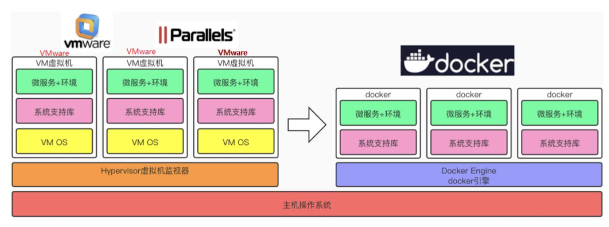
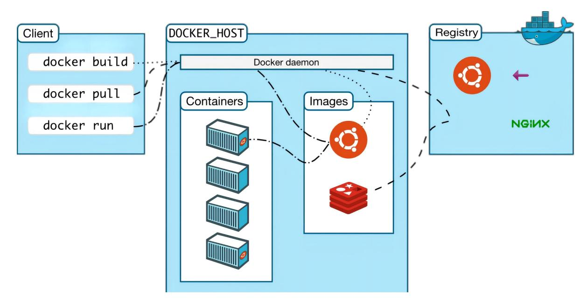
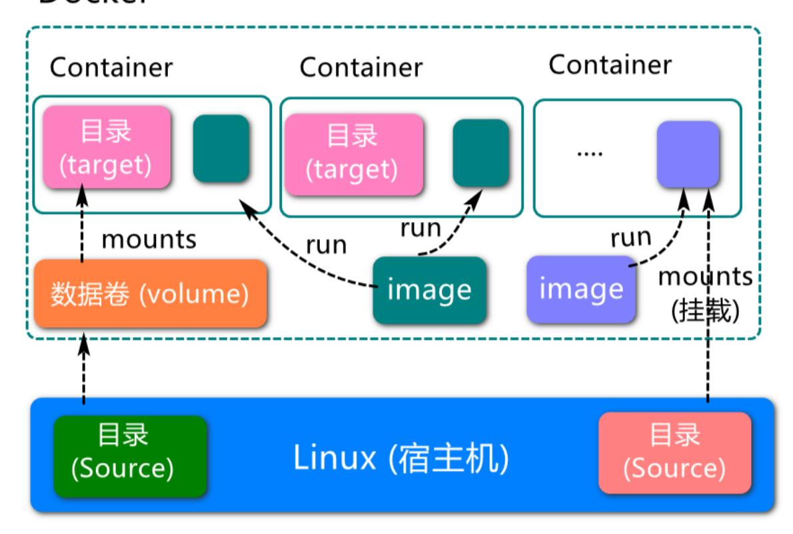

# <span id="page-0-0"></span>**1、Docker overview and docker installation**

*At present, ROS2's courses are all placed in Docker containers, and customers can experience learning to use containerized development methods.*

### **1、Docker overview and [docker installation](#page-0-0)**

- 1.1、Docker [overview](#page-0-1)
  - 1.1.1、why docker [appears](#page-0-2)
  - 1.1.2、[Docker's](#page-1-0) core idea
  - 1.1.3、Compare virtual [machines](#page-1-1) to Docker
  - 1.1.4、docker [architecture](#page-2-0)
  - 1.1.5、Docker core [objects](#page-3-0)
  - 1.1.6、images, containers, [repositories](#page-3-1)
  - 1.1.7、Docker operation [mechanism](#page-4-0)
- 1.2、docker [installation](#page-4-1)

Docker Chinese website: [https://www.docker-cn.com](https://www.docker-cn.com/)

Docker Hub (repository) official website: [https://hub.docker.com](https://hub.docker.com/)

The operating environment and software and hardware reference configurations are as follows:

- REFERENCE MODEL: ROSMASTER X3
- Robot hardware configuration: Arm series main control, Silan A1 lidar, AstraPro Plus depth camera
- Robot system: Ubuntu (version not required) + docker (version 20.10.21 and above)
- PC Virtual Machine: Ubuntu (20.04) + ROS2 (Foxy)
- <span id="page-0-1"></span>Usage scenario: Use on a relatively clean 2D plane

## **1.1、Docker overview**

Docker is an application container engine project, developed based on the Go language and open source.

## **1.1.1、why docker appears**

Let's start with a few scenarios:

- <span id="page-0-2"></span>1. O&M deploys the project you developed to the server, telling you that there is a problem and cannot be started. You ran around locally and found that there was no problem...
- 2. The project to be launched is unavailable due to the update of some software versions...
- 3. There are a lot of environmental content involved in the project, various middleware, various configurations, and the deployment of multiple servers...

These problems can actually be summed up in relation to the environment.

To avoid various problems caused by different environments, it is best to deploy the project together with the various environments required by the project.

For example, the project involves environments such as REDIS, MYSQL, JDK, ES, etc., and the entire environment is brought with you when deploying the JAR package. So the question is, how can you bring the project with the environment?

Docker is here to solve this problem!

## **1.1.2、Docker's core idea**

<span id="page-1-1"></span><span id="page-1-0"></span>

This is the logo of Docker, a whale full of containers, on the back of the whale, the containers are isolated from each other, which is the core idea of Docker.

For example, if there were multiple applications running on the same server before, there may be port occupation conflicts of software, but now they can run alone after isolation. In addition, Docker can maximize the power of the server.

### **1.1.3、Compare virtual machines to Docker**



The docker daemon can communicate directly with the main operating system to allocate resources to individual docker containers; It can also isolate containers from the main operating system and isolate individual containers from each other. Virtual machines take minutes to start, while docker containers can start in milliseconds. Since there is no bloated from the operating system, Docker can save a lot of disk space as well as other system resources.

- Virtual machines are better at completely isolating the entire operating environment. For example, cloud service providers often use virtual machine technology to isolate different users. Docker is often used to isolate different applications, such as front-end, back-end, and database.
- <span id="page-2-0"></span>Docker containers are more resource-efficient and faster (start, shut down, create, delete) than virtual machines

## **1.1.4、docker architecture**

Docker uses a client-server architecture. The Docker client communicates with the Docker daemon, which is responsible for building, running, and distributing the Docker container. The Docker client and daemon can run on the same system, or you can connect a Docker client to a remote Docker daemon. The docker client and daemon communicate using REST APIs over UNIX sockets or network interfaces. Another Docker client is Docker Compose, which lets you work with applications that consist of a set of containers.



- docker client is a docker command that is used directly after installing docker.
- Docker host is our docker host (i.e. the operating system on which docker is installed)
- Docker Daemon is Docker's background daemon that listens for and processes Docker client commands and manages Docker objects such as images, containers, networks, and volumes.
- registry is a remote repository where docker pulls images, providing a large number of images for download, and saving them in images (local image repository) after downloading.
- Images is a local image repository of docker, and image files can be viewed through docker images.

## <span id="page-3-0"></span>**1.1.5、Docker core objects**



### **1.1.6、images, containers, repositories**

### Image:

<span id="page-3-1"></span>A docker image is a read-only template. Images can be used to create docker containers, and one image can create many containers. Just like classes and objects in Java, classes are images and containers are objects.

### Container:

Docker uses containers to run independently of an application or set of applications. A container is a running instance created from an image. It can be started, started, stopped, removed. Each container is an isolated platform for security. Think of a container as a simple version of the Linux environment (including root privileges, process space, user space, network space, etc.) and the applications running in it. The definition of a container is almost identical to an image, and it is also a unified view of a bunch of layers, the only difference is that the top layer of the container is readable and writable.

### Repository:

A repository is a place where image files are stored centrally. Repositories are divided into two forms: public repositories and private repositories. The largest public repository is Docker Hub (https://hub.docker.com/), which houses a huge number of images for users to download. Domestic public warehouses include Alibaba Cloud, NetEase Cloud, etc.

You need to correctly understand the concepts of warehousing/image/container:

- Docker itself is a container runtime carrier, or management engine. We package the application and configuration dependencies to form a shippable runtime environment, and this packaged runtime environment is like an image image file. Only this image file can generate a docker container. An image file can be thought of as a template for a container. Docker generates an instance of the container from the image file. The same image file allows you to generate multiple container instances running at the same time.
- The container instance generated by the image file is itself a file, called an image file.
- A container runs a service, and when we need it, we can create a corresponding running instance through the docker client, which is our container.
- As for the repository, it is a place where a bunch of images are placed, we can publish the images to the repository, and pull them from the repository when needed.

### **1.1.7、Docker operation mechanism**

Docker pull execution process:

- <span id="page-4-0"></span>1. The client sends instructions to Docker Daemon
- 2. Docker Daemon first check whether there are relevant images in the local images
- 3. If there is no relevant image locally, request the mirror server to download the remote mirror to the local computer

docker run execution process:

- 1. Check whether the specified image exists locally and download it from the public repository
- 2. Create and start a container from the image
- 3. Assign a file system (lite Linux system) and mount a read-write layer outside the read-only image layer
- 4. Bridge a virtual interface from the bridge interface configured by the host to the container
- 5. Configure an IP address from the address pool to the container
- 6. Execute the application specified by the user

## **1.2、docker installation**

- <span id="page-4-1"></span>1. [Official website installation reference manual: https://docs.docker.com/engine/install/ubunt](https://docs.docker.com/engine/install/ubuntu/) u/
- 2. You can use the following commands to install with one click:

```
curl -fsSL https://get.docker.com | bash -s docker --mirror Aliyun
```

3. Check the docker version

sudo docker version

4. Test the command

sudo docker run hello-world

The following output indicates that the Docker installation was successful

jetson@ubuntu:~\$ sudo docker run hello-world

[sudo] password for jetson:

Unable to find image 'hello-world:latest' locally latest: Pulling from library/hello-world

7050e35b49f5: Pull complete

Digest: sha256:4e83453afed1b4fa1a3500525091dbfca6ce1e66903fd4c01ff015dbcb1ba33e

Status: Downloaded newer image for hello-world:latest

Hello from Docker!

This message shows that your installation appears to be working correctly.

To generate this message, Docker took the following steps:
1. The Docker client contacted the Docker daemon.

- 2. The Docker daemon pulled the "hello-world" image from the Docker Hub. (arm64v8)
- 3. The Docker daemon created a new container from that image which runs the executable that produces the output you are currently reading.
- 4. The Docker daemon streamed that output to the Docker client, which sent it to your terminal.

To try something more ambitious, you can run an Ubuntu container with: \$ docker run -it ubuntu bash

Share images, automate workflows, and more with a free Docker ID: https://hub.docker.com/

For more examples and ideas, visit: https://docs.docker.com/get-started/