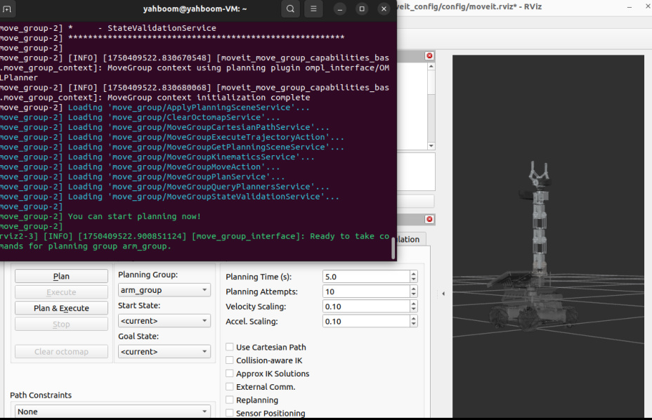
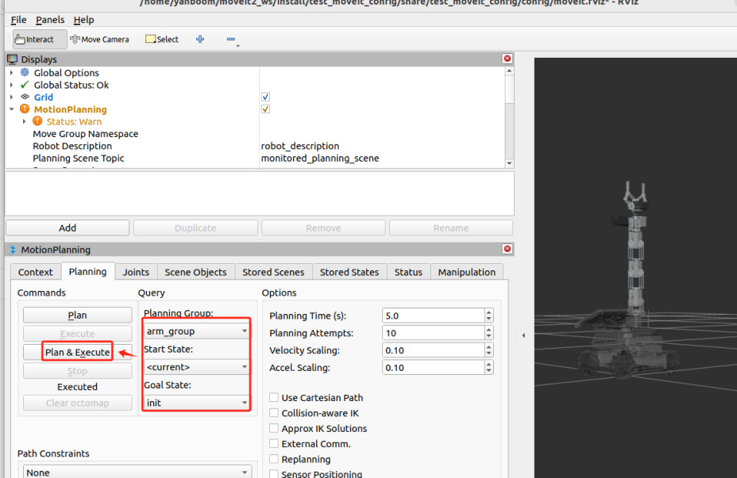
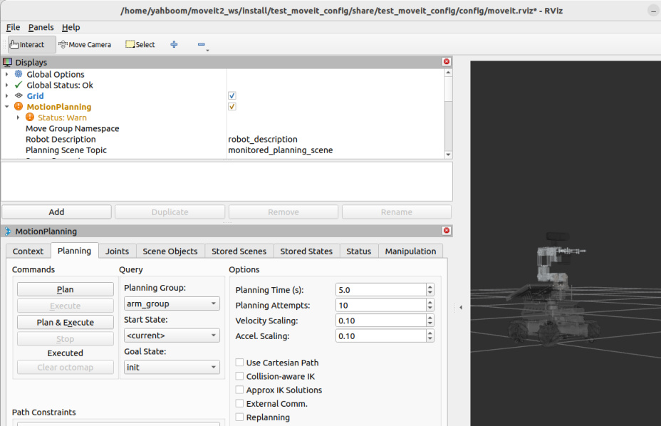
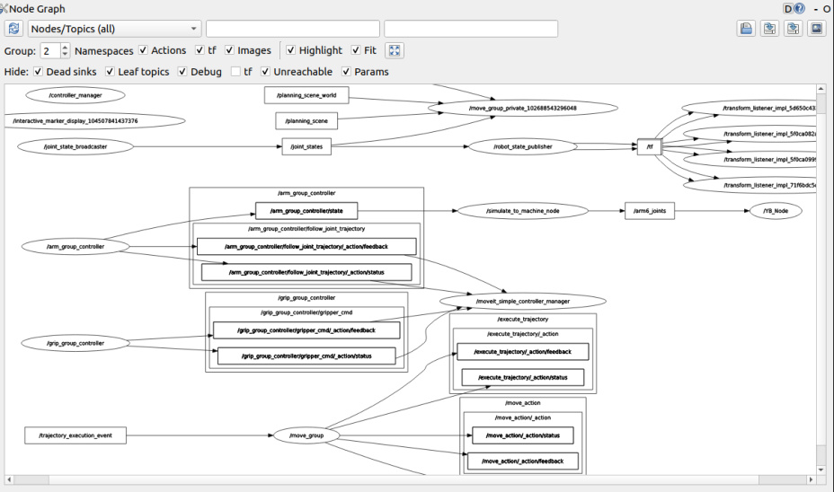
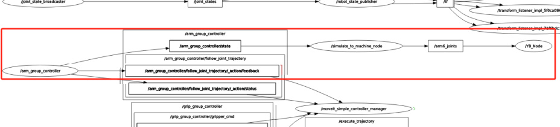
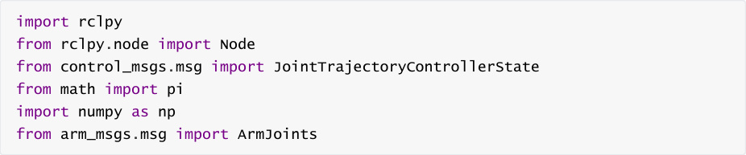
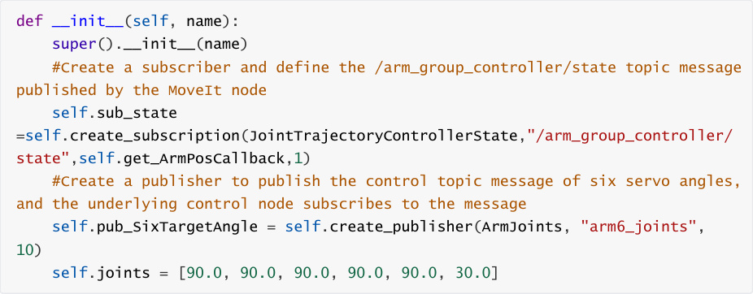
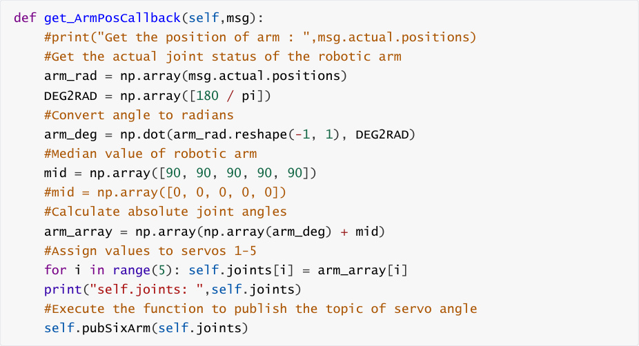
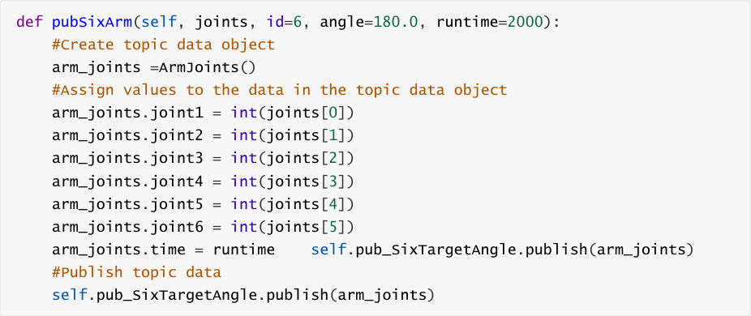

# MoveIt2 simulation-reality linkage
Preface: Raspberry Pi 5 and Jetson-nano's ROS is running in Docker, so the effect of running

MoveIT2 is generally poor. It is recommended that Raspberry Pi 5 and


The user of the Jetson-Nano motherboard runs MoveIt2 on a virtual machine. The ROS of the Orin

motherboard runs directly on the motherboard.


Therefore, users of the Orin motherboard can run MoveIt2 related cases directly on the

motherboard, and the instructions are the same as those running on a virtual machine.


The following content uses running on a virtual machine as an example.

## 1. Content Description
This section explains how to combine the simulated robotic arm in Rviz with the real robotic arm

to realize the function of driving the real machine.

## 2. Preparation
Preface: Since the real robot arm does not have an obstacle avoidance function, some positions

may hit obstacles. Therefore, before driving the real machine, you need to ensure that there are

no obstacles around the robot arm.

### 2.1. Start the agent
You need to start the agent on the motherboard. The agent will start the control node to control

the robot and chassis. The agent will be automatically started when the computer is turned on. If

the agent is not started, you can enter the following command in the terminal to start it.


### 2.2 Distributed communication between virtual machines and cars
The virtual machine and the car need to be able to communicate. There are two steps to achieve

this:


In the same local area network, the easiest way to achieve this is to connect to the same wifi;

The ROS_DOMAIN_ID of the two must be consistent. The default ROS_DOMAIN_ID of the car

is 30, and the default ROS_DOMAIN_ID of the virtual machine is also 30. If the two are

different, you need to modify the ROS_DOMAIN_ID of the virtual machine, modify


environment variables.

Check whether the distributed communication between the two is achieved. Enter it on the


communicating.


## 3. Program startup
Enter the following command in the virtual machine to start MoveIt2,


After the program is started, when the terminal displays **"You can start planning now!"**, it

indicates that the program has been successfully started, as shown in the figure below.


At this time, the posture of the robotic arm is straightened upwards. After running the program to

drive the real machine, the robotic arm on the car will also straighten upwards. Be careful with

the robotic arm and place it in an open space. Enter the following command in the virtual

machine terminal to start the program to drive the real machine:





After the program runs, the robotic arm will straighten upwards, just like the robotic arm in rviz.


This is to allow the robot arm in rviz to plan and move to our preset init posture, as shown in the

figure below. Select [Planning Group] as arm_group, select [Start State] as, and select [Goal State]

as. We plan the robot arm's posture from the current up to the previously set init, and then click

[Plan&Execute].




The robotic arm in rviz will first plan and then slowly move to the init posture. The robotic arm on

the car will also slowly move to the init posture. The final result is shown in the figure below.

## 4. Node Communication
Enter the following command in the virtual machine to view the current node communication

diagram,





Select [Nodes/Topics (all)] in the upper left corner, and then click the refresh button next to it to

get the following content:




We focus on the following diagrams:


This section illustrates the communication between the three nodes.

## 5. Core code analysis
Program source code path:


In the virtual

machine: `/home/yahboom/moveit2_ws/src/MoveIt_SimToMachine/MoveIt_SimToMachine/Simula`

```
tionToMachine.py

```

Import the library files used,







Program initialization, creating topic subscribers and publishers,





/arm_group_controller/state topic callback function,





Release the servo angle topic function,



