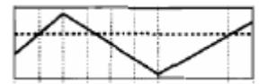
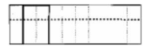
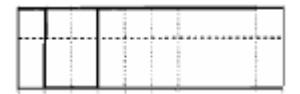
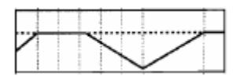
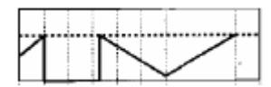
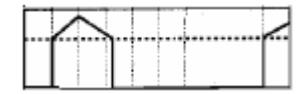
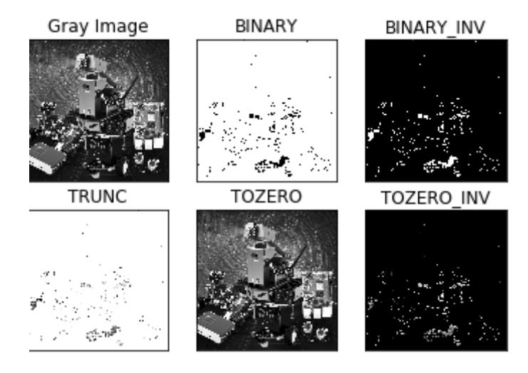

## **Image binarization**

The core idea of binarization is to set a threshold, with values above the threshold being set to 0 (black) or 255 (white), making the image black and white. The threshold can be fixed or adaptive. An adaptive threshold typically compares a pixel at a point with the average value of the pixels in the region around that point, or with a weighted sum of Gaussian distributions. This difference can be set or not.

Global Threshold:

Python-OpenCV provides a threshold function: cv2.threshold(src, threshold, maxValue, method)



src original image: the dashed line is the value to be thresholded; the dotted line is the threshold



cv2.THRESH\_BINARY: The grayscale value of pixels greater than the threshold is set to maxValue (for example, the maximum 8-bit grayscale value is 255), and the grayscale value of pixels less than the threshold is set to 0.



cv2.THRESH\_BINARY\_INV : The grayscale value of pixels above the threshold is set to 0, while those below the threshold are set to maxValue.



cv2.THRESH\_TRUNC: Pixels with grayscale values less than the threshold value will not be changed, and pixels with grayscale values greater than the threshold value will be set to the threshold value.



cv2.THRESH\_TOZERO: Pixels with grayscale values less than the threshold value will not be changed, while those with grayscale values greater than the threshold value will all be changed to 0.



cv2.THRESH\_TOZERO\_INV: Pixels with grayscale values greater than the threshold will not be changed; pixels with grayscale values less than the threshold will all be changed to 0.

Code path:

opencv/opencv\_basic/03\_Image processing and text drawing/02Binarization processing.ipynb

```
import cv2
import numpy as np
import matplotlib.pyplot as plt
img = cv2.imread('yahboom.jpg',1)
GrayImage = cv2.cvtColor(img, cv2.COLOR_BGR2GRAY) #Convert to grayscale image
ret,thresh1=cv2.threshold(GrayImage,10,255,cv2.THRESH_BINARY)
ret,thresh2=cv2.threshold(GrayImage,10,255,cv2.THRESH_BINARY_INV)
ret,thresh3=cv2.threshold(GrayImage,10,255,cv2.THRESH_TRUNC)
ret,thresh4=cv2.threshold(GrayImage,10,255,cv2.THRESH_TOZERO)
ret,thresh5=cv2.threshold(GrayImage,10,255,cv2.THRESH_TOZERO_INV)
titles = ['Gray Image','BINARY','BINARY_INV','TRUNC','TOZERO','TOZERO_INV']
images = [GrayImage, thresh1, thresh2, thresh3, thresh4, thresh5]
for i in range(6):
     plt.subplot(2,3,i+1),plt.imshow(images[i],'gray')
   plt.title(titles[i])
   plt.xticks([]),plt.yticks([])
plt.show()
```

