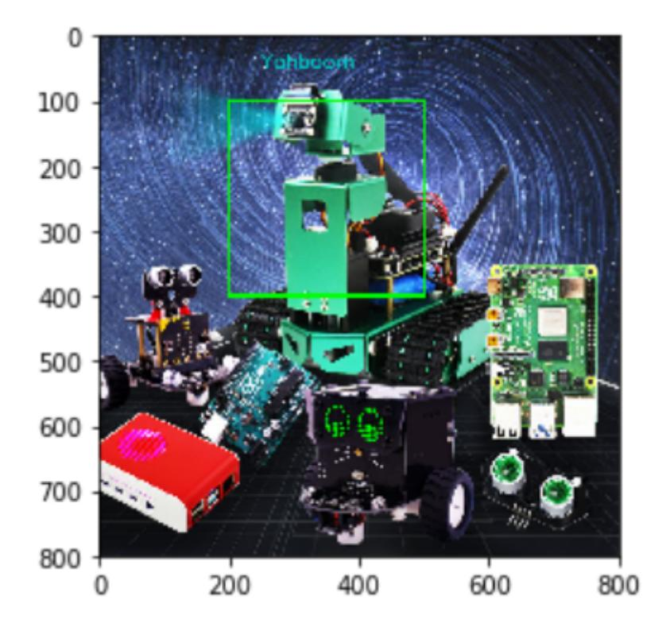

## **Text and picture drawing**

Function call: cv2.putText(img, str, origin, font, size, color, thickness)

The parameters are: picture, added text, upper left corner coordinates (integer), font, font size, color, font weight.

The font types are as follows:

| 枚举                                                                 |                                             |
|--------------------------------------------------------------------|---------------------------------------------|
| FONT_HERSHEY_SIMPLEX Python: cv.FONT_HERSHEY_SIMPLEX               | 正常大小sans-serif字体                            |
| FONT_HERSHEY_PLAIN Python: cv.FONT_HERSHEY_PLAIN                   | 小尺寸sans-serif字体                             |
| FONT_HERSHEY_DUPLEX Python: cv.FONT_HERSHEY_DUPLEX                 | 正常大小的sans-serif字体(比FONT_HERSHEY_SIMPLEX更复杂) |
| FONT_HERSHEY_COMPLEX Python: cv.FONT_HERSHEY_COMPLEX               | 正常大小的衬线字体                                   |
| FONT_HERSHEY_TRIPLEX Python: cv.FONT_HERSHEY_TRIPLEX               | 正常大小的serif字体(比FONT_HERSHEY_COMPLEX更复杂)      |
| FONT_HERSHEY_COMPLEX_SMALL Python: cv.FONT_HERSHEY_COMPLEX_SMALL   | 较小版本的FONT_HERSHEY_COMPLEX                   |
| FONT_HERSHEY_SCRIPT_SIMPLEX Python: cv.FONT_HERSHEY_SCRIPT_SIMPLEX | 手写风格的字体                                     |
| FONT_HERSHEY_SCRIPT_COMPLEX Python: cv.FONT_HERSHEY_SCRIPT_COMPLEX | 更复杂的FONT_HERSHEY_SCRIPT_SIMPLEX变体           |
| FONT_ITALIC Python: cv.FONT_ITALIC                                 | 标志为斜体字体 YahBoom                             |

## Code path:

opencv/opencv\_basic/03\_Image processing and text drawing/06Text and image drawing.ipynb

```
import cv2
import numpy as np
img = cv2.imread('yahboom.jpg',1)
font = cv2.FONT_HERSHEY_SIMPLEX
cv2.rectangle(img,(200,100),(500,400),(0,255,0),3)
# 1 dst 2 text content 3 coordinates 4 5 font size 6 color 7 thickness 8 line
type
cv2.putText(img,'Yahboom',(250,50),font,1,(200,200,0),2,cv2.LINE_AA)
# cv2.imshow('src',img)
# cv2.waitKey(0)
```

```
import matplotlib.pyplot as plt\nimg = cv2.cvtColor(img, cv2.COLOR_BGR2RGB)
plt.imshow(img)
plt.show()
```

