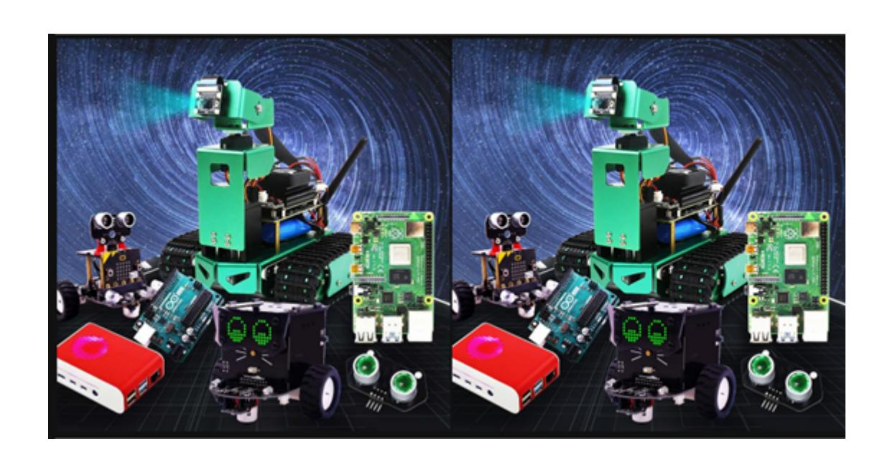

## **Image quality**

Code path:

```
opencv/opencv_basic/01_Getting_Started_with_OpenCV/03_OpenCV Picture
quality.ipynb
```

1. Compression method.

cv2.imwrite('yahboomTest.jpg', img, [cv2.IMWRITE\_JPEG\_QUALITY, 50])

cv2.CV\_IMWRITE\_JPEG\_QUALITY: Sets the image quality of the image format .jpeg or .jpg. The value is 0-100 (the larger the value, the higher the quality). The default is 95

cv2.CV\_IMWRITE\_WEBP\_QUALITY: Sets the image quality to .webp format, with a value of 0--100

cv2.CV\_IMWRITE\_PNG\_COMPRESSION: Sets the compression ratio of the .png format. The value is 0--9 (the larger the value, the greater the compression ratio). The default is 3

The main code is as follows:

```
import cv2
img = cv2.imread('yahboom.jpg',1)
cv2.imwrite('yahboomTest.jpg', img, [cv2.IMWRITE_JPEG_QUALITY, 50])
#1M 100k 10k 0-100 lossy compression
```

```
# 1 Lossless 2 transparency attribute
import cv2
img = cv2.imread('yahboom.jpg',1)
cv2.imwrite('yahboomTest.png', img, [cv2.IMWRITE_PNG_COMPRESSION,0])
# jpg 0 high compression ratio 0-100 png 0 low compression ratio 0-9
```

```
#bgr8 to jpeg format
import enum
import cv2
def bgr8_to_jpeg(value, quality=75):
      return bytes(cv2.imencode('.jpg', value)[1])
```

```
import ipywidgets.widgets as widgets
image_widget1 = widgets.Image(format='jpg', )
image_widget2 = widgets.Image(format='jpg', )
# create a horizontal box container to place the image widget next to each other
image_container = widgets.HBox([image_widget1, image_widget2])
# display the container in this cell's output
display(image_container)
img1 = cv2.imread('yahboomTest.jpg',1)
img2 = cv2.imread('yahboomTest.png',1)
image_widget1.value = bgr8_to_jpeg(img1)
image_widget2.value = bgr8_to_jpeg(img2)
```

When the code block runs to the end, you can see a comparison chart of the two photos.

