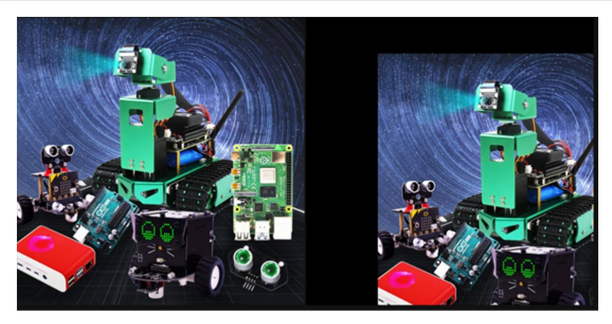

## **Image panning**

The original image src is converted to the target image dst through the transformation matrix M:

```
 dst(x, y) = src(M11x + M12y+M13, M21x+M22y+M23)
```

If the original image src is moved 200 pixels to the right and 100 pixels downward, the corresponding relationship is:

```
dst(x, y) = src(x+200, y+100)
```

Complete the above expression:

```
 dst(x, y) = src(1·x + 0·y + 200, 0·x + 1·y + 100)
```

According to the above expression, the values of each element in the corresponding transformation matrix M can be determined as:

M11=1

M12=0

M13=200

M21=0

M22=1

M23=100

Substituting the above values into the transformation matrix M, we get:

$$\mathbf{M} = \begin{bmatrix} 1 & 0 & 200 \\ 0 & 1 & 100 \end{bmatrix} \leftarrow$$

Next, we directly use the transformation matrix M to call the function cv2.warpAffine() to complete the image translation.

Code path:

opencv/opencv\_basic/02\_OpenCV Transform/03Picture Pan.ipynb

```
import cv2
import numpy as np
img = cv2.imread('yahboom.jpg',1)
#cv2.imshow('src',img)
imgInfo = img.shape
height = imgInfo[0]
width = imgInfo[1]
####
matShift = np.float32([[1,0,200],[0,1,100]])# 2*3
dst = cv2.warpAffine(img, matShift, (height, width)) #1 data 2 mat 3 info
# Shift matrix
# cv2.imshow('dst',dst)
# cv2.waitKey(0)
```

The following will show the original image and the translated image in the JupyterLab control:

```
#bgr8 to jpeg format
import enum
import cv2
def bgr8_to_jpeg(value, quality=75):
    return bytes(cv2.imencode('.jpg', value)[1])
import ipywidgets.widgets as widgets
image_widget1 = widgets.Image(format='jpg', )
image_widget2 = widgets.Image(format='jpg', )
# create a horizontal box container to place the image widget next to each other
image_container = widgets.HBox([image_widget1, image_widget2])
# display the container in this cell's output
display(image_container)
#display(image_widget2)
img1 = cv2.imread('yahboom.jpg',1)
image_widget1.value = bgr8_to_jpeg(img1)
image_widget2.value = bgr8_to_jpeg(dst)
```



As can be seen from the image, the picture has moved to the lower right corner by (200, 100).