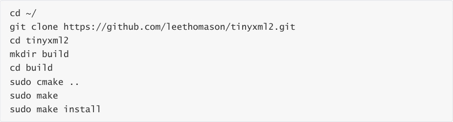
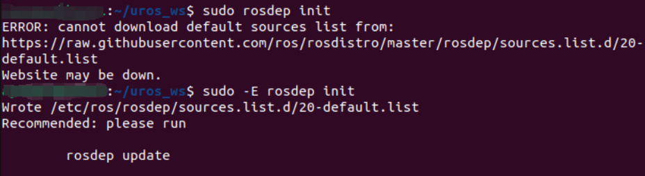
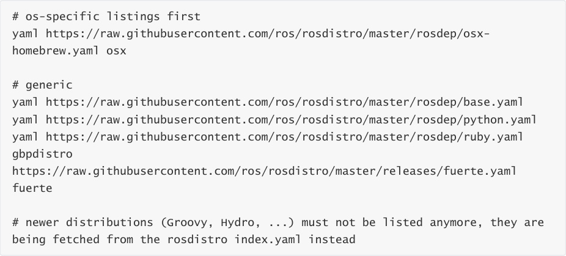
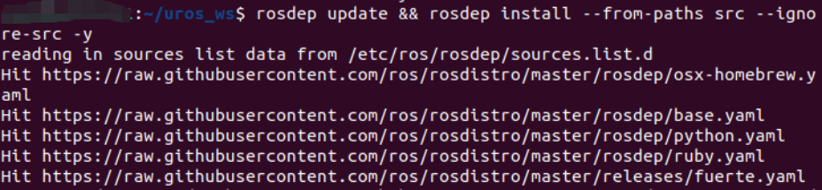
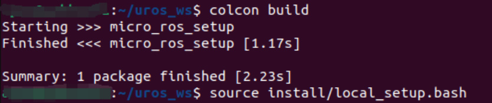
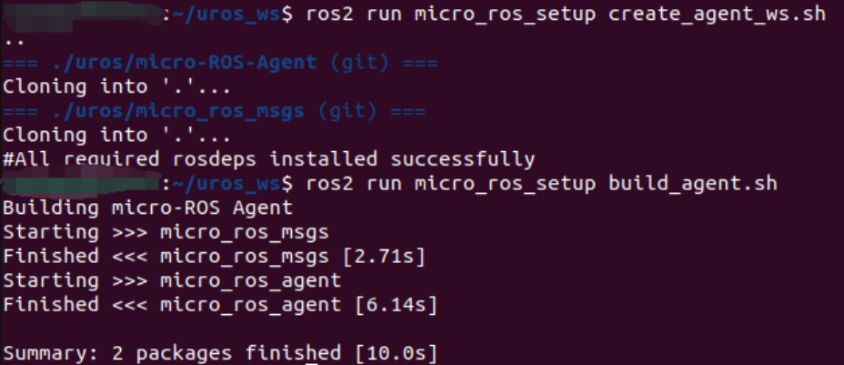

# Install and start the Microros agent
**Install and start the Microros agent**

1. Docker starts the microros agent

Docker starts the serial port proxy

Agent startup failure

2. Start microros agent from source code

Install tinyxml2 dependencies

Install the python3-rosdep tool

Compile the micro_ros_setup environment

Compile the micro_ros_agent environment

Start the microros serial port proxy from source code

3. Start the microros agent with the factory image

**Note: You can select any one of the three startup methods.**
## 1. Docker starts the microros agent
**Docker starts the serial port proxy**

Among them, --dev /dev/myserial is the bound serial port device, which can also be changed to

/dev/ttyUSB0, etc.

-b 2000000 is the baud rate.

To exit the proxy, press Ctrl+C in the terminal.

Note that you cannot close the terminal directly, otherwise Docker will continue to run in the

background.

If the MCU starts the reconnection proxy multiple times, causing ROS2 to search for multiple

identical nodes, it will not actually affect the use. Press Ctrl+C to end the proxy and then reset the

MCU to reconnect to the proxy.

**Agent startup failure**

The microROS agent can only be started in one terminal. If a terminal has already started the

microROS agent in the background, an error will be reported when starting the agent again.

Please press Ctrl+C to exit the agent in the original agent terminal before running the agent again.

If the next time you start the agent, it fails because you directly closed the terminal, you can

restart the virtual machine/computer to solve it, or manually end Docker to solve it.

How to manually end docker:

Please first query the current Docker process number and end the current proxy Docker process.

## 2. Start microros agent from source code
**Install tinyxml2 dependencies**

Enter the following command in the terminal to install tinyxml2

**Install the python3-rosdep tool**

Enter the following command in the terminal to install the rosdep tool. If it has already been

installed, you can skip this step.

**Compile the micro_ros_setup environment**

Activate the ROS2 environment variables. Here we take the humble version as an example. If it

has already been activated, you can skip the activation step.

Create and enter the workspace uros_ws in the user directory

Download the micro_ros_setup file to the src folder

Initialize rosdep

If there is a network problem, please add the -E parameter

If all the above steps return an error and rosdep still cannot be initialized, you can create a new

20-default.list file in the /etc/ros/rosdep/sources.list.d/ directory and add the following content,

then proceed to the next step.

Update rosdep and install related driver packages

Compile Workspace

Activate the micro_ros_setup environment

**Compile the micro_ros_agent environment**

If an error occurs when executing build_agent.sh, compile again.

**Start the microros serial port proxy from source code**

Activate the micro_ros_agent agent environment

Enter the following command to start the serial port proxy from the ROS2 environment

Among them, --dev /dev/myserial is the bound serial port device, which can also be changed to

/dev/ttyUSB0, etc.

-b 2000000 is the baud rate.

To exit the proxy, press Ctrl+C in the terminal.

## 3. Start the microros agent with the factory image
The factory image system has integrated the proxy function and made it into a script. You only

need to run the following command to enable the proxy.
