# Read IMU data
Read IMU data

1. Experimental Purpose

2. Hardware Connection

3. Core code analysis

4. Compile, download and burn firmware

5. Experimental Results

## 1. Experimental Purpose
Use the IMU attitude sensor chip of the STM32 control board to read the raw data of the IMU

device.

## 2. Hardware Connection
As shown in the figure below, the STM32 control board integrates the IMU attitude sensor chip.

No additional external devices need to be connected. You only need to connect the type-C data

cable to the computer and the Connect interface of the STM32 control board.


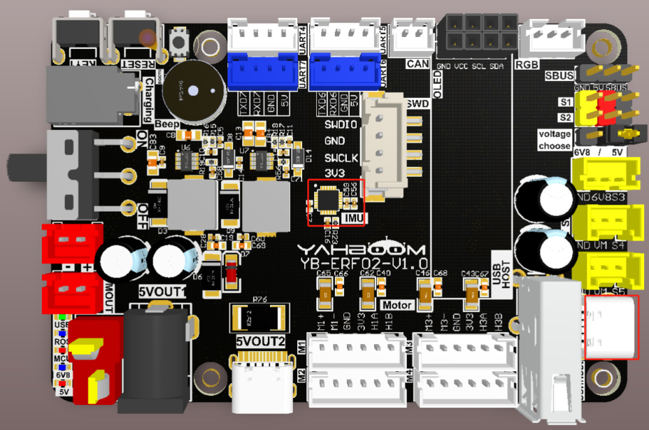
## 3. Core code analysis
The path corresponding to the program source code is:


The IMU sensor chip uses the ICM20948 chip, which uses SPI communication to transmit data.

According to the pin assignment, you need to initialize SPI2 as the host first.


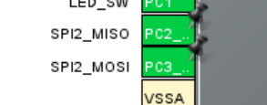

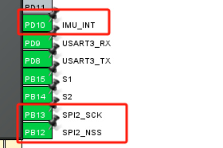

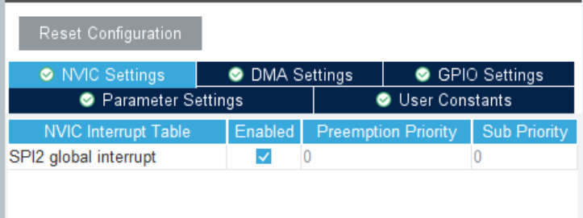
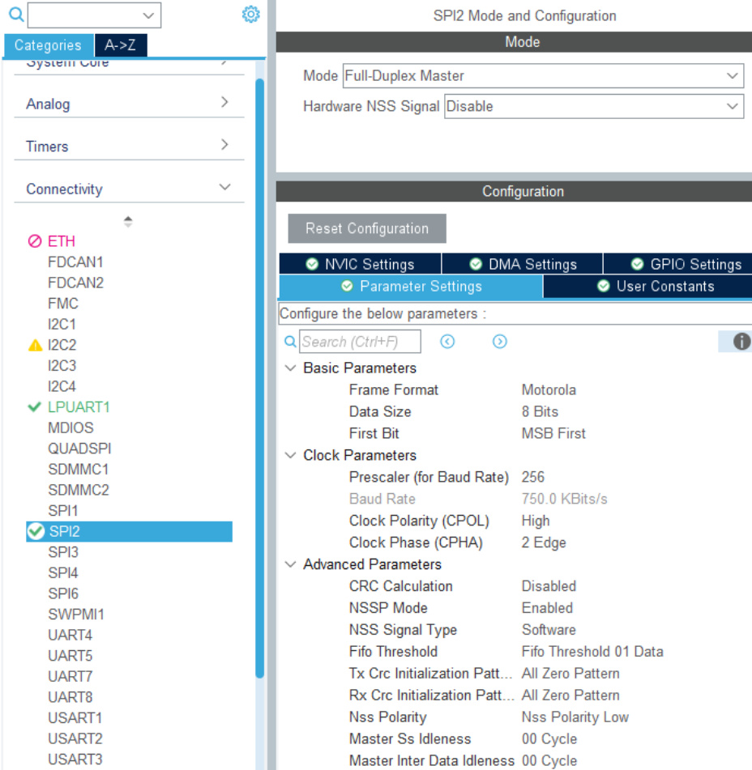
```
void MX_SPI2_Init(void)

{

hspi2.Instance = SPI2;

hspi2.Init.Mode = SPI_MODE_MASTER;

hspi2.Init.Direction = SPI_DIRECTION_2LINES;

hspi2.Init.DataSize = SPI_DATASIZE_8BIT;

hspi2.Init.CLKPolarity = SPI_POLARITY_HIGH;

hspi2.Init.CLKPhase = SPI_PHASE_2EDGE;

hspi2.Init.NSS = SPI_NSS_SOFT;

hspi2.Init.BaudRatePrescaler = SPI_BAUDRATEPRESCALER_256;

hspi2.Init.FirstBit = SPI_FIRSTBIT_MSB;

hspi2.Init.TIMode = SPI_TIMODE_DISABLE;

hspi2.Init.CRCCalculation = SPI_CRCCALCULATION_DISABLE;

hspi2.Init.CRCPolynomial = 0x0;

hspi2.Init.NSSPMode = SPI_NSS_PULSE_ENABLE;

hspi2.Init.NSSPolarity = SPI_NSS_POLARITY_LOW;

hspi2.Init.FifoThreshold = SPI_FIFO_THRESHOLD_01DATA;

hspi2.Init.TxCRCInitializationPattern =

SPI_CRC_INITIALIZATION_ALL_ZERO_PATTERN;

hspi2.Init.RxCRCInitializationPattern =

SPI_CRC_INITIALIZATION_ALL_ZERO_PATTERN;

hspi2.Init.MasterSSIdleness = SPI_MASTER_SS_IDLENESS_00CYCLE;

hspi2.Init.MasterInterDataIdleness = SPI_MASTER_INTERDATA_IDLENESS_00CYCLE;

```

```
 hspi2.Init.MasterReceiverAutoSusp = SPI_MASTER_RX_AUTOSUSP_DISABLE;

 hspi2.Init.MasterKeepIOState = SPI_MASTER_KEEP_IO_STATE_DISABLE;

 hspi2.Init.IOSwap = SPI_IO_SWAP_DISABLE;

 if (HAL_SPI_Init(&hspi2) != HAL_OK)

 {

 Error_Handler();

 }

 }

```

Enables and disables the SPI communication function of ICM20948.


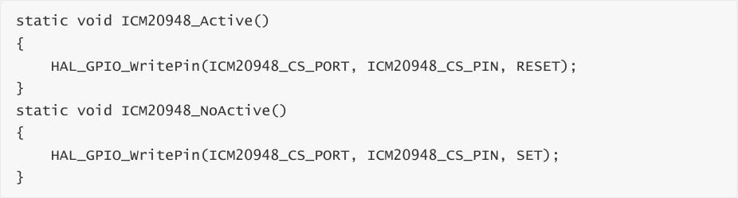

Read a byte from register reg.


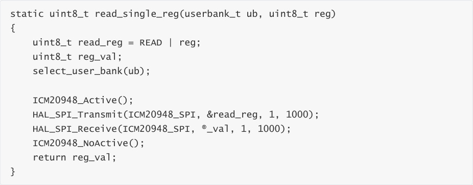


Read multiple bytes of data from register reg.


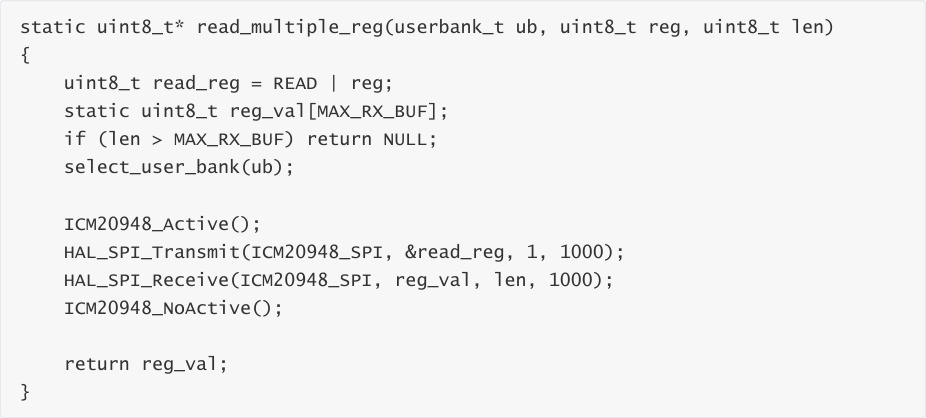


Write a byte to register reg.


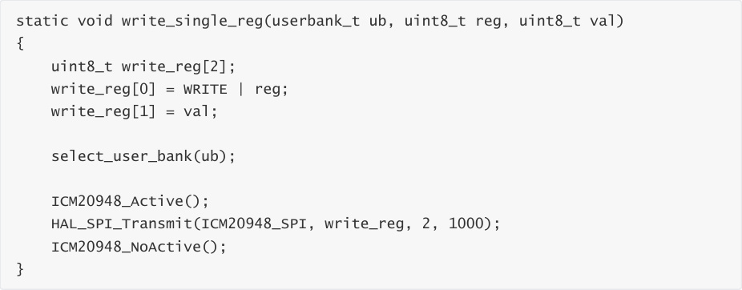


Write multiple bytes of data to register reg.


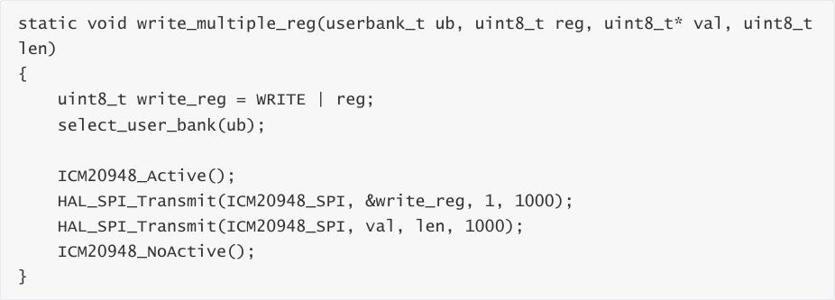


Read the who am i value of ICM20948 and determine whether it meets the requirements.


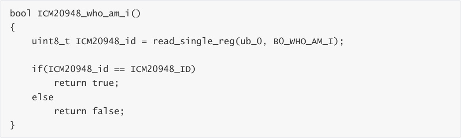


Reset and wake up the ICM20948 chip.


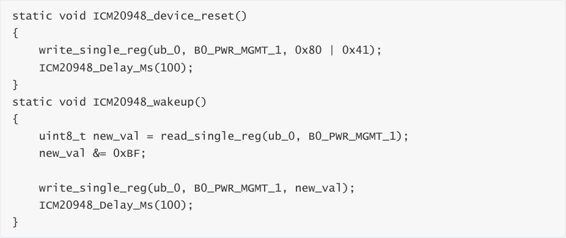


Gyroscope self-calibration function.


Accelerometer self-calibration function.

```
 static void ICM20948_accel_calibration()

 {

 raw_data_t temp;

 uint8_t* temp2;

 uint8_t* temp3;

 uint8_t* temp4;

 int32_t accel_bias[3] = {0};

 int32_t accel_bias_reg[3] = {0};

 uint8_t accel_offset[6] = {0};

 for(int i = 0; i < 100; i++)

 {

 ICM20948_accel_read(&temp);

 accel_bias[0] += temp.x;

 accel_bias[1] += temp.y;

 accel_bias[2] += temp.z;

 }

 accel_bias[0] /= 100;

```


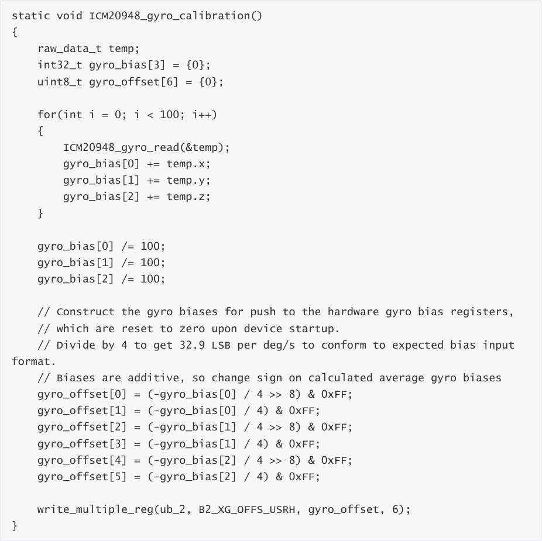
```
 accel_bias[1] /= 100;

 accel_bias[2] /= 100;

 uint8_t mask_bit[3] = {0, 0, 0};

 temp2 = read_multiple_reg(ub_1, B1_XA_OFFS_H, 2);

 accel_bias_reg[0] = (int32_t)(temp2[0] << 8 | temp2[1]);

 mask_bit[0] = temp2[1] & 0x01;

 temp3 = read_multiple_reg(ub_1, B1_YA_OFFS_H, 2);

 accel_bias_reg[1] = (int32_t)(temp3[0] << 8 | temp3[1]);

 mask_bit[1] = temp3[1] & 0x01;

 temp4 = read_multiple_reg(ub_1, B1_ZA_OFFS_H, 2);

 accel_bias_reg[2] = (int32_t)(temp4[0] << 8 | temp4[1]);

 mask_bit[2] = temp4[1] & 0x01;

 accel_bias_reg[0] -= (accel_bias[0] / 8);

 accel_bias_reg[1] -= (accel_bias[1] / 8);

 accel_bias_reg[2] -= (accel_bias[2] / 8);

 accel_offset[0] = (accel_bias_reg[0] >> 8) & 0xFF;

 accel_offset[1] = (accel_bias_reg[0]) & 0xFE;

 accel_offset[1] = accel_offset[1] | mask_bit[0];

 accel_offset[2] = (accel_bias_reg[1] >> 8) & 0xFF;

 accel_offset[3] = (accel_bias_reg[1]) & 0xFE;

 accel_offset[3] = accel_offset[3] | mask_bit[1];

 accel_offset[4] = (accel_bias_reg[2] >> 8) & 0xFF;

 accel_offset[5] = (accel_bias_reg[2]) & 0xFE;

 accel_offset[5] = accel_offset[5] | mask_bit[2];

 write_multiple_reg(ub_1, B1_XA_OFFS_H, &accel_offset[0], 2);

 write_multiple_reg(ub_1, B1_YA_OFFS_H, &accel_offset[2], 2);

 write_multiple_reg(ub_1, B1_ZA_OFFS_H, &accel_offset[4], 2);

 }

```

Set the gyroscope range to 2000dps

```
 ICM20948_gyro_full_scale_select(_2000dps);

 static void ICM20948_gyro_full_scale_select(gyro_scale_t full_scale)

 {

 uint8_t new_val = read_single_reg(ub_2, B2_GYRO_CONFIG_1);

 switch(full_scale)

 {

 case _250dps :

 new_val |= 0x00;

 g_scale_gyro = 131.0;

 break;

 case _500dps :

 new_val |= 0x02;

 g_scale_gyro = 65.5;

 break;

 case _1000dps :

 new_val |= 0x04;

```

```
 g_scale_gyro = 32.8;

 break;

 case _2000dps :

 new_val |= 0x06;

 g_scale_gyro = 16.4;

 break;

 }

 write_single_reg(ub_2, B2_GYRO_CONFIG_1, new_val);

 }

```

Set the accelerometer range to 16g.


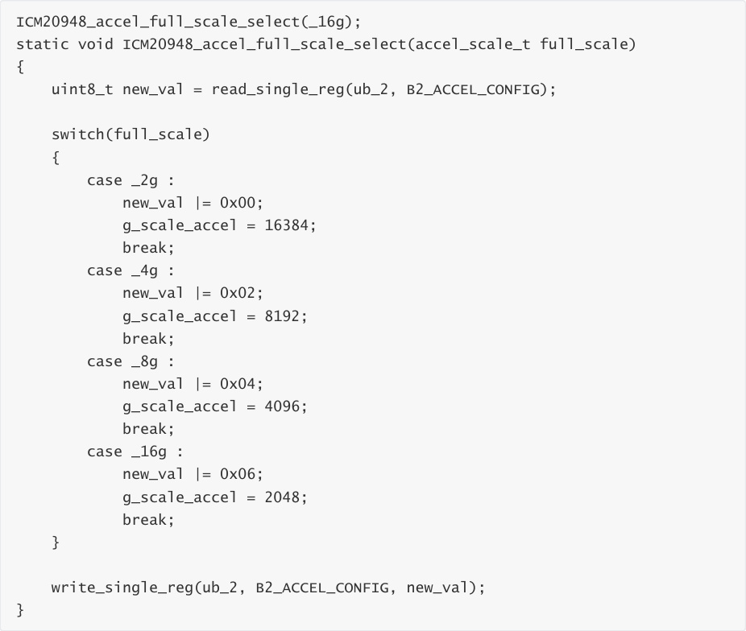


Read the raw data from the gyroscope.


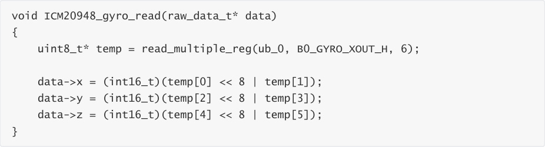


Read the raw data from the accelerometer.


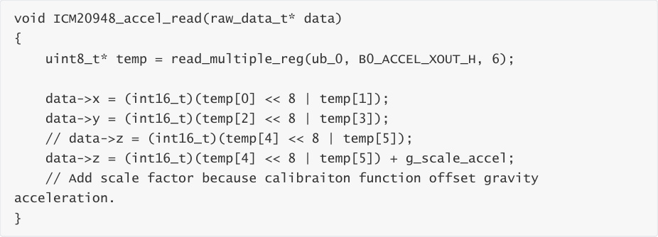


Get the scaled accelerometer data


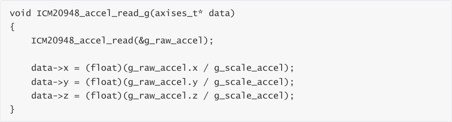


Get gyroscope scaled data


Aggregate and read IMU data.


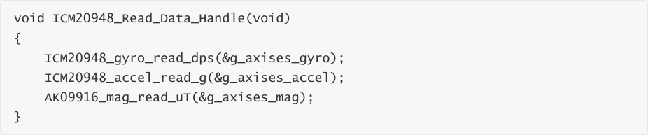


Initialize the magnetometer.


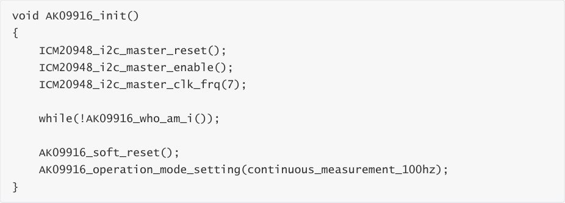


Read and determine the magnetometer ID number.


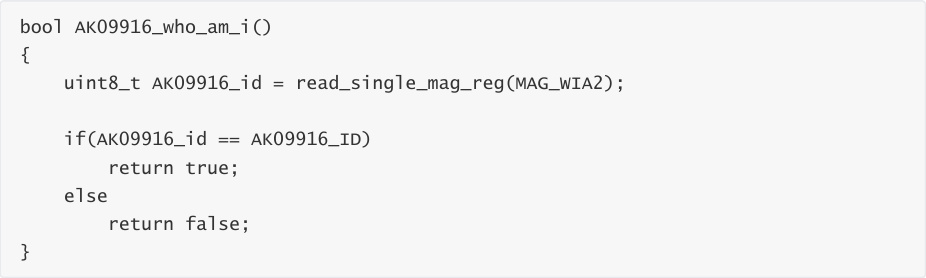


Read raw data from the magnetometer.


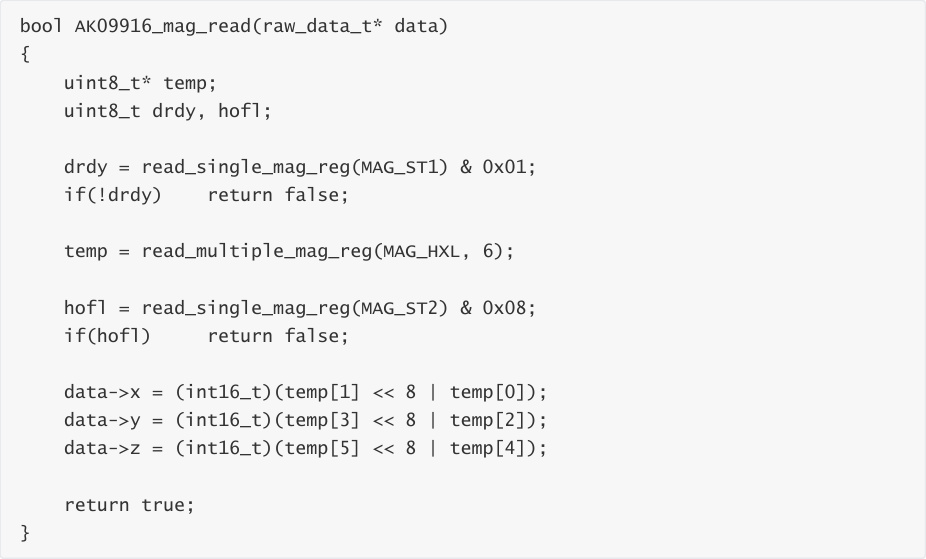


Read scaled magnetometer data.


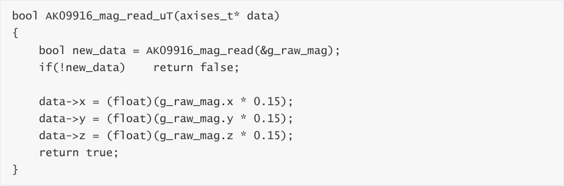


Call ICM20948_Read_Data_Handle to read and print relevant data.


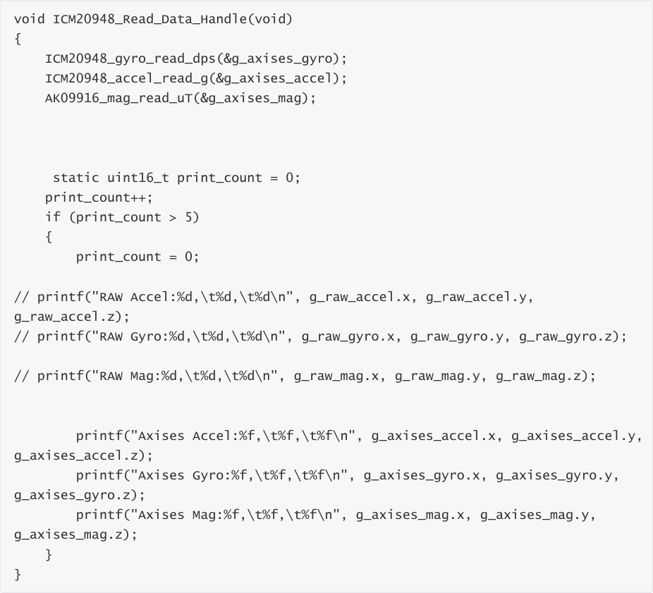


## 4. Compile, download and burn firmware
Select the project to be compiled in the file management interface of STM32CUBEIDE and click the

compile button on the toolbar to start compiling.


If there are no errors or warnings, the compilation is complete.


Press and hold the BOOT0 button, then press the RESET button to reset, release the BOOT0

button to enter the serial port burning mode. Then use the serial port burning tool to burn the

firmware to the board.


If you have STlink or JLink, you can also use STM32CUBEIDE to burn the firmware with one click,

which is more convenient and quick.

## 5. Experimental Results
The MCU_LED light flashes every 200 milliseconds.


Connect the control board to the computer via a Type-C data cable, open the serial port assistant

(specific parameters are shown in the figure below), and you can see that the serial port assistant

will display and print the relevant data of Accel Gyro Mag.


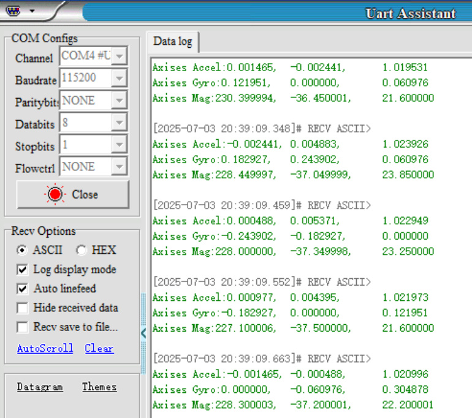
