# Driving RGB light strips
Driving RGB light strips

1. Experimental Purpose

2. Hardware Connection

3. Core code analysis

4. Compile, download and burn firmware

5. Experimental Results

## 1. Experimental Purpose
Learn how to control a WS2812 RGB light strip using the SPI functionality of the STM32 controller

board.

## 2. Hardware Connection
As shown in the figure below, the STM32 control board has an integrated RGB interface, but you

need to connect an additional RGB light strip. You need to prepare your own RGB light strip and

connect the type-C data cable to the computer and the USB Connect interface of the STM32

control board.


The RGB light strip is driven by the WS2812 chip, and the circuit design uses SPI+DMA to simulate

the WS2812 control timing to drive the RGB light strip.


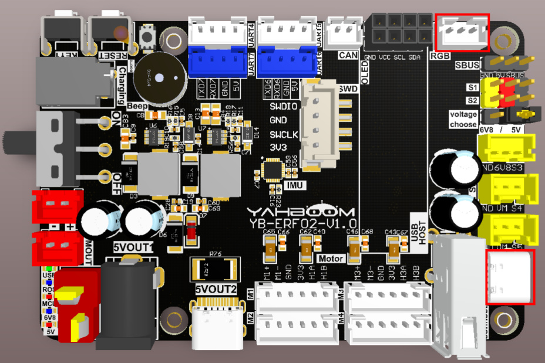
## 3. Core code analysis
The path corresponding to the program source code is:


According to the pin assignment, the signal pin of the RGB light strip is connected to PE6 (SPI4
MOSI), so the SPI4 is initialized to master mode. The clock frequency of SPI4 is 120MHz, divided by

32, so the final communication frequency of SPI4 is 3.75Mhz.


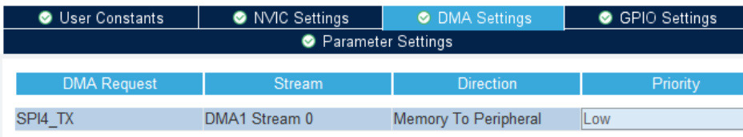

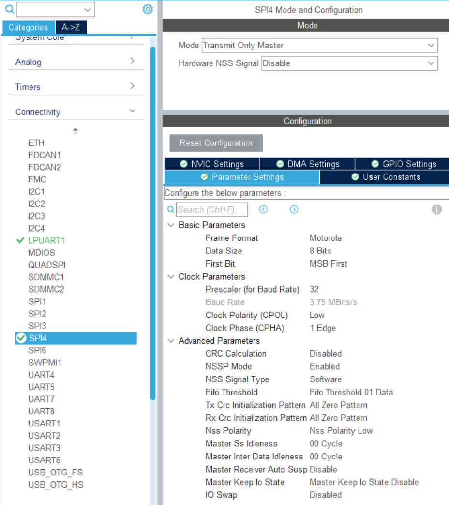
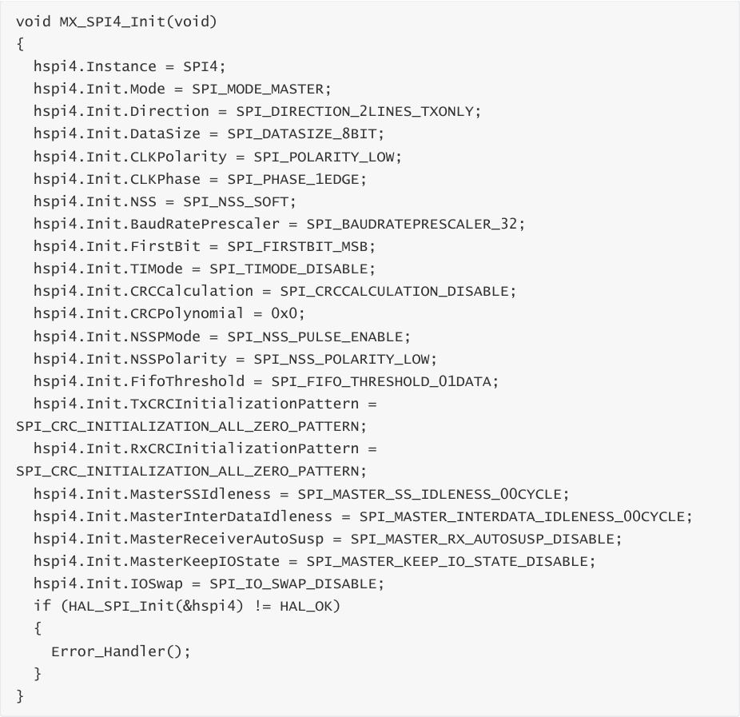


According to the timing requirements of ws2812, SPI's 4-bit data is used to simulate ws2812's

one-bit data. 0x0E represents the ws2812's "1" code, and 0x08 represents the ws2812's "0" code.


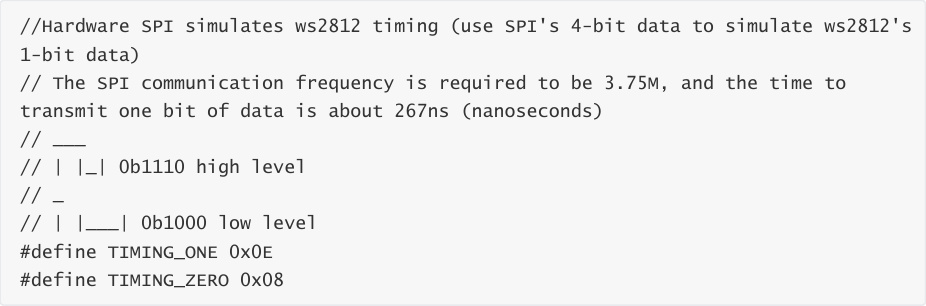


Define a structure to cache the data of the RGB light strip.

```
 #define RGB_CTRL_ALL 0xFF

 #define MAX_RGB 8

 #define RGB_BIT_WIDTH 4

 #define RGB_BIT_SIZE (RGB_BIT_WIDTH*3)

 #define RGB_RESET_WIDTH 100

```

```
 typedef struct rgb_ws2812

 {

 uint8_t reset[RGB_RESET_WIDTH];

 union

 {

 uint8_t Buff[RGB_BIT_SIZE];

 struct

 {

 uint8_t G[RGB_BIT_WIDTH]; // G First

 uint8_t R[RGB_BIT_WIDTH]; // R Second

 uint8_t B[RGB_BIT_WIDTH]; // B Third

 } RGB;

 } Strip[MAX_RGB];

 } ws2812_t;

```

Convert RGB color values into ws2812 structure data.


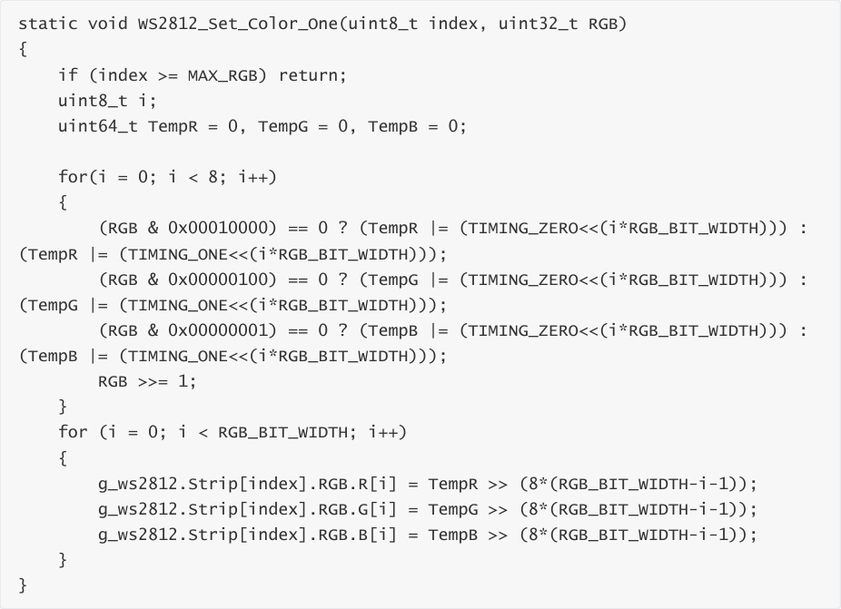


There are two ways to set the color of the RGB light strip. The first is to write the merged color

data, and the second is to write the RGB values separately.

```
 void RGB_Set_Color_U32(uint8_t index, uint32_t color)

 {

 if (index < MAX_RGB)

 {

 WS2812_Set_Color_One(index, color);

 return;

 }

 if (index == RGB_CTRL_ALL)

 {

 for (uint16_t i = 0; i < MAX_RGB; i++)

 {

 WS2812_Set_Color_One(i, color);

```

```
 }

 }

 }

 void RGB_Set_Color(uint8_t index, uint8_t r, uint8_t g, uint8_t b)

 {

 uint32_t color = r << 16 | g << 8 | b;

 RGB_Set_Color_U32(index, color);

 }

```

SPI transmits data to the RGB light strip to update the color of the RGB light strip. This function

must be called after each modification of the RGB light strip color to send the cached data of the

ws2812 structure to the RGB light strip via SPI.


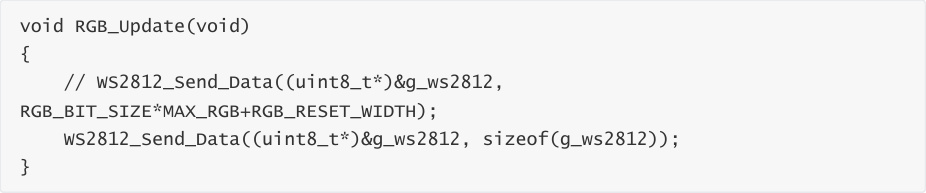


Start the computer and control the color change of the RGB light bar.

```
 void App_Handle(void)

 {

 RGB_Init();

 while (1)

 {

 rgb_count++;

 if (rgb_count > 100)

 {

 rgb_count = 0;

 rgb_color = (rgb_color + 1) % 5;

 printf("color:%d\n", rgb_color);

 if (rgb_color == 0)

 {

 RGB_Clear();

 RGB_Update();

 }

 else if (rgb_color == 1)

 {

 RGB_Clear();

 RGB_Set_Color(RGB_CTRL_ALL, 0xFF, 0x00, 0x00);

 RGB_Update();

 }

 else if (rgb_color == 2)

 {

 RGB_Clear();

 RGB_Set_Color(RGB_CTRL_ALL, 0x00, 0xFF, 0x00);

 RGB_Update();

 }

 else if (rgb_color == 3)

 {

 RGB_Clear();

 RGB_Set_Color(RGB_CTRL_ALL, 0x00, 0x00, 0xFF);

```

```
 RGB_Update();

 }

 else if (rgb_color == 4)

 {

 RGB_Clear();

 RGB_Set_Color(RGB_CTRL_ALL, 0xFF, 0xFF, 0xFF);

 RGB_Update();

 }

 }

 App_Led_Mcu_Handle();

 HAL_Delay(10);

 }

 }

## 4. Compile, download and burn firmware
```

Select the project to be compiled in the file management interface of STM32CUBEIDE and click the

compile button on the toolbar to start compiling.


If there are no errors or warnings, the compilation is complete.


Press and hold the BOOT0 button, then press the RESET button to reset, release the BOOT0

button to enter the serial port burning mode. Then use the serial port burning tool to burn the

firmware to the board.


If you have STlink or JLink, you can also use STM32CUBEIDE to burn the firmware with one click,

which is more convenient and quick.

## 5. Experimental Results
The MCU_LED light flashes every 200 milliseconds.


The RGB light strip updates the color of the RGB light strip every second, and the color sequence

is red, green, blue, white and off.


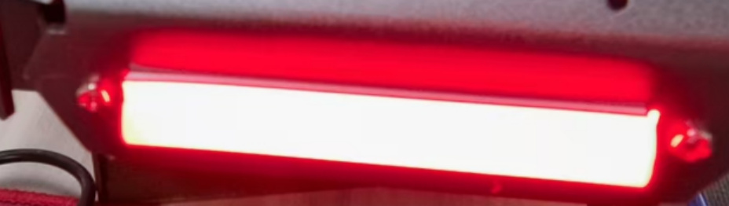

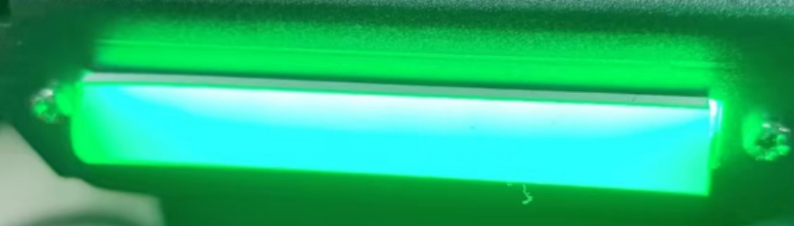

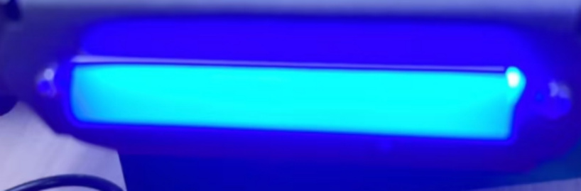

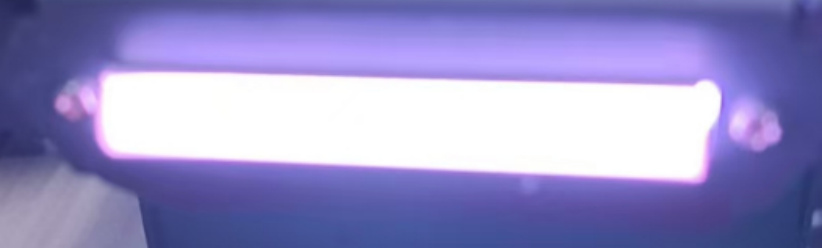
