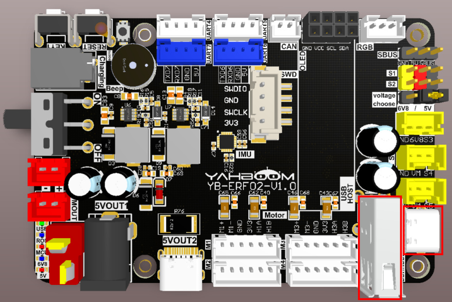
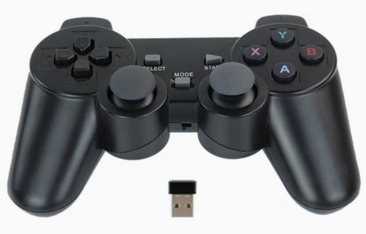
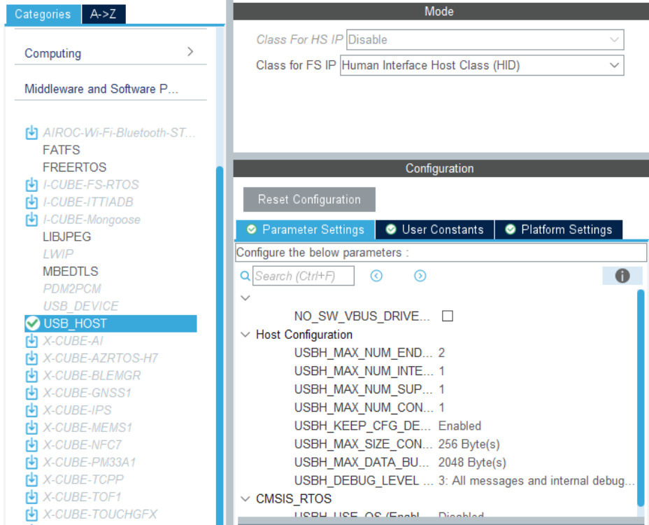
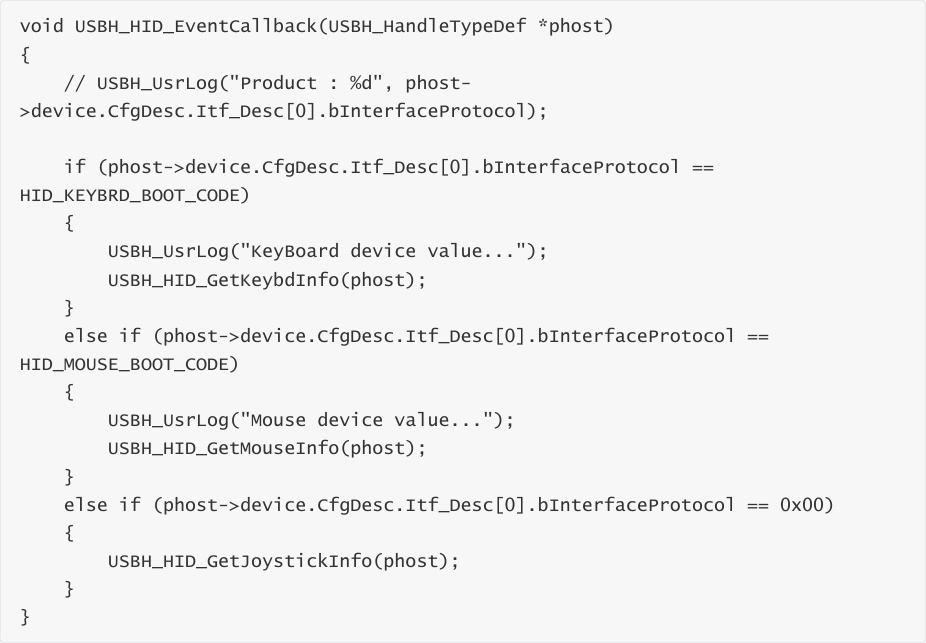
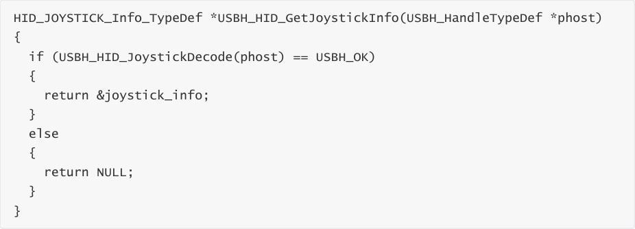
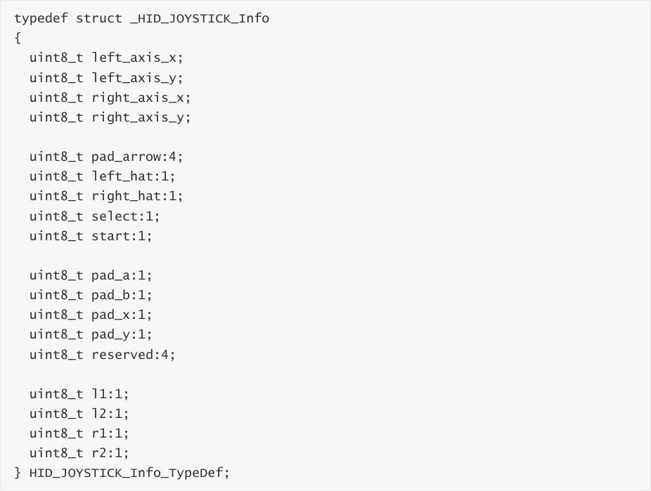
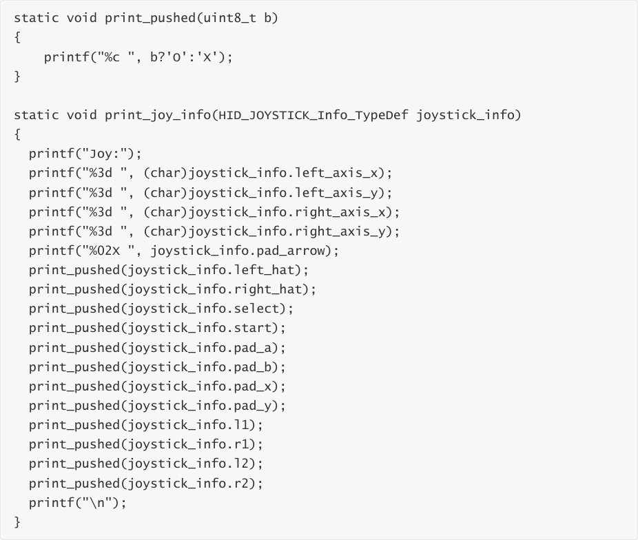
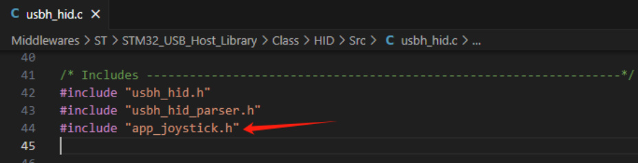
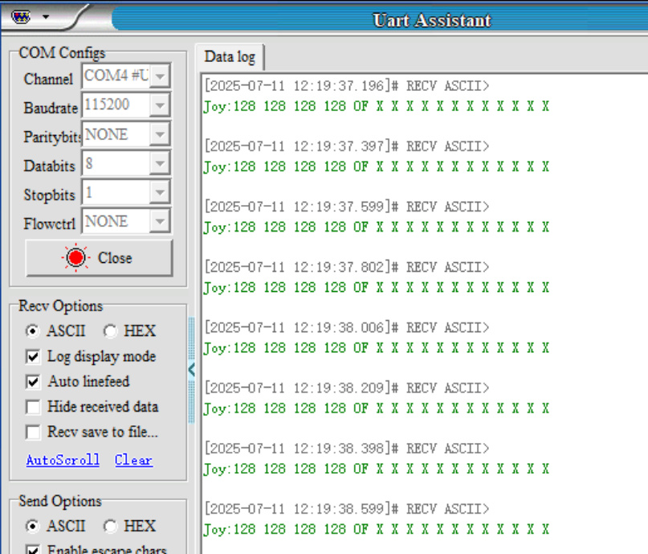

# USB controller remote control
USB controller remote control

1. Experimental Purpose

2. Hardware Connection

3. Core code analysis

4. Compile, download and burn firmware

5. Experimental Results

## 1. Experimental Purpose
Learn to use the USB host function of the STM32 control board to receive and parse data from the

USB controller.

## 2. Hardware Connection
As shown in the figure below, the STM32 control board integrates a USB host interface. Insert the

USB handle receiver into the USB host interface on the control board. The USB handle receiver

and wireless handle must be prepared by yourself.


Please connect the type-C data cable to the computer and the USB Connect port of the STM32

control board.


Schematic diagram of wireless controller and USB controller receiver




## 3. Core code analysis
The path corresponding to the program source code is:


According to the pin assignment, USB-DP is connected to PA12 and USB-DM is connected to PA11.


According to the USB_HOST component provided by STM32CUBEIDE, configure USB to HID mode.




Get the controller data in the USB interrupt callback function.





If the data is read successfully, the joystick_info structure data is returned.





The joystick_info structure stores the current status of the controller. The data printed later is

sorted in this order.





If the controller data is read and parsed successfully, the current value of the controller will be

printed out.

```
 static USBH_StatusTypeDef USBH_HID_JoystickDecode(USBH_HandleTypeDef *phost)

 {

 HID_HandleTypeDef *HID_Handle = (HID_HandleTypeDef *) phost->pActiveClass
 >pData;

 static uint32_t prev_time = 0;

 if (HID_Handle->length == 0U)

 {

 return USBH_FAIL;

 }

 /*Fill report */

```

```
if (USBH_HID_FifoRead(&HID_Handle->fifo, &joystick_report_data, HID_Handle
>length) == HID_Handle->length)

{

uint8_t* p = (uint8_t*)joystick_report_data;

uint8_t is_diff=0;

for(uint8_t i=0;i<HID_Handle->length/4;i++) {

if(old_report_data[i] != joystick_report_data[i]) {

is_diff = 1;

}

}

if(!is_diff && ((HAL_GetTick() - prev_time) < MIN_JOY_SEND_TIME_MS)) {

return USBH_OK;

}

prev_time = HAL_GetTick();

memcpy(old_report_data, p, HID_Handle->length);

#ifdef DEBUG_JOY_RAW_INFO

print_raw_data(HID_Handle);

#endif

/*Decode report */

joystick_info.pad_arrow = (uint8_t)HID_ReadItem((HID_Report_ItemTypedef *)

&prop_pad, 0U) & 0x0F;

joystick_info.left_hat = (uint8_t)HID_ReadItem((HID_Report_ItemTypedef *)

&prop_hat_switch_left, 0U) ? 1 : 0;

joystick_info.right_hat = (uint8_t)HID_ReadItem((HID_Report_ItemTypedef *)

&prop_hat_switch_right, 0U) ? 1 : 0;

joystick_info.left_axis_x = (uint8_t)HID_ReadItem((HID_Report_ItemTypedef *)

&prop_x, 0U);

joystick_info.left_axis_y = (uint8_t)HID_ReadItem((HID_Report_ItemTypedef *)

&prop_y, 0U);

joystick_info.right_axis_x = (uint8_t)HID_ReadItem((HID_Report_ItemTypedef *)

&prop_z, 0U);

joystick_info.right_axis_y = (uint8_t)HID_ReadItem((HID_Report_ItemTypedef *)

&prop_rz, 0U);

joystick_info.pad_a = (uint8_t)HID_ReadItem((HID_Report_ItemTypedef *)

&prop_btn_a, 0U) ? 1 : 0;

joystick_info.pad_b = (uint8_t)HID_ReadItem((HID_Report_ItemTypedef *)

&prop_btn_b, 0U) ? 1 : 0;

joystick_info.pad_x = (uint8_t)HID_ReadItem((HID_Report_ItemTypedef *)

&prop_btn_x, 0U) ? 1 : 0;

joystick_info.pad_y = (uint8_t)HID_ReadItem((HID_Report_ItemTypedef *)

&prop_btn_y, 0U) ? 1 : 0;

joystick_info.l1 = (uint8_t)HID_ReadItem((HID_Report_ItemTypedef *)

&prop_btn_l1, 0U) ? 1 : 0;

joystick_info.r1 = (uint8_t)HID_ReadItem((HID_Report_ItemTypedef *)

&prop_btn_r1, 0U) ? 1 : 0;

joystick_info.l2 = (uint8_t)HID_ReadItem((HID_Report_ItemTypedef *)

&prop_btn_l2, 0U) ? 1 : 0;

joystick_info.r2 = (uint8_t)HID_ReadItem((HID_Report_ItemTypedef *)

&prop_btn_r2, 0U) ? 1 : 0;

```

```
 joystick_info.select = (uint8_t)HID_ReadItem((HID_Report_ItemTypedef *)

 &prop_btn_select, 0U) ? 1 : 0;

 joystick_info.start = (uint8_t)HID_ReadItem((HID_Report_ItemTypedef *)

 &prop_btn_start, 0U) ? 1 : 0;

 #ifdef DEBUG_JOY_INFO

 print_joy_info(joystick_info);

 #endif

 return USBH_OK;

 }

 return USBH_FAIL;

 }

```

Print the current status of the controller.





Define JOY_SEND_TIME_MS to manage the timeout period for printing data. If there is no key

change in the handle, print once every 200 milliseconds. If there is a key change in the handle,

print the value immediately.


In the App_Handle function, call MX_USB_HOST_Process cyclically to process the data sent by the

USB handle.

```
 void App_Handle(void)

```

```
 {

 uint32_t lastTick = HAL_GetTick();

 while (1)

 {

 MX_USB_HOST_Process();

 if (HAL_GetTick() - lastTick >= 10)

 {

 lastTick = HAL_GetTick();

 App_Loop_10ms();

 }

 }

 }

```

Since USB_HOST is automatically generated by the STM32CUBEIDE component, if you regenerate

the code, you need to add the import of the app_joystick.h header file in the

Middlewares\ST\STM32_USB_Host_Library\Class\HID\Src\usbh_hid.c file.

## 4. Compile, download and burn firmware
Select the project to be compiled in the file management interface of STM32CUBEIDE and click the

compile button on the toolbar to start compiling.


If there are no errors or warnings, the compilation is complete.


Press and hold the BOOT0 button, then press the RESET button to reset, release the BOOT0

button to enter the serial port burning mode. Then use the serial port burning tool to burn the

firmware to the board.


If you have STlink or JLink, you can also use STM32CUBEIDE to burn the firmware with one click,

which is more convenient and quick.





## 5. Experimental Results
The MCU_LED light flashes every 200 milliseconds.


Open the Serial Port Assistant (specific parameters are shown in the figure below) and you'll see

data from each channel of the USB controller continuously printed out. When you manually

toggle the joystick or button on the USB wireless controller, the data changes accordingly, with "X"

indicating release and "O" indicating press. For the button order, see the

HID_JOYSTICK_Info_TypeDef structure parameters.


Note: If the USB wireless controller is not used for a period of time, it will enter a dormant state.

At this time, you need to press the START button to activate the controller before operating the

controller to see any value changes.



