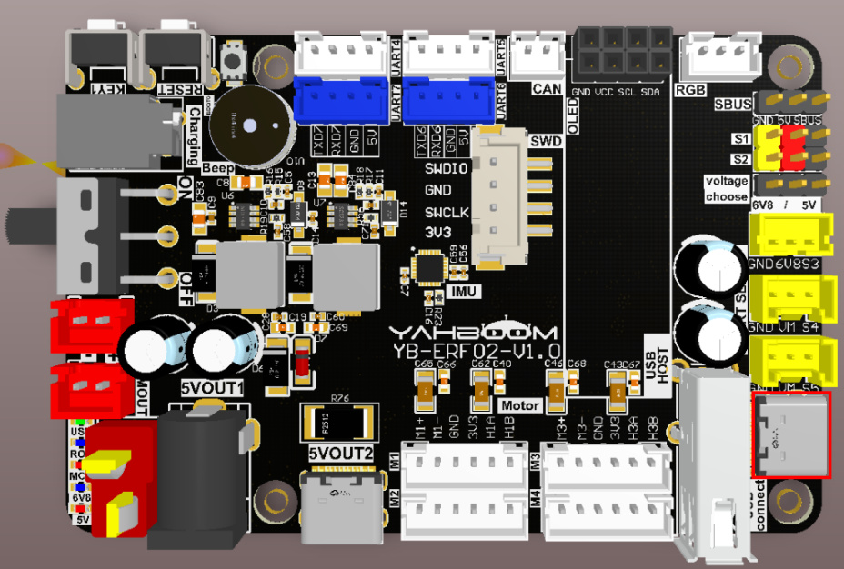
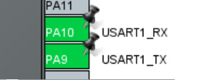
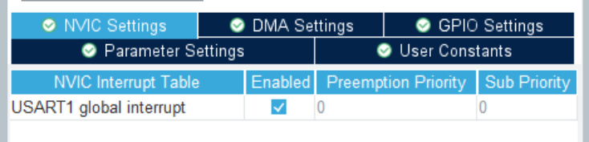
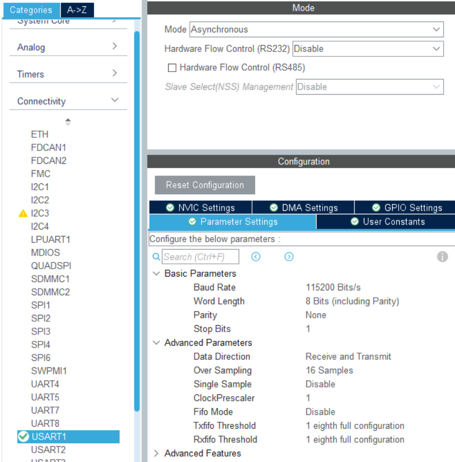
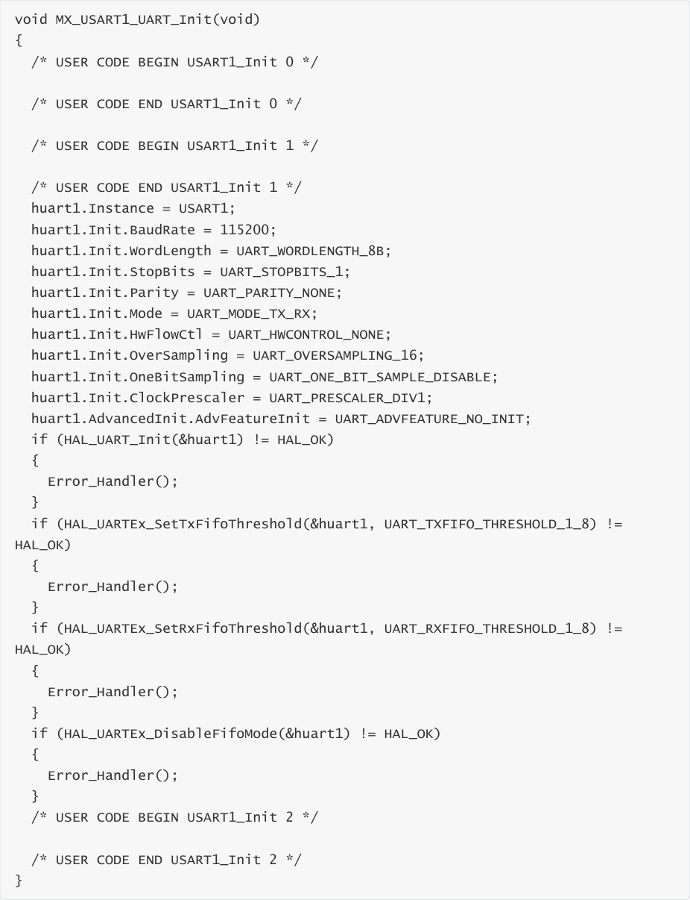
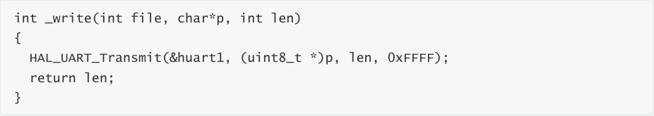
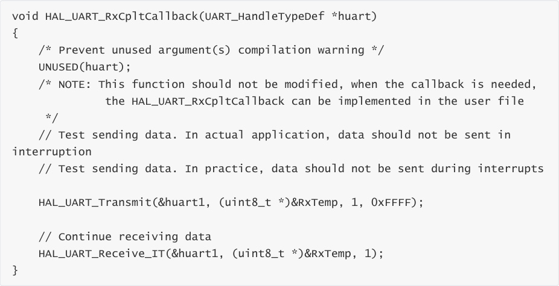
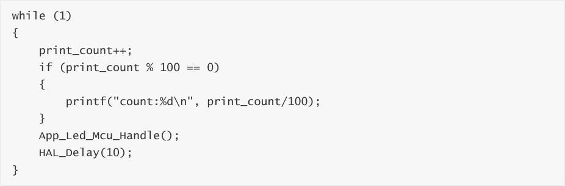
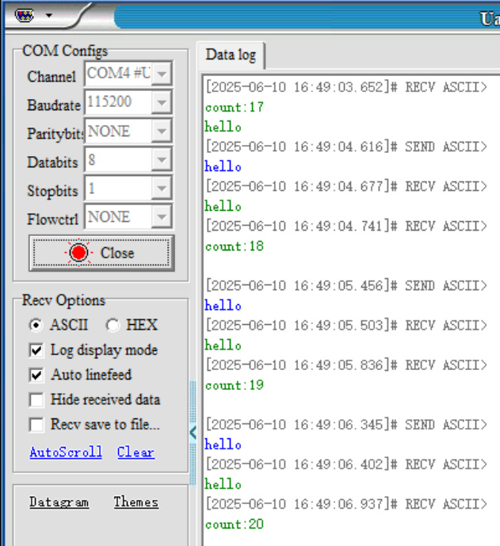

# Serial communication
Serial communication

1. Experimental Purpose

2. Hardware Connection

3. Core code analysis

4. Compile, download and burn firmware

5. Experimental Results

## 1. Experimental Purpose
Use the serial port on the STM32 control board to learn how to receive and send data.

## 2. Hardware Connection
As shown in the figure below, the CP2104 serial port chip is an onboard component, so no

external devices are required. Please connect the Type-C data cable between the computer and

the USB Connect port on the STM32 control board.

If the CP2104 serial port driver is not installed, please open the browser and enter the following

URL to download, decompress and install it.

## 3. Core code analysis
The path corresponding to the program source code is:

Here we take serial port 1 as an example. UART1_TXD of serial port 1 corresponds to hardware

PA9, UART1_RXD corresponds to hardware PA10, and the baud rate is set to 115200, 8-bit data, 1

stop bit, and no parity check.

Note: PA9/PA10 can also be used as multiplexed pins, redirecting their function to the low-power

serial port LPUART1.

Redefine the printf function to print data to serial port 1.

Enable serial port interrupt request data.

Receive serial port data and then print it out through the serial port.

Loop function that prints a string of characters every second.

## 4. Compile, download and burn firmware
Select the project to be compiled in the file management interface of STM32CUBEIDE and click the

compile button on the toolbar to start compiling.

If there are no errors or warnings, the compilation is complete.

Press and hold the BOOT0 button, then press the RESET button to reset, release the BOOT0

button to enter the serial port burning mode. Then use the serial port burning tool to burn the

firmware to the board.

If you have STlink or JLink, you can also use STM32CUBEIDE to burn the firmware with one click,

which is more convenient and quick.

## 5. Experimental Results
The MCU_LED light flashes every 200 milliseconds.

Connect the control board to the computer via a Type-C data cable, open the serial port assistant

(specific parameters are shown in the figure below), and you can see that the serial port assistant

will display print count:xx, and the count value will automatically increase by 1 per second.

The serial port assistant sends the character hello, and the expansion board will automatically

return the character hello.

