# PID control of motor speed
PID control of motor speed

1. Experimental Purpose

2. Hardware Connection

3. Core code analysis

4. Compile, download and burn firmware

5. Experimental Results

## 1. Experimental Purpose
Use the encoder motor interface of the STM32 control board to learn how to use the number of

motor encoder pulses combined with the PID algorithm to control the speed of the motor.

## 2. Hardware Connection
As shown in the figure below, the STM32 control board integrates four encoder motor control

interfaces. This requires additional connection to an encoder motor. The motor control interface

supports 520 encoder motors. Because encoder motors require high voltage and current, they

must be powered by a battery.


Use a type-C data cable to connect the computer USB and the USB Connect port of the STM32

control board.


The corresponding names of the four motor interfaces are: left front wheel -> M1, left rear wheel
- M2, right front wheel -> M3, right rear wheel -> M4.


## 3. Core code analysis
The path corresponding to the program source code is:


The encoder motor hardware configuration is a combination of motor and encoder settings.


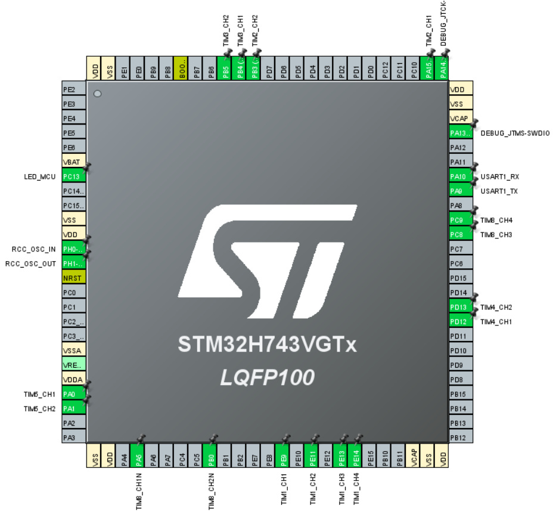

This time, the incremental PID algorithm is used to control the motor. A motor_pid_t structure is

defined to store PID related parameters. A motor_data_t structure is defined to store motor

speed related parameters.


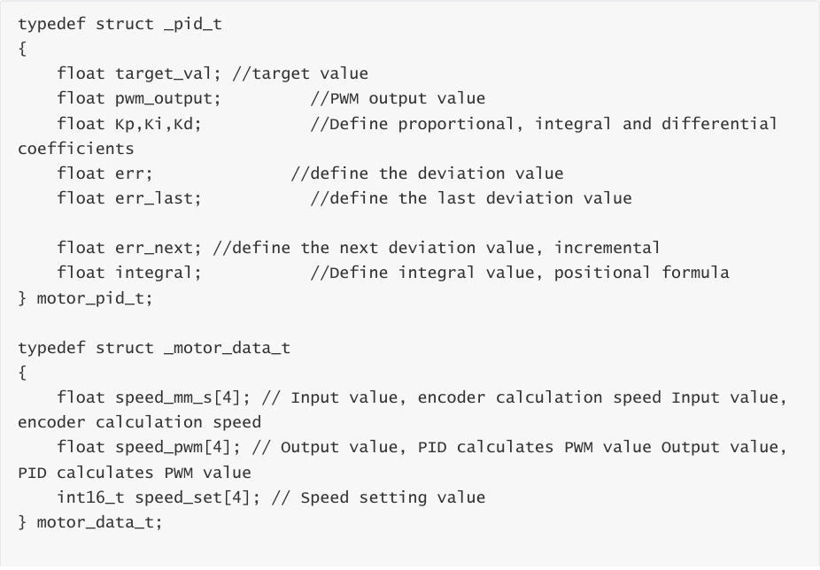


When the motors are initialized, the PID parameters of the four motors are set to the default

values.


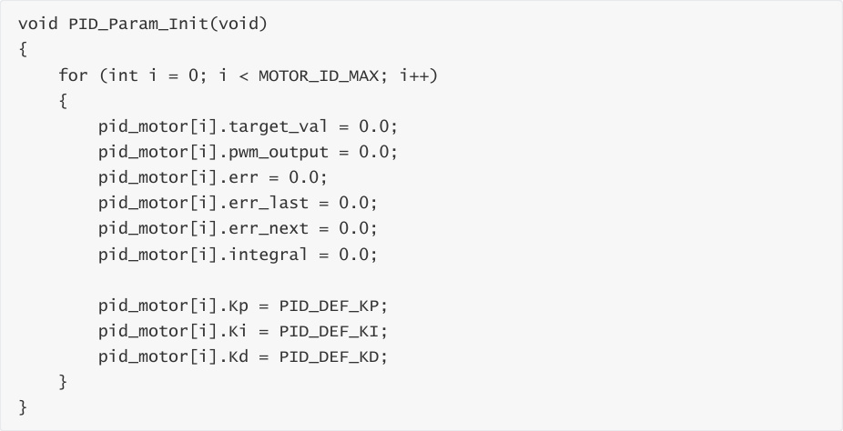


Implementation function of the incremental PID algorithm.


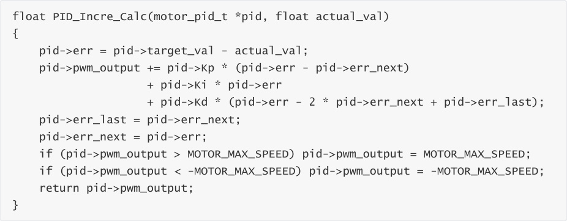


The speed parameter obtained by the motor encoder is passed in, and the PWM value of the

motor is calculated using the incremental PID algorithm.


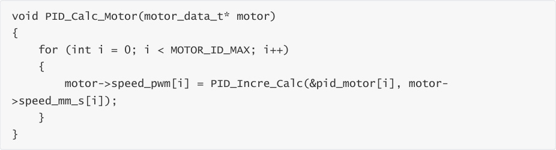


Set the PID target value.

```
 void PID_Set_Motor_Target(uint8_t motor_id, float target)

 {

 if (motor_id > MOTOR_ID_MAX) return;

 if (motor_id == MOTOR_ID_MAX)

```

```
 {

 for (int i = 0; i < MOTOR_ID_MAX; i++)

 {

 pid_motor[i].target_val = target;

 }

 }

 else

 {

 pid_motor[motor_id].target_val = target;

 }

 }

```

Clear PID parameters.


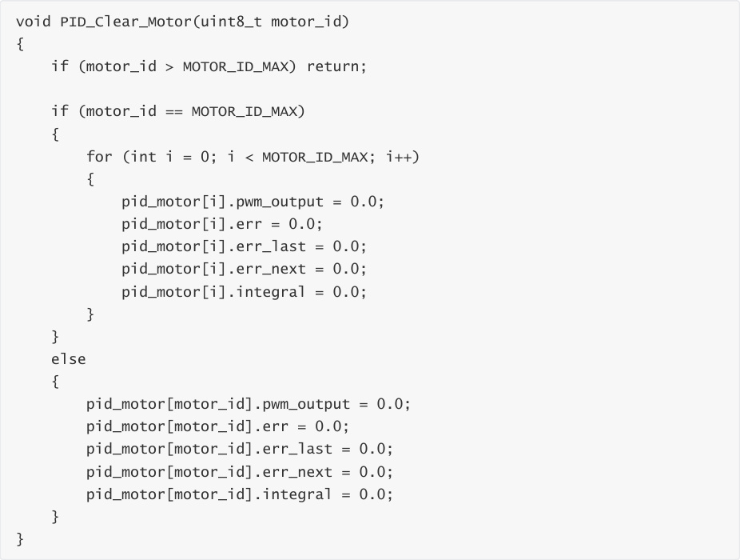


Set the encoder motor's operating speed and convert the motor speed parameter into a PID

target parameter value. The motor speed parameter range is related to the encoder motor and

wheels. For example, the speed_m value range is [-700, 700].


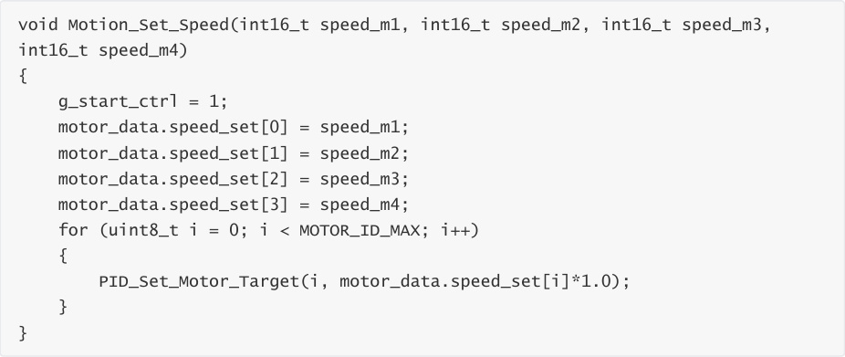


Read the motor speed, calculate the motor speed based on the data captured by the encoder and

the circumference of the wheel, and save the speed value to the speed_motors variable.


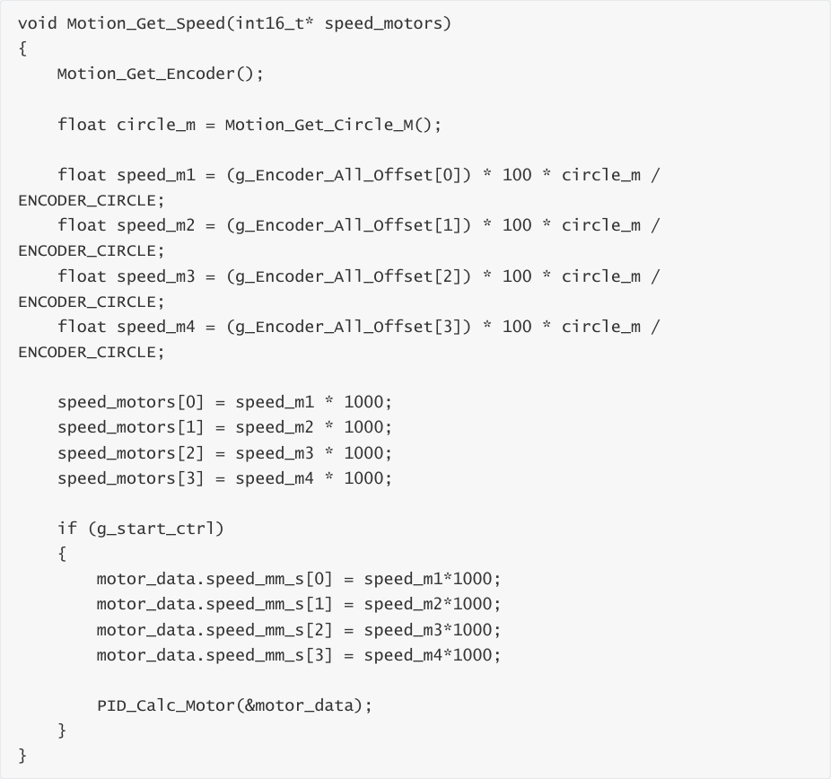


The Motion_Handle function is called every 10 milliseconds in the loop to read, calculate, and

control the motor speed. To facilitate display, the function of printing the motor speed value

through the serial port is added.


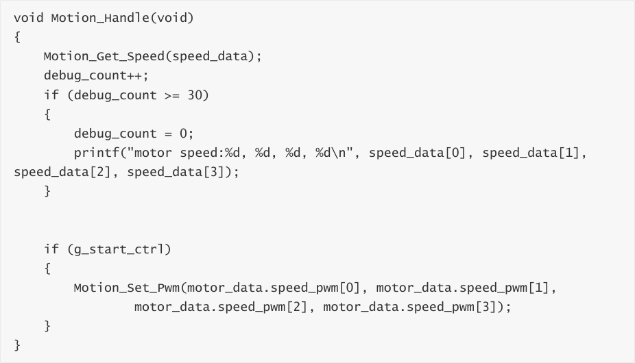


Initialize the encoder motor and PID parameters in App_Handle, and then set the speed of the

four motors to 300, indicating a forward speed of 0.3m/s.


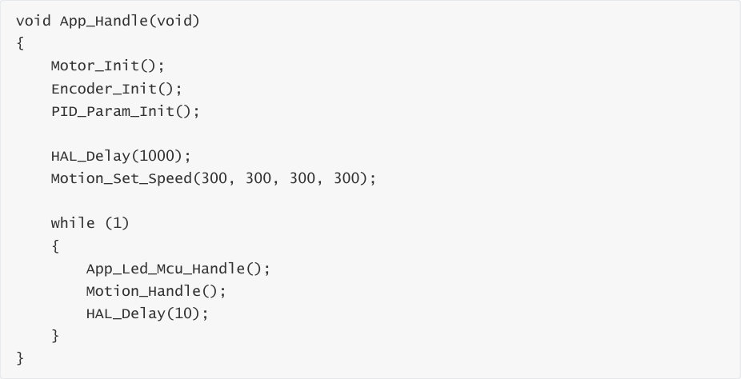


## 4. Compile, download and burn firmware
Select the project to be compiled in the file management interface of STM32CUBEIDE and click the

compile button on the toolbar to start compiling.


If there are no errors or warnings, the compilation is complete.


Press and hold the BOOT0 button, then press the RESET button to reset, release the BOOT0

button to enter the serial port burning mode. Then use the serial port burning tool to burn the

firmware to the board.


If you have STlink or JLink, you can also use STM32CUBEIDE to burn the firmware with one click,

which is more convenient and quick.


## 5. Experimental Results
**Note: Since the motor starts moving after the program is downloaded, please suspend the**

**car or motor in the air first to avoid the car running around.**


The MCU_LED light flashes every 200 milliseconds.


The car moves forward at a speed of 0.3m/s.


Open the serial port assistant and check that the four motors are running at around 300, which is

normal.


Regarding the speed deviation issue: Due to the differences between each motor and hardware

issues such as encoder capture accuracy, the PID algorithm is a dynamic process in adjusting the

motor PWM, so as long as the speed is close to the set value, it is considered normal.


At this point, you can add some resistance to the wheels to see if the PID algorithm can maintain

the speed of the car normally. If it can still be maintained near the set value after adding

resistance, it is normal.


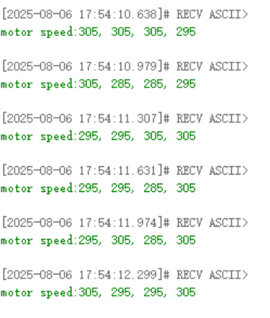
