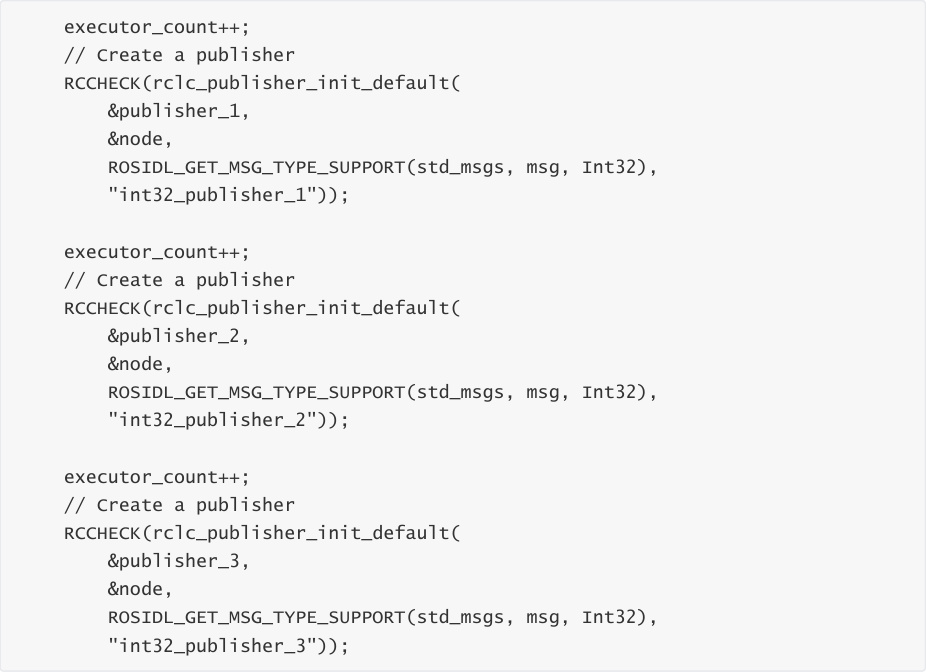
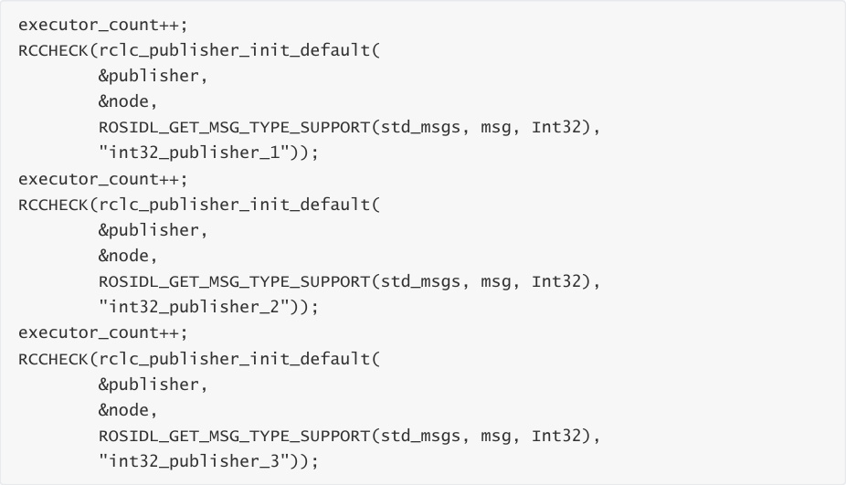
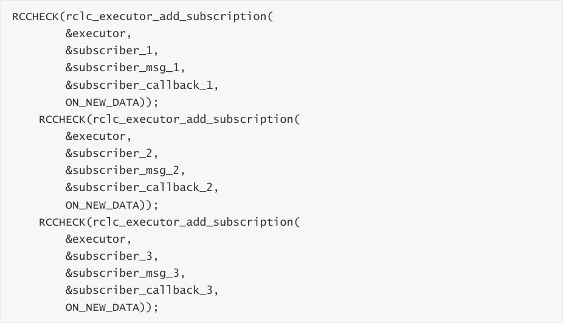
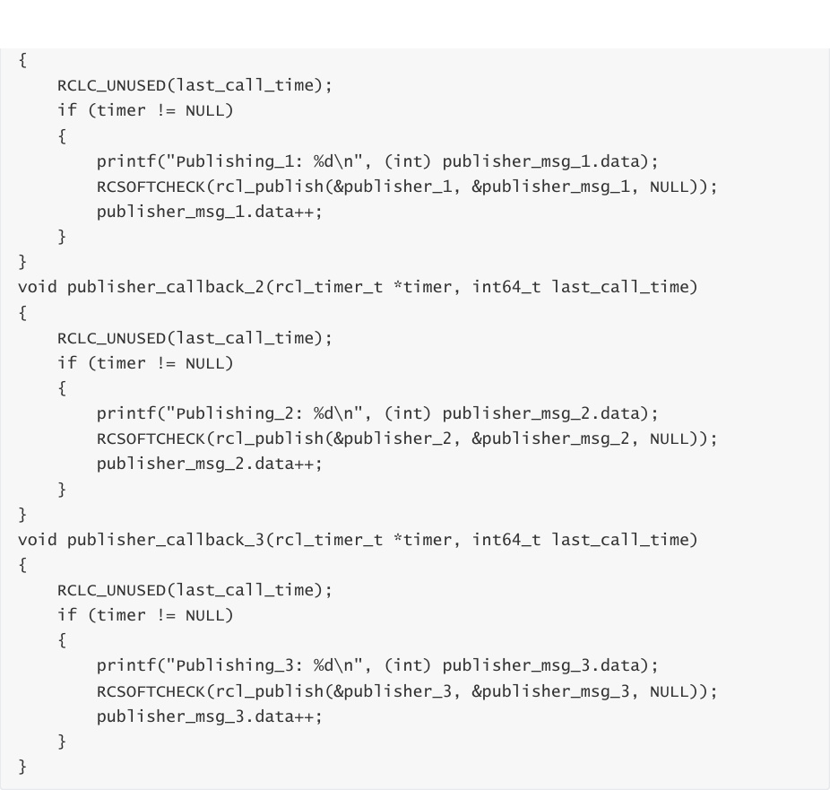
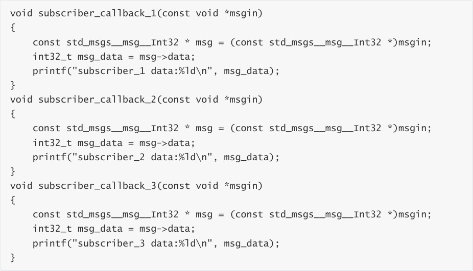

# Multi-topic subscription and publishing
Multi-topic subscription and publishing

1. Experimental Purpose

2. Hardware Connection

3. Core code analysis

4. Compile, download and burn firmware

5. Experimental Results

## 1. Experimental Purpose
Learn about the STM32-microROS component, access the ROS2 environment, and subscribe to

and publish multiple int32 topics.

## 2. Hardware Connection
As shown in the figure below, the STM32 control board integrates the STM32H743 chip and can

use the microros framework program.


Please connect the Type-C data cable to the USB port of the main control board and the USB

Connect port of the STM32 control board.


If you have a USB-to-serial module such as CH340, you can connect to the serial port assistant to

view debugging information.


Since ROS2 requires the Ubuntu environment, it is recommended to install Ubuntu22.04 and

ROS2 environment on the main control board.


Note: There are many types of main control boards. Here we take the Jetson Orin series main

control board as an example, with the default factory image burned.

## 3. Core code analysis
The virtual machine path corresponding to the program source code is:


Create three publishers with message type of Int32.




Create three timers.

```
 #definePUBLISHER_TIMEOUT_1 (1000)

 #definePUBLISHER_TIMEOUT_2 (800)

 #definePUBLISHER_TIMEOUT_3 (500)

 RCCHECK(rclc_timer_init_default(

 &publisher_timer_1,

 &support,

 RCL_MS_TO_NS(PUBLISHER_TIMEOUT_1),

 publisher_callback_1));

 RCCHECK(rclc_timer_init_default(

 &publisher_timer_2,

 &support,

 RCL_MS_TO_NS(PUBLISHER_TIMEOUT_2),

 publisher_callback_2));

 RCCHECK(rclc_timer_init_default(

 &publisher_timer_3,

```

```
 &support,

 RCL_MS_TO_NS(PUBLISHER_TIMEOUT_3),

 publisher_callback_3));

```

Create three subscribers, and the message type is Int32.


Adds a publisher's timer to the executor.





Adding subscribers to the executor





The publisher timer's timing callback function is processed.

```
 void publisher_callback_1(rcl_timer_t *timer, int64_t last_call_time)

```




The subscriber's receiving callback function is processed.





Call rclc_executor_spin_some in a loop to make microros work properly.


## 4. Compile, download and burn firmware
Select the project to be compiled in the file management interface of STM32CUBEIDE and click the

compile button on the toolbar to start compiling.


If there are no errors or warnings, the compilation is complete.


Since the Type-C communication serial port used by the microros agent is multiplexed with the

burning serial port, it is recommended to use the STlink tool to burn the firmware.


If you are using the serial port to burn, you need to first plug the Type-C data cable into the

computer's USB port, enter the serial port download mode, burn the firmware, and then plug it

back into the USB port of the main control board.

## 5. Experimental Results
The MCU_LED light flashes every 200 milliseconds.


The functional operation is similar to the single topic subscription and publishing functions,

except that the topic name is different.


If the proxy is not enabled on the main control board terminal, enter the following command to

enable it. If the proxy is already enabled, disable it and then re-enable it.


After the connection is successful, three nodes and three subscribers are created.


Open another terminal and view the /YB_Example_Node node.


Publish a message with the int data 123 to the topic /subscriber_1.


Publish a message with the int data value 456 to the topic /subscriber_2.


Publish a message with the integer value 789 to the topic /subscriber_3.


You can see the corresponding information printed on the serial port assistant, indicating that the

subscription is successful.


Check the frequency of /publisher_1, /publisher_2, and /publisher_3 topics


Press Ctrl+C to end the command.


Subscribe to data from topics /int32_publisher_1, /int32_publisher_2, and /int32_publisher_3


Press Ctrl+C to end the command.
