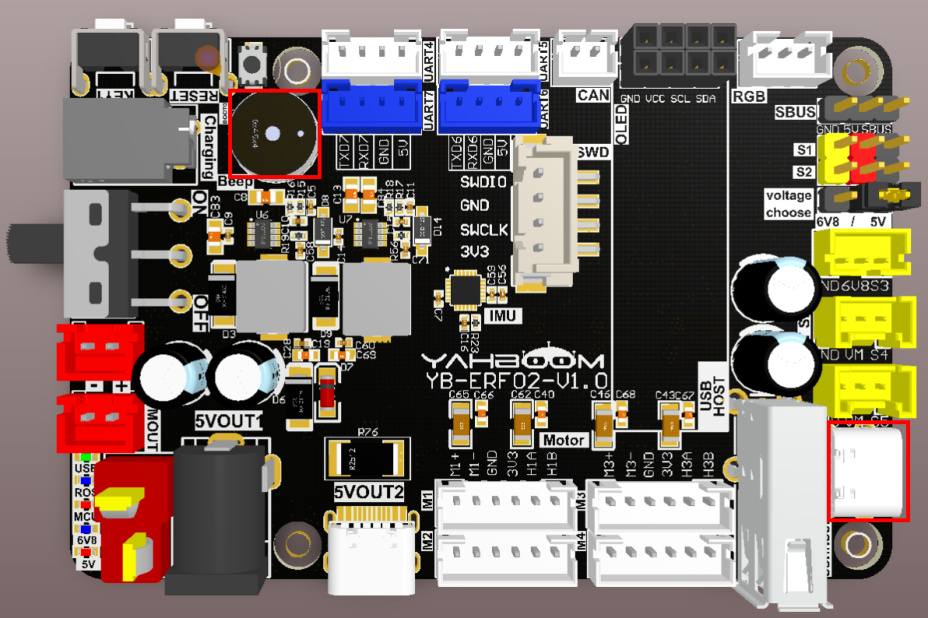
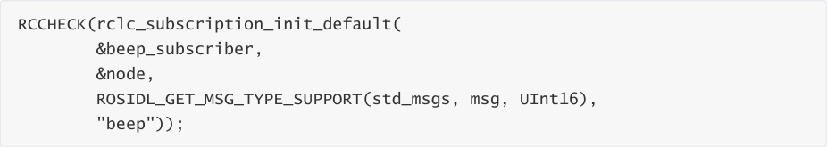
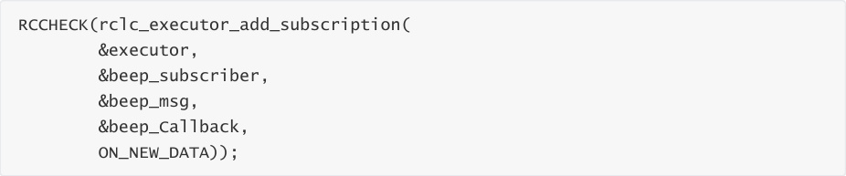
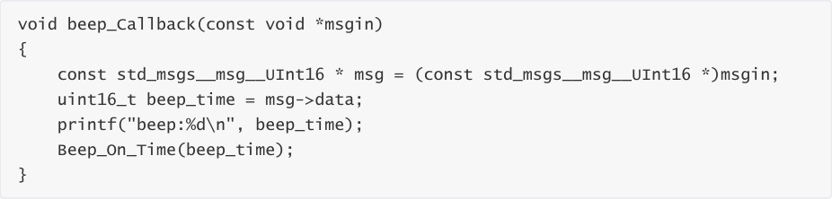
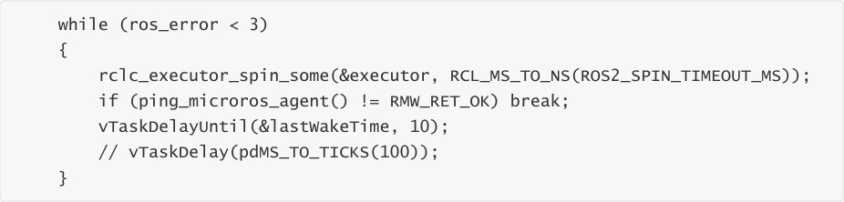
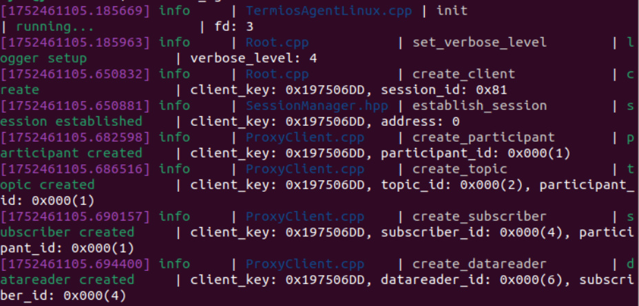
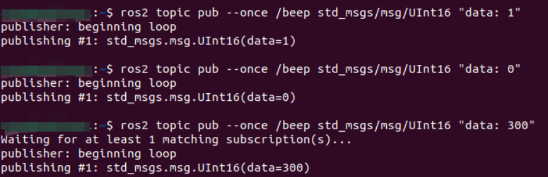

# Subscribe to the buzzer topic
Subscribe to the buzzer topic

1. Experimental Purpose

2. Hardware Connection

3. Core code analysis

4. Compile, download and burn firmware

5. Experimental Results

## 1. Experimental Purpose
Learn about the STM32-microROS component, access the ROS2 environment, and subscribe to

the topic of controlling the buzzer switch.

## 2. Hardware Connection
As shown in the figure below, the STM32 control board integrates an active buzzer.

Use a Type-C data cable to connect the USB port of the main control board and the USB Connect

port of the STM32 control board.

Since ROS2 requires the Ubuntu environment, it is recommended to install Ubuntu22.04 and

ROS2 environment on the main control board.

Note: There are many types of main control boards. Here we take the Jetson Orin series main

control board as an example, with the default factory image burned.

## 3. Core code analysis
The virtual machine path corresponding to the program source code is:

Create a subscriber beep, the message type is UInt16.

Add a subscriber beep to the executor.

The buzzer receives data callback function and controls the buzzer switch.

Call rclc_executor_spin_some in a loop to make microros work properly.

## 4. Compile, download and burn firmware
Select the project to be compiled in the file management interface of STM32CUBEIDE and click the

compile button on the toolbar to start compiling.

If there are no errors or warnings, the compilation is complete.

Since the Type-C communication serial port used by the microros agent is multiplexed with the

burning serial port, it is recommended to use the STlink tool to burn the firmware.

If you are using the serial port to burn, you need to first plug the Type-C data cable into the

computer's USB port, enter the serial port download mode, burn the firmware, and then plug it

back into the USB port of the main control board.

## 5. Experimental Results
The MCU_LED light flashes every 200 milliseconds.

If the proxy is not enabled on the main control board terminal, enter the following command to

enable it. If the proxy is already enabled, disable it and then re-enable it.

After the connection is successful, a node and a subscriber are created.

Open another terminal and view the /YB_Example_Node node.

Publish data to the /beep topic to control the buzzer to keep beeping.

Publish data to the /beep topic to turn off the buzzer.

Publish data to the /beep topic to control the buzzer to sound for 300 milliseconds and then turn

off automatically.

