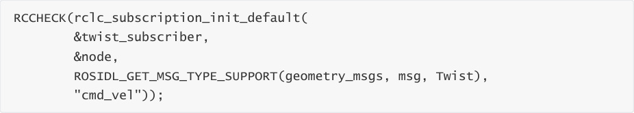
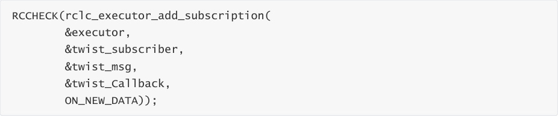
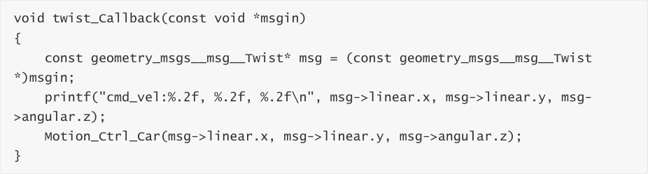
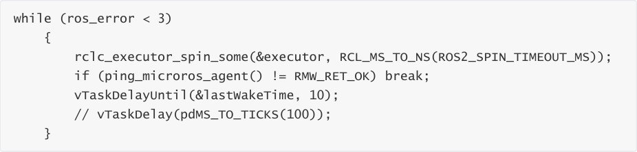
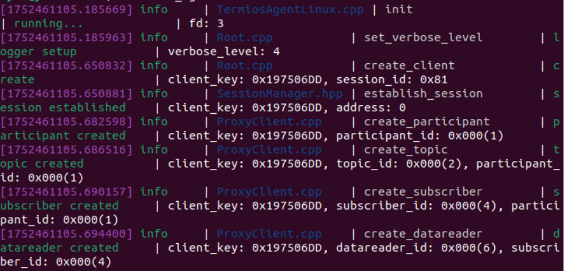
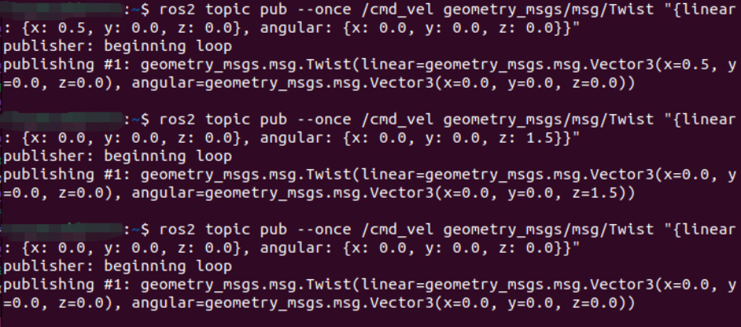

# Subscribe to the speed control topic
Subscribe to the speed control topic

1. Experimental Purpose

2. Hardware Connection

3. Core code analysis

4. Compile, download and burn firmware

5. Experimental Results

## 1. Experimental Purpose
Learn about the STM32-microROS component, access the ROS2 environment, and subscribe to

topics about controlling the car's speed.

## 2. Hardware Connection
As shown in the figure below, the STM32 control board integrates four encoder motor drivers and

interfaces, connecting the four motors to the motor interfaces. The corresponding names of the

four motor interfaces are: left front wheel -> M1, left rear wheel -> M2, right front wheel -> M3,

and right rear wheel -> M4.

Since the encoder motor requires high voltage and high current, it must be powered by a battery.

Use a Type-C data cable to connect the USB port of the main control board and the USB Connect

port of the STM32 control board.

Note: There are many types of main control boards. Here we take the Jetson Orin series main

control board as an example, with the default factory image burned.

## 3. Core code analysis
The virtual machine path corresponding to the program source code is:

Create a subscriber named "cmd_vel" and specify the ROS topic type as

geometry_msgs/msg/Twist.

Add a cmd_vel topic subscriber to the executor.

When the microros subscriber receives the cmd_vel topic data, the twist_Callback callback

function is triggered to control the movement of the robot according to the received value.

Call rclc_executor_spin_some in a loop to make microros work properly.

## 4. Compile, download and burn firmware
Select the project to be compiled in the file management interface of STM32CUBEIDE and click the

compile button on the toolbar to start compiling.

If there are no errors or warnings, the compilation is complete.

Since the Type-C communication serial port used by the microros agent is multiplexed with the

burning serial port, it is recommended to use the STlink tool to burn the firmware.

If you are using the serial port to burn, you need to first plug the Type-C data cable into the

computer's USB port, enter the serial port download mode, burn the firmware, and then plug it

back into the USB port of the main control board.

## 5. Experimental Results
Note: When using ROS2 to control the car's motor, it will rotate. Please place the car in the air first

to prevent it from moving around on the table.

The MCU_LED light flashes every 200 milliseconds.

If the proxy is not enabled on the main control board terminal, enter the following command to

enable it. If the proxy is already enabled, disable it and then re-enable it.

After the connection is successful, a node and a subscriber are created.

Open another terminal and view the /YB_Example_Node node.

Publish data to the /cmd_vel topic to control the robot car to move forward at 0.5m/s.

Publish data to the /cmd_vel topic to control the robot car to rotate at 1.5 rad/s.

Publish data to the /cmd_vel topic to control the robot car to stop.

