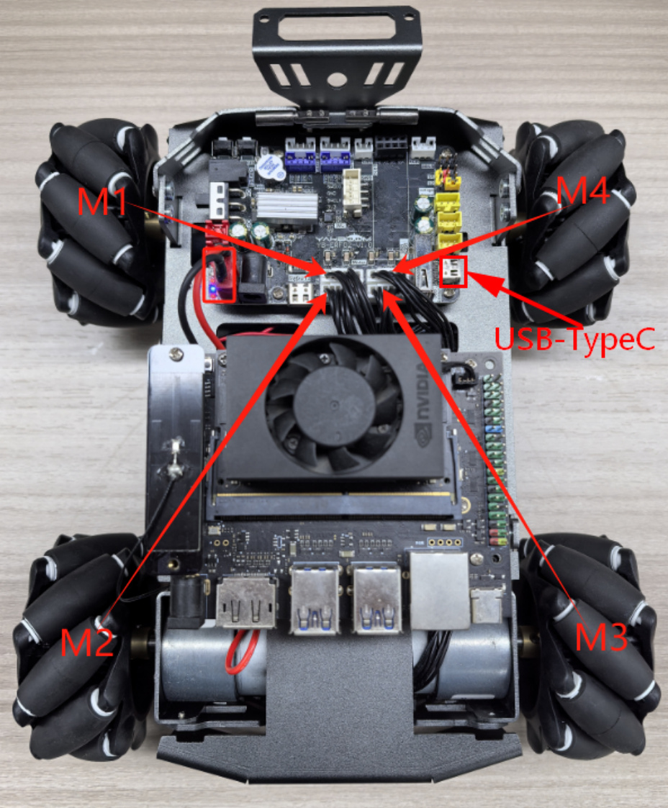
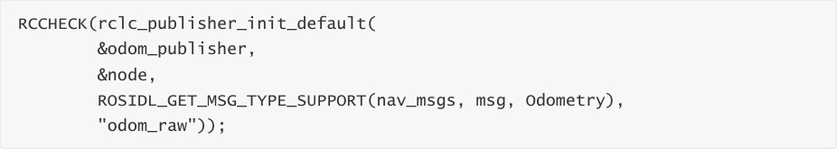
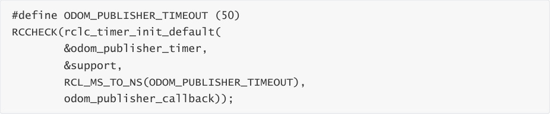
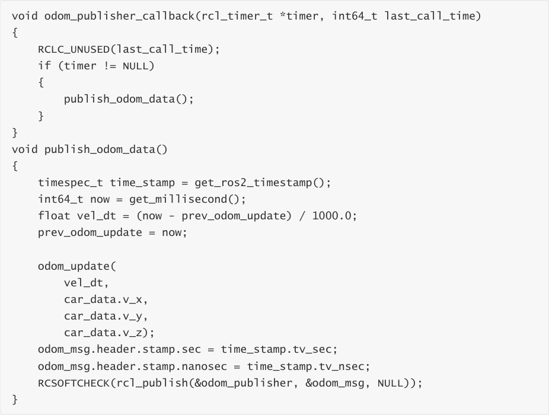
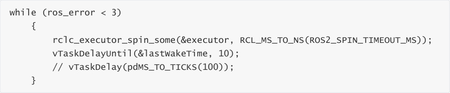
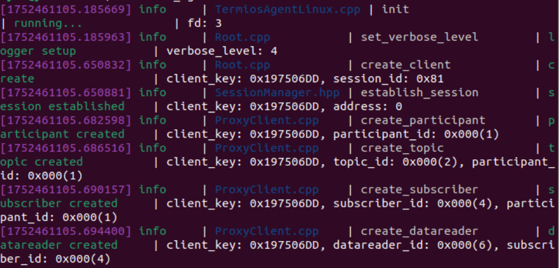
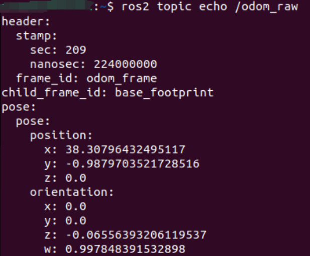
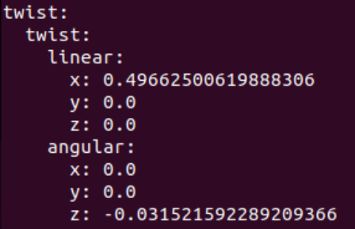
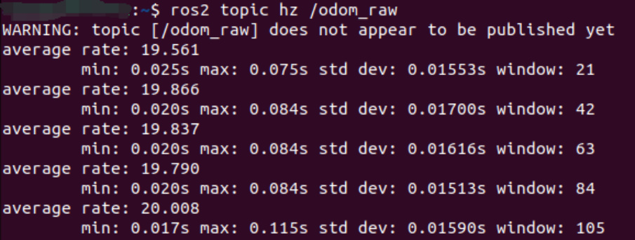

# Release speed topic
Release speed topic

1. Experimental Purpose

2. Hardware Connection

3. Core code analysis

4. Compile, download and burn firmware

5. Experimental Results

## 1. Experimental Purpose
Learn about STM32-microROS components, access the ROS2 environment, and publish a topic on

the robot car's odom speed.

## 2. Hardware Connection
As shown in the figure below, the STM32 control board integrates four encoder motor drivers and

interfaces, connecting the four motors to the motor interfaces. The corresponding names of the

four motor interfaces are: left front wheel -> M1, left rear wheel -> M2, right front wheel -> M3,

and right rear wheel -> M4.


Since the encoder motor requires high voltage and high current, it must be powered by a battery.


Use a Type-C data cable to connect the USB port of the main control board and the USB Connect

port of the STM32 control board.




Note: There are many types of main control boards. Here we take the Jetson Orin series main

control board as an example, with the default factory image burned.

## 3. Core code analysis
The virtual machine path corresponding to the program source code is:


Create the publisher "odom_raw" and specify the publisher's information type as

nav_msgs/msg/Odometry.





Create a publisher timer with a publishing frequency of 11HZ.





Adds the publisher's timer to the executor.


The main function of the odom timer callback function is to update the odom data and send the

data out.





Read the speed from the robot car and update the odom information according to the car speed.

```
 void odom_update(float vel_dt, float linear_vel_x, float linear_vel_y, float

 angular_vel_z)

 {

 float delta_heading = angular_vel_z * vel_dt; // radians

 float cos_h = cos(heading_);

```

```
 float sin_h = sin(heading_);

 float delta_x = (linear_vel_x * cos_h - linear_vel_y * sin_h) * vel_dt; // m

 float delta_y = (linear_vel_x * sin_h + linear_vel_y * cos_h) * vel_dt; // m

 // calculate current position of the robot

 x_pos_ += delta_x;

 y_pos_ += delta_y;

 heading_ += delta_heading;

 // calculate robot's heading in quaternion angle

 // ROS has a function to calculate yaw in quaternion angle

 float q[4];

 odom_euler_to_quat(0, 0, heading_, q);

 // robot's position in x,y, and z

 odom_msg.pose.pose.position.x = x_pos_;

 odom_msg.pose.pose.position.y = y_pos_;

 odom_msg.pose.pose.position.z = 0.0;

 // robot's heading in quaternion

 odom_msg.pose.pose.orientation.x = (double)q[1];

 odom_msg.pose.pose.orientation.y = (double)q[2];

 odom_msg.pose.pose.orientation.z = (double)q[3];

 odom_msg.pose.pose.orientation.w = (double)q[0];

 odom_msg.pose.covariance[0] = 0.001;

 odom_msg.pose.covariance[7] = 0.001;

 odom_msg.pose.covariance[35] = 0.001;

 // linear speed from encoders

 odom_msg.twist.twist.linear.x = linear_vel_x;

 odom_msg.twist.twist.linear.y = linear_vel_y;

 odom_msg.twist.twist.linear.z = 0.0;

 // angular speed from encoders

 odom_msg.twist.twist.angular.x = 0.0;

 odom_msg.twist.twist.angular.y = 0.0;

 odom_msg.twist.twist.angular.z = angular_vel_z;

 odom_msg.twist.covariance[0] = 0.0001;

 odom_msg.twist.covariance[7] = 0.0001;

 odom_msg.twist.covariance[35] = 0.0001;

 }

```

Call rclc_executor_spin_some in a loop to make microros work properly.





## 4. Compile, download and burn firmware
Select the project to be compiled in the file management interface of STM32CUBEIDE and click the

compile button on the toolbar to start compiling.


If there are no errors or warnings, the compilation is complete.


Since the Type-C communication serial port used by the microros agent is multiplexed with the

burning serial port, it is recommended to use the STlink tool to burn the firmware.


If you are using the serial port to burn, you need to first plug the Type-C data cable into the

computer's USB port, enter the serial port download mode, burn the firmware, and then plug it

back into the USB port of the main control board.

## 5. Experimental Results
Note: When using ROS2 to control the car's motor, it will rotate. Please place the car in the air first

to prevent it from moving around on the table.


The MCU_LED light flashes every 200 milliseconds.


If the proxy is not enabled on the main control board terminal, enter the following command to

enable it. If the proxy is already enabled, disable it and then re-enable it.


After the connection is successful, a node, a publisher and a subscriber are created.




Open another terminal and view the /YB_Example_Node node.


Publish data to the /cmd_vel topic to control the robot car to move forward at 0.5m/s.


Subscribe to the data of the /odom_raw topic,


Press Ctrl+C to end the command.





Check the frequency of the /odom_raw topic. A frequency of around 20 Hz is normal.


Press Ctrl+C to end the command.


Publish data to the /cmd_vel topic to control the robot car to stop.



