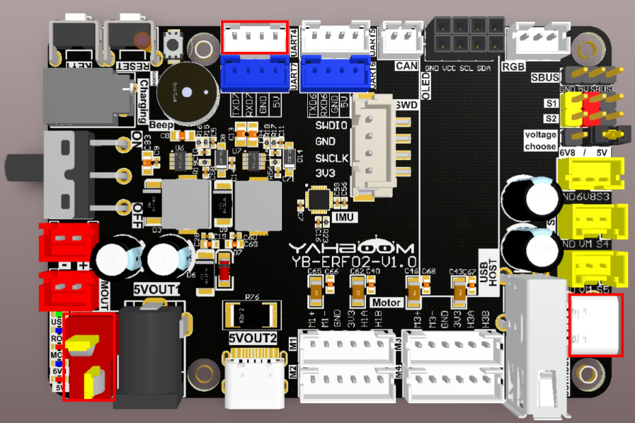
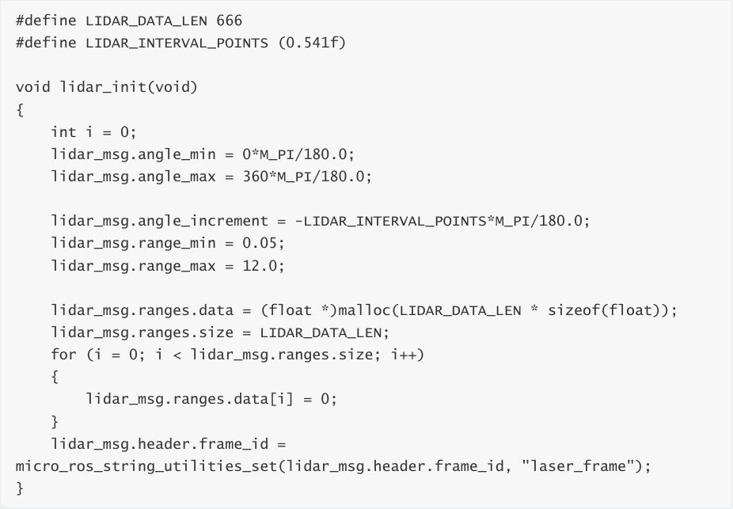
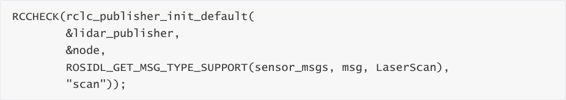
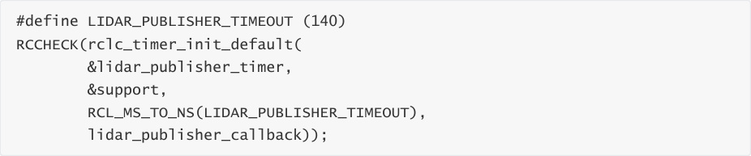
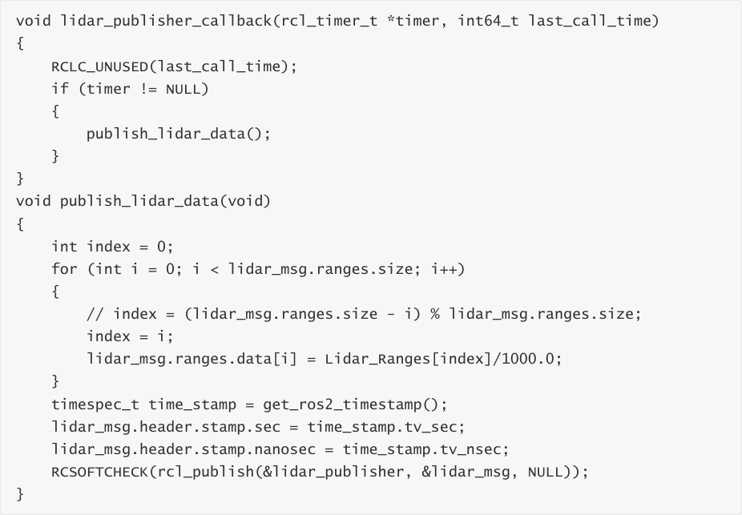
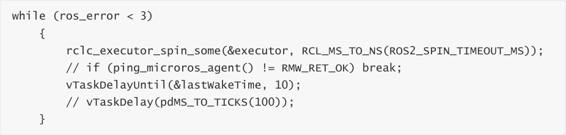
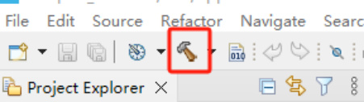
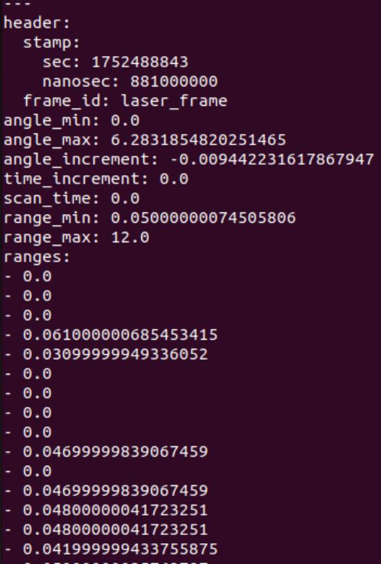
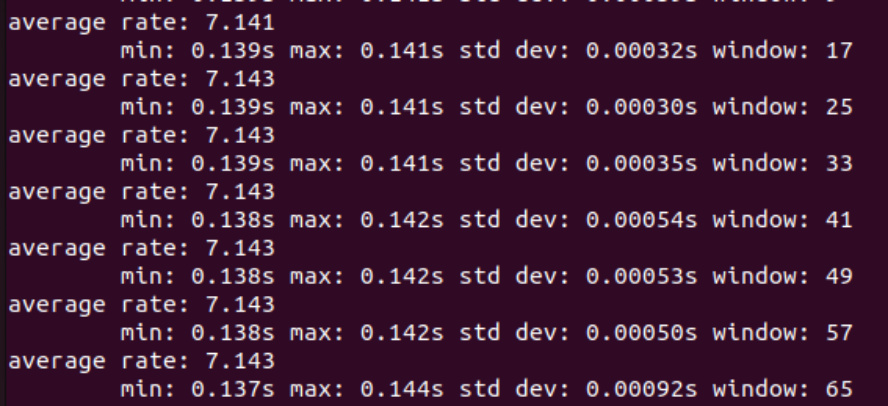
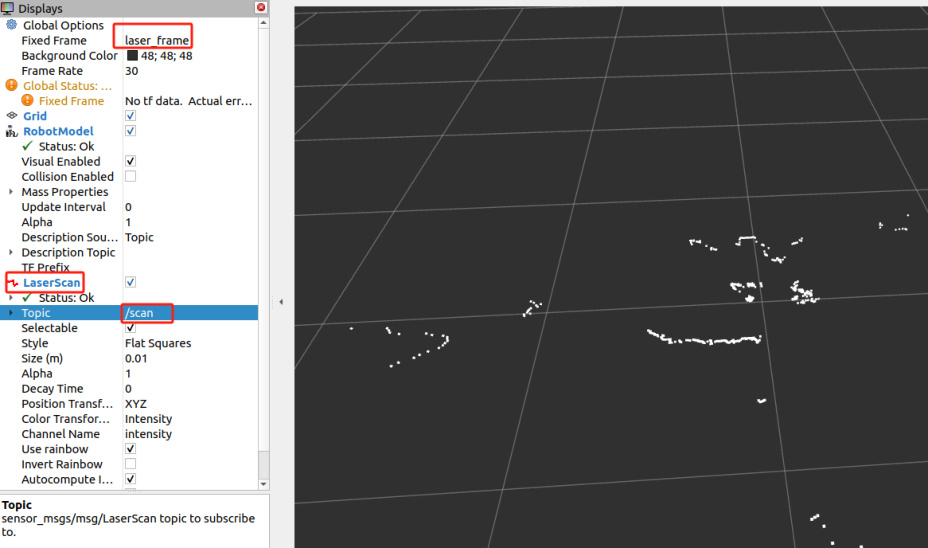

# Publish radar data topic
Publish radar data topic

1. Experimental Purpose

2. Hardware Connection

3. Core code analysis

4. Compile, download and burn firmware

5. Experimental Results

## 1. Experimental Purpose
Learn about STM32-microROS components, access the ROS2 environment, and publish radar data

topics.

## 2. Hardware Connection
As shown in the figure below, the STM32 control board integrates the Tmini-Plus LiDAR serial port

interface, and an external Tmini-Plus LiDAR is required to complete the experiment.

Since the LiDAR requires a large current, it is recommended to use a battery for power supply.

Use a Type-C data cable to connect the USB port of the main control board and the USB Connect

port of the STM32 control board.

Note: There are many types of main control boards. Here we take the Jetson Orin series main

control board as an example, with the default factory image burned.

Note: The M3 Pro series car products come with a Tmini-Plus serial port adapter cable. The

adapter cable has an anti-misinsertion function and can be inserted into the left radar port.

## 3. Core code analysis
The virtual machine path corresponding to the program source code is:

Initialize and publish the lidar information, set the lidar angle to 0 ~ 360, the angle interval to 0.54

degrees, the ranging range to 0.05~12.0 meters, set the frame_id to "laser_frame", and then

decide whether to add the ROS_NAMESPACE prefix based on whether ROS_NAMESPACE is empty.

To create a publisher named "scan", you need to specify the publisher's message type as

sensor_msgs/msg/LaserScan.

Create a publisher timer with a publishing frequency of 7 Hz.

Add the publisher's timer to the executor

The main function of the laser radar timer callback function is to send LaserScan data.

Call rclc_executor_spin_some in a loop to make microros work properly.

## 4. Compile, download and burn firmware
Select the project to be compiled in the file management interface of STM32CUBEIDE and click the

compile button on the toolbar to start compiling.

If there are no errors or warnings, the compilation is complete.

Since the Type-C communication serial port used by the microros agent is multiplexed with the

burning serial port, it is recommended to use the STlink tool to burn the firmware.

If you are using the serial port to burn, you need to first plug the Type-C data cable into the

computer's USB port, enter the serial port download mode, burn the firmware, and then plug it

back into the USB port of the main control board.

## 5. Experimental Results
The MCU_LED light flashes every 200 milliseconds.

If the proxy is not enabled on the main control board terminal, enter the following command to

enable it. If the proxy is already enabled, disable it and then re-enable it.

After the connection is successful, a node and a publisher are created.

Open another terminal and view the /YB_Example_Node node.

Subscribe to/scan topic data,

Press Ctrl+C to end the command.

Check the frequency of the /scan topic. A frequency of about 7 Hz is normal.

Press Ctrl+C to end the command.

To view the visualization, open the rviz2 client, add the LaserScan topic data, set Fixed Frame to

laser_frame, and Topic to /scan. Other parameters are as shown in the figure below.

