# 2、Common commands for docker image
# containers
## 2、Common commands for docker image containers
### 2.1、do not use the sudo command

### 2.2、help commands

### 2.3、mirror command

### 2.4、container commands

### 2.5、common other commands

### 2.6、Command Summary


The operating environment and software and hardware reference configurations are as follows:


REFERENCE MODEL: ROSMASTER X3


Robot hardware configuration: Arm series main control, Silan A1 lidar, AstraPro Plus depth

camera


Robot system: Ubuntu (version not required) + docker (version 20.10.21 and above)


PC Virtual Machine: Ubuntu (20.04) + ROS2 (Foxy)


Usage scenario: Use on a relatively clean 2D plane
### 2.1、do not use the sudo command
Usually, to operate docker commands, you need to add the prefix sudo, as follows:


But after adding the docker user group, you don't need to add the sudo prefix. How to add a docker

user group (run commands in the host running docker):


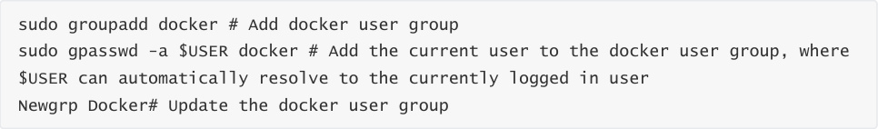


After adding the above command, use the [docker images] command to test, if there is no error, it

means that you can already use the sudo command. If the following error is reported:


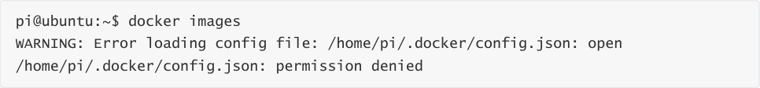


Run the following command on the host to solve the problem:


### 2.2、help commands
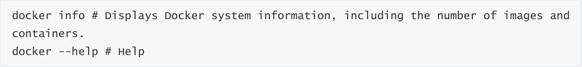


### 2.3、mirror command
1、Docker pull download image


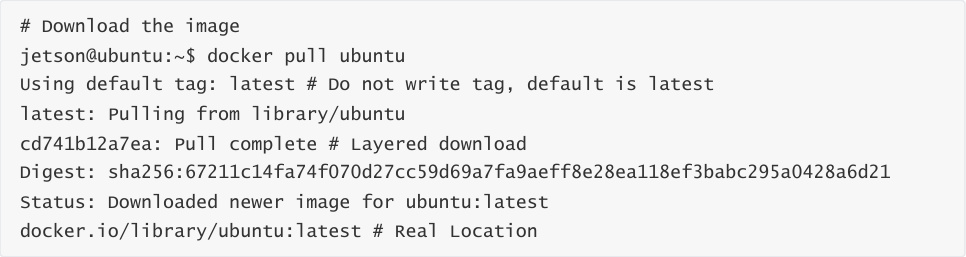


2、Docker images lists the images


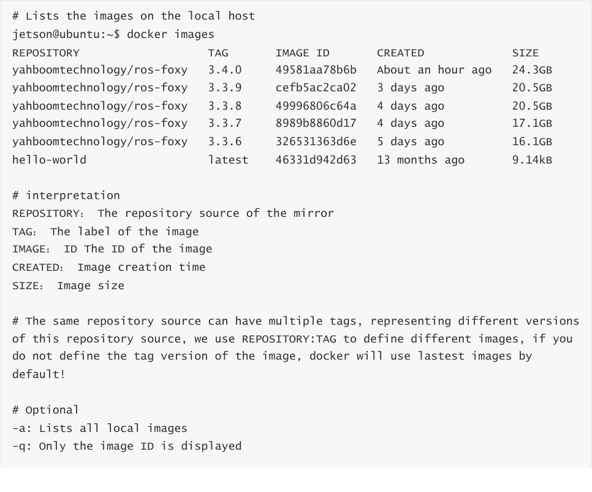


```
 --digests: Displays the summary information of the image

```

3、docker search


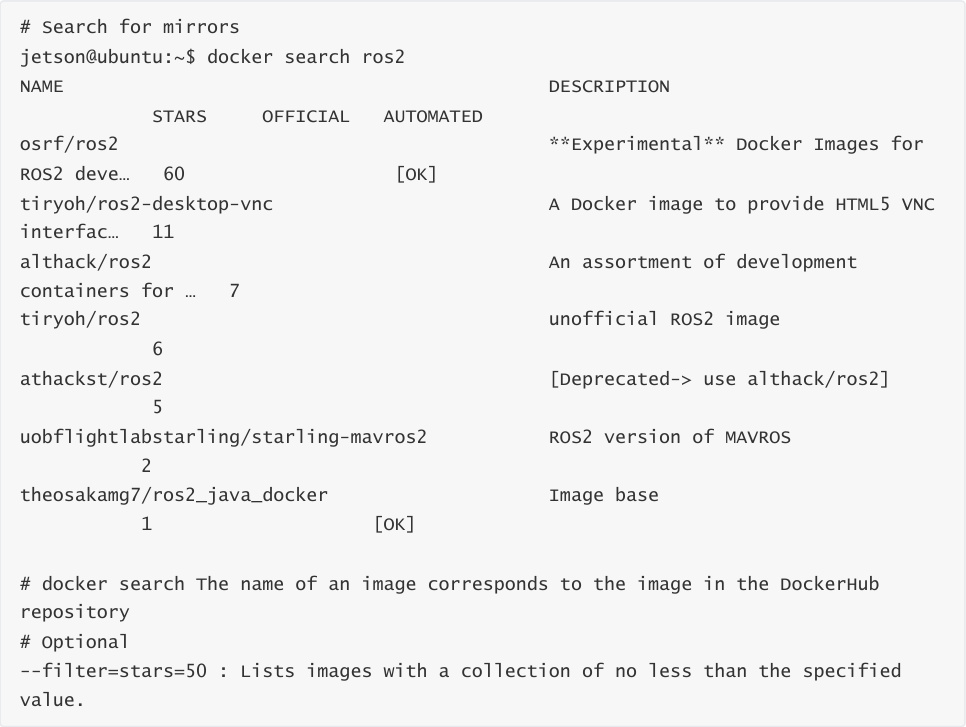


4、docker rmi delete the image


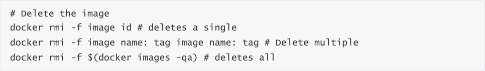


### 2.4、container commands
To create a container with an image, we use the image of ubuntu here to test and download the

image:


1、docker run

```
 # command

 docker run [OPTIONS] IMAGE [COMMAND][ARG...]

 # Description of common parameters

 --name="Name" # Specify a name for the container

```

```
 -d # runs the container in background mode and returns the ID of the container!

 -i # runs the container in interactive mode by using it with -t

 -t # reassigns a terminal to the container, usually used with -i

 -P # random port mapping (uppercase)

 -p # specifies the port mapping (summary), which can generally be written in four

 ways

 ip:hostPort:containerPort

 ip::containerPort

 hostPort:containerPort (commonly used)

 containerPort

 # test

 jetson@ubuntu:~$ docker images

 REPOSITORY          TAG    IMAGE ID    CREATED     SIZE

 yahboomtechnology/ros-foxy  3.4.0   49581aa78b6b  2 hours ago   24.3GB

 yahboomtechnology/ros-foxy  3.3.9   cefb5ac2ca02  3 days ago   20.5GB

 yahboomtechnology/ros-foxy  3.3.8   49996806c64a  4 days ago   20.5GB

 yahboomtechnology/ros-foxy  3.3.7   8989b8860d17  4 days ago   17.1GB

 yahboomtechnology/ros-foxy  3.3.6   326531363d6e  5 days ago   16.1GB

 ubuntu            latest  bab8ce5c00ca  6 weeks ago   69.2MB

 hello-world         latest  46331d942d63  13 months ago  9.14kB

 # Use ubuntu to start the container in interactive mode and execute the /bin/bash

 command inside the container!

 jetson@ubuntu:~$ docker run -it ubuntu:latest /bin/bash

 root@c54bf9efae47:/# ls

 bin boot dev etc home lib media mnt opt proc root run sbin srv sys

 tmp usr var

 root@c54bf9efae47:/# exit    # Use exit to exit the container back to the host

 exit

 jetson@ubuntu:~$

```

2、docker ps


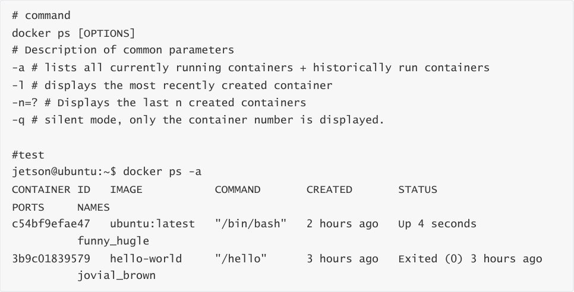


3、Exit the container


4、Multiple terminals enter a running container


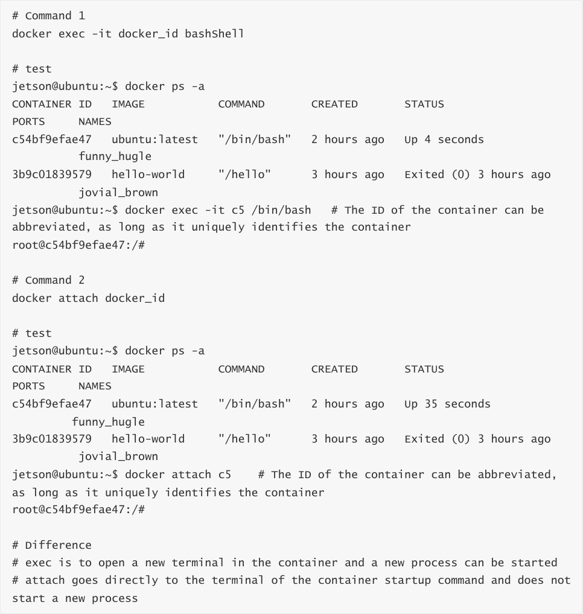


5、Start and stop the container


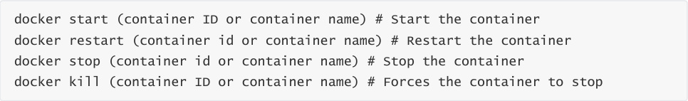


6、Delete the container


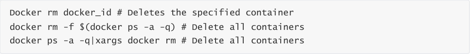


### 2.5、common other commands
1. View the process information running in the container and support ps command parameters.


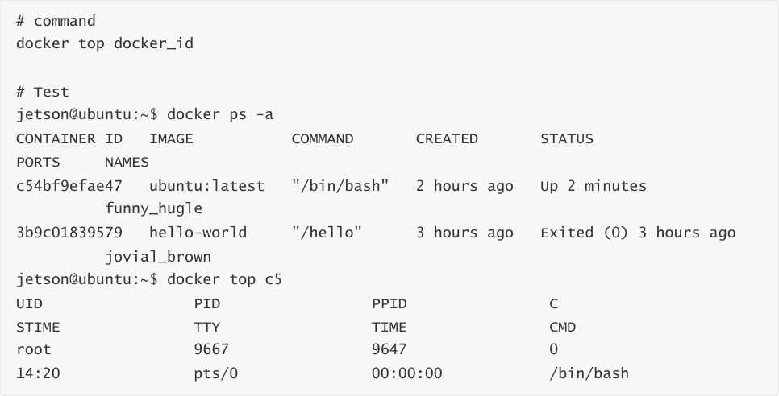


2、View the metadata of the container/image

```
 # Command

 docker inspect docker_id

 # Test viewing container metadata

 jetson@ubuntu:~$ docker ps -a

 CONTAINER ID  IMAGE      COMMAND    CREATED    STATUS

 PORTS   NAMES

 c54bf9efae47  ubuntu:latest  "/bin/bash"  2 hours ago  Up 4 minutes

 funny_hugle

 3b9c01839579  hello-world   "/hello"   3 hours ago  Exited (0) 3 hours ago

 jovial_brown

 jetson@ubuntu:~$ docker inspect c54bf9efae47

 [

 {

 # The complete id, the container ID above here, is the first few digits of

 this ID that were intercepted

 "Id": "c54bf9efae471071391202a8718b346d9af76cb1ff17741e206280603d6f0056",

 "Created": "2023-04-24T04:19:46.232822024Z",

 "Path": "/bin/bash",

 "Args": [],

 "State": {

```

```
"Status": "running",

"Running": true,

"Paused": false,

"Restarting": false,

"OOMKilled": false,

"Dead": false,

"Pid": 9667,

"ExitCode": 0,

"Error": "",

"StartedAt": "2023-04-24T06:20:58.508213216Z",

"FinishedAt": "2023-04-24T06:19:45.096483592Z"

},

# Test viewing image metadata

jetson@ubuntu:~$ docker images

REPOSITORY          TAG    IMAGE ID    CREATED     SIZE

ubuntu            latest  bab8ce5c00ca  6 weeks ago   69.2MB

hello-world         latest  46331d942d63  13 months ago  9.14kB

jetson@ubuntu:~$ docker inspect bab8ce5c00ca

[

{

"Id":

"sha256:bab8ce5c00ca3ef91e0d3eb4c6e6d6ec7cffa9574c447fd8d54a8d96e7c1c80e",

"RepoTags": [

"ubuntu:latest"

],

"RepoDigests": [

"ubuntu@sha256:67211c14fa74f070d27cc59d69a7fa9aeff8e28ea118ef3babc295a0428a6d21"

],

"Parent": "",

"Comment": "",

"Created": "2023-03-08T04:32:41.063980445Z",

"Container":

"094fd0c521be8c84d81524e4a5e814e88a2839899c56f654484d32d171c7195b",

"ContainerConfig": {

"Hostname": "094fd0c521be",

.............

"Labels": {

"org.opencontainers.image.ref.name": "ubuntu",

"org.opencontainers.image.version": "22.04"

}

},

"DockerVersion": "20.10.12",

"Author": "",

"Config": {

"Hostname": "",

.........

"Labels": {

"org.opencontainers.image.ref.name": "ubuntu",

"org.opencontainers.image.version": "22.04"

```

```
 }

 },

 "Architecture": "arm64",

 "Variant": "v8",

 "Os": "linux",

 "Size": 69212233,

 "VirtualSize": 69212233,

 "GraphDriver": {

 "Data": {

 "MergedDir":

 "/var/lib/docker/overlay2/8418b919a02d38a64ab86060969b37b435977e9bbdeb6b0840d4eb6982

 80e796/merged",

 "UpperDir":

 "/var/lib/docker/overlay2/8418b919a02d38a64ab86060969b37b435977e9bbdeb6b0840d4eb6982

 80e796/diff",

 "WorkDir":

 "/var/lib/docker/overlay2/8418b919a02d38a64ab86060969b37b435977e9bbdeb6b0840d4eb6982

 80e796/work"

 },

 "Name": "overlay2"

 },

 "RootFS": {

 "Type": "layers",

 "Layers": [

 "sha256:874b048c963ab55b06939c39d59303fb975d323822a4ea48a02ac8dc635ea371"

 ]

 },

 "Metadata": {

 "LastTagTime": "0001-01-01T00:00:00Z"

 }

 }

 ]

### 2.6、Command Summary
```

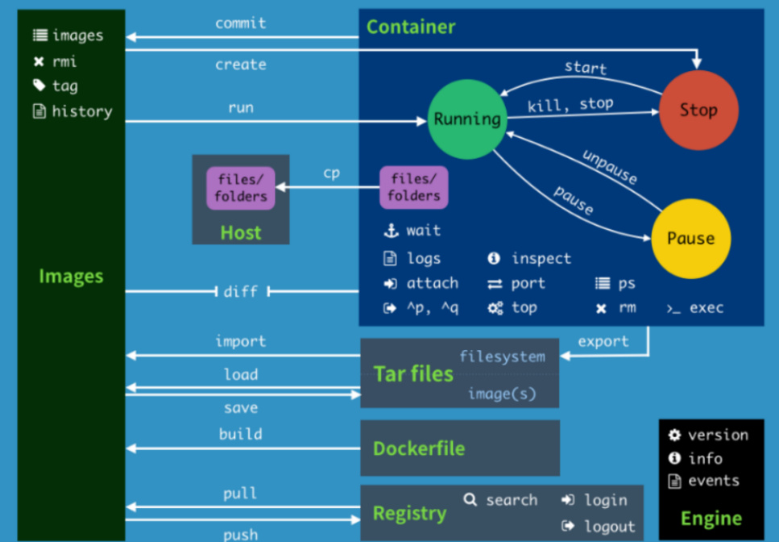
