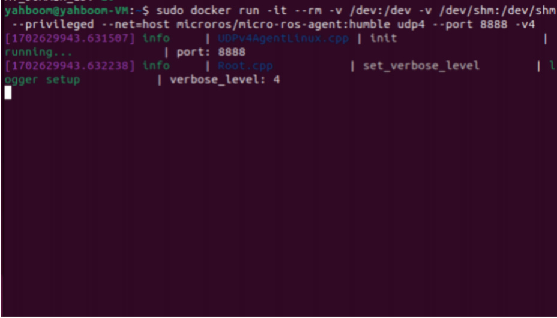
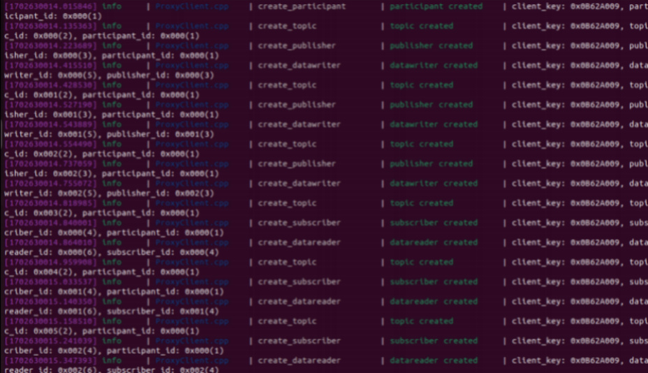

# Enter the robot's docker container
Note: The virtual machine needs to be in the same LAN as the car, and the ROS_DOMAIN_ID must

be the same. You can refer to [Read Before Use] to set the IP and ROS_DOMAIN_ID on the board.

Taking the matching virtual machine as an example, enter the following command to enter the

docker container:

After starting the container, the proxy will be turned on, the car switch will be turned on, and the

car will be connected to the proxy. The connection is successful as shown in the figure below.

After the car is connected, a node named /YB_Car_Node will be started. Enter the following

command in the terminal of the matching virtual machine to query:
