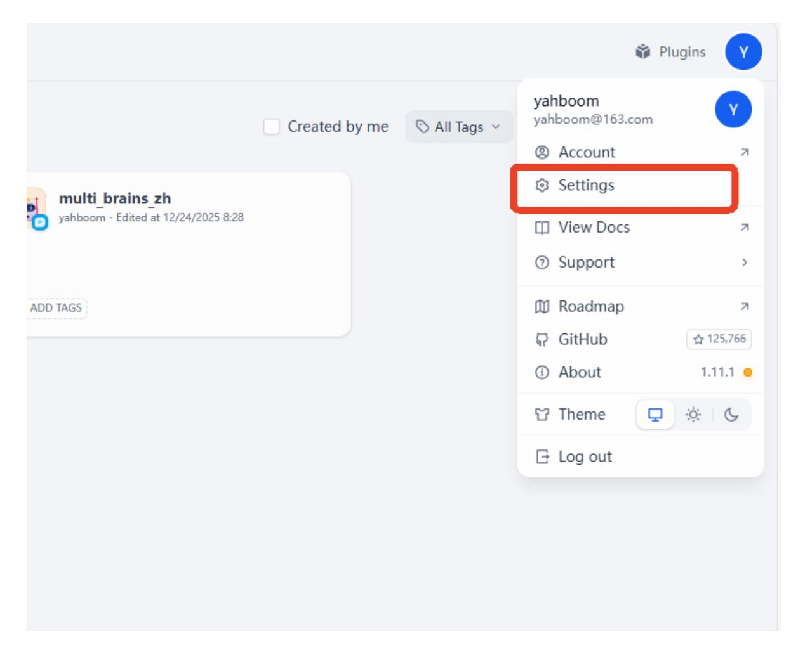
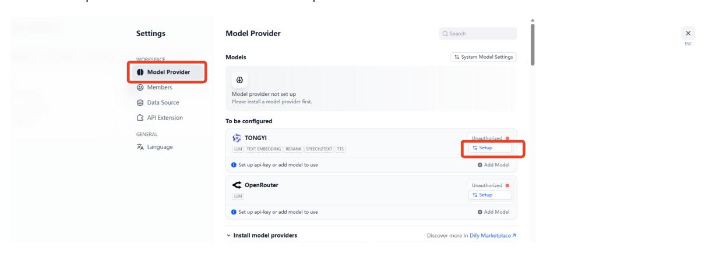
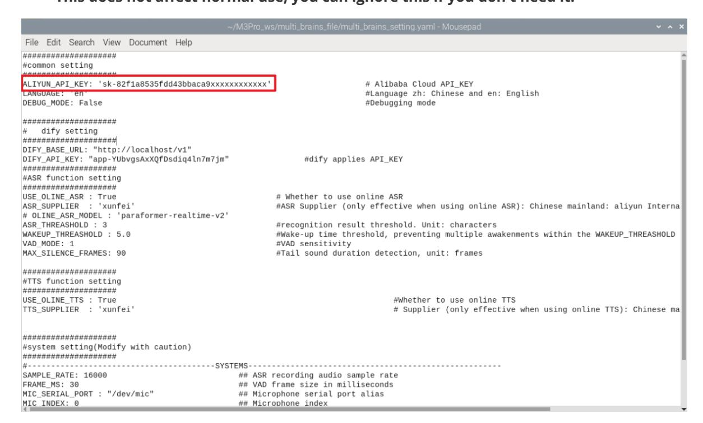

# **Configuring the API Key**

#### **[Configuring](#page-0-0) the API Key**

- <span id="page-0-0"></span>[1. Course](#page-0-1) Content
- [2. Starting](#page-0-2) the Dify Service
- [3. Configuring](#page-1-0) the Model Service Provider API Key
- [4. Testing](#page-3-0) the API Key
- [5. Configuring](#page-4-0) the multi\_brains Function Package API
- 6. Using Local Speech [Services](#page-4-1)
  - 6.1 Local Speech [Recognition](#page-5-0)
  - 6.2 Local Speech [Synthesis](#page-5-1)
- <span id="page-0-1"></span>[7. Modifying](#page-6-0) the Dfiy Service API

#### **1. Course Content**

Use the previously registered API key to configure the robot car's API key.

[!WARNING]

<span id="page-0-2"></span>**Note**: Please ensure the car is connected to the internet to use the cloud-based model services.

### **2. Starting the Dify Service**

[!TIP]

ROSMASTER-M3 Pro uses Dify to build a multi-agent system, with Dify managing the calls to the cloud-based models. - Connect to the vehicle's system via VNC or SSH, and enter the following command in the terminal:

bringup\_dify

View the vehicle's IP address. This can be done via the OLED screen or by using ifconfig in the terminal.

Enter the vehicle's IP address directly into your browser's address bar to access the Dify management page. If this is the first time logging in, you will need to use the account and password. You can select the language in the upper left corner.

#### [!NOTE]

- Account name: yahboom@163.com
- Password: yahboom123
- All account passwords, intelligent agent applications, and RAG data are stored locally.
- After logging in, the page will look like this:


#### **3. Configuring the Model Service Provider API Key**

<span id="page-1-0"></span>Click Settings



Here, we'll use configuring the Alibaba Cloud Model Studio Platform account API as an example. Click Model Provider -> Setup



Enter your Alibaba Cloud Model Studio Platform API key, then select whether it's an international account, and click Save.


#### **4. Testing the API Key**

[!TIP]

- <span id="page-3-0"></span>If you need to test whether your API key is valid, you can refer to this section of the tutorial. Otherwise, you can skip it.
- Click on the "TEST\_API" application in the studio.


Then, select any model in the model selection to test.


Enter any content in the chat box. If the registered API key is valid, you will see the model's response.


## **5. Configuring the multi\_brains Function Package API**

<span id="page-4-0"></span>Generate the parameter file by running the following commands in the terminal:

```
cd ~/M3Pro_ws/multi_brains_file
cp .multi_brains_setting_example_en.yaml multi_brains_setting.yaml
```

If you later use Alibaba Cloud's speech synthesis service to generate a custom voice file, please apply for an API-KEY from Alibaba Cloud International and fill in ALIYUN\_API\_KEY . **This does not affect normal use; you can ignore this if you don't need it.**



#### <span id="page-4-1"></span>**6. Using Local Speech Services**

- By default, online speech services are used for speech recognition and speech synthesis. If you need to use local speech services, please refer to this section of the tutorial; otherwise, you can skip this section.
- <span id="page-5-0"></span>Note that due to memory and performance limitations, local speech services are not currently available on Jetson Nano.

#### **6.1 Local Speech Recognition**

nano ~/M3Pro\_ws/multi\_brains\_file/multi\_brains\_setting.yaml

- Find the USE\_ONLINE\_ASR option in the ASR function setting section and set it to False. Save and exit with Ctrl+x to enable local speech recognition.
- Other parameters are used to configure some parameters of the recording process. See the comments for details on the function of each parameter. Beginners can use the default settings.

```
####################
#ASR function setting
#Speech Recognition Function Settings
####################
USE_OLINE_ASR : False # Whether to use online
ASR
ASR_SUPPLIER : 'xunfei' #ASR Supplier (only
effective when using online ASR): Chinese mainland: aliyun International: xunfei
OLINE_ASR_MODEL : 'paraformer-realtime-v2'
ASR_THREASHOLD : 3 # ASR recognition result
threshold, unit: characters
WAKEUP_THREASHOLD : 5.0 # Wake-up time threshold, to
prevent multiple wake-ups within WAKEUP_THREASHOLD time, unit: seconds
VAD_MODE: 1 # VAD sensitivity
MAX_SILENCE_FRAMES: 90 # Tail sound duration
detection, unit: frames
```

#### **6.2 Local Speech Synthesis**

<span id="page-5-1"></span>nano ~/M3Pro\_ws/multi\_brains\_file/multi\_brains\_setting.yaml

Find the USE\_OLINE\_TTS option in the TS function setting section and set it to False. Save and exit with Ctrl+x to enable local speech synthesis.

```
####################
#TTS function setting
#Speech Synthesis Function Settings
####################
USE_OLINE_TTS : False
# Whether to use online TTS
... .
```

### **7. Modifying the Dfiy Service API**

- <span id="page-6-0"></span>**Note**: This section is for users with development needs only and can generally be ignored.
- If you need to modify the address that the vehicle's infotainment system uses to access the Dify application's API, or if Dify is deployed on a different server, you need to modify the access address in the configuration file:

```
nano ~/M3Pro_ws/multi_brains_file/multi_brains_setting.yaml
```

- Find the DIFY\_API\_KEY and DIFY\_BASE\_URL parameters, where:
- DIFY\_BASE\_URL is the address for accessing the Dify backend service.
- DIFY\_API\_KEY is the API key for the AI application in Dify.

```
####################
# dify setting
# dify configuration options
####################
DIFY_BASE_URL: "http://localhost/v1"
DIFY_API_KEY: "app-mhawRyoHteauIho7wvXhlhwR" # Dify application
API_KEY
```