# **Dify Basic Functions**

#### **Dify Basic [Functions](#page-0-0)**

- [1. Course](#page-0-1) Content
- [2. Starting](#page-0-2) the Dify Service
- [3. Basic Usage](#page-1-0)
  - 3.1 Switching Dify [Language](#page-1-1)
  - 3.2 Switching the AI [Application's](#page-4-0) Access Model
- [4. Account](#page-8-0) Settings
- [5. Development](#page-10-0) Documentation

### **1. Course Content**

Understand and master the basic operations and functions of Dify

## **2. Starting the Dify Service**

Connect to the vehicle's computer via VNC or SSH, and enter the following command in the terminal:

bringup\_dify

Check the vehicle's IP address. This can be done via the OLED screen, ifconfig , or directly in the terminal.

Enter the vehicle's IP address directly in the browser's address bar to access the Dify management page. If this is the first time logging in, you will need to use the account and password. You can select the language in the upper left corner.

#### [!NOTE]

- Account: yahboom@163.com
- Password: yahboom123
- All account passwords, AI agent applications, and RAG data are stored locally.
- The Dify main interface is shown below:

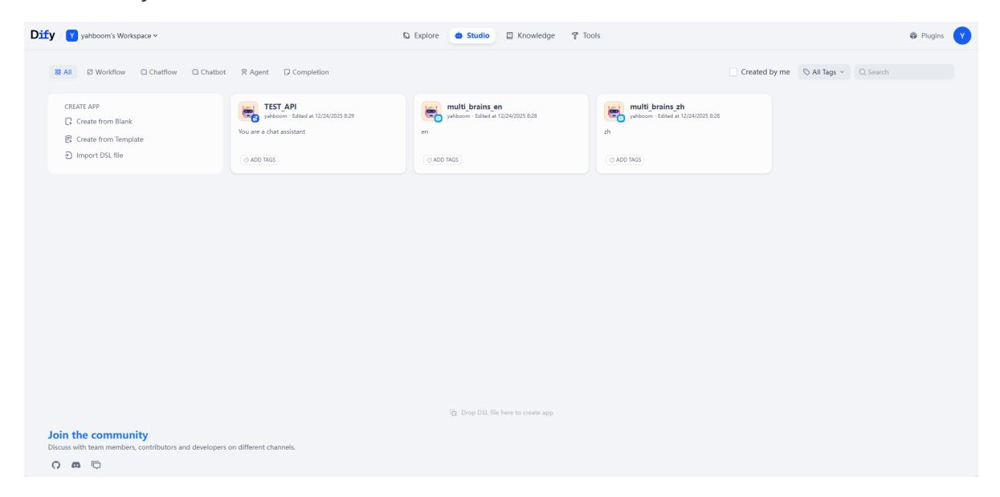

### **3. Basic Usage**

#### [!TIP]

If you need to use cloud-based AI models from model providers, please ensure the vehicle's computer is connected to the internet.

### **3.1 Switching Dify Language**

Generally, the Dify page will follow the browser's language. If you need to switch manually, you can select the language in the settings.

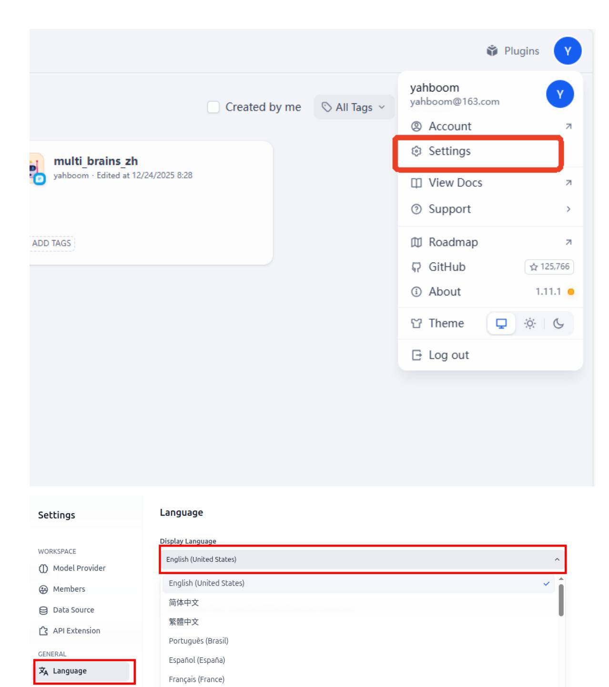

### 3.1 Accessing Model Provider Services

- Dify has built-in model interface plugins for various model providers. These plugins are maintained and upgraded by their respective model providers. We can install the corresponding model provider's plugin to quickly access cloud models from different vendors.
- Click on "Plugins" -> "Explore Marketplace" -> "Models" in the upper left corner of the homepage to access the model interface plugin page.

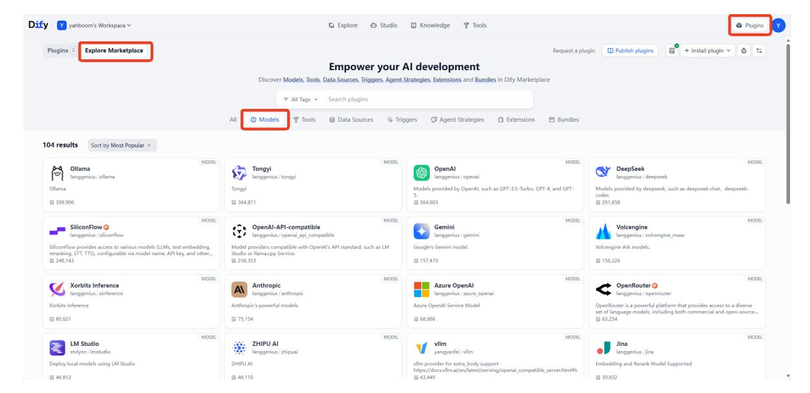

This example demonstrates installing and configuring the Tongyi Qianwen plugin. The method is the same for other plugins; simply click "Install".

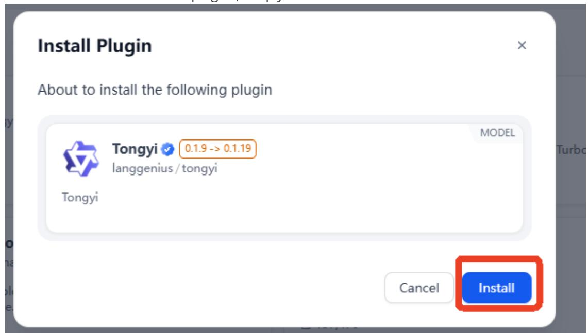

Afterwards, simply enter the API-KEY obtained from the corresponding platform in the Model Provider section of the Settings page. If the API-KEY is valid, the APIKEY for the corresponding plugin will show a green light.

#### [!TIP]

For more detailed steps on configuring the API-KEY and testing the API-KEY , please refer to section 6. Configuring API-KEY in the previous chapter.

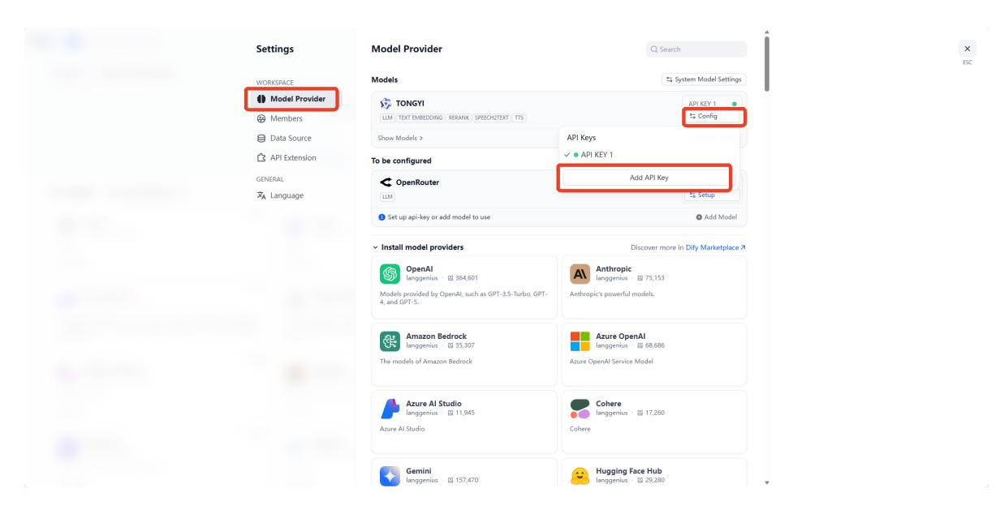

### **3.2 Switching the AI Application's Access Model**

For already developed AI intelligent agent applications, you can quickly switch between different models to test their effects. Here, we take the multi\_brains core intelligent agent of ROSMASTER-M3 Pro as an example. Click on the intelligent agent application on the homepage.

There are three core AIs: Task Routing, Decision Layer AI, and Execution Layer AI.

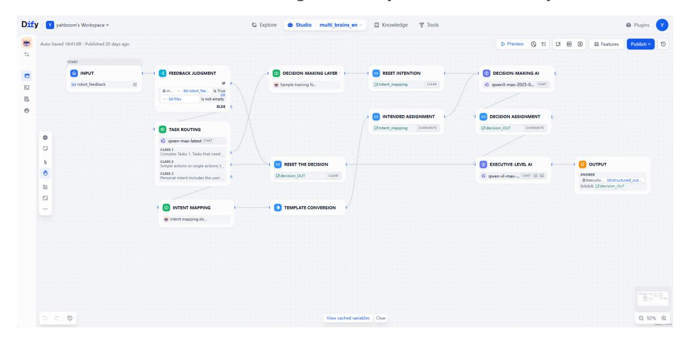

Here, we take switching the Decision Layer AI as an example. Click on the Decision MAKING AI card, and you can switch between different vendor models in the model selection dropdown menu.

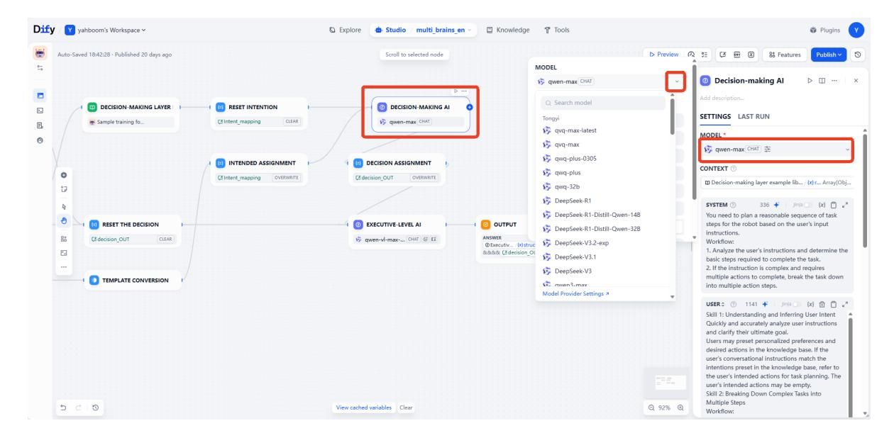

- You can also fine-tune the parameters to adjust the model's response. The detailed function of each parameter can be viewed by hovering the mouse over it.
- Taking the temperature parameter as an example:

This parameter is used to control the degree of randomness and diversity. The temperature value controls the degree to which the probability distribution of each candidate word is smoothed during text generation. A higher temperature value reduces the peaks in the probability distribution, allowing more lowprobability words to be selected, resulting in more diverse generated text; a lower temperature value, on the other hand, enhances the peaks in the probability distribution, making high-probability words more likely to be selected, resulting in more deterministic generated text.

#### [!TIP]

Beginners can generally use the default parameters without adjustment.

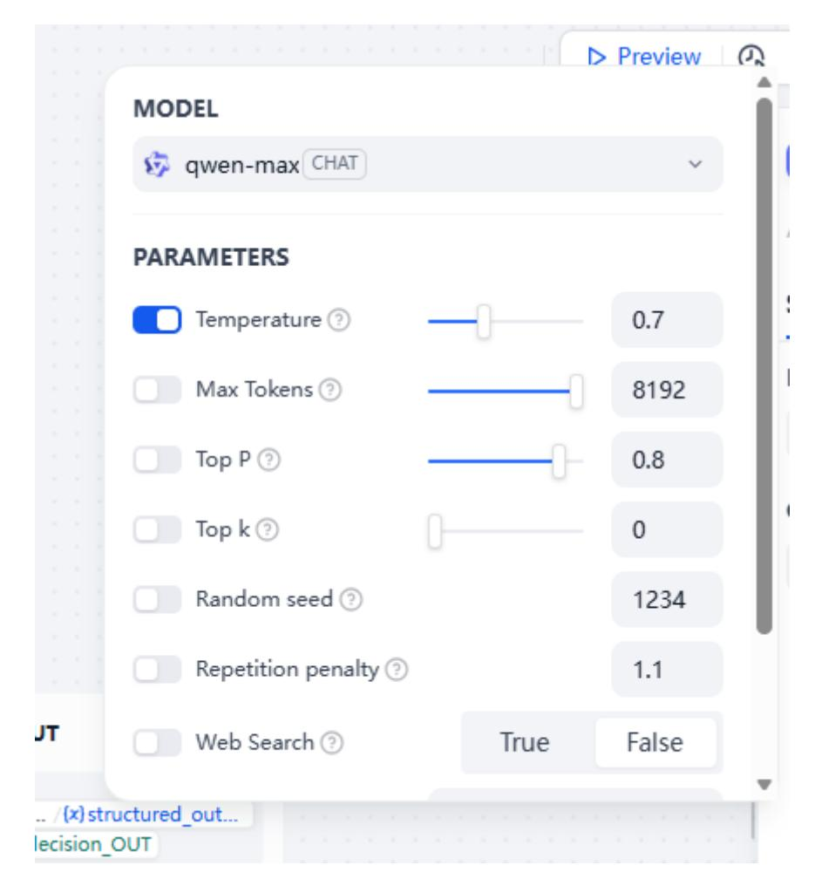

Note that after modifying the AI application, you need to click Publish - Publish Update to save the changes.

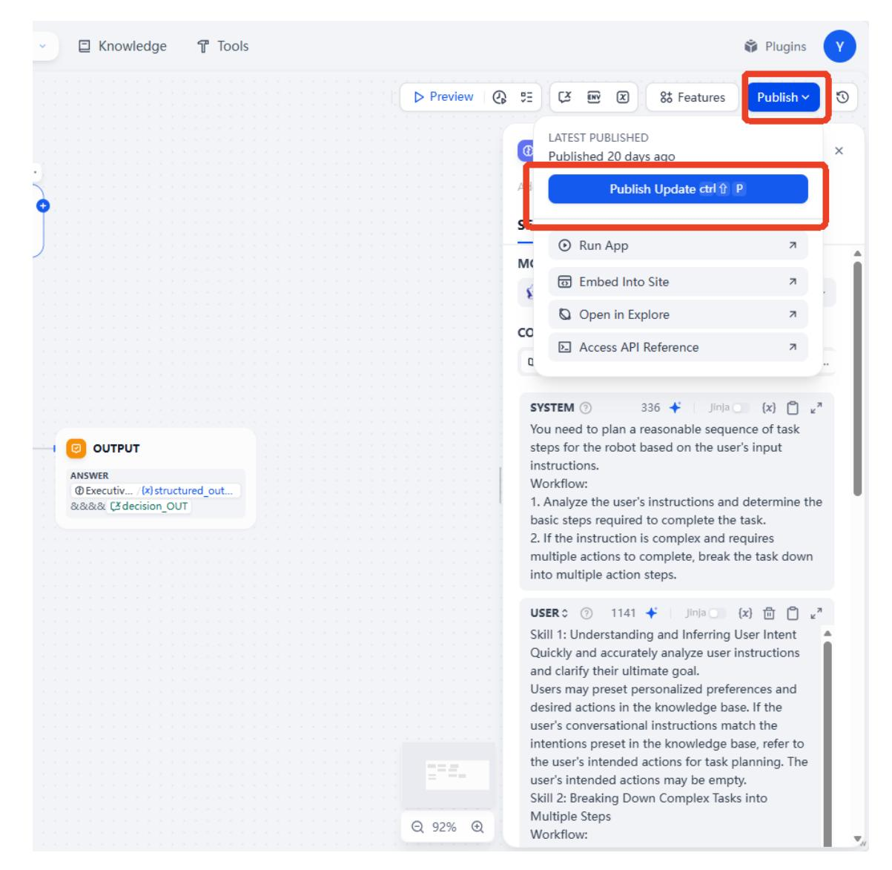

#### [!WARNING]

### **Note:**

- For the execution layer model, because it needs to process images, only multimodal models can be selected (visual models will have special symbols as shown in the image below).
- There are no restrictions on the models for the task routing and decision-making layers.
- Task routing can select a smaller parameter model to improve response speed.

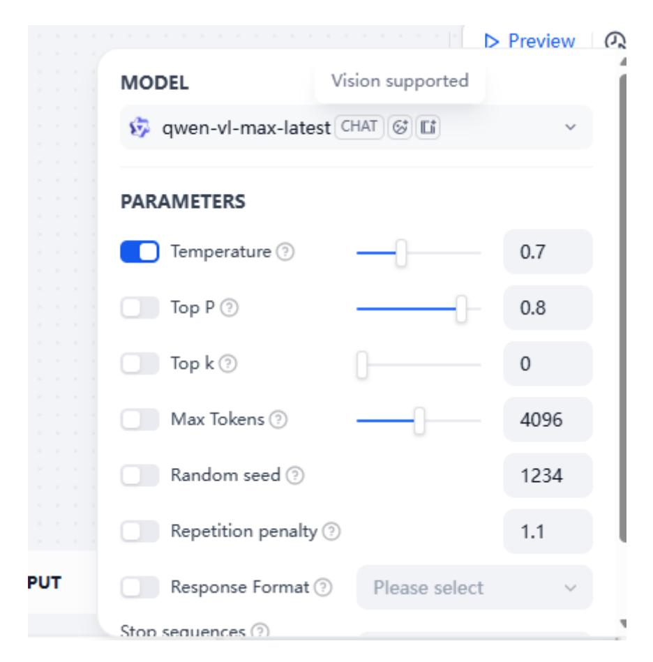

### **4. Account Settings**

#### [!NOTE]

Dify account information is stored locally and has no privacy risks. The ROSMASTER-M3 Pro comes with a pre-configured administrator account. Refer to this section of the tutorial only if you need to modify account information.

Click the avatar in the upper right corner -> Account

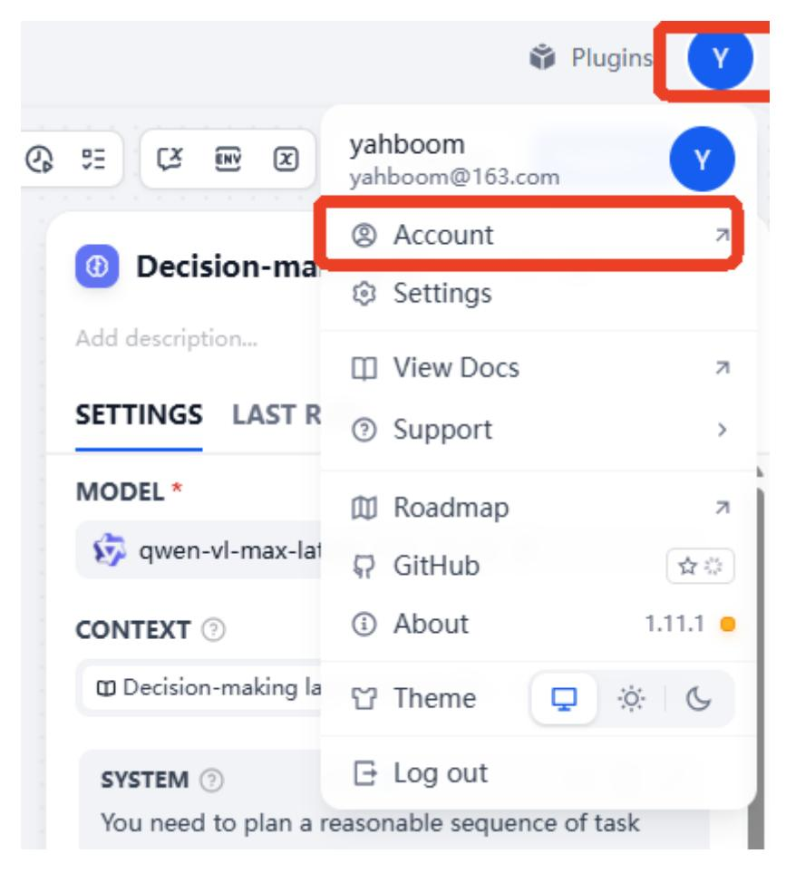

Account information is shown below. You can modify the information as needed.

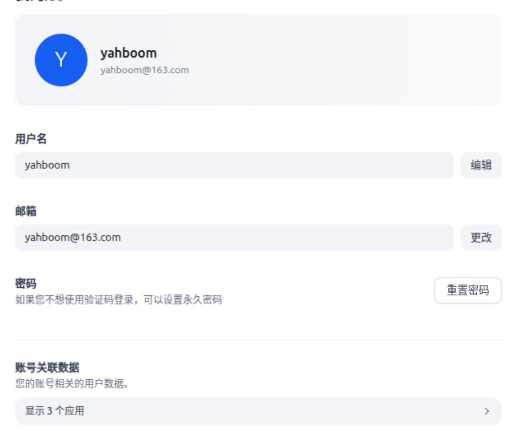

To log out, click the avatar again to log out.

## **5. Development Documentation**

For users who require further development, more detailed development documentation is available. Click the avatar in the upper right corner -> View Docs

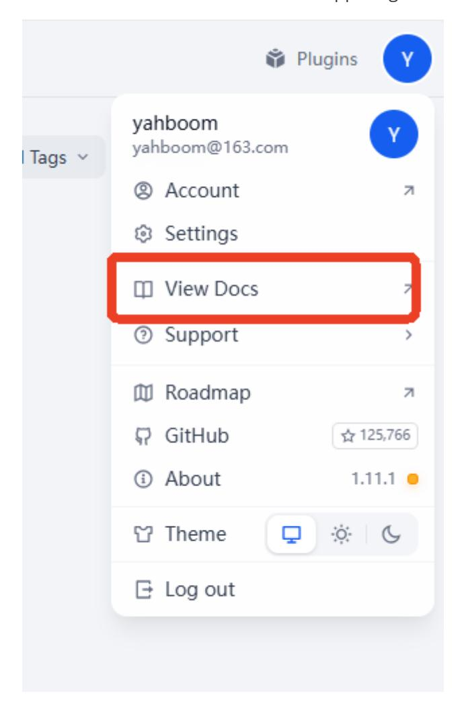

This will open Dify's online development documentation page. You can select and view different documentation content from the dropdown list on the left.

