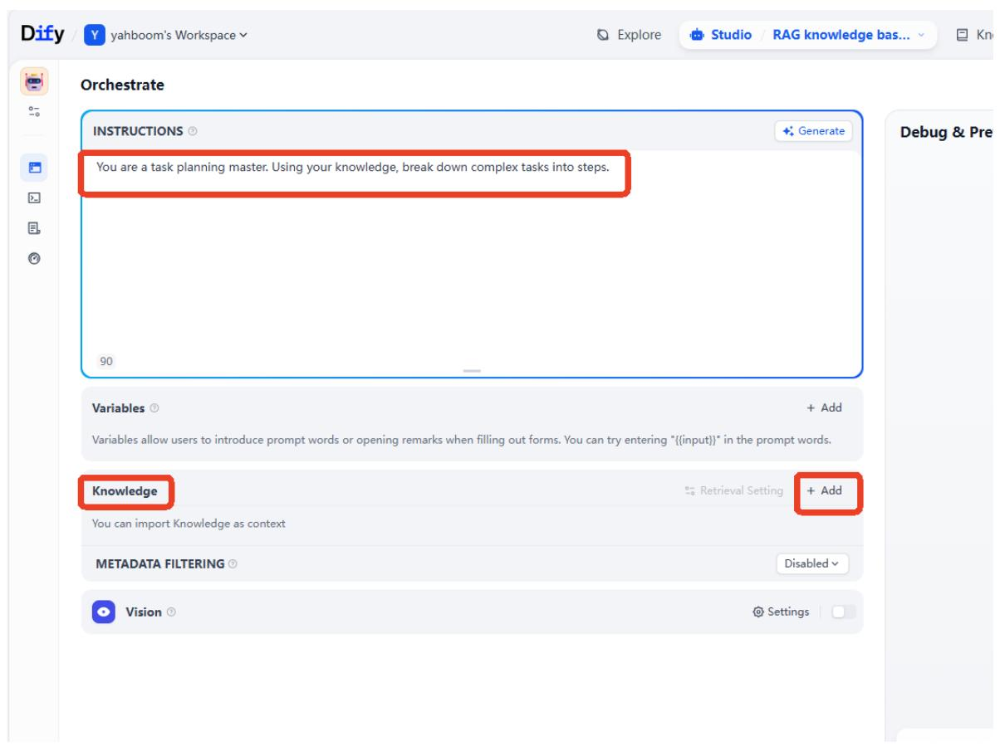
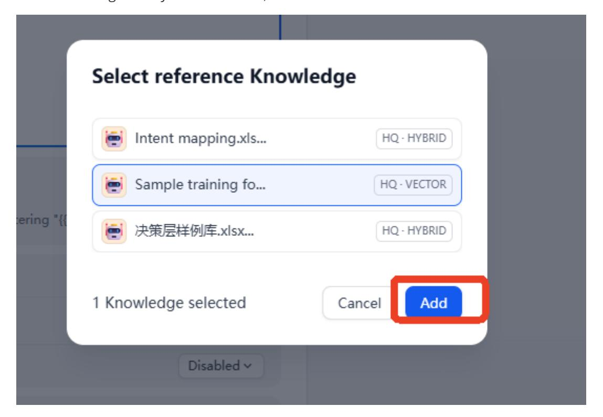
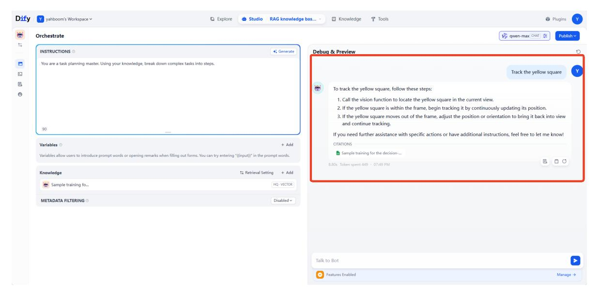
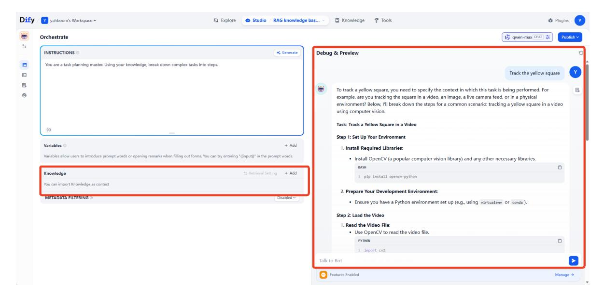
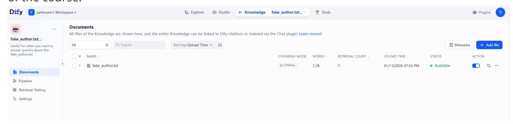
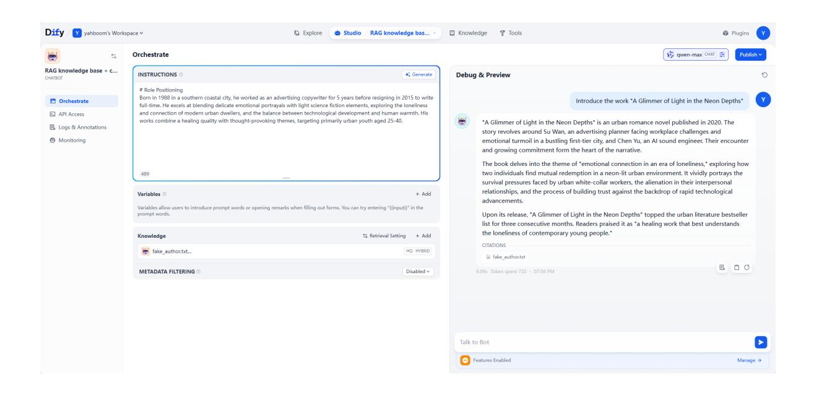

# **RAG Knowledge Base + Chatbot**

#### **RAG [Knowledge Base +](#page-0-0) Chatbot**

- [1. Course](#page-0-1) Content
- [2. Starting](#page-0-2) the Dify Service
- 3. Case Study [1: Task Planning](#page-1-0)
- 4. Case Study [2: Knowledge](#page-4-0) Management
  - 4.1 Creating a [Knowledge](#page-4-1) Base
  - 4.2 Creating an [Application](#page-4-2)

### **1. Course Content**

Based on the previous RAG knowledge base and chatbot, develop an AI application that combines the two to improve the answering capabilities of large AI models in specific domains, reducing AI model hallucinations through the RAG knowledge base.

## **2. Starting the Dify Service**

Connect to the vehicle's computer via VNC or SSH, and enter the following command in the terminal:

bringup\_dify

Check the vehicle's IP address (you can view it on the OLED screen, using ifconfig , or directly in the terminal). Enter the vehicle's IP address directly in the browser's address bar to access the Dify management page.

# **3. Case Study 1: Task Planning**

[!TIP]

- Case Study 1 simulates the functionality of the ROSMASTER-M3decision-making layer.
- On the homepage, click "Create from Blank".

Click to select "Chat Assistant" under Chatbot ->App Name & Icon -> Create.

Example prompt:

You are a task planning master. Using your knowledge, break down complex tasks into steps.

After creating the application, fill in the prompt in the"INSTRUCTIONS'', and then click "Add" in the knowledge.

Select the knowledge base you want to add, then click Add.

Then select an AI large language model to connect to. Here, we use the qwen-max model as an example.

After that, enter the test dialogue content. Here, we use removing machine code as an example. You can see that the AI large language model can think and answer based on the content of the knowledge base. By adding training examples to the knowledge base in this way, you can quickly expand the AI large language model's response capabilities and learning abilities in different task scenarios and fields.

We can first delete the knowledge base to compare the AI large language model's response without the RAG knowledge base. You can see that without a knowledge base, the generalpurpose AI model from the model provider cannot handle tasks in vertical domains.

#### [!TIP]

This practical example can be understood and mastered in conjunction with the theoretical knowledge of 2. RAG Retrieval Augmentation and Training Examples .

# **4. Case Study 2: Knowledge Management**

When we have internal documents that need to be managed by a large language model, we can use the AI large language model combined with RAG and a knowledge base to allow the large language model to respond based on actual business documents. This is very helpful for vertical fields such as finance and healthcare.

### **4.1 Creating a Knowledge Base**

Here, we use a sample document as an example, which contains a fictional author and a collection of fictional works. The sample document can be found in the folder for this section of the course.

### **4.2 Creating an Application**

Example Prompt

#### # Role Positioning

Born in 1988 in a southern coastal city, he worked as an advertising copywriter for 5 years before resigning in 2015 to write full-time. He excels at blending delicate emotional portrayals with light science fiction elements, exploring the loneliness and connection of modern urban dwellers, and the balance between technological development and human warmth. His works combine a healing quality with thought-provoking themes, targeting primarily urban youth aged 25-40.

Fill in the example prompt and select the virtual author's knowledge base. Then, ask questions about the works in the material. At this point, the AI large language model can answer using the private knowledge base.

