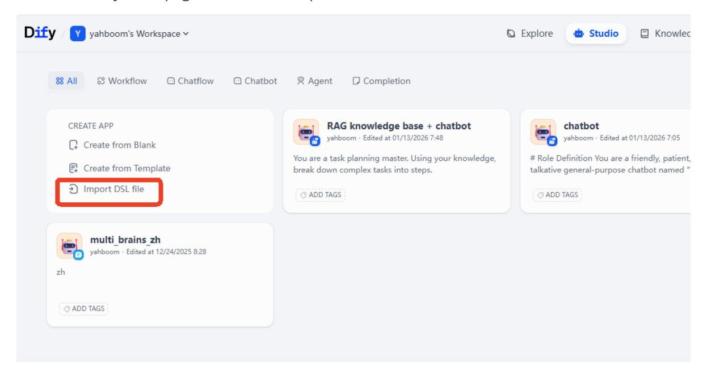
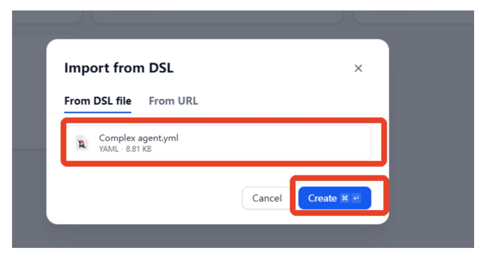
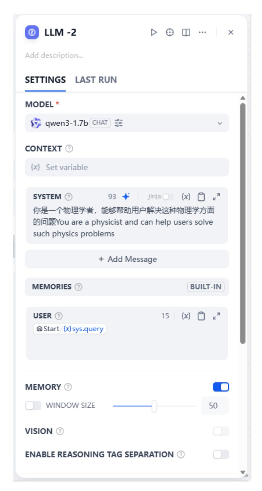
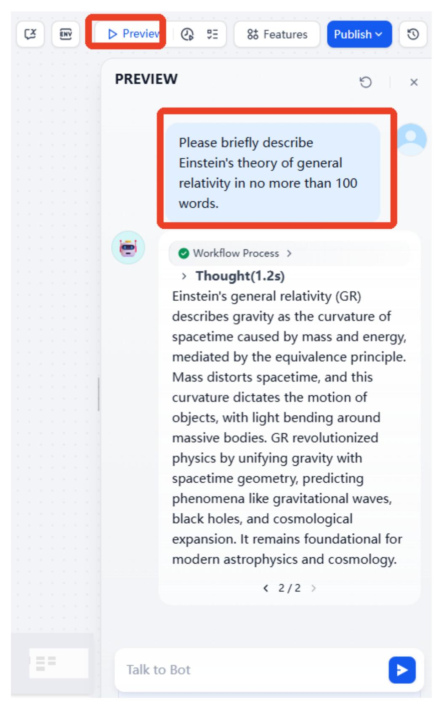
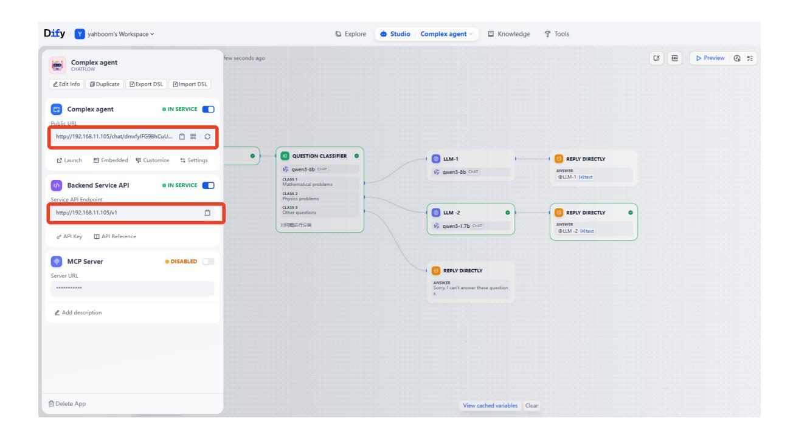

# **AI Agent Workflow**

#### **AI Agent [Workflow](#page-0-0)**

- <span id="page-0-0"></span>[1. Course](#page-0-1) Content
- [2. Start](#page-0-2) the Dify Service
- 3. Case [Study: Categorized Question-Answering](#page-1-0) Chatbot
- 4. Visualizing [and Debugging](#page-5-0) Workflows
- <span id="page-0-1"></span>5. Accessing AI Agent [Applications](#page-7-0)

#### **1. Course Content**

Build intelligent agent workflows using multiple large AI models to implement complex logical functions.

#### **2. Start the Dify Service**

<span id="page-0-2"></span>Connect to the car's infotainment system via VNC or SSH. Enter the following command in the terminal:

```
sh ~/bringup_dify.sh
```

Check the car's IP address. You can do this through the OLED screen, using ifconfig , or directly in the terminal. Enter the car's IP address directly into your browser's address bar to access the Dify management page.

## **3. Case Study: Categorized Question-Answering Chatbot**

- <span id="page-1-0"></span>In the example AI application folder of this lesson, there are reference examples that can be directly imported and used.
- In the Dify homepage studio, click "Import DSL File".



Select the example AI application Complex agent.yml in the course folder for this section, and then click "Create".



You can see the workflow content as shown below.


In the workflow, Question Classifier is a module driven by a large AI model. Its function is to categorize user questions into math questions, physics questions, and other questions. If the user's input matches a math or physics-related question, it will invoke the corresponding branch of the large AI model to answer it. The categories in Question Classifier are as follows:


The LLM-1 branch is used to answer math-related questions. The prompt and settings are shown below.


The LLM-2 branch is used to answer physics-related questions. The prompt and settings are shown below.



#### **4. Visualizing and Debugging Workflows**

<span id="page-5-0"></span>To debug and test the workflow, click the preview in the upper right corner, and then enter the problem in the pop-up dialog box for testing.



Simultaneously, the workflow will display the branches through which data flows in real time, thus facilitating workflow debugging.


To expand your workflow, click the "+" sign on the left, which provides access to several predefined tools and modules for Dify.


### **5. Accessing AI Agent Applications**

<span id="page-7-0"></span>After orchestrating your AI application, click "Publish Application" to save the configuration. Then, click "Copy URL" or "API Access Credentials" to access the created AI application via the web interface or backend service API.

