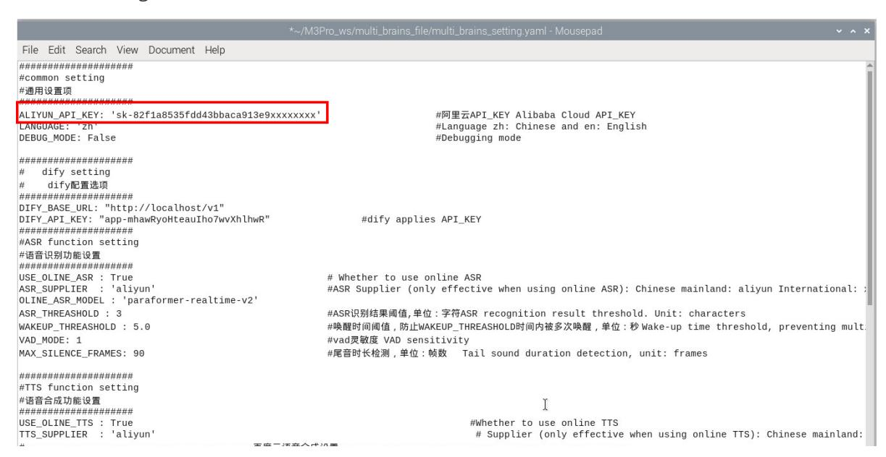
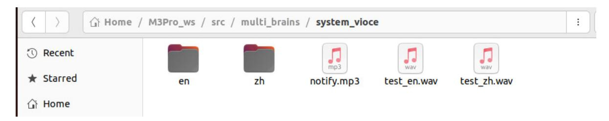
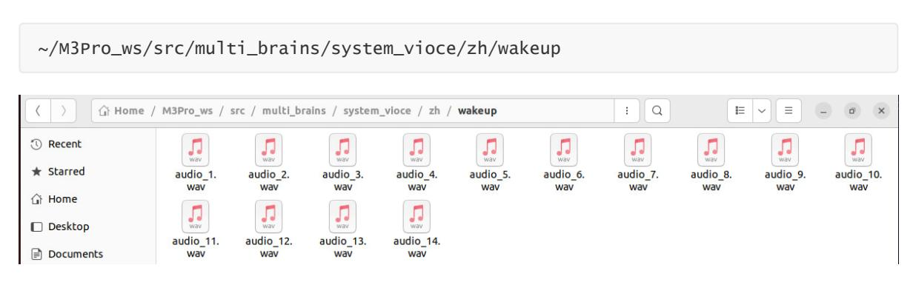
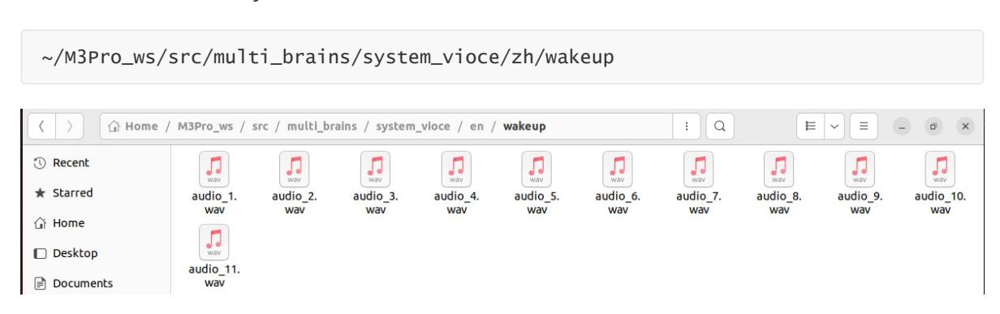

# **Personalized Wake-Up Response**

#### **[Personalized](#page-0-0) Wake-Up Response**

- <span id="page-0-0"></span>[1. Course](#page-0-1) Content
- <span id="page-0-1"></span>[3. Loading](#page-3-0) Audio Files

## **1. Course Content**

Add audio files to the multi\_brains program's audio library to customize the voice response after wake-up.

#### [!NOTE]

- This section of the tutorial is only for users who need to customize personalized voice responses and does not affect normal use.
- If you do not need to customize personalized responses, you can skip this section. ## 2. Preparing Audio Files
- The **audio materials for voice replies can be downloaded and prepared independently.**
- Alternatively, you can generate speech using the system's built-in generate\_voice command. The speech generation uses the speech synthesis model from the Bailian platform, so you need to configure the ALIYUN\_API\_KEY first, as described in the "02 - Configuring API-KEY" section of this chapter.
- Pre-configure the Bailian API-KEY



Run the command in the terminal:

```
generate_voice --text Hello
```

--text is the startup parameter; replace "Hello" with the text you want to synthesize into speech.

The audio file will be automatically saved in the ~/generate\_voices/ directory.

### [!NOTE]

Other optional startup parameters are as follows:

- --voice : Speaker, default Cherry
- --language\_type : Language, default Chinese
- --save\_path : Audio file save path, default ~/generate\_voices/
- --config\_file : Configuration file path, default ~/M3Pro\_ws/multi\_brains\_file/multi\_brains\_setting.yaml
- --text : Text to be synthesized into audio, default is empty
- --model : Speech synthesis model, default qwen3-tts-flash

For available speakers and speech synthesis models, please refer to the dynamic notifications on [the Bailian official website: https://bailian.console.aliyun.com/?spm=5176.29619931.J\\_SEsSjsNv72y](https://bailian.console.aliyun.com/?spm=5176.29619931.J_SEsSjsNv72yRuRFS2VknO.2.74cd10d73l2Pw5&tab=doc#/doc/?type=model&url=2879134) RuRFS2VknO.2.74cd10d73l2Pw5&tab=doc#/doc/?type=model&url=2879134

Reference model:

### Speech synthesis - Qwen

## Model availability

We recommend Qwen3-TTS-Flash.

Qwen3-TTS-Flash offers 49 voices and supports multiple languages and dialects.

Qwen-TTS offers up to 7 voices and supports only Chinese and English.

International (Singapore) China (Beijing)

| Model                                                                       | Version  |
|-----------------------------------------------------------------------------|----------|
| qwen3-tts-flash  Capabilities are identical to qwen3- tts-flash-2025-09-18. | Stable   |
| qwen3-tts-flash-2025-11-27                                                  | Snapshot |
| qwen3-tts-flash-2025-09-18                                                  | Snapshot |

• Reference Tone

| Name    | voice parameter |
|---------|-----------------|
| Cherry  | Cherry          |
| Serena  | Serena          |
| Serena  | Ethan           |
| Chelsie | Chelsie         |
| Momo    | Momo            |
| Vivian  | Vivian          |
| Moon    | Moon            |
|         |                 |

Supported Languages

Chinese, English, Spanish, Russian, Italian, French, Korean, Japanese, German, Portuguese

## **3. Loading Audio Files**

<span id="page-3-0"></span>multi\_brains system audio path:

~/M3Pro\_ws/src/multi\_brains/system\_vioce



- Where:
- zh is the Chinese response voice, suitable for domestic users. Place the prepared audio files in the directory:



en is the English response voice, suitable for international users. Place the prepared audio files in the directory:



When the multi\_brains program is started, it will automatically load the audio files in the corresponding directory and randomly play personalized response voices when the user wakes the system.