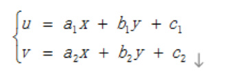
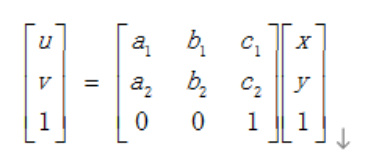
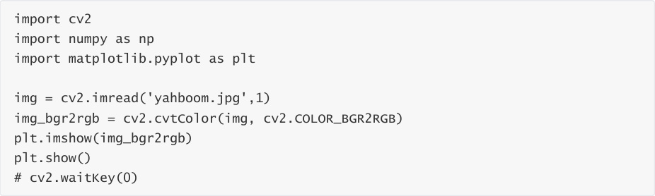
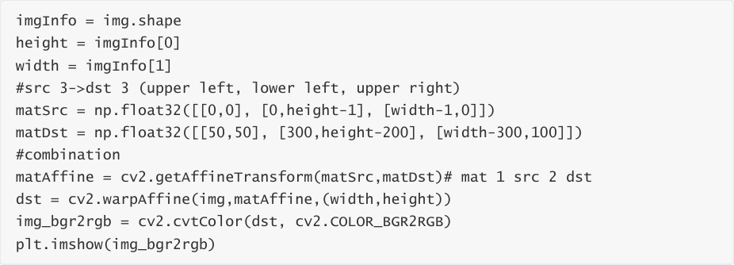
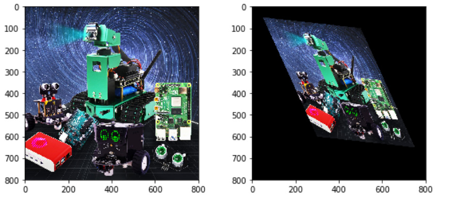

# Affine transformation
Affine Transformation (Affine Transformation or Affine Map) is a linear transformation from two
dimensional coordinates (x, y) to two-dimensional coordinates (u, v). Its mathematical expression

matrix representation is:

Affine transformation maintains the "straightness" of two-dimensional graphics (a straight

line remains a straight line after an affine transformation) and "parallelism" (the relative position

relationship between straight lines remains unchanged, parallel lines remain parallel lines after

an affine transformation, and the position order of the points on the straight lines does not

change). Three pairs of non-collinear corresponding points determine a unique affine

transformation. The rotation and stretching of an image is an image affine transformation. Affine

transformation also requires an M matrix. However, due to the complexity of affine

transformation, it is generally difficult to find this matrix directly. OpenCV provides a method to

automatically solve M based on the correspondence between the three points before and after

the transformation. This function is:

The two positions are the corresponding positions before and after the transformation. The

output is the affine matrix M. Then use the function cv2.warpAffine().

Code path:

