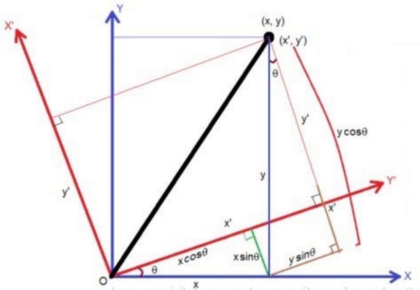
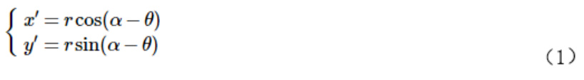
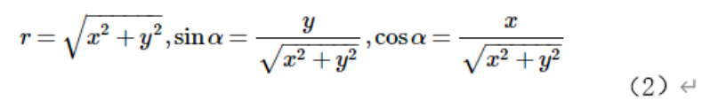
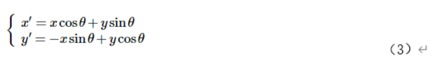
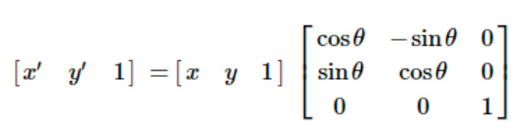
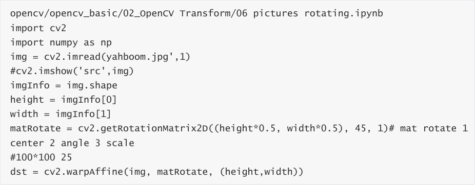
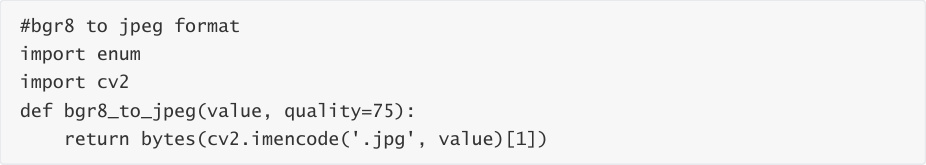
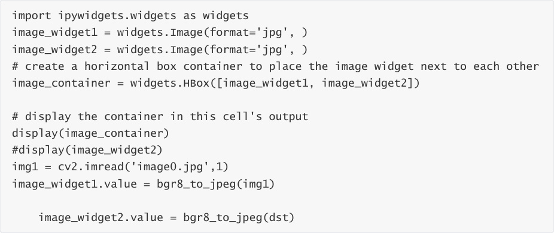
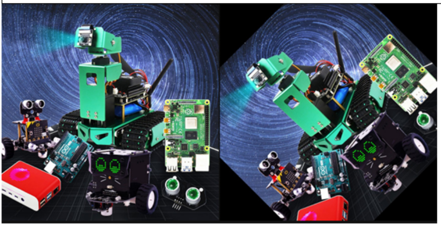

# Image Rotation
Image rotation refers to the process of rotating an image by a certain angle according to a certain

position, while maintaining the original size. After the image is rotated, the horizontal axis of

symmetry, vertical axis of symmetry, and center coordinate origin of the image may change, so

the coordinates of the image during rotation need to be converted accordingly. As shown in the

figure below:

Assuming that the image is rotated counterclockwise by θ, the rotation transformation can be

obtained according to the coordinate transformation:

and

(2) Substituting (1) into (2) yields:

That is as follows:

The grayscale value of the rotated image is equal to the grayscale value of the corresponding

position in the original image as follows:

f(x′,y′)=f(x,y)

The above is the principle of rotation, but the API provided by OpenCV can directly obtain the

transformation matrix through the function. The syntax format of this function is:

matRotate = cv2.getRotationMatrix2D(center, angle, scale)

center: the center point of rotation

Angle: The angle of rotation. Positive number means counterclockwise; negative number means

clockwise.

scale: The scale of the transformation (zoom in or out). 1 means no change, less than 1 means

reduction, and greater than 1 means enlargement.

Code path:

The following will show the original image and the rotated image in the JupyterLab control.

