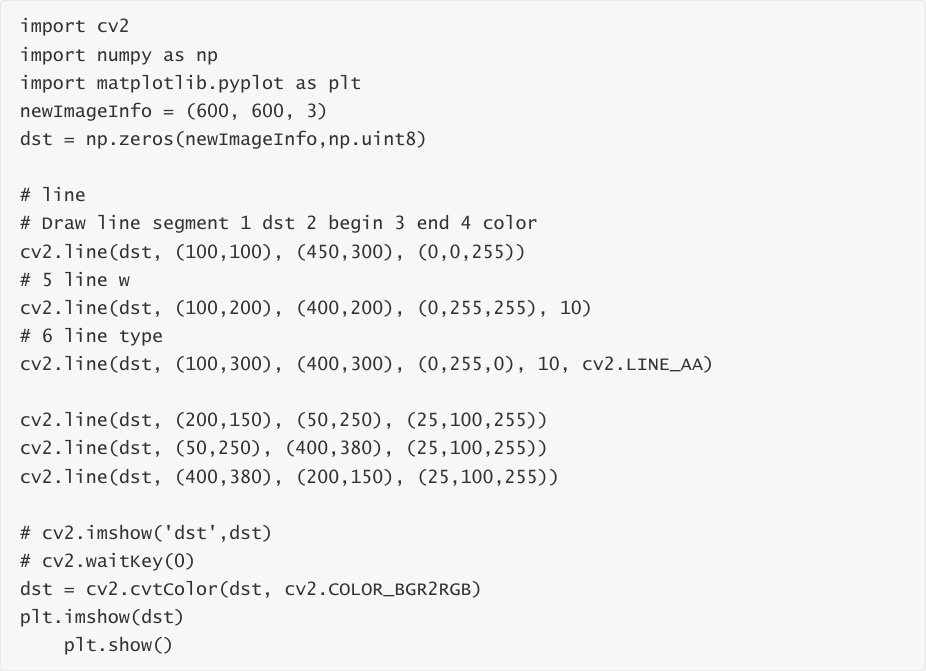
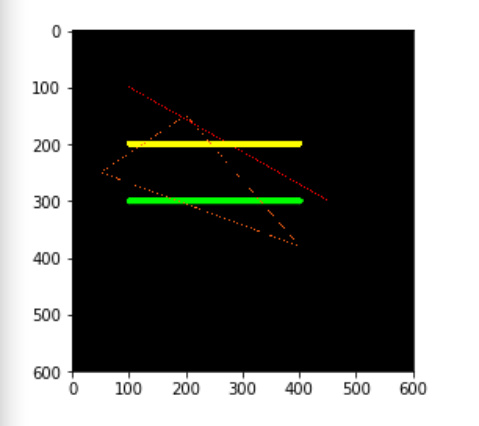

# Line drawing
When using OpenCV to process images, we sometimes need to draw line segments, rectangles,

etc. on the image. In OpenCV, we use the line(dst, pt1, pt2, color, thickness=None, lineType=None,

shift=None) function to draw line segments.

Parameter Description:

dst: output image.

pt1, pt2: Required parameters. The coordinate points of the line segment, representing the

starting point and the ending point respectively

color: Required parameter. Used to set the color of the line segment

thickness: optional parameter. Used to set the width of the line segment

lineType: Optional parameter. Used to set the type of line segment. Optional values include 8 (8

adjacent connected lines - default), 4 (4 adjacent connected lines), and cv2.LINE_AA for anti
aliasing.

Code path:

