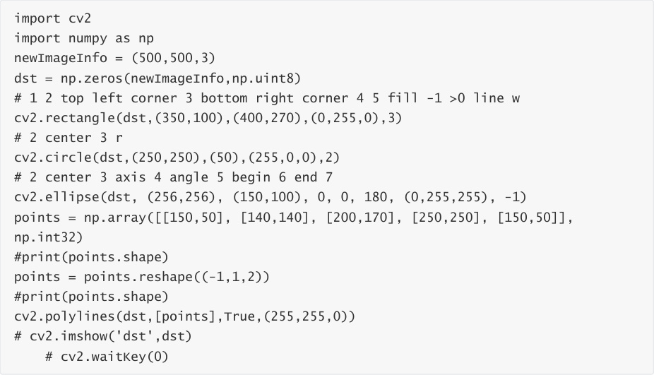
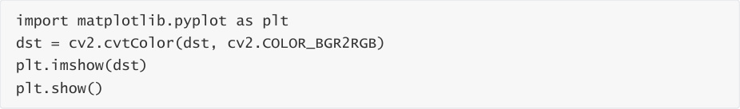
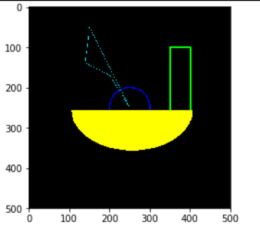

# Rectangle and circle drawing
## 1. Drawing a rectangle
rectangle(img, pt1, pt2, color, thickness=None, lineType=None, shift=None)

Parameter Description:

img: canvas or carrier image.

pt1, pt2: Required parameters. The vertices of the rectangle, representing the top and diagonal

vertices, i.e. the upper left corner and lower right corner of the rectangle (these two vertices can

determine a unique rectangle)

color: Required parameter. Used to set the color of the rectangle

thickness: Optional parameter. Used to set the width of the rectangle side. When the value is

negative, it means filling the rectangle.

lineType: Optional parameter. Used to set the type of line segment. Optional values include 8 (8

adjacent connected lines - default), 4 (4 adjacent connected lines), and cv2.LINE_AA for anti
aliasing.

## 2. Drawing a circle
cv2.circle(img, center, radius, color[,thickness[,lineType]])

Parameter Description:

img: canvas or carrier image

center: the coordinates of the circle center, format: (50,50)

radius: radius

color: color

thickness: Line thickness. Defaults to 1. If -1, it is filled solid.

lineType: Line type. The default is 8, connection type. The following table describes

|parameter|illustrate|
|---|---|
|cv2.FILLED|filling|
|cv2.LINE_4|4Connection Type|
|cv2.LINE_8|8 connection types|
|cv2.LINE_AA|Anti-aliasing, this parameter will make the lines smoother|

## 3. Draw an ellipse
cv2.ellipse(img, center, axes, angle, StartAngle, endAngle, color[,thickness[,lineType]])

center: the center point of the ellipse, (x, x)

Axes: refers to the short radius and long radius, (x, x)

Angle: refers to the angle of counterclockwise rotation

StartAngle: The angle of the arc's starting angle

endAngle: The angle of the arc end angle

For img and color, please refer to the description of circle.

#The fifth parameter refers to the counterclockwise starting angle of the drawing, and the sixth

refers to the counterclockwise ending angle of the drawing

#If the 456 parameter is added with a sign, it means the opposite direction, that is, clockwise.

## 4. Draw polygons
cv2.polylines(img,[pts],isClosed, color[,thickness[,lineType]])

pts: vertices of the polygon

isClosed: Whether it is closed. (True/False)

Other parameters refer to the circle drawing parameters

Code path:

