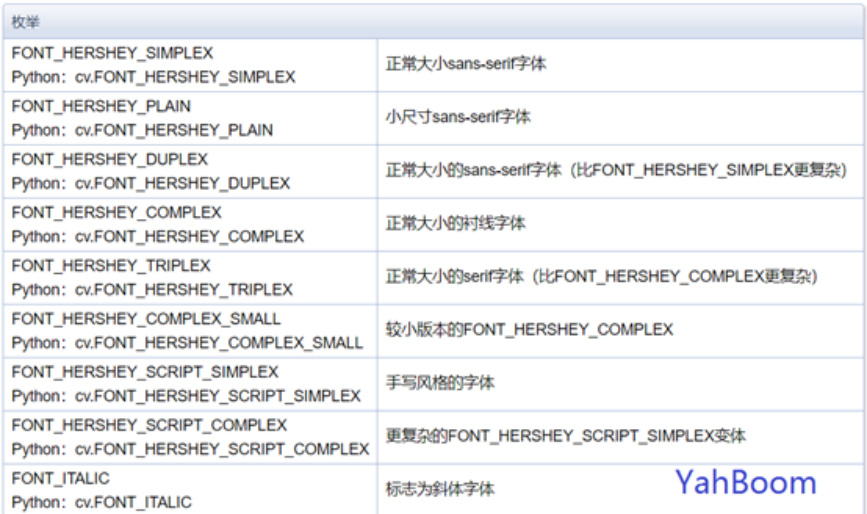
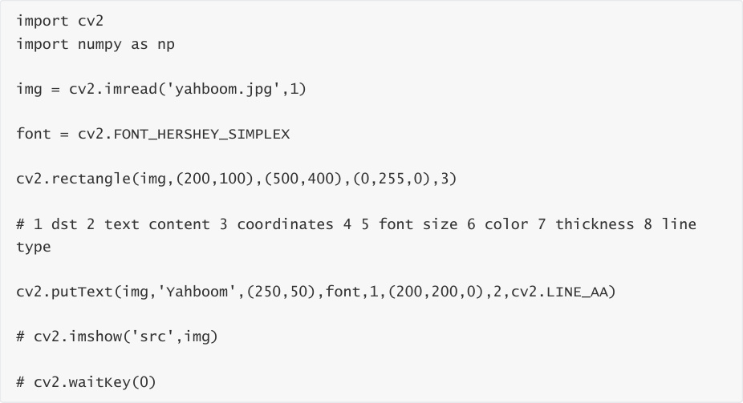
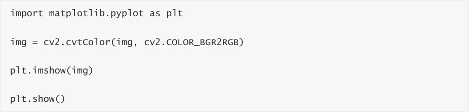
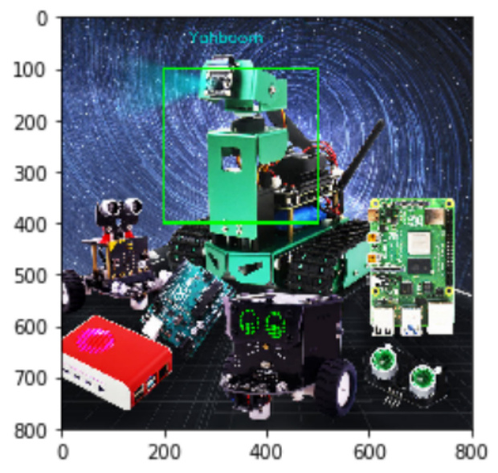

# Text and picture drawing
Function call: cv2.putText(img, str, origin, font, size, color, thickness)

The parameters are: picture, added text, upper left corner coordinates (integer), font, font size,

color, font weight.

The font types are as follows:

Code path:

